# Lab: Reflected XSS with AngularJS sandbox escape and CSP

| Field | Details |
|-------|---------|
| **Provider** | PortSwigger |
| **Difficulty** | Expert |
| **Category** | Cross-Site Scripting |
| **Date** | 2026-07-25 |

---

## Summary

Reflected XSS with AngularJS sandbox escape and CSP is a lab in the PortSwigger Web Security Academy. In this lab, breaking out of context is simple and there are no limits on characters, but executing JS is not so easy.  
You can't execute inline scripts, and included scripts are also blocked by CSP. But there are signs to tell you that you should think the other way.

In this writeup, I'll walk through the entire manual exploitation flow step by step.

The task is to alert document.cookie:  
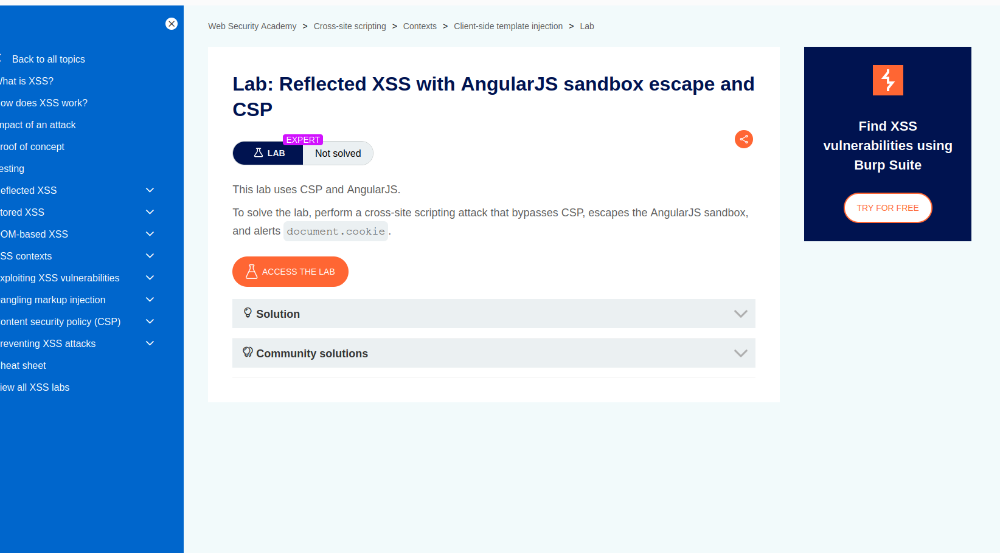  

---

## Reconnaissance

First of all, there is a search box input which can be the perfect entry point (to break out of the context).  

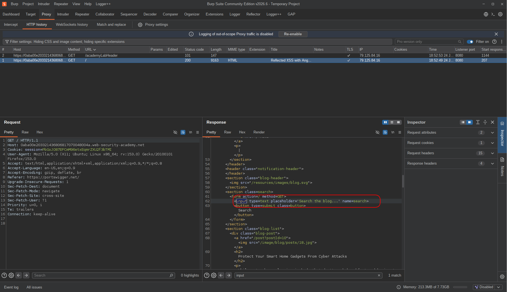  

<br>

And another thing, if you open the source or just inspect the HTML body, there are obvious signs of using AngularJS.  

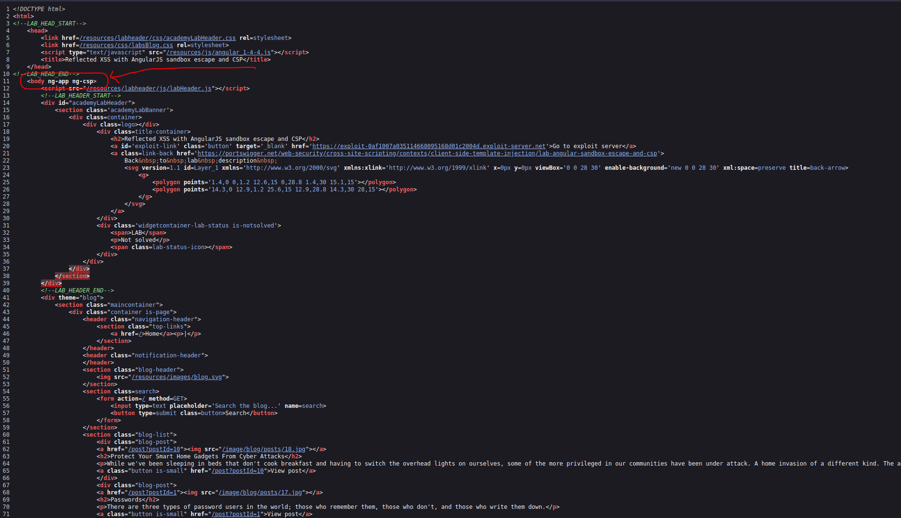  

`ng-app` and `ng-csp` tell that.  

My first test was to find a reflection of my input data, so I started with the search parameter (related to the search box) and entered some value...  

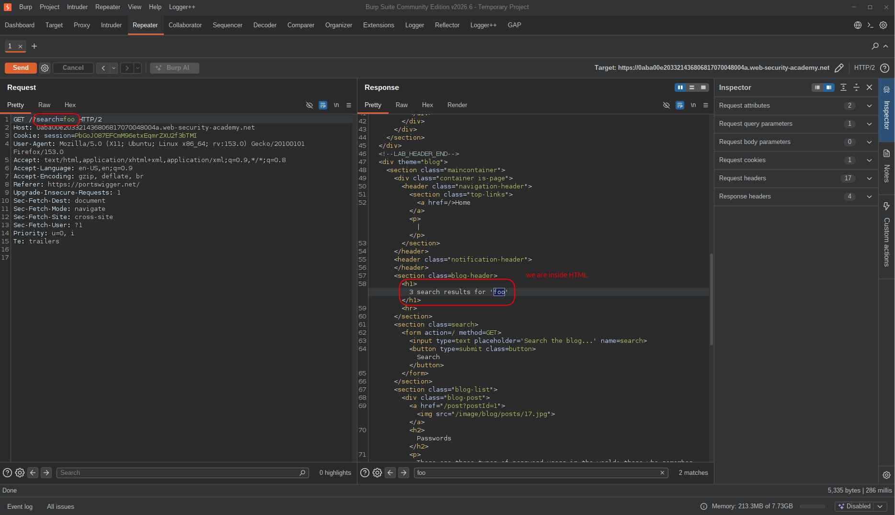  

I've entered 'foo' and it got reflected in the response.  
My next move was trying to break the string, even though I didn't need to and I was already in the HTML context:  

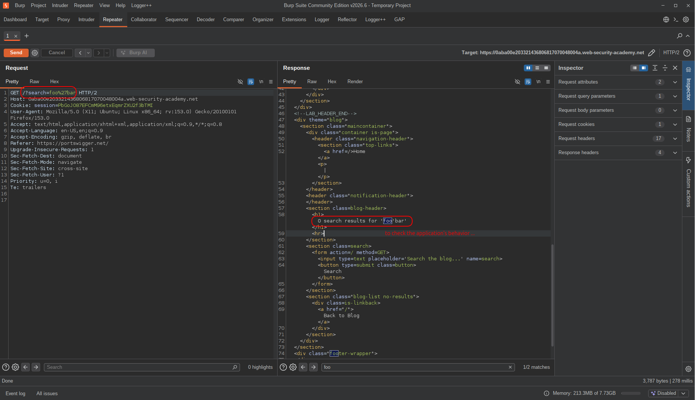  

<br>

After that I went straight for some injection.  
Always remember to start from harmless payloads and extend slowly...  
This way if there is a WAF, or the injection point is not vulnerable at all, you will know it earlier.  

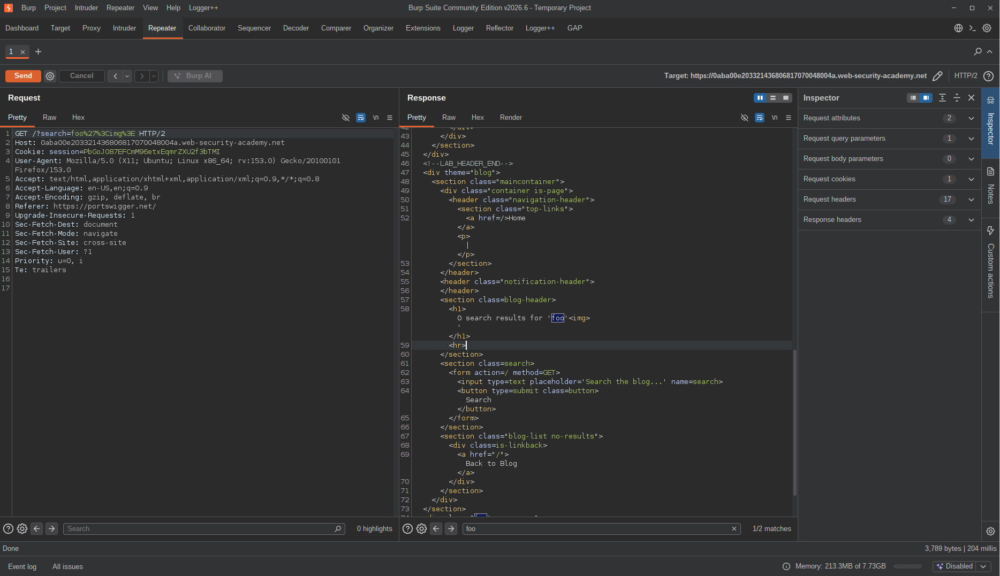  

I've injected an image and it reflected with no problem.  
Until this moment, everything was ideal...  
An easy XSS makes everyone happy,  
so I moved to executing JS and entered this payload:  

```xml

```

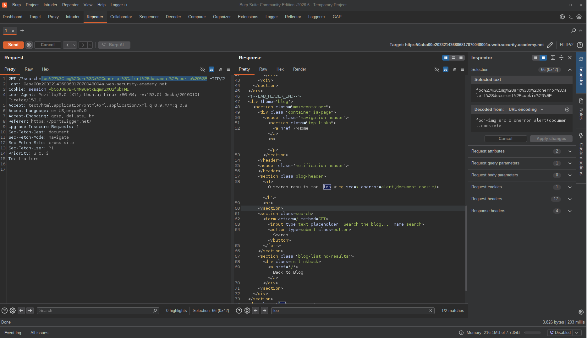  

Reflection was fine so I copied the query string and pasted it into the URL in my browser and nothing happened!  
No JS execution...  

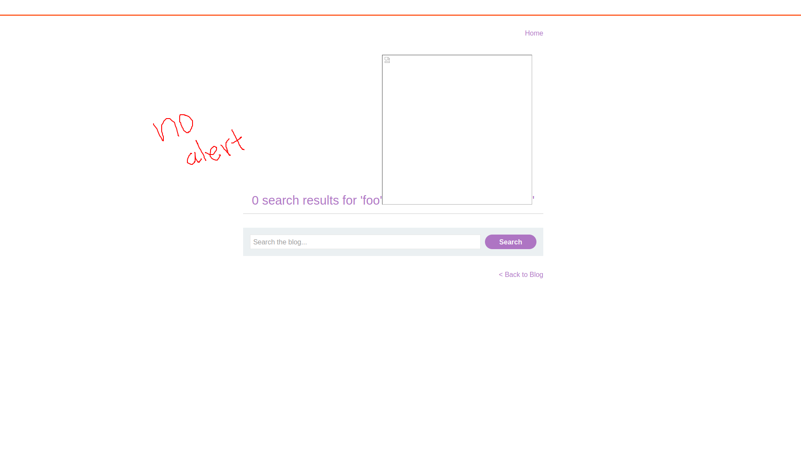  

So it can only mean one thing:  
Something is preventing JavaScript from being executed... and what is it? CSP.  
Then I took a step back to analyze the response again, and YES — it was CSP.  

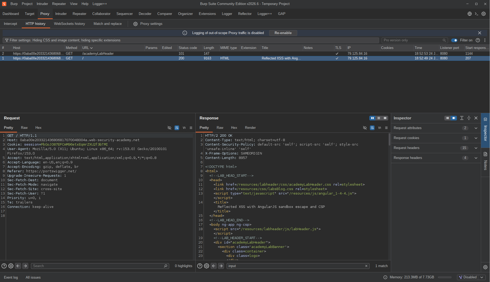  

<br>

There were two policies for scripts:  
1. Fallback: `default-src 'self'`
2. `script-src 'self'`

Which means: scripts can only be loaded and executed from the same origin, with a specified `src`.  
And note that inline scripts are not allowed, because `script-src` does not include `'unsafe-inline'`.  

And there was a part of the response which said:
```xml
<script type="text/javascript" src="/resources/js/angular_1-4-4.js"></script>
```

So: only same-origin sourced scripts are allowed, and there is a script with a relative path source, so the browser sees: `https://variableSubdomain.web-security-academy.net/resources/js/angular_1-4-4.js`.  
What does that mean? AngularJS has the only allowed JS code here... but how do we enter Angular code?  

---

## Exploitation

AngularJS makes HTML alive.  
It extends HTML with directives and expressions that are evaluated by its template engine.  
In the HTML body, when a tag has the attribute `ng-app`, its children can contain other directives for different purposes...  

And we know that we have HTML injection, right?  
So we can create an HTML tag with an Angular directive, and since we need it to be a real exploit, the code must be triggered automatically, without user interaction (like click, focus, etc).  

The first tag and attribute that comes to mind is probably the `input` and `autofocus` combo. So I tried that:  

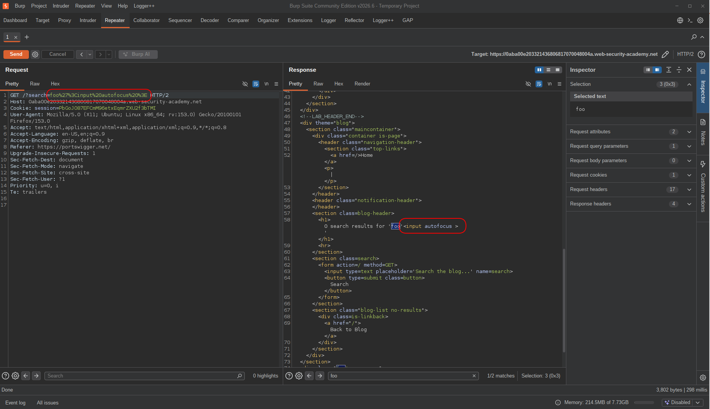  

I got the reflection, and it came down to finding the right directive.  
AngularJS has a ton of different directives for different goals.  
These directives can contain JS code and expressions that need to be evaluated.  
For example, if we want to add some onfocus event, `ng-focus` is the one we want to use.  

```xml
<input autofocus ng-focus="alert(document.cookie)">
```

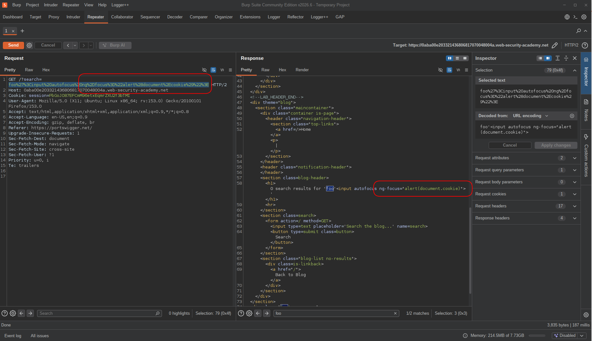  

<br>

The first thing I tried was `alert(document.cookie)` — and miracles can happen sometimes.  

>READ THIS IN CASE YOU DON'T KNOW ABOUT ANGULARJS SANDBOXING AND ESCAPING:  
In older versions of AngularJS (before 1.6) there was a feature called sandbox.  
Its job was to prevent anyone from accessing sensitive functions, objects, and generally dangerous things in JavaScript —  
like the `window` object and its properties, `Function`, etc.  
.  
But why are these dangerous? Because Angular has a template engine which evaluates JS expressions (executes the code).  
For example, if the user input was placed directly into a template, it would simply be evaluated — a text like 'hello' was not dangerous, but if the user entered something like `{{7*7}}` and 49 appeared on screen, that's a CSTI,  
or Client-Side Template Injection. Attackers could escalate that to XSS by some tricks (like accessing `Function()` to run JS code, etc).  
Angular expressions have access to scope and from scope we can access JS objects:  
`"hello".constructor`  
`[].constructor.constructor` (array constructor → `Array()` which is a function, function constructor → `Function()` which allows the user to execute arbitrary JS code.)  
.  
However, JavaScript was full of ways to bypass and escape this sandbox, like the one I just told you.  
There are different methods to escape this sandbox:  
1. Constructor chaining  
    - `[].pop.constructor('alert(origin)')` or `"hi".constructor.constructor('alert(origin)')`
2. Prototype abuse  
    - `Object.prototype.constructor = Function;` → `{}.constructor('alert(origin)')`
3. Parser confusion  
    - Is the "constructor" word being blocked? ...  
    - `{{constructor.constructor('alert(1)')()}}` → `{{'const'+'ructor'}}`? — `{{ a = 'constr'; b = 'uctor'; {}[a+b][a+b]('alert(origin)') }}`
    - Use bracket notation instead of dot notation → `ng-init="b=$on['const'+'ructor'];b('alert(origin)')()"` (directive example. `$on` is a function.)  
    - `{{ x = {'y': 'constructor'}; x['y']['y']('alert(1)')() }}`

>And that is why my `alert(document.cookie)` was not successful —  
because `window.alert` is being restricted.  
This is a sandbox.  

How could I escape this sandbox?  
There are many ways, but I tried some one by one:  

At first, I tried an alternative for the window object: `$event.view` in Angular, which in some cases refers to the window object itself.  
When Angular executes an event handler (directive), it delivers the `$event` variable to the expression. This is the real browser DOM event.  
So it has a `target` property, and more.  
And `$event.view` refers to the window related to the document.  
Again it was not successful.  

```xml
<input autofocus ng-focus="$event.view.alert(document.cookie)">
```

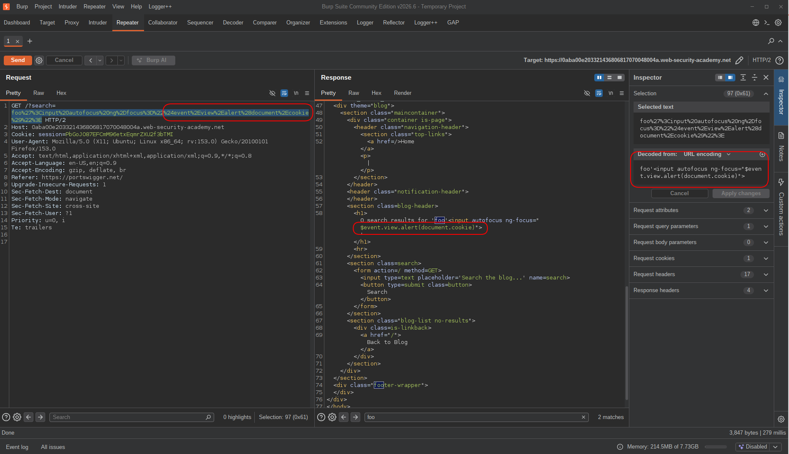  

<br>

I decided to change my payloads a little bit to find out if my expression was even being evaluated, so I entered:  
```text
...search=foo'{{7*7}}
```

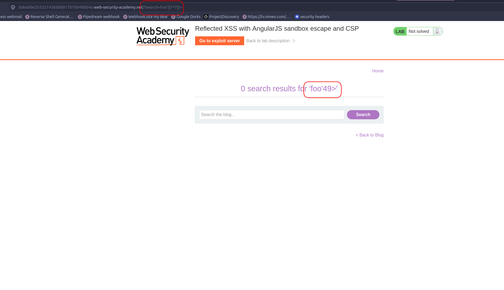  

And I got 49, so CSTI was also confirmed.  

<br>

Then I got back to my payload (autofocus input) and tried another sandbox escaping method: constructor chaining.  
Angular recognized `Function` immediately and threw an error.  

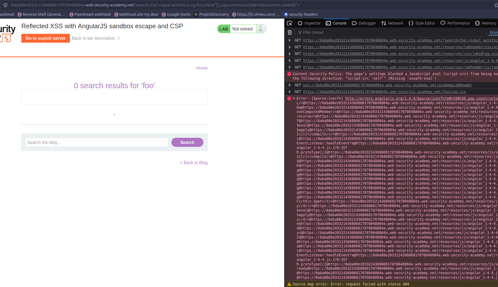  

The next approach was a little bit different, but again related to the `$event` variable:  
For example, when you click on a button and an event is triggered, the browser creates an event and that event does not stay only on the button you've clicked — it moves inside the DOM (event propagation).  
The path looks like: `button --> ancestor elements --> body --> html --> document --> window`,  
and `window` is the last one. `$event` has a method called `composedPath()` which returns this whole path as an array (with `window` as the last element!), so what happens if we inject this:  
```xml
<input autofocus ng-focus="$event.composedPath().pop().alert()">
```

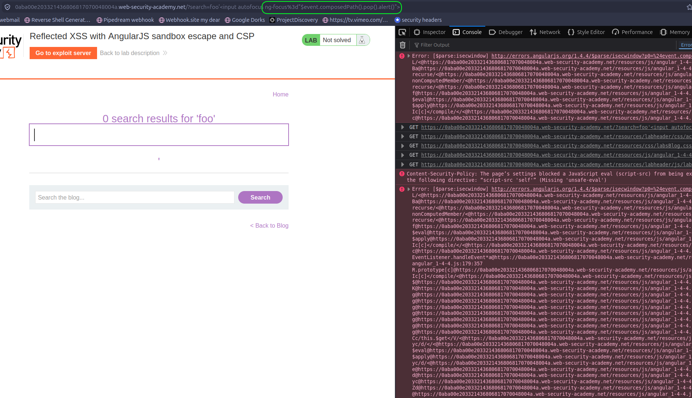    

And it failed again.  

<br>

But there is more:  
Angular has two features for piping and sorting values:  
1. In JavaScript, `|` is just a bitwise OR operator, but in Angular `|` means filter operator, like a pipe in bash — to pass a value on its left to the filter on its right.  
2. `orderBy:'expression'`: The `orderBy` filter expects an array as its input and an expression that determines how each element should be evaluated for sorting.  
    - It is used to sort values; however, it takes an expression and sorts values based on the result of that expression (it executes the expression). But how does it know what to evaluate with? The expression is evaluated in the context of each array element. During this evaluation, Angular resolves identifiers and properties based on the current object.  

In this lab we have `$event.composedPath()` → `[input, body, html, document, window]`  
and then `| orderBy:'expression'`  

Which means something like: `for (item of composedPath) { evaluate(expression, item) }`.  
For the first test, the expression is something harmless, like the letter `'x'`.  
And errors are gone! This was a good sign.  
```xml
<input autofocus ng-focus="$event.composedPath()|orderBy:'x'">
```

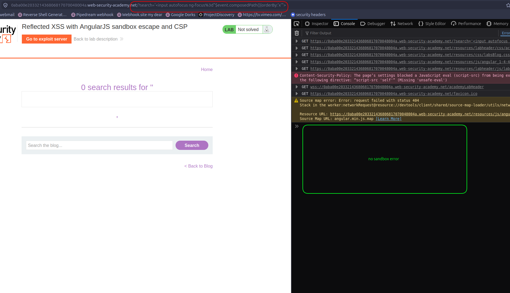    

<br>

So my next move was changing `x` to `alert(1)` to see if there was any execution.  
And I got an error again — but this time it was a good sign, not a failure!  
Because the problem was `alert`, and not `item.alert()`!  
Angular attempts to evaluate the expression against every object in the path. When the current object becomes `window`, the identifier `alert` resolves to `window.alert`.  
Where is it going to be found? On `window`!  
```xml
<input autofocus ng-focus="$event.composedPath()|orderBy:'alert(1)'">
```

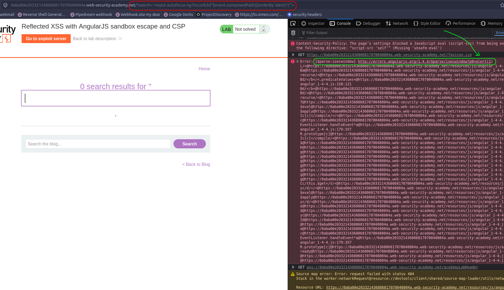  

It also meant that the code had reached `window.alert()` and the sandbox stopped it.  
So if not `window.alert()`, then `window.what`?  
Anything that is allowed!  
But it should refer to `alert` — because we need that!  
So in JavaScript, functions are first-class citizens. If you assign a function to another variable, like `f=alert`, from now on `f` refers to `alert` and works just like it. In fact `f` is `alert` itself, but the sandbox can't recognize it, because there is no direct reference.  

<br>

So I assigned `alert` to the variable `f` and called it immediately:  
```xml
<input autofocus ng-focus="$event.composedPath()|orderBy:'(f=alert)(1)'">
```

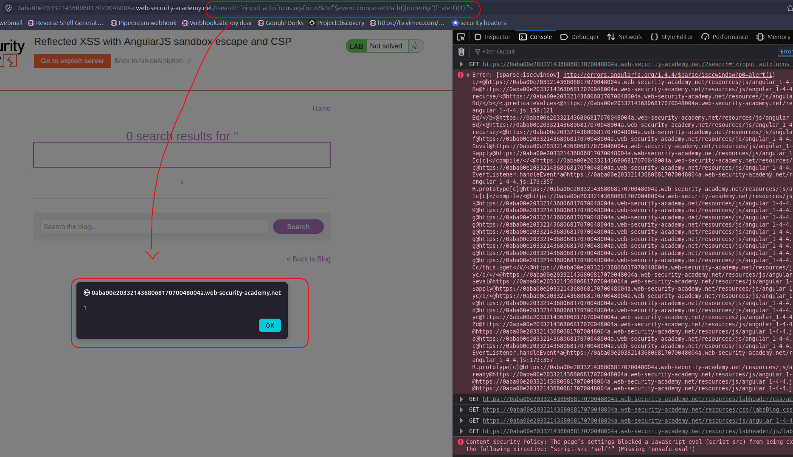  

<br>

And all I needed now to complete the exploit was to alert `document.cookie` and not the digit 1, but there was a problem...  
The payload was too long for the search parameter.  

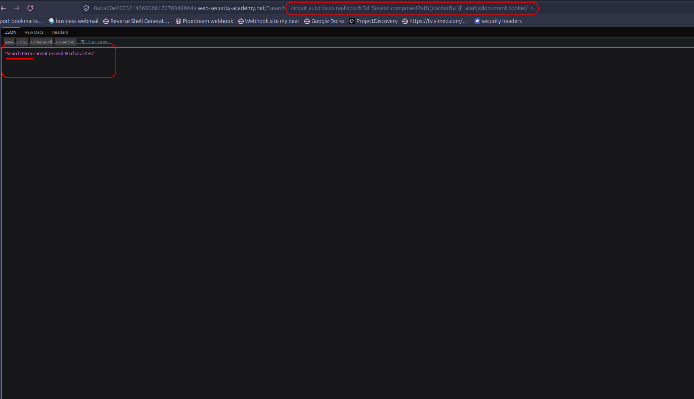  

So I had to make it as short as possible.  
In HTML, using an id after a fragment will focus on the element with that id. So `#l` will do the same thing as `autofocus` if the tag has `id=l`.  
Also `foo` and `'` were no longer in use.  

```text
<input id=l ng-focus="$event.composedPath()|orderBy:'(f=alert)(document.cookie)'">#l
```

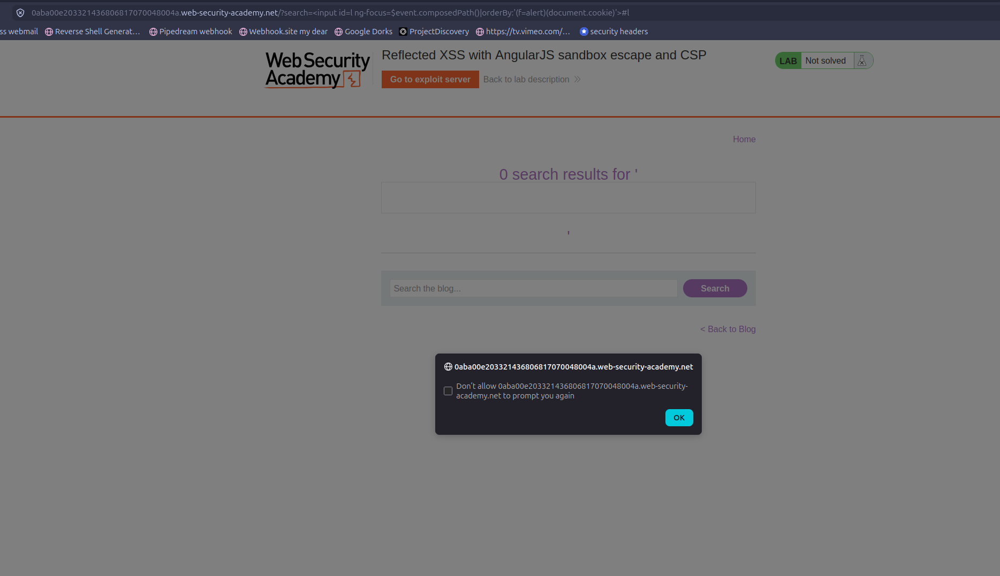  

<br>

And the last thing to do was delivering it to the target, by using an exploit server to redirect the user to the malicious URL.  

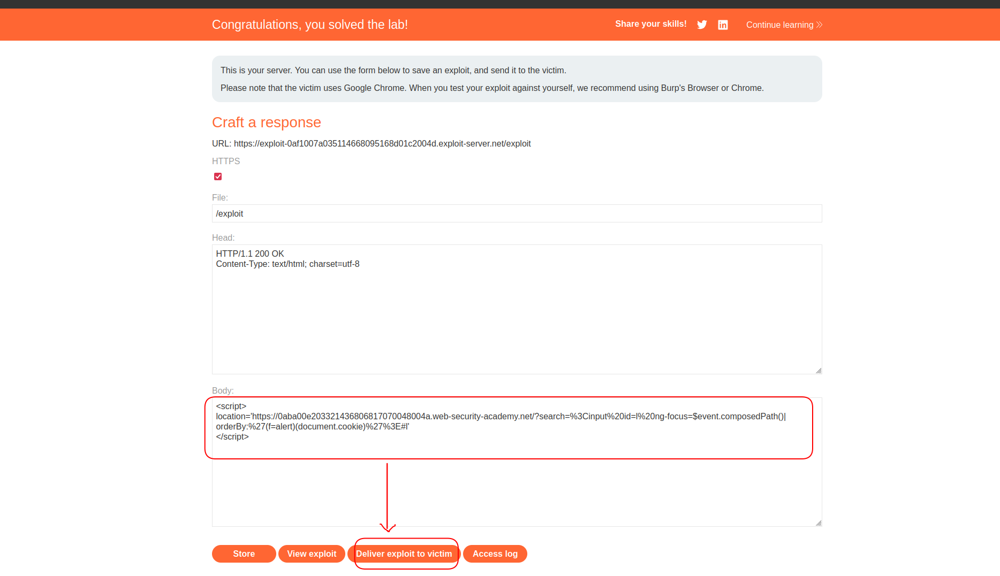  

---

## Final Payload:

```text
<input id=l ng-focus="$event.composedPath()|orderBy:'(f=alert)(document.cookie)'">#l
```

---

## Result

Once the exploit server was set up with the redirect, all that was left was to deliver the link to the victim.  
When they opened it, they got redirected to the target site with the malicious query string already embedded in the URL.  
The page loaded, the input got auto-focused via the fragment `#l`, `ng-focus` fired, the sandbox was bypassed, and `document.cookie` got alerted — clean and automatic, zero clicks required from the victim beyond opening the link.  
Lab solved.

---

## Impact & Remediation

An attacker who discovers this vulnerability can craft a malicious URL and deliver it to any user of the application.
Once the victim opens the link, arbitrary JavaScript executes silently in their browser under the target origin, with no further interaction needed.
This can lead to session hijacking via cookie theft, performing unauthorized actions on behalf of the victim, injecting fake UI elements into the page, or redirecting them to a phishing site.

The root causes here are two separate issues that compound each other:

The first is the AngularJS version. Versions below 1.6 include a sandbox that was repeatedly bypassed and eventually removed entirely. Running an old version of AngularJS in production is a liability — upgrade to a modern framework or at minimum to a version without the sandbox false sense of security.

The second is the CSP configuration. A `script-src 'self'` policy sounds strict, but it allows any JS file hosted on the same origin to run — and AngularJS itself is hosted there. This turns the allowed script into an attack vector. A properly scoped CSP with nonces or hashes, and without blanket `'self'` for scripts, would significantly raise the bar.

On the input side: all user-controlled data must be encoded before being reflected into any HTML context. Relying on a downstream framework like Angular to "handle" unsanitized input is not a defense — it is a risk.

---

## Takeaway

This lab was a great example of how defense layers can cancel each other out when they are not thought through together.

CSP was supposed to stop JavaScript execution. AngularJS was supposed to sandbox template expressions. Neither worked, because the attacker was allowed to inject HTML, and AngularJS — the very script the CSP trusted — was the execution engine.

The key lessons from this challenge:

* **Always identify what is actually trusted by the browser.**
  In this case, CSP trusted the same origin, and AngularJS was served from that origin. That made Angular's template engine a fully CSP-compliant code execution path. The attacker did not need to bypass CSP at all — they used it against the target.

* **A sandbox is not a security boundary.**
  The AngularJS sandbox was never designed to be a security feature. It was a development guardrail. The PortSwigger team documented bypasses for it extensively. Treating it as a defense against injection is a misunderstanding of what it was built for.

* **HTML injection is the real primitive here.**
  XSS is often discussed in terms of `<script>` tags and event handlers, but in an AngularJS application, injecting any tag with a directive is enough. The moment you control an HTML attribute inside an `ng-app` scope, you control execution.

* **`orderBy` as a code execution gadget is a classic trick worth remembering.**
  The filter evaluates an expression against each item in the array. When that array is the event's composed path, `window` ends up as one of the items — and any identifier in the expression resolves against `window`. This is the kind of indirect path that sandbox logic cannot easily track.

* **Payload length is a real constraint, not just a CTF detail.**
  Swapping `autofocus` for `id=l` and using the URL fragment `#l` is a practical technique. In real engagements, URL length limits exist in browsers, WAFs, and logging systems. Keeping payloads minimal is not just elegance — it is often necessary.

* **The biggest takeaway: layered defenses only work if each layer is independent.**
  Here, CSP depended on origin trust, and the origin hosted the very tool used to bypass the sandbox. If HTML injection had been prevented at the output encoding layer, none of the rest would have mattered. Fix the root cause first.