# Lab: Broken brute-force protection, IP block

| Field | Details |
|-------|---------|
| **Provider** | PortSwigger |
| **Difficulty** | Practitioner |
| **Category** | Broken Authentication |
| **Date** | 2026-07-31 |

---

## Summary

Broken brute-force protection, IP block is a lab in the PortSwigger Web Security Academy. In this lab we have a user's credentials and we can log in to wiener's account.
Also there is a brute-force protection which is IP-based — three failed attempts means rate limiting.

In this writeup, I'll walk through the entire manual exploitation flow step by step.

The task is to take over somebody else's account. The victim's username is `carlos`.

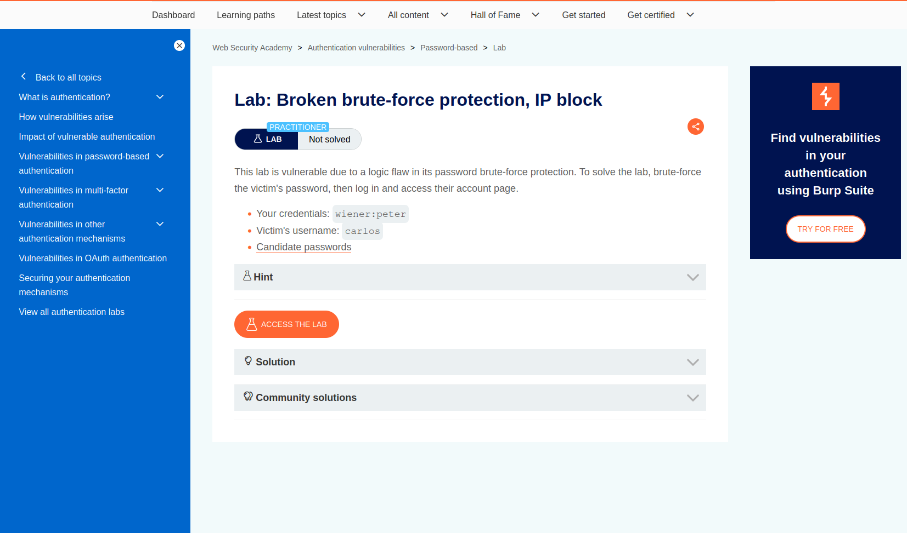

And a password list is also given.

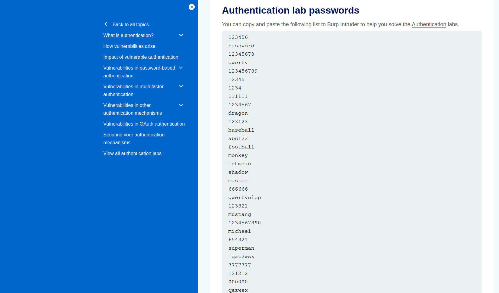

---

## Reconnaissance

First, opening the target — it's just a normal looking weblog where users can add posts and...
nothing suspicious at first sight.

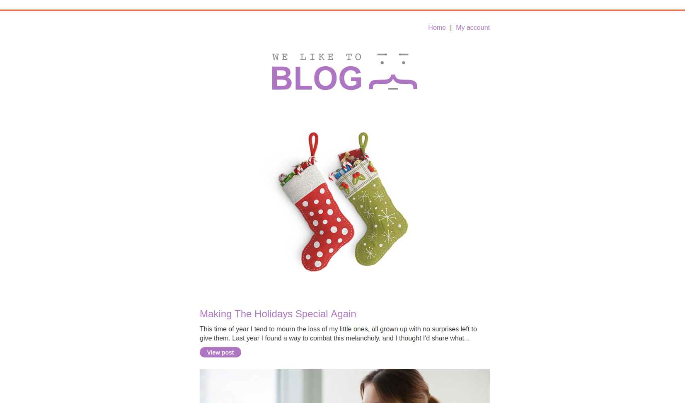

Since the given credentials belong to the wiener username, I logged into their account with: `wiener:peter`.

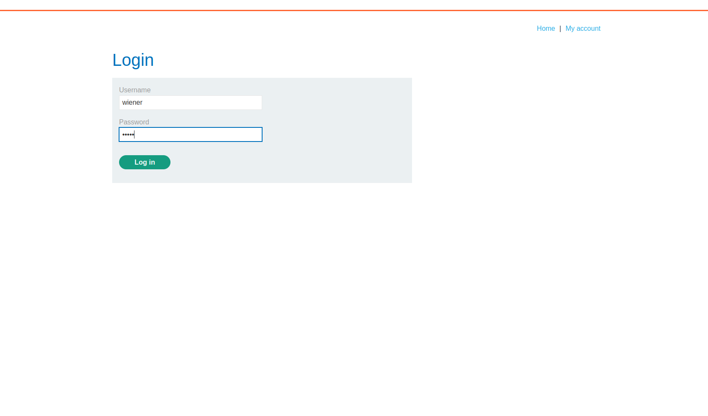

And I inspected my traffic to capture the login flow.
A POST request was sent including my credentials and then I got redirected to the profile page with status code `302`. It's important to keep every detail like status codes and eye-catching keywords in your recon flow.

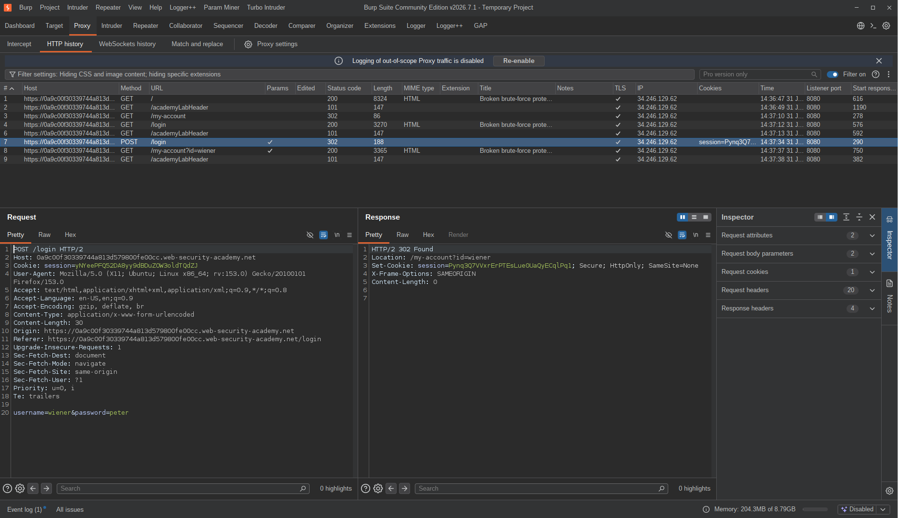

I sent that request to Repeater to check the application's behavior.
As username I entered `wiener` and password was `peter`. I got another 302, so there was no prevention of sending credentials as many times as you want.
Then I changed the username to the victim's username (`carlos`) and also set the password to `carlos`:

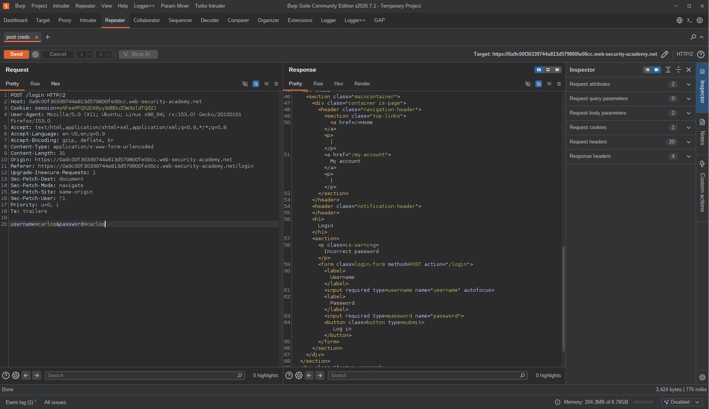

The response said: "Invalid credentials."
And I tried sending the same request again and again to check if there were any brute-force protections...
After three failed attempts, I hit the limit.

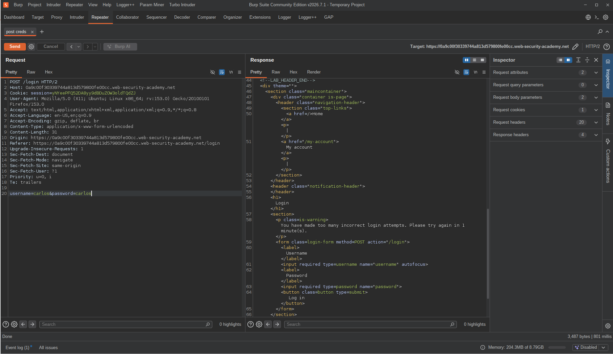

So yes — there was a protection.

<br>

A common and simple bypass for brute-force protection is sending a legitimate value before hitting the limit,
so the application resets your failed attempts count.
This happens if the developer only counts failed attempts up to the last successful one and not cumulatively.
The counter only works correctly when credentials are wrong.

<br>

So in my next move, I sent `carlos:carlos` twice, then `wiener:peter` once, then `carlos:carlos` twice again — and I didn't get caught by the protection.
Now that I knew the pattern, it was time to exploit this to take over the account.

---

## Exploitation

For any brute-force attack or fuzzing operation, we need a wordlist.
There are many good wordlists you can find online, but for this lab the list was already given.
So I just copied it into a local file to use in the process.

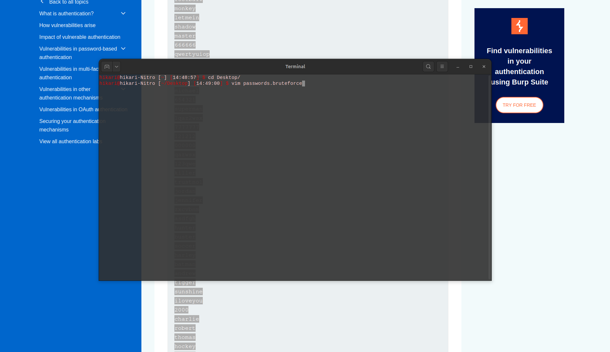

Then I sent the request to Turbo Intruder. If you know a little Python, it can be really useful and way more powerful than Burp Intruder.

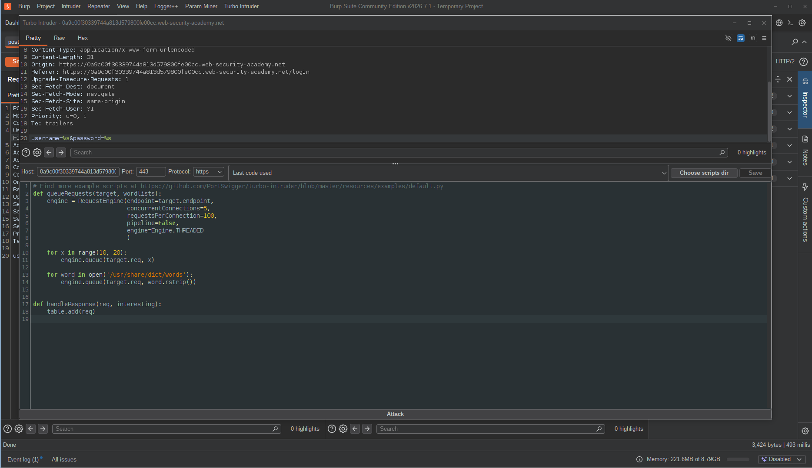

**Read this in case you want to know more about Turbo Intruder:**  
{  
>Turbo Intruder has two main functions: `queueRequests` and `handleResponse`.
`queueRequests` takes two arguments: `target` and `wordlists`.
It's like a framework — we never call this function ourselves, our job is just to do the settings and initialization, and Turbo Intruder will do the rest.
- `target` is the most important argument. It is the same request that we sent from Burp to Turbo Intruder.
The moment you send a request to Turbo Intruder, it creates an object named `target` which contains a lot of information.
For example, `target.endpoint` will be: `academy.net:443` — because the engine needs to know where to connect.

- `wordlists` is usually not needed, because we have our own wordlists and combinations which can be customized based on the target.

>`handleResponse` also takes two arguments: `req` and `interesting`.
This function will be called on each response.
- `req` holds almost everything about the response, like `status` (status code), `length` (body length), `wordcount` (word count), `response` (entire response), and `time` (latency).

- `interesting` is usually not needed in most normal scripts — Turbo Intruder uses it for some specific attacks.

>`table.add(req)` will show the result in Turbo Intruder's output table.
Using this, we can add filters on our request/response outputs.
For example:
```python
# status code
if req.status == 302:
    table.add(req)

# size filter
if req.length != 3184:
    table.add(req)

# looking for a specified word
if "Welcome" in req.response:
    table.add(req)
```

>Inside `queueRequests`, we should create an engine to send our requests using the `RequestEngine` constructor.
`concurrentConnections` specifies how many TCP connections should be opened. In this case we want `1` — because we don't want to hit the limit immediately.
`requestsPerConnection` specifies how many requests should be sent on each connection before it closes.
`pipeline`: if set to `True`, the engine will send requests repeatedly without waiting for a response.
`gate`: usually used for race conditions — all requests are held before a gate and released at the same time.

>Finally, the most important part:
You can add placeholders in your request using the `%s` operator (old-style string formatting).
For example, to brute-force a username and many passwords:
`username=carlos&password=carlos` → `username=%s&password=%s`
And then in your script, add this to the queue with: `engine.queue(target.req, ['carlos', password.strip()])`

This is all you need to know to start working with Turbo Intruder.  
}

So I edited my request and added placeholders (`%s`) for both `username` and `password` fields.
Then I updated the script:
1. `concurrentConnections` must be 1. In a brute-force attack with protections, using more connections will get you banned immediately — especially when 3 failed attempts trigger rate limiting.
2. I opened the wordlist that I copied to a local file, and for more control I iterated over it using `enumerate` to have both indexes and values at the same time.

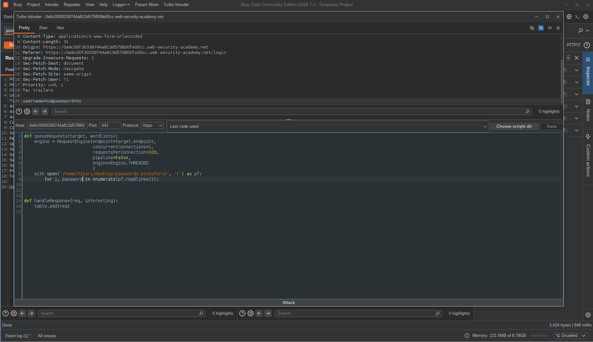

But what should I do for each password?
I want this pattern:
```text
wiener, carlos, carlos, wiener, carlos, carlos, ...
```
So the logic has to be:  
i = 0 → `wiener:peter`, then `carlos:pass0`  
i = 1 → `carlos:pass1`  
i = 2 → `wiener:peter`, then `carlos:pass2`  
i = 3 → `carlos:pass3`  

To avoid getting caught by the protection.

So if `i % 2 == 0`...

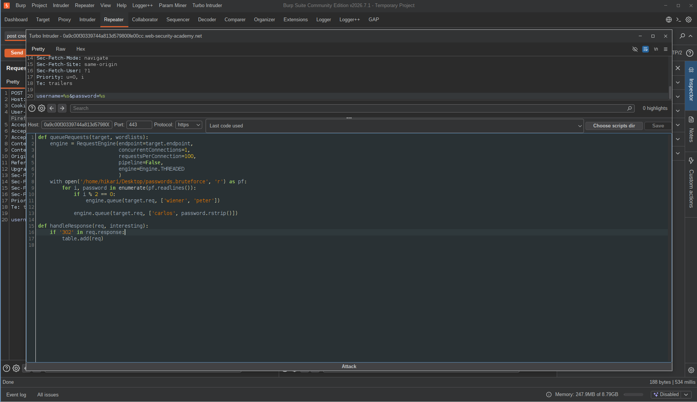

Using this method, we bypass the protection by sending a legitimate request every two attack attempts.
And since I knew that a successful login returns a `302` response, I filtered for all `302`s.

Then I just waited for Carlos to appear in the output — if the password was in the list.

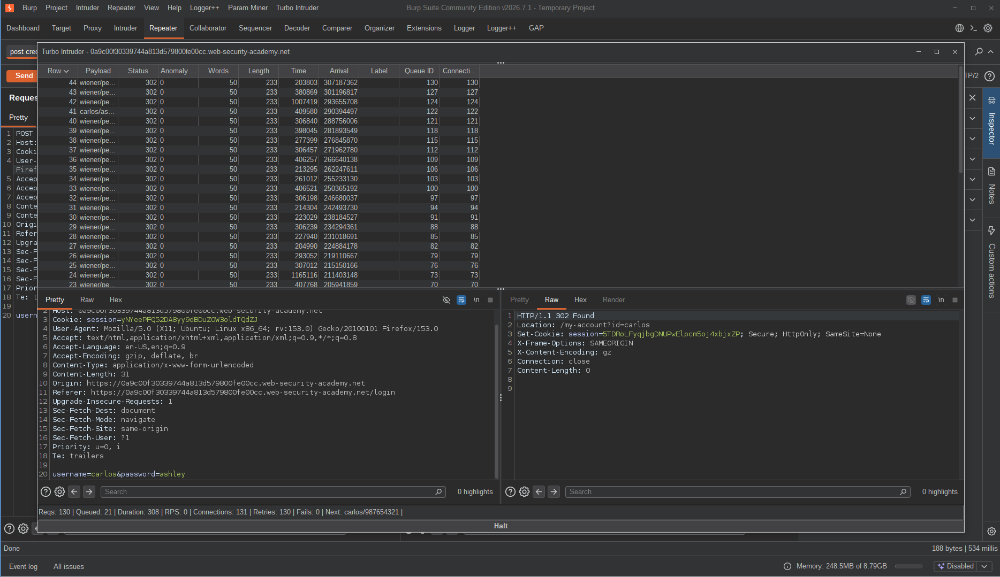

And I was able to log in to their account:

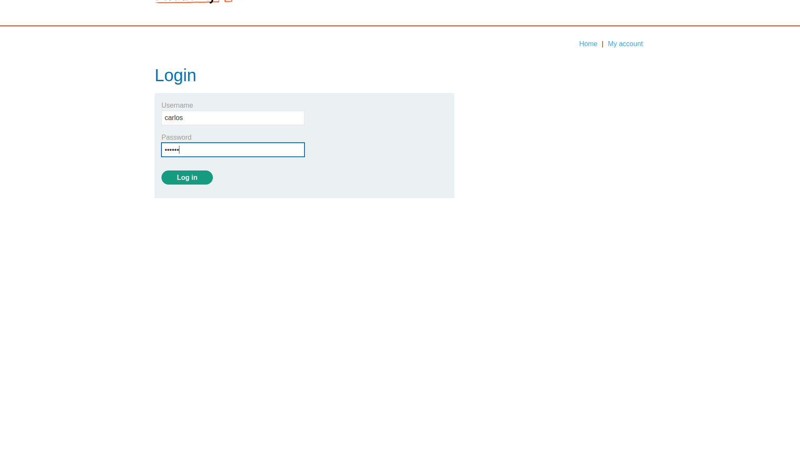

---

## Final Payload:

This is the final Turbo Intruder script:

```python
def queueRequests(target, wordlists):
    engine = RequestEngine(endpoint=target.endpoint, concurrentConnections=1, requestsPerConnection=100, pipeline=False, engine=Engine.THREADED)

    with open('/path/to/wordlist', 'r') as pf:
        for i, password in enumerate(pf.readlines()):
            if i % 2 == 0:
                engine.queue(target.req, ['wiener', 'peter'])

            engine.queue(target.req, ['carlos', password.rstrip()])

def handleResponse(req, interesting):
    if '302' in req.response:
        table.add(req)
```

---

## Result

The protection was there, but it was checking the wrong thing.
It counted consecutive failures — so slipping in a valid login every two attempts was enough to reset the counter and keep going indefinitely.
No CAPTCHA, no lockout, no alerts, nothing.
By the time the script finished, Carlos's password was sitting in the output table with a `302` next to it.
Logged in, account taken over, zero interaction from the victim.

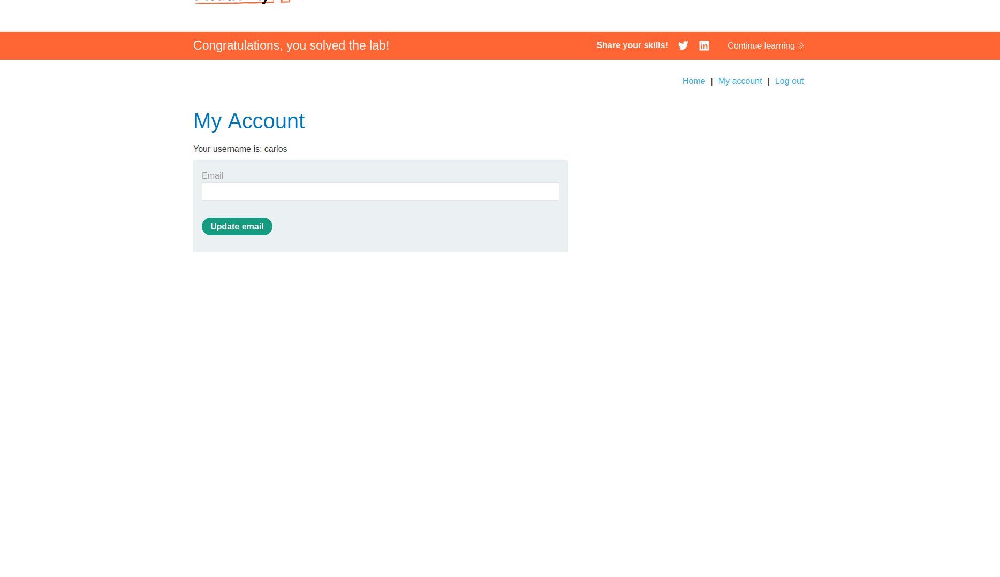

---

## Impact & Remediation

The brute-force protection here is purely cosmetic. It counts consecutive failed attempts, and a single successful login resets it — which means an attacker with one valid account can use it as a reset token and bypass the protection entirely, for as long as they want.

The real-world impact is straightforward: any account on the platform is brute-forceable given enough time and a decent password list. No special access, no vulnerability chaining, no victim interaction needed. Just a script and patience.

To actually fix this, a few things need to change:

Rate limiting should be cumulative, not consecutive. A successful login in between failed attempts should not wipe the counter. The protection needs to track the total number of attempts within a time window, not just the streak.

The application should enforce per-account rate limiting or temporary lockouts that cannot be bypassed by successful logins to other accounts.

IP-based protection alone is not enough. It's easy to rotate IPs, use proxies, or in this case exploit a legitimate account to sidestep it. Per-account lockout must be enforced independently of IP.

CAPTCHA on repeated failed attempts adds friction that automated tools can't easily bypass.

And on the user side — enforcing a strong password policy reduces the surface. A password that's not in any wordlist doesn't get cracked by this kind of attack.

---

## Takeaway

This lab is a good reminder that a security control is only as strong as its logic — not its existence.

A few things worth remembering:

* **"We have brute-force protection" is not the same as "brute-force is not possible."** The protection here was real, it was just checking the wrong thing. Always test what the protection actually does, not just whether it exists. Send a valid login in the middle of a failed attempt sequence and see if the counter resets.

* **Consecutive vs. cumulative — this distinction matters a lot.** Counting only consecutive failures is a common mistake. An attacker who knows this will always interleave valid credentials. The counter needs to track attempts over time, not just streaks.

* **One valid account can be a weapon.** In this lab, `wiener:peter` wasn't just credentials — it was the bypass mechanism. Having any legitimate access to an application can sometimes be leveraged to attack other accounts. Think about what a low-privilege user can do, not just what they're allowed to do.

* **Turbo Intruder is worth learning.** Burp Community's Intruder is rate-limited and slow. Turbo Intruder gives you full control via Python — custom patterns, conditional queuing, filtering by status or response content. For any non-trivial brute-force scenario it's the right tool.

* **Filter early, filter smart.** Running the attack without a filter first, then adding `-fs` or a status code filter once you know the baseline, is a clean workflow. It avoids false positives and keeps the output readable.
