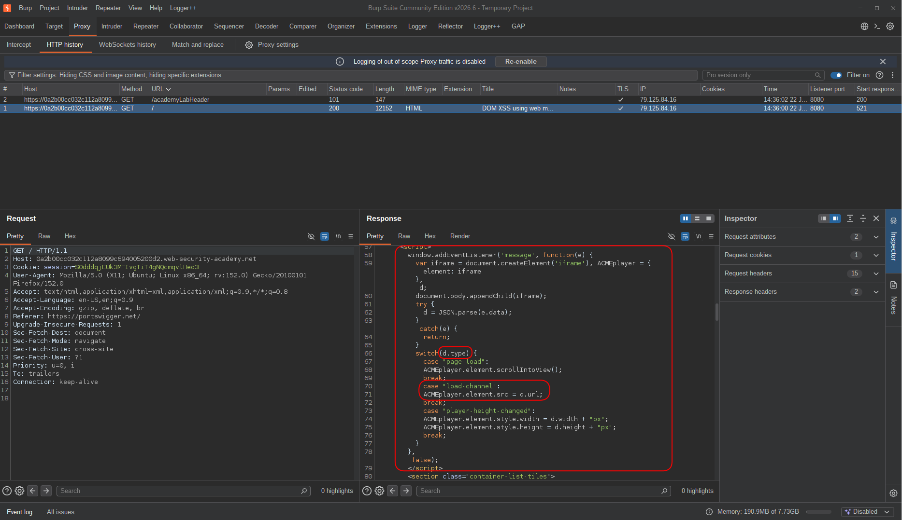
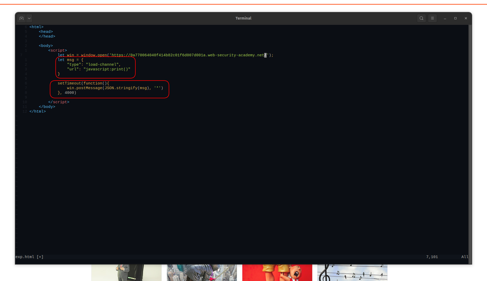
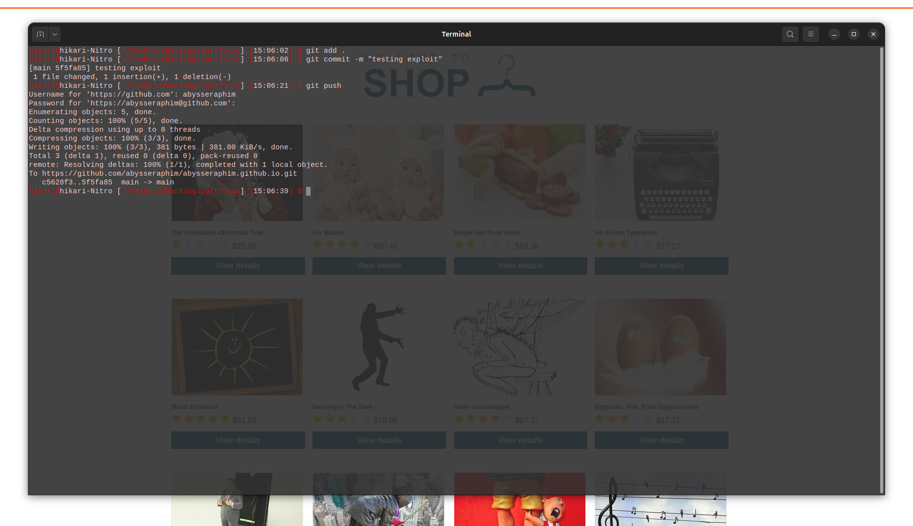
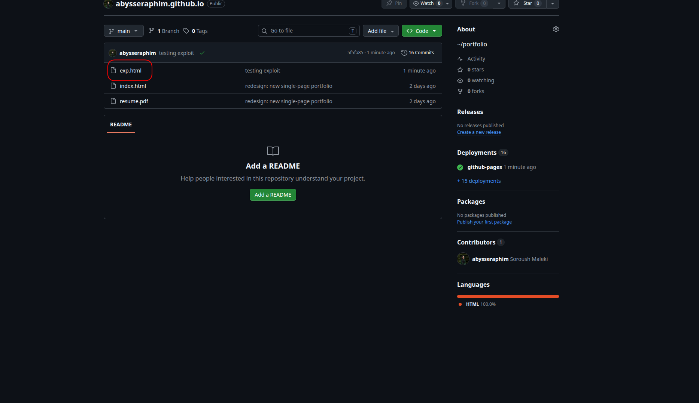
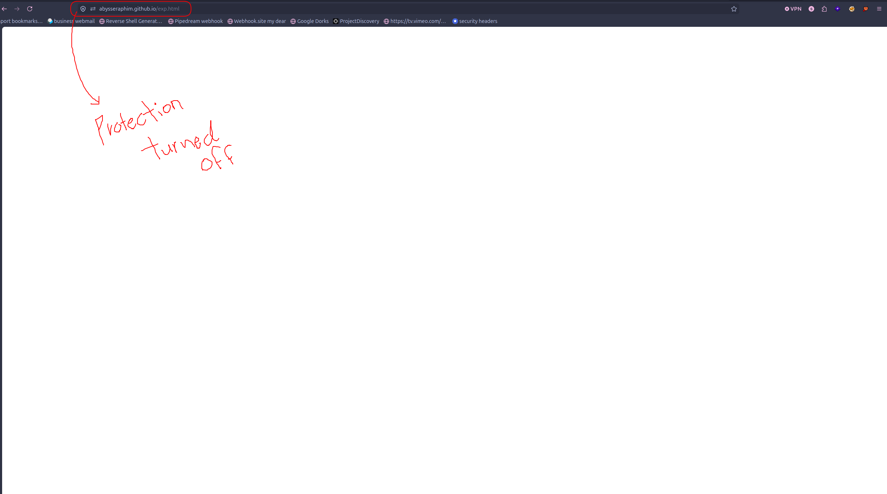
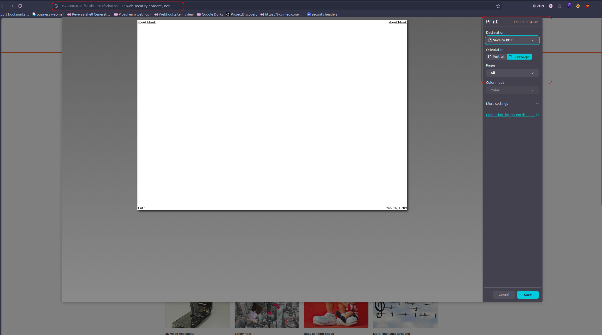
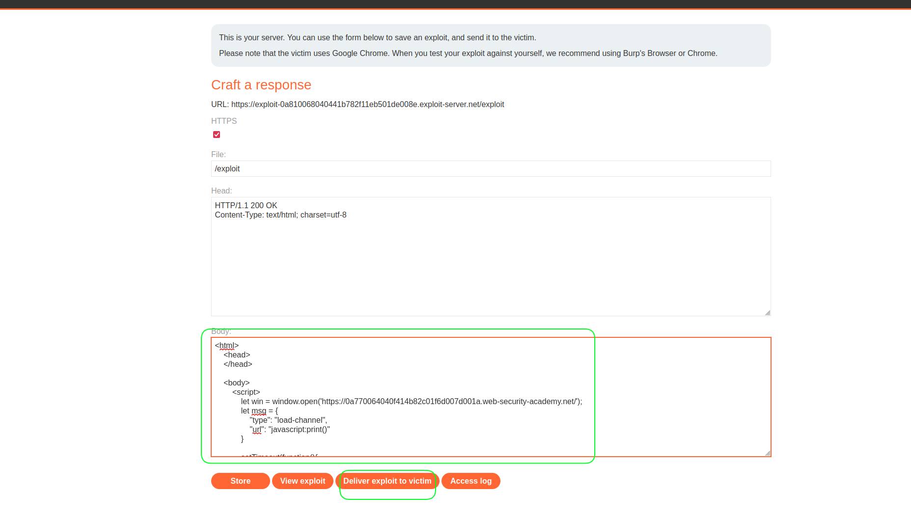
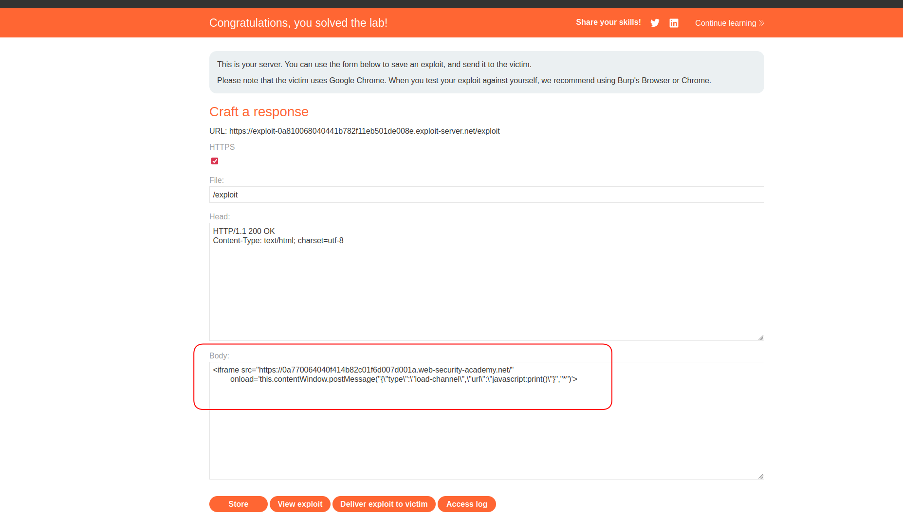

# Lab: DOM XSS using web messages and JSON.parse

| Field | Details |
|-------|---------|
| **Provider** | PortSwigger |
| **Difficulty** | Practitioner |
| **Category** | Cross-Site Scripting |
| **Date** | 2026-07-22 |

---

## Summary

DOM XSS using web messages and JSON.parse is a lab in the PortSwigger Web Security Academy. In this lab, the application has a postMessage listener in the main page script that receives data from an external source.  
Since this message listener doesn't validate the sender's origin and passes user-controlled data directly into an unsafe sink, it makes the application vulnerable to XSS.

In this writeup, I'll walk through the entire manual exploitation flow step by step.

---

## Reconnaissance

In the first page, when I inspected my request in a proxy (Burp), a script tag caught my eye immediately because of the postMessage listener.

But first — what is postMessage? To understand it, we need to talk about SOP (Same-Origin Policy).  
SOP prevents two different origins (an origin is defined by: scheme, host, and port) from sharing resources and data directly. This is the feature that keeps the whole internet safe and prevents PII leakage across sites.

But applications sometimes need to transfer data between different origins — like different subdomains of a site. Several solutions exist for this: CORS (Cross-Origin Resource Sharing), JSONP (transferring data via script tags, which is inherently unsafe), and postMessage.  
postMessage transfers data between two origins by sending messages through an iframe or a popup window.

Back to the target:



In the first response from the target, I spotted the postMessage event listener in the script — meaning the page was actively waiting for incoming messages.  
When a message arrives, the event listener creates a new iframe, and stores parsed message data in a variable `d`.  
The message itself is stored in `e.data`.

Looking more closely at the script, `e.data` is being parsed with `JSON.parse()`, so the expected message is a JSON object with keys like: `type`, `width`, `height`, `url`, etc.

There's a switch statement that executes different code based on the `type` property:
- `page-load` → nothing special, just scrolls the iframe into view
- `load-channel` → **the message's `url` property gets assigned directly to the iframe's `src`** — this is the sink we care about
- `player-height-changed` → updates the iframe's width and height styles

So I went straight to writing the exploit.

---

## Exploitation

Since many sites block iframe creation, I started with a popup window approach:

```javascript
let win = window.open('https://0a2b00cc032c112a8099c694005200d2.web-security-academy.net/');
let msg = {
    "type": "load-channel",
    "url": "javascript:print()"
}

setTimeout(function(){
    win.postMessage(JSON.stringify(msg), '*')
}, 4000)
```

I opened a popup window pointing to the lab, crafted a message with the targeted fields needed to trigger the vulnerable code path, then sent the JSON-stringified message to the opened window. The `"*"` as the second argument means no origin check on the sender side — send it to whatever target. The whole thing is wrapped in `setTimeout` to make sure the exploit runs after the page is fully loaded.



Since I had no personal web server, I used my GitHub Pages repository to host the exploit:



And it was placed there successfully:



> **Note:** For scenarios where you need a live log or want to check exfiltration results in real time, nginx/apache2 + cloudflared is probably the best free option.

I opened the exploit page (with popup protection disabled) and it worked:





The script executed in the target's context. But the lab wasn't marked as solved yet.

I realized I had to use the lab's exploit server — put the exploit there and click "Deliver exploit to victim". So I copied the entire exploit into the body section and triggered it.



Still not solved. Then it hit me — I had browser popup protection enabled, and the bot delivering the exploit to the victim wouldn't disable it. A bot has no reason to click "Allow popups", and Chrome blocks script-triggered popups by default unless there's prior user interaction.

So I switched to the second method. Instead of `window.open`, I used an `iframe` — it doesn't require any user interaction and loads inline:

```html
<iframe src="https://0a2b00cc032c112a8099c694005200d2.web-security-academy.net/" 
        onload='this.contentWindow.postMessage(JSON.stringify({"type":"load-channel","url":"javascript:print()"}), "*")'>
```

---

## Result

And the lab was finally solved.



---

## Impact & Remediation

If this vulnerability existed in a real application, an attacker could:
- steal session cookies (if `HttpOnly` is not set)
- perform actions on behalf of the victim (CSRF-like impact)
- redirect the victim to phishing pages
- capture keystrokes or credentials

The root cause is two missing checks:

**1. No origin validation** — the listener accepts messages from any origin.  
Fix: check `e.origin` before processing:
```javascript
if (e.origin !== "https://trusted-origin.com") return;
```

**2. Unsafe sink** — `iframe.src` is set directly from user-controlled data without sanitization.  
Fix: validate that the URL starts with `https://` before assigning it to `src`. Never assign untrusted input directly to `iframe.src`, `location.href`, or any URL sink.

---

## Takeaway

- `postMessage` is not safe by default — always validate `e.origin` on the receiver side.
- `iframe.src = userInput` is a sink. If untrusted input reaches it unsanitized, `javascript:` URLs are executable.
- `iframe` + `onload` is the preferred pattern for exploit delivery because timing is deterministic and requires no user interaction. However, some sites block iframe embedding — in that case, `window.open` + `setTimeout` is a valid fallback, just make sure popup protection is disabled in your browser.
- When you see a `switch` statement processing message types, map each case to its sink. `load-channel` → `iframe.src` was the one that mattered here.
- Bots don't click "Allow popups". Always think about what a victim's browser does automatically versus what requires user interaction.