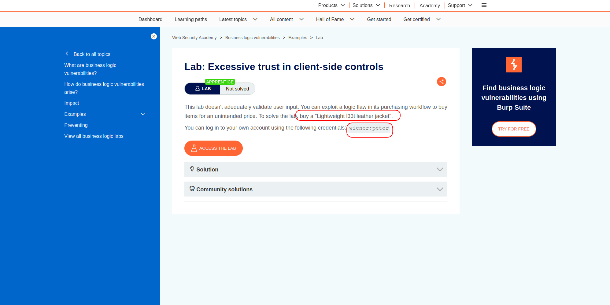
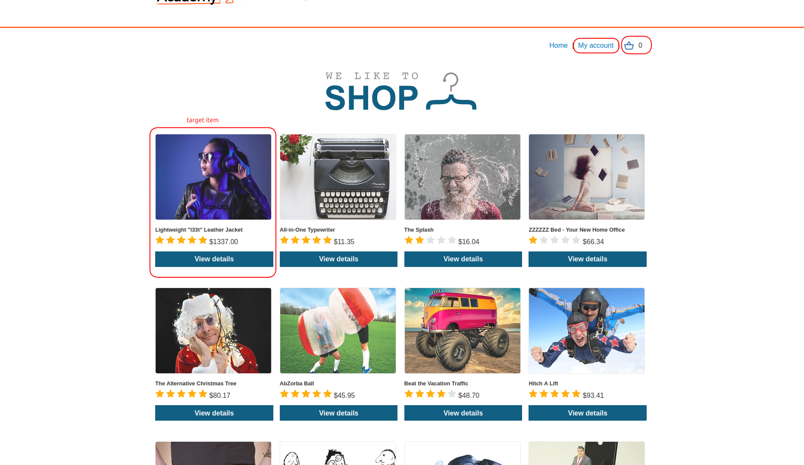
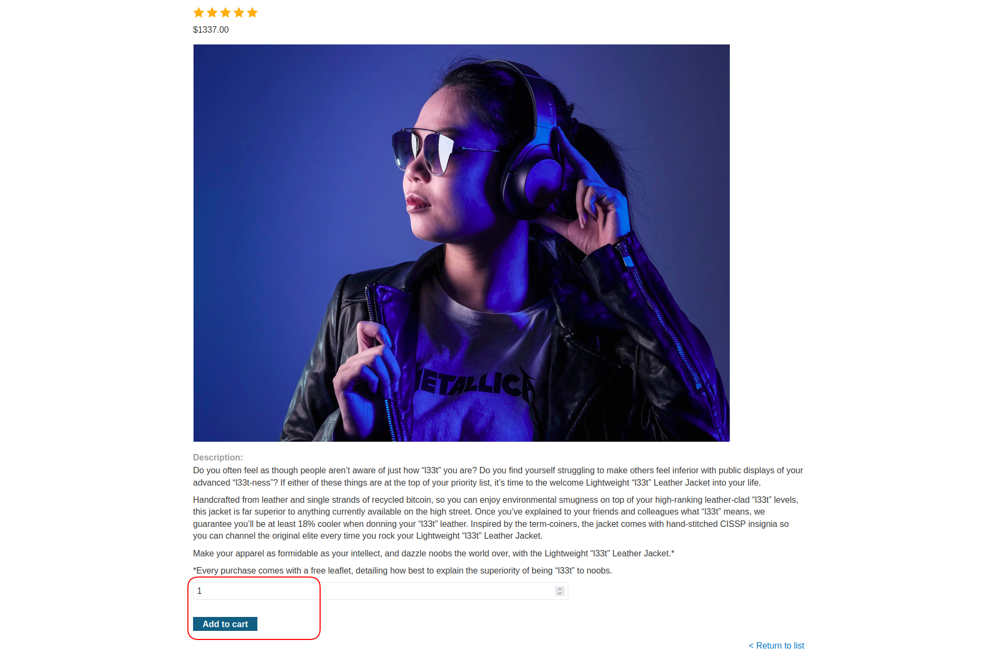
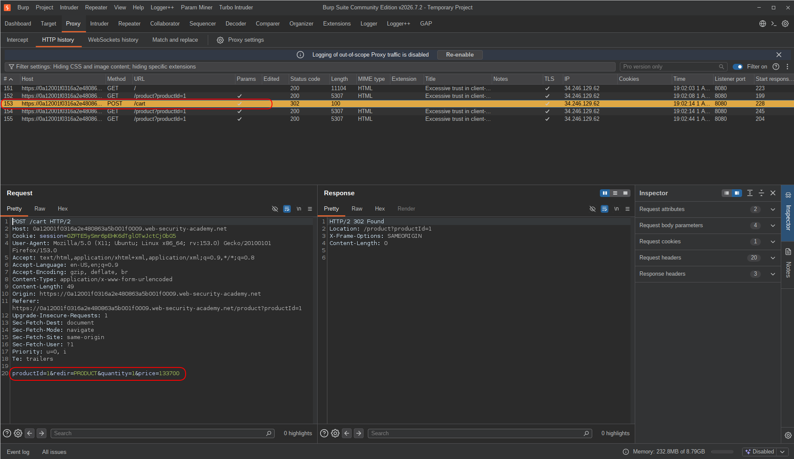
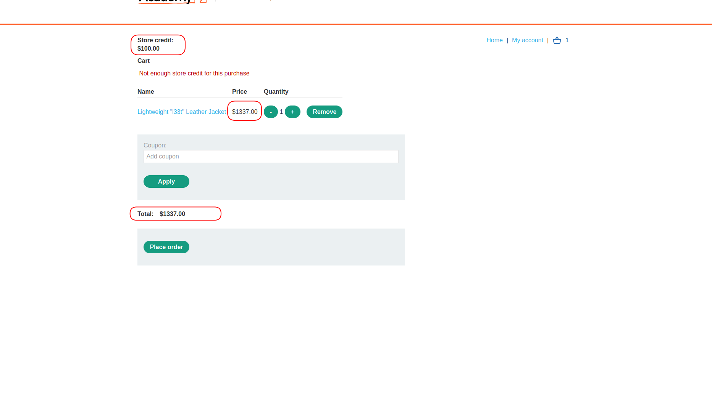
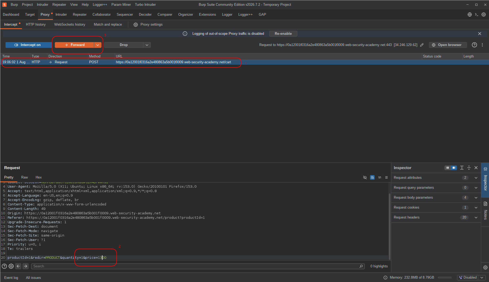
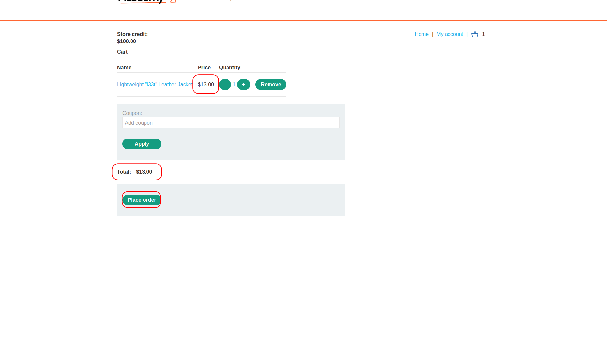
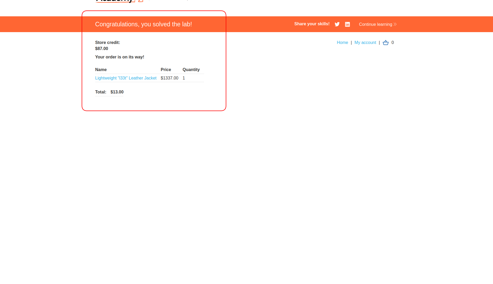

# Lab: Excessive Trust in Client-Side Controls

| Field | Details |
|-------|---------|
| **Provider** | PortSwigger |
| **Difficulty** | Apprentice |
| **Category** | Business Logic |
| **Date** | 2026-08-01 |

---

## Summary

Excessive Trust in Client-Side Controls is a lab in the PortSwigger Web Security Academy.  
In this lab we have a shopping website where you can add items to cart and submit orders.  
The task is buying a product that costs more than our current balance.

In this writeup, I'm going to explain one of the most common — and most embarrassing — business logic vulnerabilities out there.

---

## Reconnaissance

When I opened the web application, it looked like a standard shopping site — some items to buy, account management, and a cart.

The target is a Lightweight l33t Leather Jacket priced at $1337.00. My account balance was $100. So I can't just buy it normally.

I added the jacket to my cart and intercepted the request.  
The POST request body contained: `productId`, `redir`, `quantity` — and `price`.

The price is being sent from the client side. The server is just... trusting it.

When I tried to place the order without touching anything, the application said: "Not enough store credit for this purchase."

---

## Exploitation

I removed the item from the cart, turned on request interception and clicked Add to Cart again.

This is one of the most straightforward tests you can do — if the price is in the request body, just change it.

I changed `price` from `133700` to `1300` (that's $13.00) and forwarded the request.

The jacket was added to the cart at $13.00.

I placed the order and it went through.

---

## Result

The order was accepted at the manipulated price. Lab solved.

---

## Impact & Remediation

The impact here is direct financial loss for the business.  
Any user can buy any item for any price they want — including $0 or negative values — just by modifying the request before it reaches the server.  
In a real application, this translates to stolen goods, revenue loss, and potential for large-scale abuse if the vulnerability is discovered by more than one person.

To fix this:
- **Price must never be sent from the client.** The server should calculate the price based on the `productId` using its own database — not trust whatever number shows up in the request body.
- The only thing the client should send is what the user selected: product ID and quantity. Everything else — price, discount, total — is the server's job to calculate.
- Any pricing logic that lives in the frontend (JavaScript, hidden fields, POST parameters) is not security. It's just UI. Treat it accordingly.

---

## Takeaway

- **If it comes from the client, it can be modified.** This applies to everything — prices, quantities, discounts, role flags, you name it. The frontend is not a trust boundary.

- **Business logic bugs don't need fancy payloads.** No injections, no encoding tricks, no special tools. Just changing a number in a POST request was enough to bypass the entire purchasing workflow. Sometimes the simplest test is the right one.

- **Always intercept add-to-cart requests.** In real bug bounty engagements, pricing endpoints are high-value targets. If the price parameter exists client-side, it's worth testing — even if it looks like it couldn't possibly work.