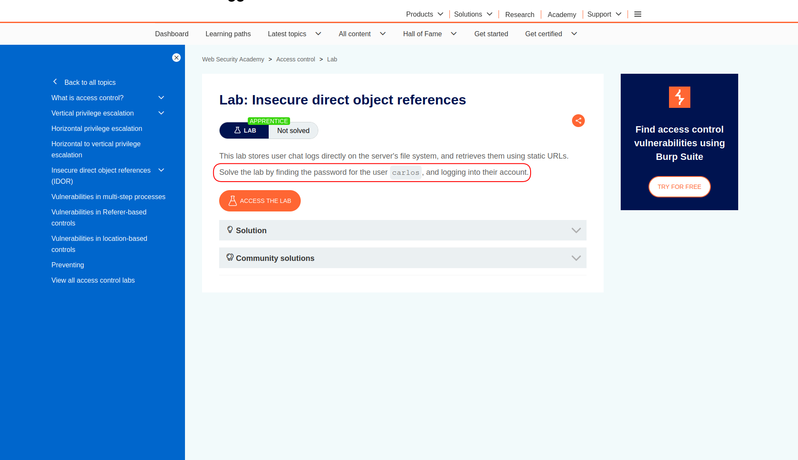
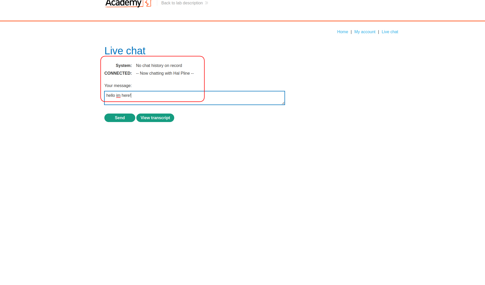
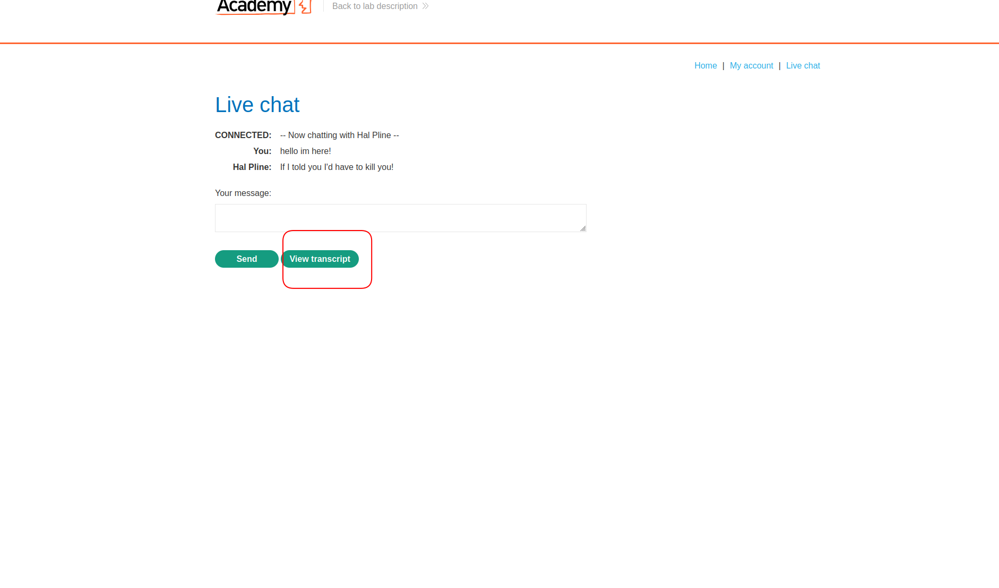
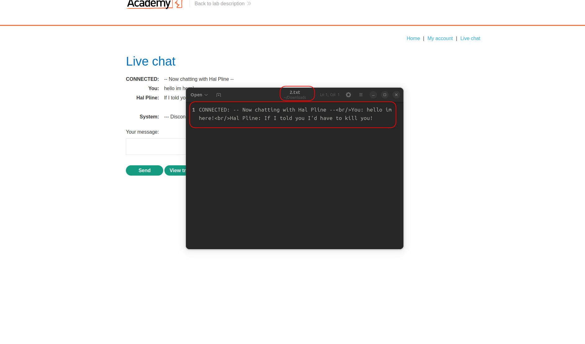
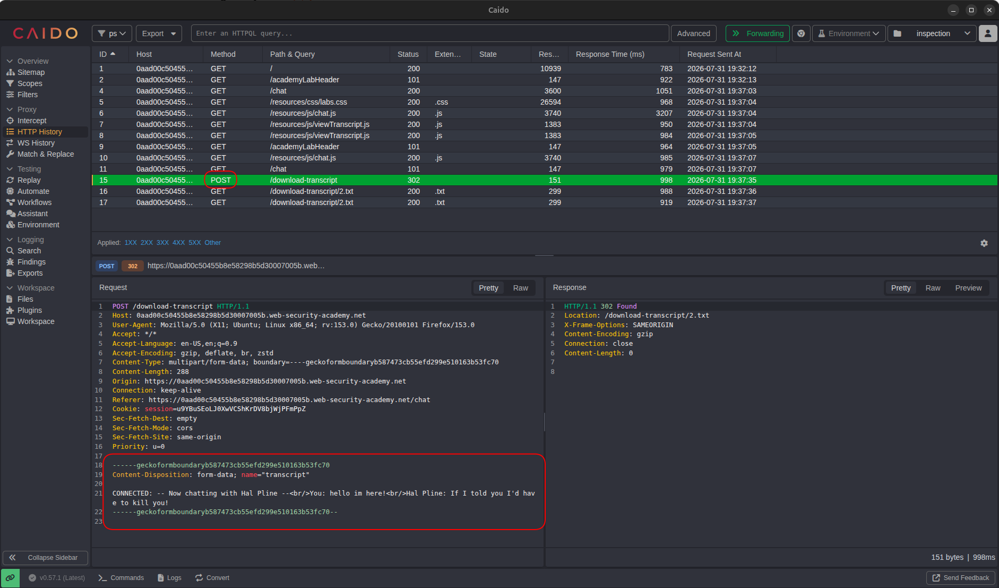
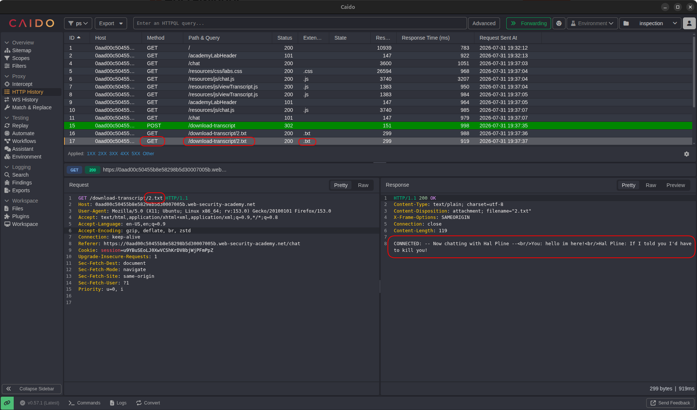
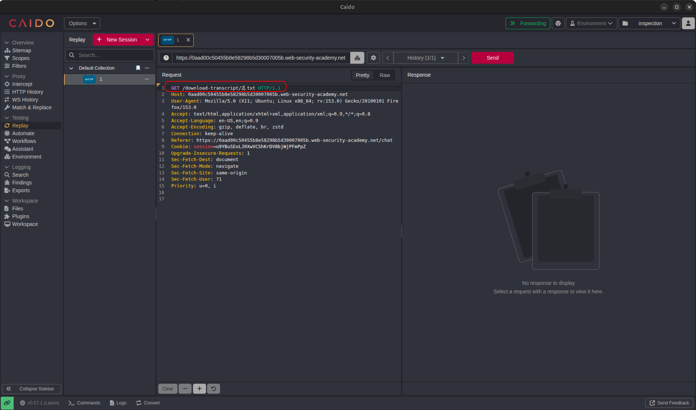
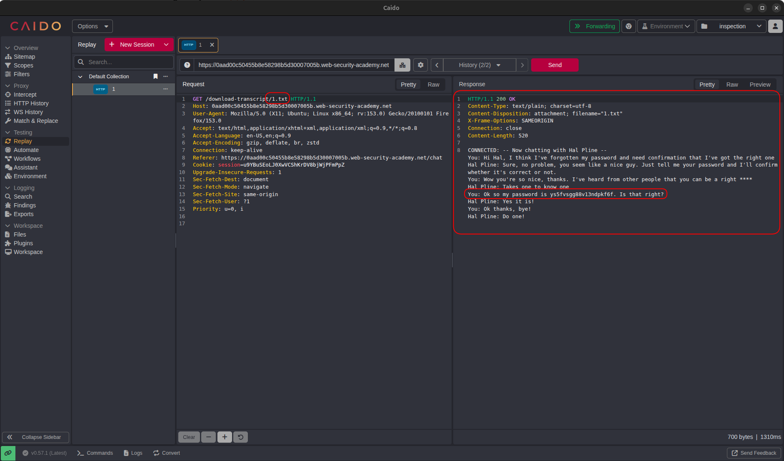
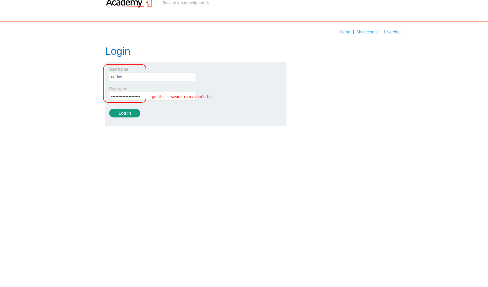
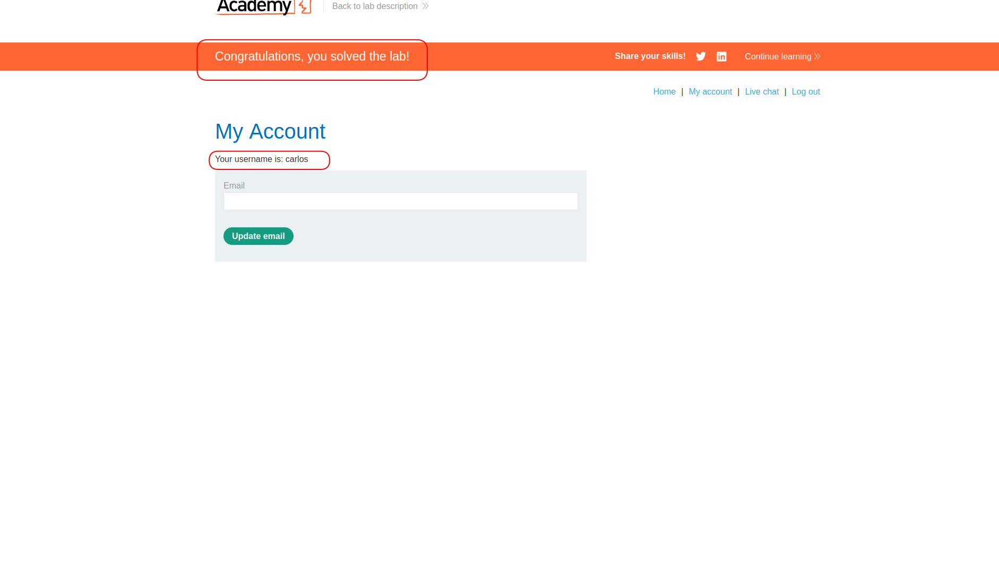

# Lab: Insecure Direct Object References

| Field | Details |
|-------|---------|
| **Provider** | PortSwigger |
| **Difficulty** | Apprentice |
| **Category** | Broken Access Control |
| **Date** | 2026-07-31 |

---

## Summary

Insecure Direct Object References is a lab in the PortSwigger Web Security Academy. In this lab there is a live chat feature that you can use to chat with someone, and all messages will be saved on the server.  
Later you can download the entire transcript.

The task is to take over somebody else's account. The victim's username is `carlos`.

---

## Reconnaissance

When I opened the target lab, I saw a shopping web application.  
There are some items, an account section, and a live chat page.

I opened the live chat page and wrote a message:

And some response came back:

 

So now if I click on "View Transcript", I should be able to see the entire chat.  
I did that and a text file downloaded to my system:

The question is:  
How does the server know which chat to download and show me?  
Does it search based on my session and date? Or what?

So I took a look at the request history:

That was the POST request which sent the chat data to the server so the server can save it for later use.  
This was probably done when the chat ended.

The next request was related to downloading the transcript —  
because there is a `.txt` extension and it's a GET request.  
And it was! In the response I can see the transcript:

If you take a good look at the request path, you will see there is a number — a predictable file name: `2.txt`

> In IDOR (Insecure Direct Object Reference), there are two types of identifiers: `implicit` and `explicit`.  
> Explicit IDs — like a number, a string, or anything that references something directly and explicitly.  
> Implicit IDs — like a verb-based path (for example `/me`, `/my-transcript`, ...).  
> The identifier here is an explicit one.  
> The simplest test is to change the ID.  
> A hacker can also combine this with other methods like: path normalization tricks, HTTP verb tampering (different knocks), adding extensions, etc.

---

## Exploitation

So I sent that request to the repeater and changed the ID from `2.txt` to `1.txt` — because if I'm number 2, who is number 1?

  

And I got another transcript in the response.  
Sensitive chat data that contained a password to Carlos's account.

I copied that password and tried to log in as `carlos`:

Done! I was inside Carlos's account.

---

## Result

Changed the file name from `2.txt` to `1.txt` in the download request.  
Got back a chat transcript that wasn't mine — and it had Carlos's password in plain text.  
Logged in, account taken over.

---

## Impact & Remediation

The application is serving files by name with zero access control.  
Anyone who knows (or guesses) a filename can download any transcript on the server.  
No authentication check, no ownership verification, nothing.  
The files are sequentially named — so it's not even a guessing game, it's just counting.

Real-world impact: every chat transcript on the platform is exposed to any authenticated user.  
Passwords, personal conversations, support tickets — anything saved as a transcript is readable by anyone.

To fix this:  
Access control must be enforced server-side on every file request — not just at the UI level.  
Each transcript should be tied to the user's session or account, and the server should verify ownership before serving the file.  
Filenames should not be sequential or predictable — use UUIDs or signed URLs that expire.  
And sensitive data like passwords should never appear in chat logs in the first place.

---

## Takeaway

A few things worth keeping in mind:

* **The URL tells you a lot.** Seeing `2.txt` in a download path immediately raises a question: who's `1.txt`? Always look at how objects are referenced in requests — numbers, filenames, IDs. If it looks guessable, test it.

* **Explicit vs implicit identifiers.** Explicit IDs directly reference a specific object — a number, a UUID, a filename. Implicit ones use context like `/me` or `/my-transcript`. Both can be vulnerable, but explicit ones are usually easier to test and faster to exploit.

* **IDOR is not just about changing numbers.** Once you find a reference, you can combine it with other techniques — path normalization, HTTP verb tampering, adding or removing extensions. The number change here was the simplest possible case.

* **Server-side access control is non-negotiable.** Hiding a link in the UI or using a non-obvious filename is not security. If the server doesn't check who's asking for what, it doesn't matter how obscure the URL is.