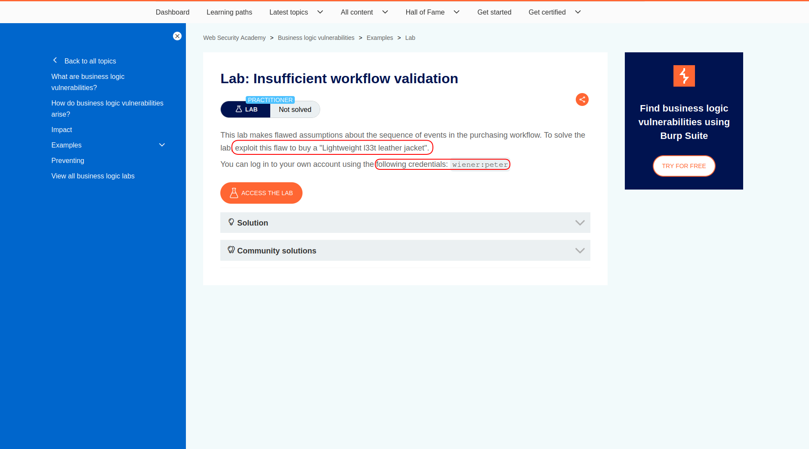
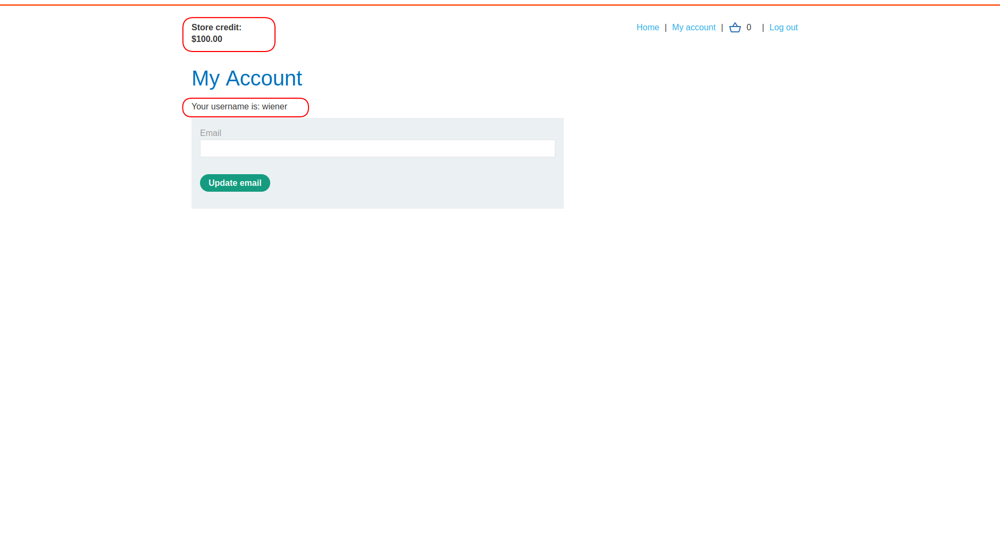
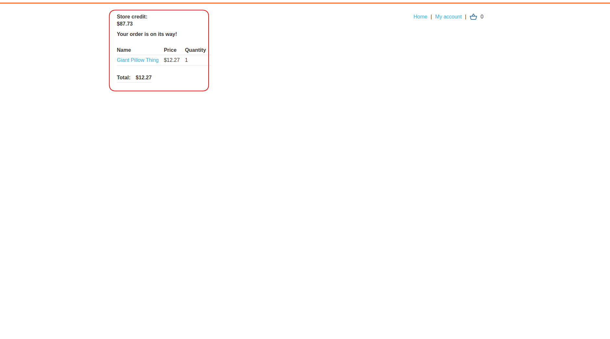
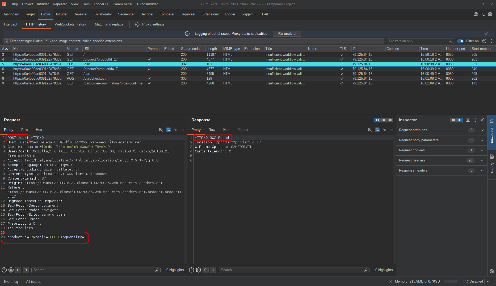
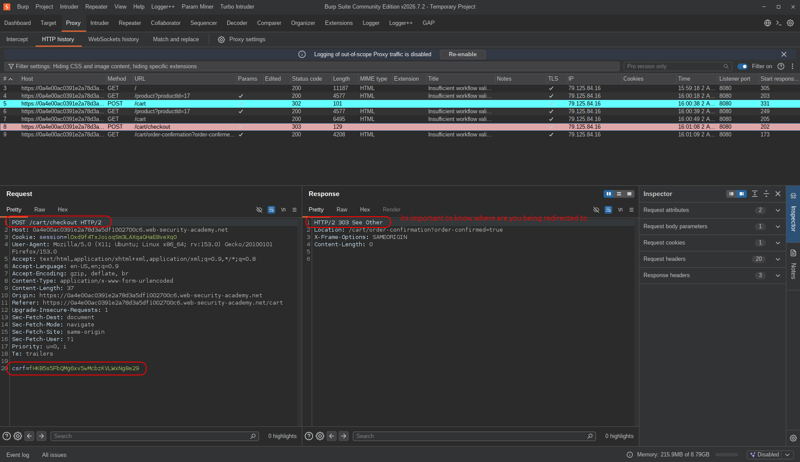
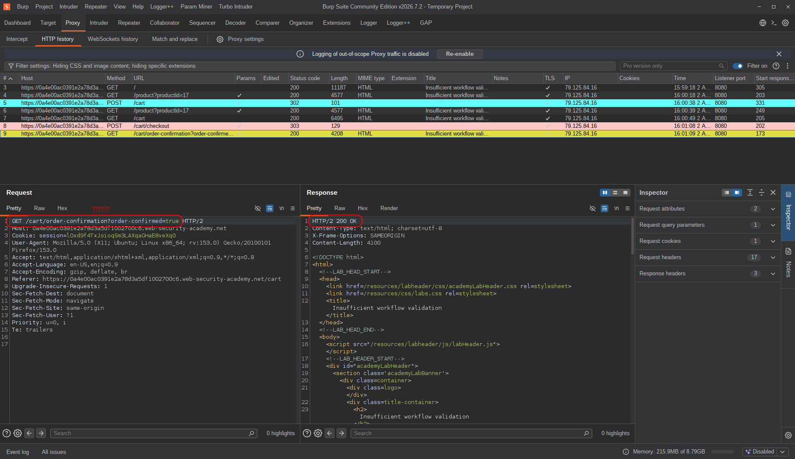
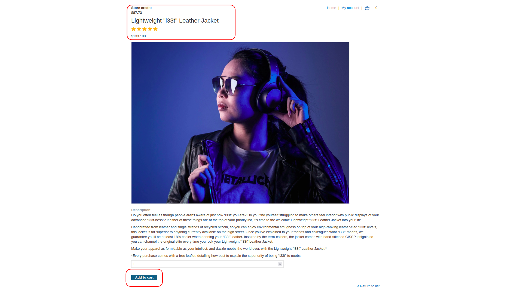
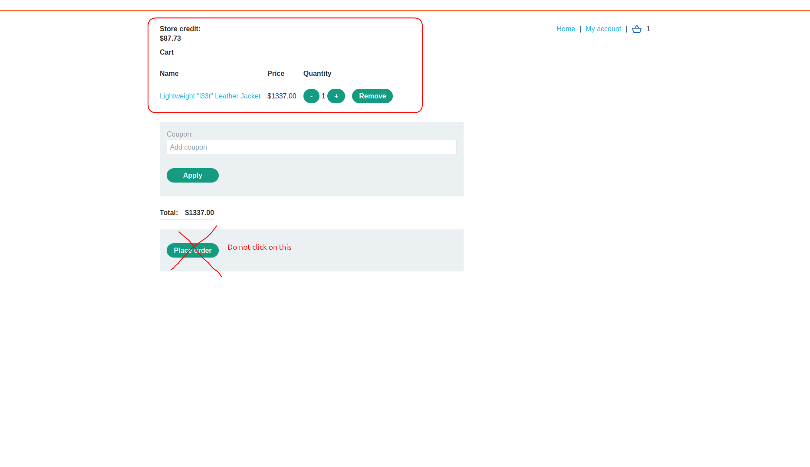
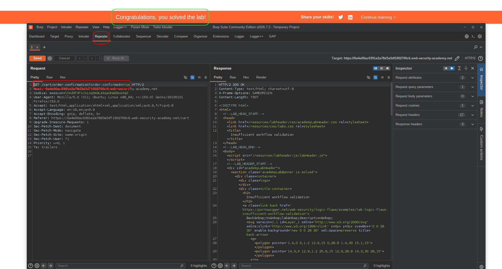

# Lab: Insufficient workflow validation

| Field | Details |
|-------|---------|
| **Provider** | PortSwigger |
| **Difficulty** | Practitioner |
| **Category** | Business Logic |
| **Date** | 2026-08-02 |

---

## Summary

Insufficient workflow validation is a lab in the PortSwigger Web Security Academy.  
In this lab, we have a shop which does not control checkout validation properly.  

The task is to buy a leather jacket which has a much higher price than our current balance.  

---

## Reconnaissance

When you open the target, its just a normal looking shopping website.  
You can add items to cart and place the order:  

  

Then I logged into the given account (`wiener:peter`) and there was a 100 dollars shopping credits.  

  

 

So I was able to buy cheap and small things, but not expensive ones, like that one leather jacket ($1337).  
And I did that! I ordered some cheap product (a giant pillow)  

  

And I placed the order:  

  

 

Then I moved on to burp to check the requests  
And inspect the traffic, to see if there is anything eye catching...  

There was a POST request, sending the product's information to `/cart`.  
It carried information like: `productId`, `redir`, `quantity`.  
This request was sent when I clicked on `add to cart` button.  

  

Next request that actually did something was another POST request after clicking `place order` button.  
This is probably when payout happens.  
CSRF token is sent in the POST body and `!!THEN!!` a redirection happens to another page.    

  

But which page will be redirected to?  
A GET request to `/cart/order-confirmation` will be sent after `303`,  
Including the query string: `?order-confirmed=true`  

And this is sooo suspicious because there is no validation using a payment token or anything else.  
Just a simple confirmation:  

  

What happens if we can skip the `checkout` request and just send this one, after item is sent to cart?

---

## Exploitation

So the target item to buy was "Lightweight l33t Leather Jacket",  

  

And its about 1337 dollars, but we only have 87 dollars left in credits.  
So I sent that item to cart but didn't click on place order button:  

  

And I sent that one GET request about payout confirmation to repeater, just to confirm my cart's orders.  
No checkout, no payment — just skipped straight to the confirmation step.  

  

The server accepted it without any complaints. Order confirmed, jacket purchased, zero dollars spent.

---

## Result

Lab solved. By sending the order confirmation request directly — without going through the checkout/payment step — the server accepted the order and the jacket was purchased despite insufficient credits.

---

## Impact & Remediation

**Impact:**  
Any authenticated user can purchase any item for free by skipping the payment step entirely. The server blindly trusts the confirmation request without verifying that a valid payment was actually processed. In a real application, this would be a critical business logic flaw leading to direct financial loss.

**Remediation:**  
The server should never rely on the client to signal that payment was completed. Instead, the backend must internally track payment state — for example, by tying a signed, single-use token to a specific cart and session — and only confirm an order after verifying that token on the server side. The `/cart/order-confirmation` endpoint should reject any request that doesn't have a corresponding verified payment record.

---

## Takeaway

Workflow validation flaws are easy to miss because they don't look like typical injection or auth bugs — the endpoints themselves might be perfectly secured. The vulnerability is in the *sequence*: the application assumes the user will always follow the intended flow, and never enforces it server-side. Whenever you see a multi-step process, always ask: what happens if I skip a step? what if I replay the last step without doing the ones before it? the server should be the one enforcing order, not the client.