# Lab: Low-level logic flaw

| Field | Details |
|-------|---------|
| **Provider** | PortSwigger |
| **Difficulty** | Apprentice |
| **Category** | Business logic |
| **Date** | 2026-08-3 |

---

## Summary

Low-level logic flaw is a lab in the PortSwigger Web Security Academy.  
In this lab our balance is $100 and we have to buy a leather jacket which has a $1337 price.  
There is no broken confirmation, and also no price manipulation.  

How can we do this?  
In this writeup I'll solve this challenge manually.

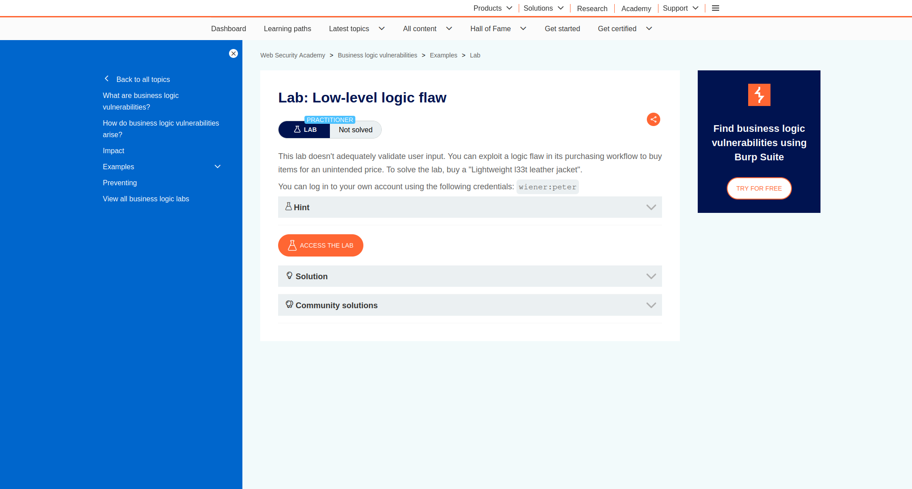  

---

## Reconnaissance

When I opened the shop, I saw the target item and more products.  

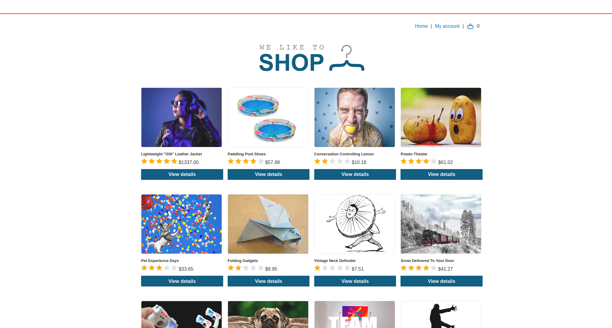  

I logged into the given account (`wiener:peter`) and there was a $100 shopping credit.  
Next I opened the product page (leather jacket) and pressed the add to cart button.  

  

<br>

It's important to save and inspect your requests somewhere so you can recognize the flow.  
In Burp Suite, I opened the request which was sent after I clicked add to cart.  
It was a POST request including `productId`, `redir` and `quantity`.  

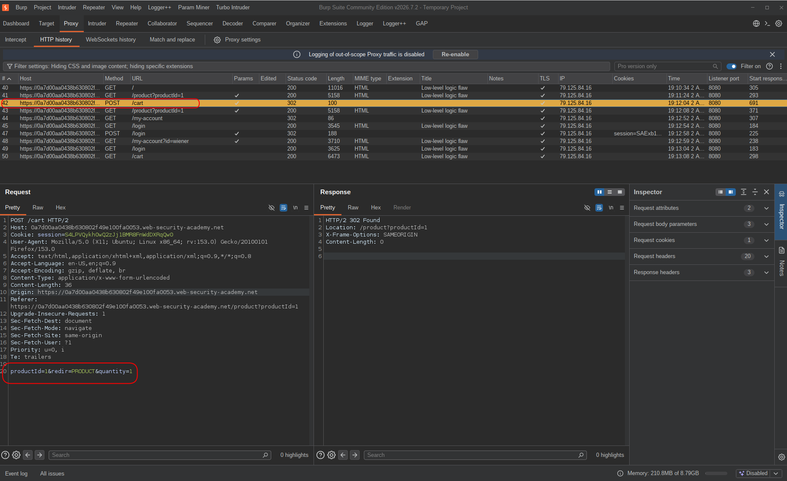  

> How could I manipulate the price, if I need to buy a $1337 jacket and I only have $100 in my credits?  
> In business logic, there are different approaches based on the application's behavior,  
> for example manipulating the price directly if it's present in the request, faking the confirmation, using the payment token twice, etc...  
> Another approach which is directly related to `Math` and `integers` is **integer overflow**.  
> Integers and numbers in general have a limit. For example the maximum value in `int8` is `2^7-1` equal to: `127`  
> and the maximum value in `uint8` would be `255`.  

Computers usually have a default integer size. It's mostly `int32` or `int64`.  
`int64` is very large and `int32` is common for integers.  

Integers can overflow.  
The maximum value for an `int32` number is `2^31-1` which is equal to: `2,147,483,647`  
If the number goes higher than this, it will become a negative number and the application is going to owe us a lot of money!  

I'll show you the rest in images and code...

---

## Exploitation

Since we cannot change the price directly to a really large number, the only thing we can manipulate here is quantity.  
We have to control the price using quantity (because price is the thing we want to change and quantity is the only thing we can control to do that).

So I sent this request to Turbo Intruder.  
I set a placeholder (`%s`) on quantity and wrote this script:  

```python
def queueRequests(target, wordlists):
    engine = RequestEngine(
        endpoint=target.endpoint,
        concurrentConnections=1,  # because requests should have a pattern and flow should be predictable
        requestsPerConnection=1,
        pipeline=False,
        engine=Engine.THREADED
    )

    for i in range(1,330):
        engine.queue(target.req, [str(99)])

def handleResponse(req, interesting):
    table.add(req)
```

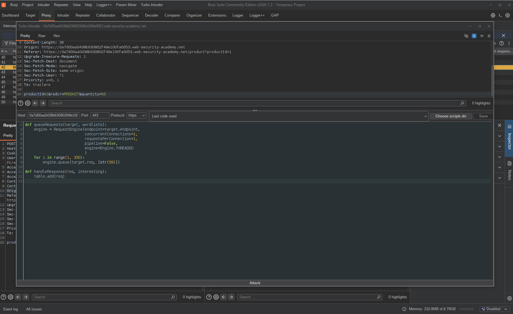  

You might be confused about the numbers 330 and 99, let me explain:  

1. First of all, we need to calculate the maximum value of `int32` (our first guess), which we did and the result was: `2,147,483,647`.  

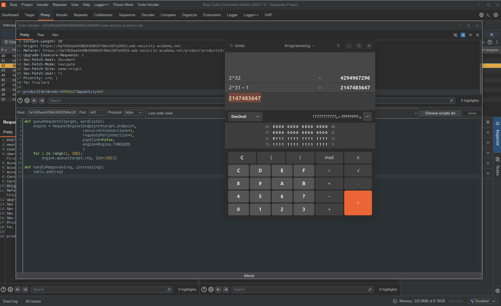  

2. Prices are in cents — we know that from previous labs in this category (and it's a common pattern) — so we need to know how many jackets we should buy to trigger an overflow. We divide `2,147,483,647` by `133700` and the result is `16061.9`.  

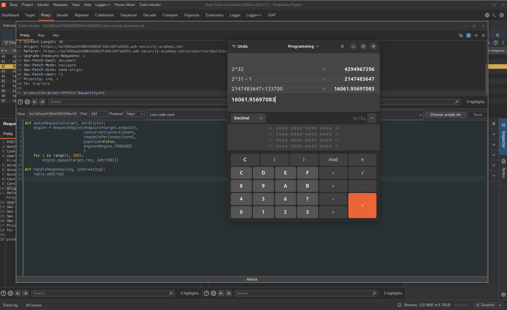  

3. Maximum quantity per request is 99, which you can find out by trying. So again we divide `16061.9` by `99` to get the number of requests that will cause an overflow. The result is: `162`.  

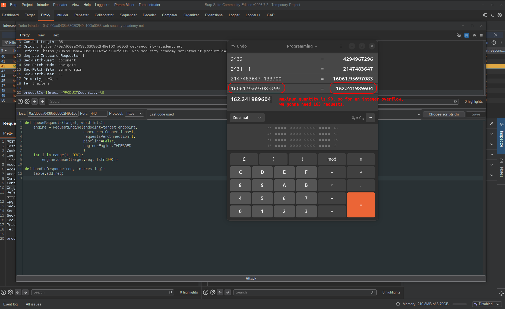  

4. After achieving the overflow, we again need about the same number of requests to get it back to normal (from 0 to a large negative number, and again the same flow to get near 0). So we double that result to get: `324` requests.  

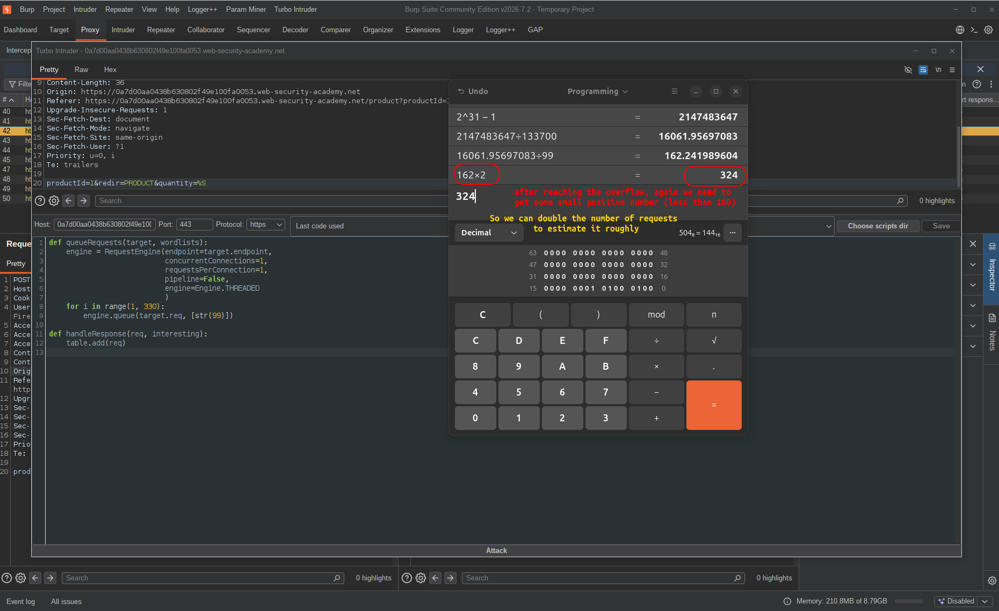  

So we are going to need 324 requests to reach an integer overflow and get back to near 0.  
These numbers are not very accurate, so we have to do it carefully and slowly enough to avoid mistakes.  

**This is the reason why I used `str(99)` and `330` in Burp Intruder (330 is too large but I needed to verify my findings).**  

It didn't work.  
Turbo Intruder was done sending requests and not a single change was visible in `/cart`. I opened one of the requests and realized Turbo Intruder was downgrading the HTTP version from `2` to `1.1` — and that was the issue.  

So I had to do the same thing with Burp Intruder, even though I'm using the community version:  

In Burp Intruder, remember to set the maximum concurrent requests to 1 for the same reason as in Turbo Intruder — to keep the flow predictable.  

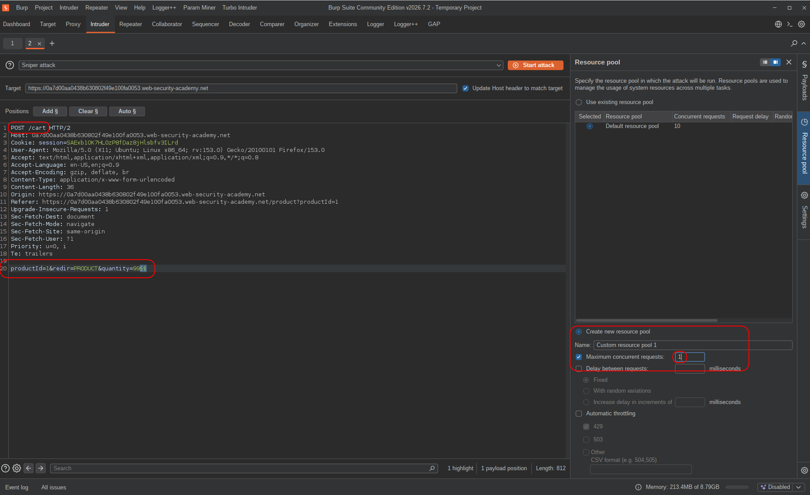  
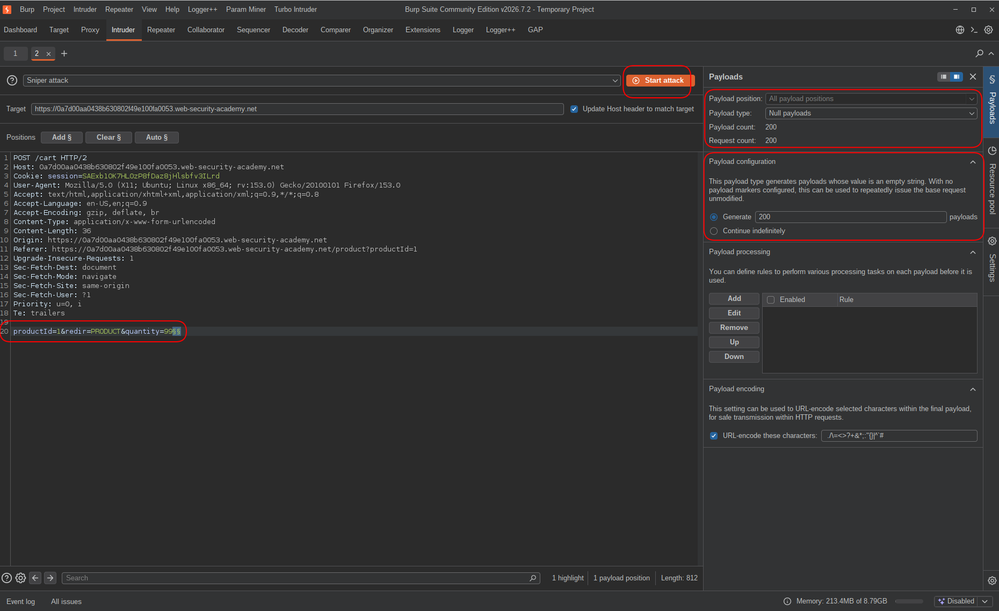  

<br>

After 162 requests, just as I predicted, the total price was about: `-2,147,483,647`  
After 200 requests, it was `-1,634,470,996`.  

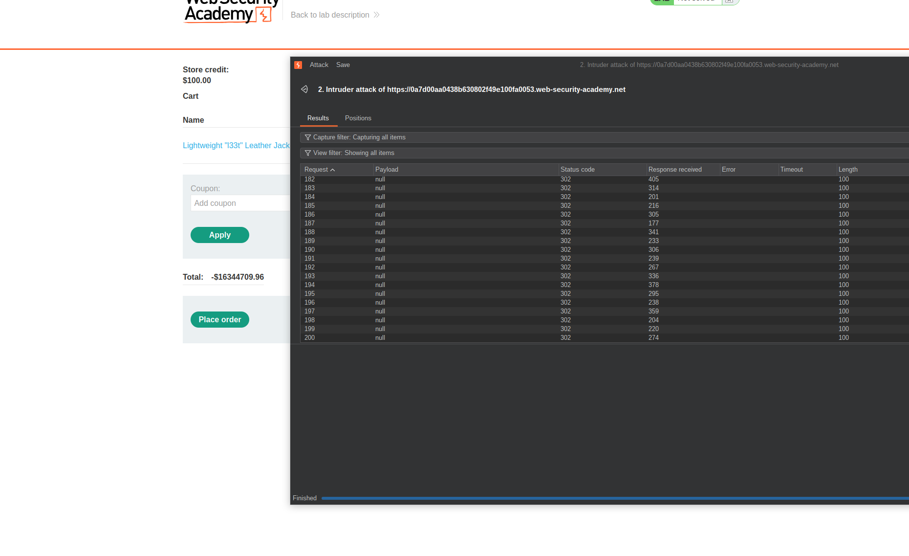  

Based on my calculations, we needed about 124 more requests to reach a number near 0, but I needed to do that slowly and carefully,  
so I repeated the intruder with only 122 more requests:  

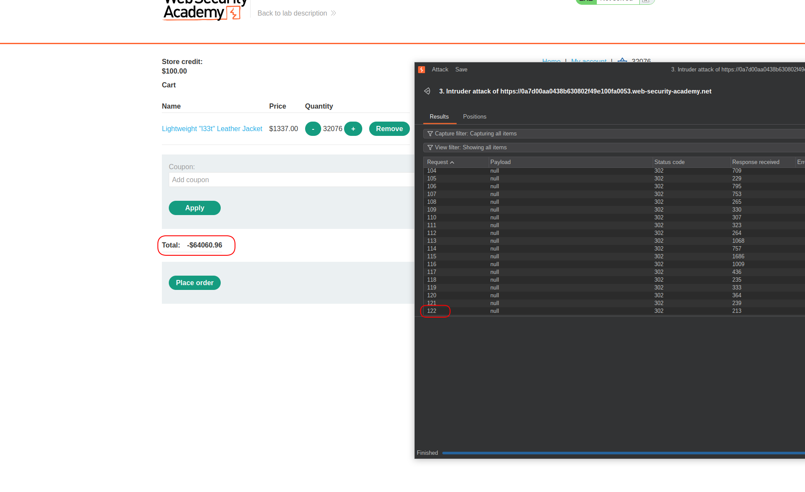  

And this time, the total price was: `-6,406,096`.  
I couldn't risk sending another request with quantity 99 because: `99 × 133700 = 13,236,300` which is nearly twice the absolute value of `6,406,096`.  

So I did the rest manually using Burp Repeater:  

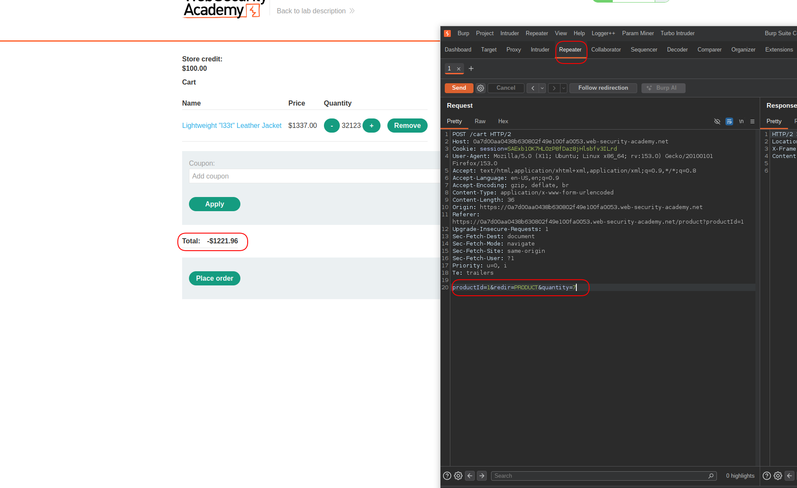  

And after 47 jackets the total price was: `-122,196`.  
So I needed to fill that gap with a cheaper item, because another jacket would push the total more than $100 above zero.  

I found another item in the shop priced at `8959` cents and divided `122,196` by its price, getting `13.6 ≈ 14`.  

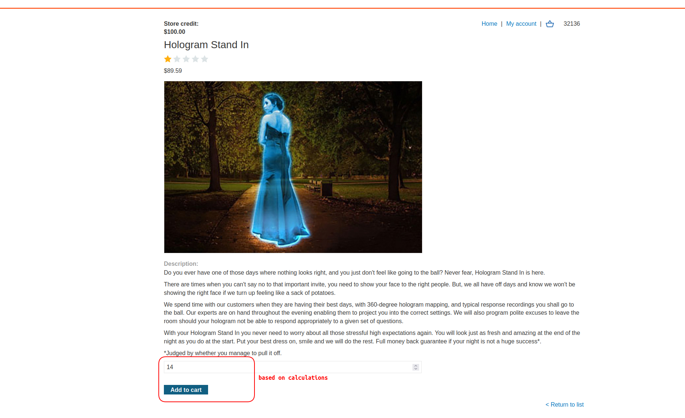  

I added that item to the cart with a quantity of 14.  
Then in my cart, the total price was: `$32.30`.  
And I was ready to click the place order button.  

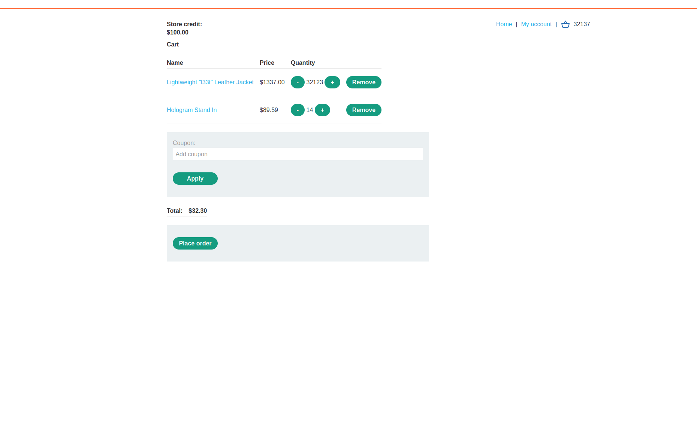  

---

## Result

The lab was solved. By exploiting the integer overflow in the server-side price calculation, I managed to bring the total cart value down to $32.30 — well within my $100 credit — and placed the order successfully. No price manipulation, no broken confirmation, just math working against the application.

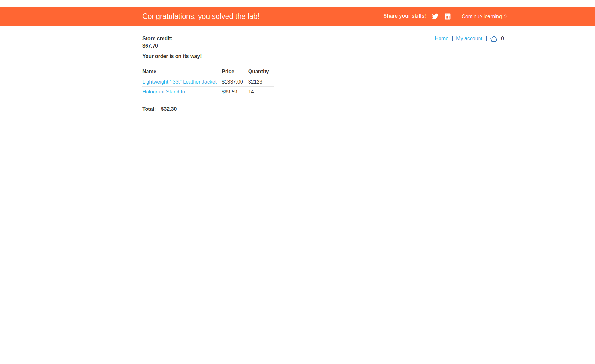  

---

## Impact & Remediation

**Impact:**  
This vulnerability allows an attacker to purchase items of arbitrary value for free or near-free by exploiting integer overflow in the server-side price calculation. Since the total is computed server-side by accumulating per-item costs without overflow protection, a sufficiently large quantity causes the signed integer to wrap to a large negative value. The attacker can then fine-tune the cart total to a small positive number within their actual credit balance and complete a legitimate-looking checkout. In a real application this would result in direct financial loss for the business, and could be scaled to purchase any number of high-value items at effectively zero cost.

**Remediation:**  
- Use arbitrary-precision arithmetic or a decimal type for all monetary calculations — never native signed integers.  
- Enforce server-side limits on quantity per item and total cart value that are reasonable for the business context.  
- Validate that the final cart total is always positive and within expected bounds before processing payment.  
- Implement rate limiting on add-to-cart endpoints to detect and block abnormal request patterns.  

---

## Takeaway

The lesson here isn't just "integer overflow exists" — it's that **any numeric input you control is a potential attack surface**, even if price itself is never in the request. I only had access to quantity, but quantity multiplied by price is still price. The application trusted that no one would send 16,000+ add-to-cart requests, which is a business logic assumption, not a technical control.

The debugging part was also a real reminder: Turbo Intruder silently downgraded HTTP/2 to HTTP/1.1 and the attack just didn't work. No error, no warning — just silence. Always verify your tool is actually sending what you think it's sending before assuming your math is wrong.

Manual exploitation with Burp Repeater at the end, carefully filling the gap cent by cent, is exactly the kind of precision work that separates understanding from just running a script.