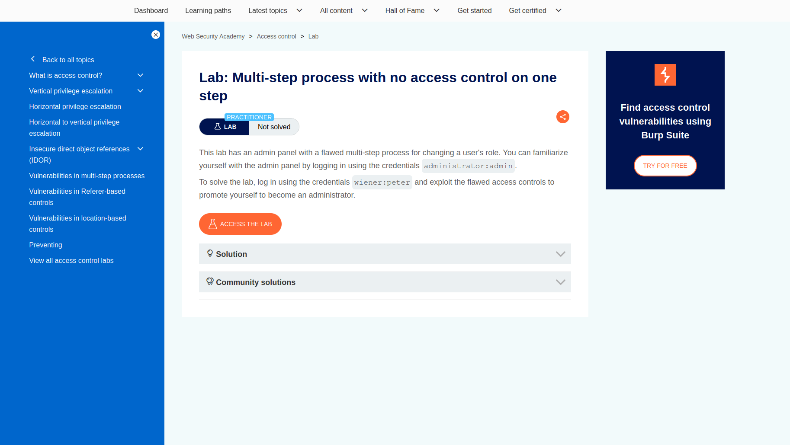
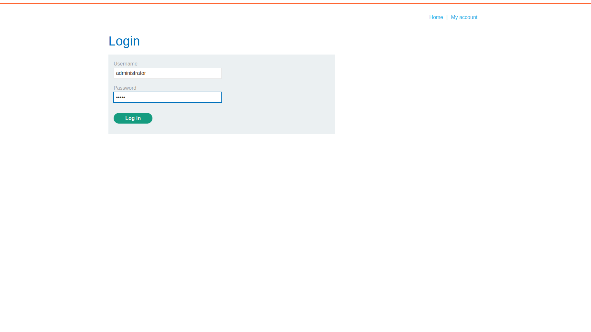
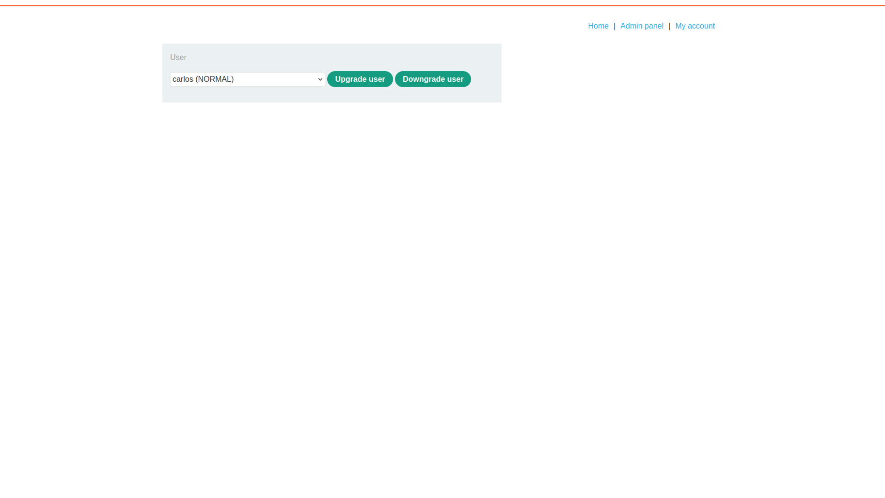
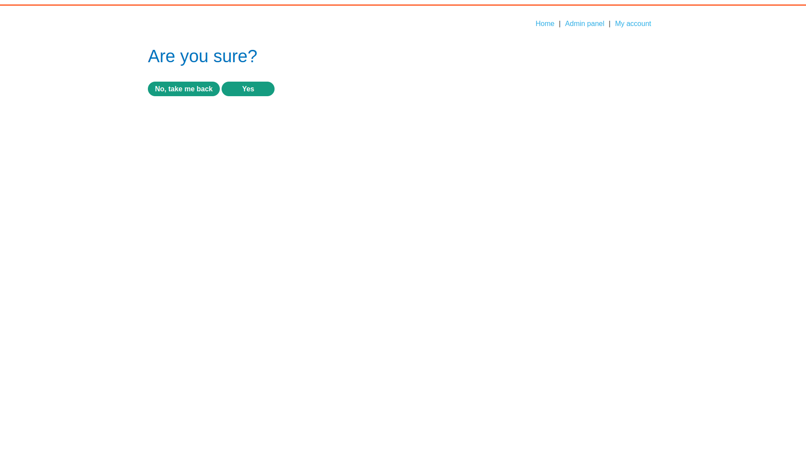
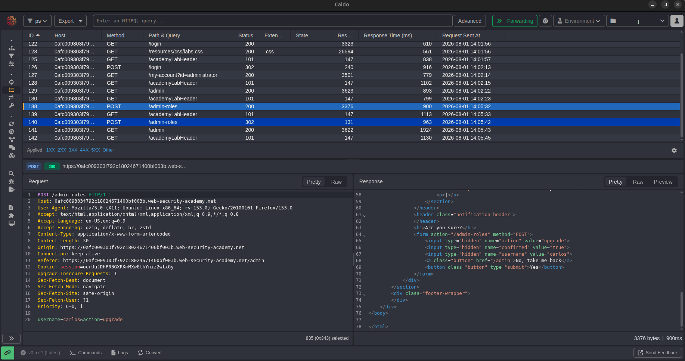
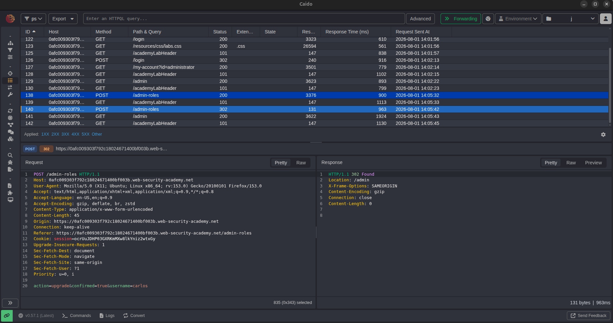
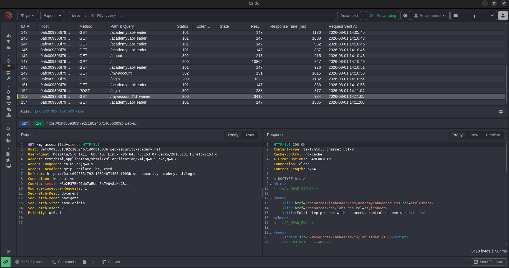
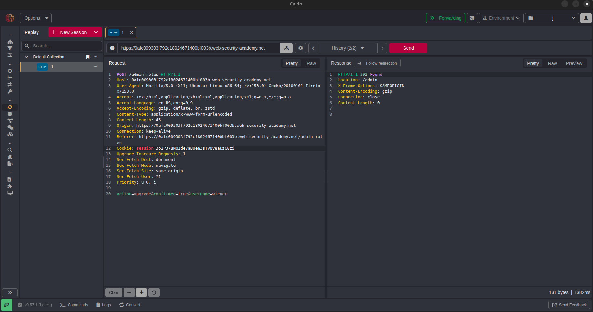
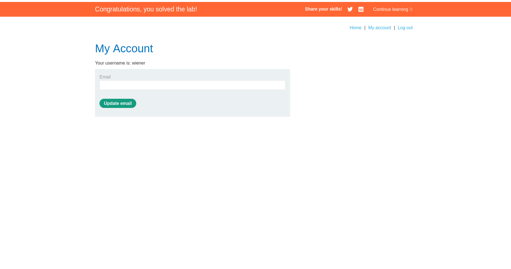

# Lab: Multi-Step Process with No Access Control on One Step

| Field | Details |
|-------|---------|
| **Provider** | PortSwigger |
| **Difficulty** | Practitioner |
| **Category** | Broken Access Control |
| **Date** | 2026-08-01 |

---

## Summary

Multi-Step Process with No Access Control on One Step is a lab in the PortSwigger Web Security Academy.  
In this lab, there's an admin panel that lets administrators change the role of users through a multi-step process.  
The task is to log in as `wiener` and exploit the flawed access controls to promote yourself to administrator.



---

## Reconnaissance

I opened the target — a normal shopping site.  
The lab gives you admin credentials upfront: `administrator:admin`  
So I logged in as admin first to understand what the role-change flow looks like.


I logged in as administrator.



Inside the admin panel, there's a user management section where you can upgrade or downgrade users.  
I clicked upgrade on a user and watched the requests.



The server first asks for confirmation before applying the change.



The flow was two steps. Step 1 — select the user and action:

```
POST /admin-roles
username=carlos&action=upgrade
```



Step 2 — confirm:

```
POST /admin-roles
action=upgrade&confirmed=true&username=carlos
```



That `confirmed=true` in the second request immediately stood out.  
Multi-step flows like this exist to make sure the user actually meant to do something.  
But the real question is: does the server check *who* is doing the confirming?

---

## Exploitation

My theory was that the server checks authorization on step 1 but forgets to do it again on step 2 — assuming that if someone reached the confirmation step, they must have already been verified.

To test this, I logged in as `wiener` and grabbed my session cookie.



Then I took the step 2 request — the one with `confirmed=true` — and replaced the admin session cookie with wiener's.  
I also changed `username` to `wiener` so I'd be upgrading myself.

```
POST /admin-roles
Cookie: session=<wiener_session>

action=upgrade&confirmed=true&username=wiener
```



The server returned 302 — no error, no rejection.  
It just went through.

---

## Result

Wiener was now an administrator. Lab solved.



---

## Impact & Remediation

The impact here depends on what that admin panel can do — and in most real applications, that's a lot.  
Any authenticated user who knows the structure of the confirmation request can skip step 1 entirely and go straight to step 2.  
No admin credentials needed. No special access. Just a valid session and knowledge of the endpoint.

In a real app this could mean: privilege escalation for any user, mass account takeovers, or full platform compromise — depending on what the admin panel exposes.

To fix this:
- Authorization must be enforced **on every step** of a multi-step process independently. The server can't assume that reaching step 2 means step 1 was properly authorized.
- Each sensitive action — not just the flow entry point — needs to verify that the requesting user has permission to perform it.
- If possible, tie the confirmation to a server-side token generated during step 1 that's bound to the session. That way you can't just forge step 2 in isolation.

---

## Takeaway

* **Multi-step doesn't mean multi-checked.** Developers often put the authorization check at the start of a flow and assume the rest is safe. Each step is its own HTTP request — and each one needs its own check.

* **`confirmed=true` is a red flag.** Whenever you see a confirmation parameter in a request body, ask yourself: what happens if I send this directly, skipping everything before it? The server shouldn't trust client-side state.

* **You don't need to find the vulnerability from scratch to understand it.** Here I used the admin account to map the flow first, then replayed it as a low-privilege user. In real engagements, this is normal — you use whatever access you have to understand the application, then test boundaries from a lower-privilege context.