# Lab: OAuth Account Hijacking via redirect_uri

| Field | Details |
|-------|---------|
| **Provider** | PortSwigger |
| **Difficulty** | Practitioner |
| **Category** | OAuth |
| **Date** | 2026-08-07 |

---

## Summary

OAuth account hijacking via redirect_uri is a lab in the PortSwigger Web Security Academy.
In this lab, account management and login is handled through an OAuth provider.
However, there is a vulnerability in the flow and we have to discover it.
The task is to get into the administrator's account and delete user: `carlos`

In this writeup I'll solve this challenge manually, step by step.

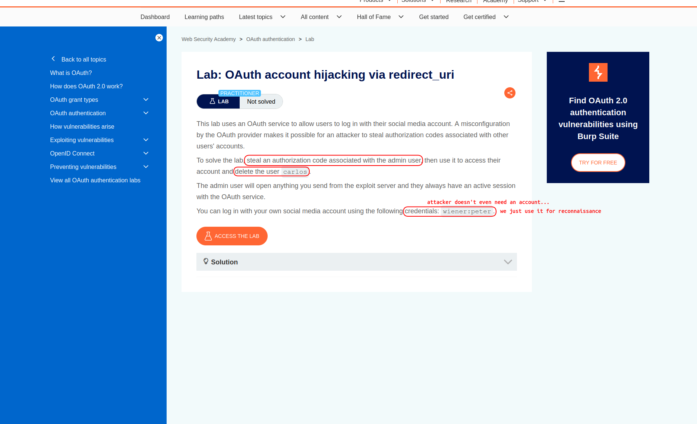

---

## Reconnaissance

The target is a normal-looking weblog where people can log into their accounts, post images, and leave comments on posts.

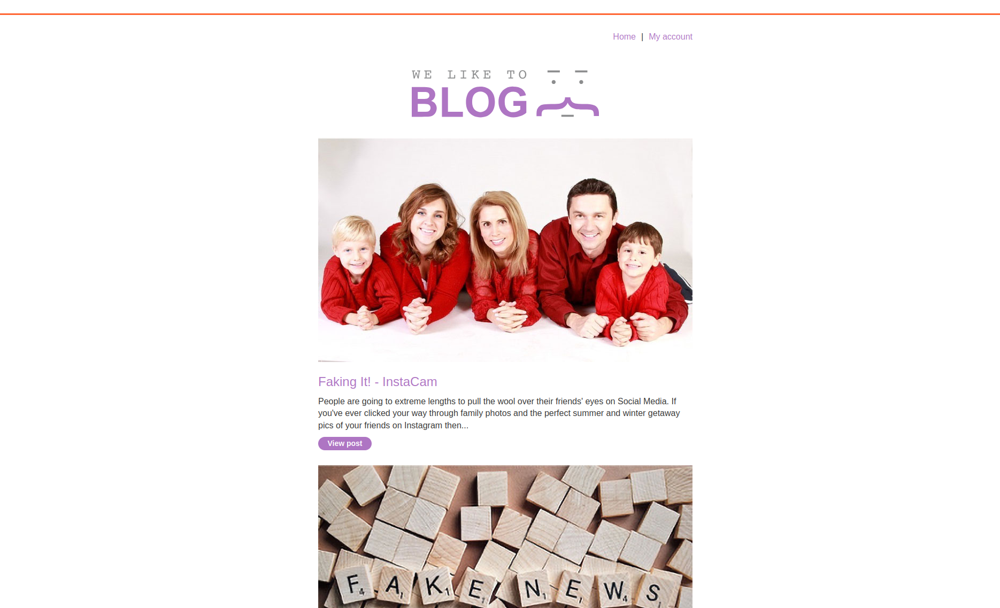

I clicked on the "My Account" button on the main page to log in using the given credentials.
After clicking, I got redirected to another site.
We know that a site cannot set cookies for another origin, so if the login happens on one site and the workflow is on another, authentication must be transferable between these two origins.
This is the general concept of federated identity — there is an authentication provider, and applications consume the token it issues.

OAuth (Open Authorization) is a protocol designed for this purpose.
It's often referred to as a pseudo-authentication protocol.
There is a provider where you enter your credentials and log in, and there is a scope that specifies which information the application can access, such as name, email, profile picture, age, etc.
A token is then generated for the user, who carries it to the application that needs it for authentication.

How does the user know where to deliver the token or code?
There are a few possibilities:
1. In OAuth, there is a `redirect_uri` parameter that holds the callback address.
2. In transfer flows generally, there might be a redirect URI callback to deliver the token, a server-side confirmation request, or other mechanisms like JSONP calls, top-level cookies, or CORS.

 

So I entered my credentials (`wiener:peter`) to log in:

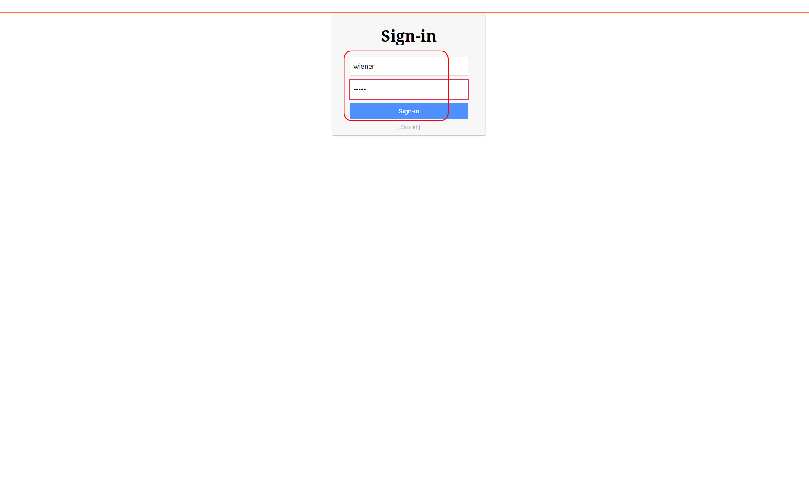

The provider then asked me which items I want to allow the application to access:

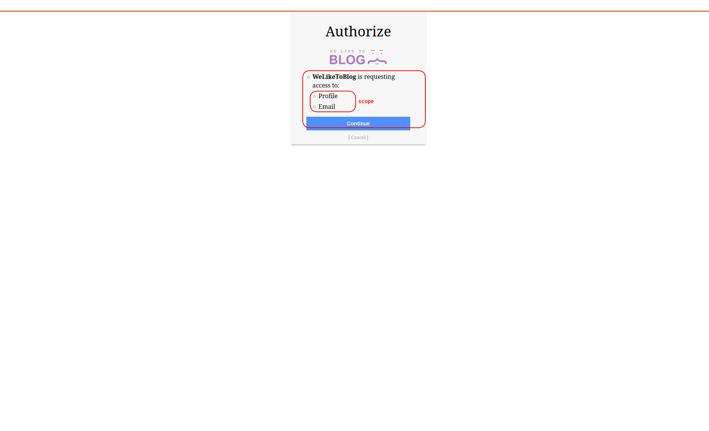

I clicked "Continue" and got redirected back to the application via the callback.
There was a message saying: "You have successfully logged in with your social media account."

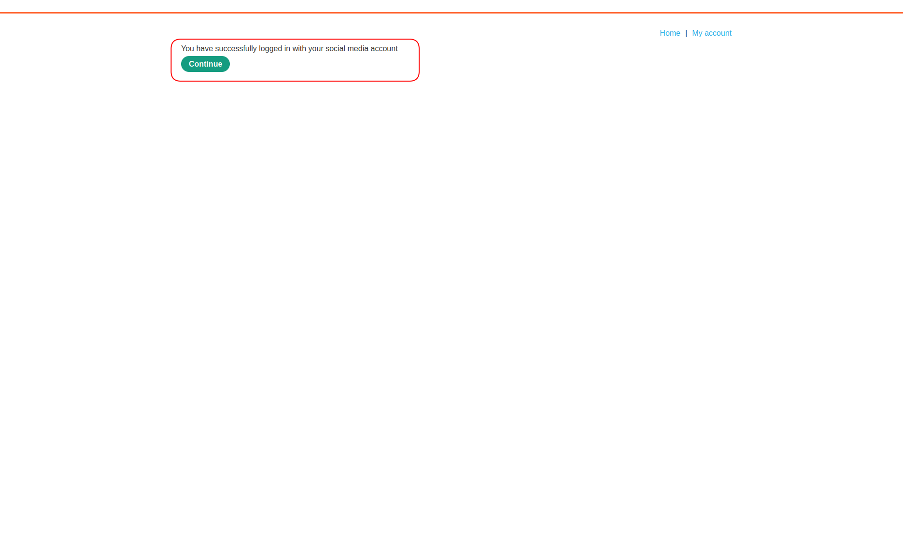

 

I moved to Burp to understand the authentication flow in detail.
The first request was a GET to `/social-login`, which redirected me to the provider's website.

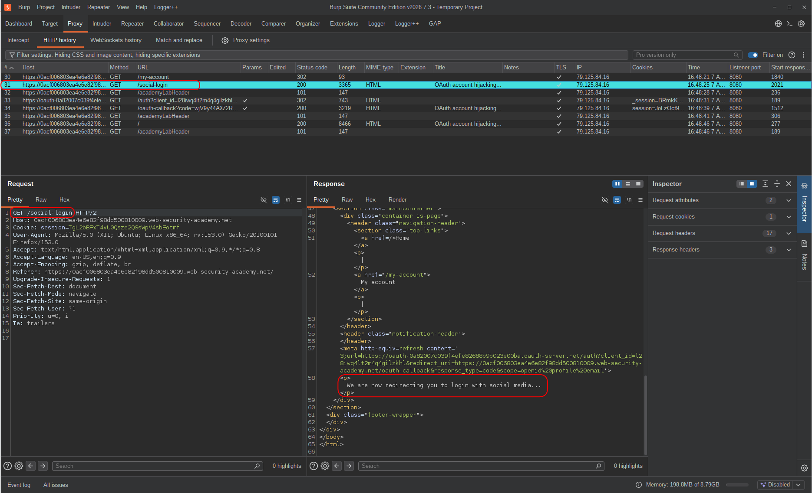

The second request was a GET to `/auth` on `oauth-server.net` with the following parameters:
- `client_id` — the application's identifier
- `redirect_uri` — the address to redirect back to after authorization
- `response_type` — the type of response the application expects (typically `code` or `token`)
- `scope` — the data the application is requesting access to

This is clearly OAuth — the provider is a known OAuth server and the parameters match the protocol exactly.
The only thing missing is `state`, which acts as a CSRF token in OAuth flows.

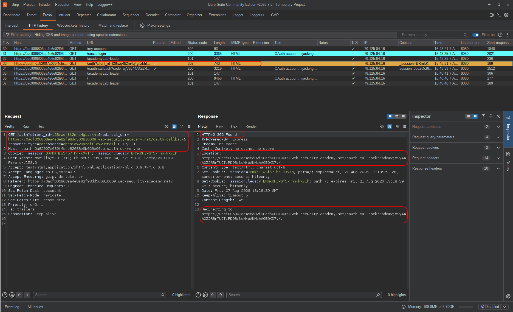

The response tells the browser to redirect to the `redirect_uri`.
The final request was a GET to `/oauth-callback` on the application, carrying the authorization code.

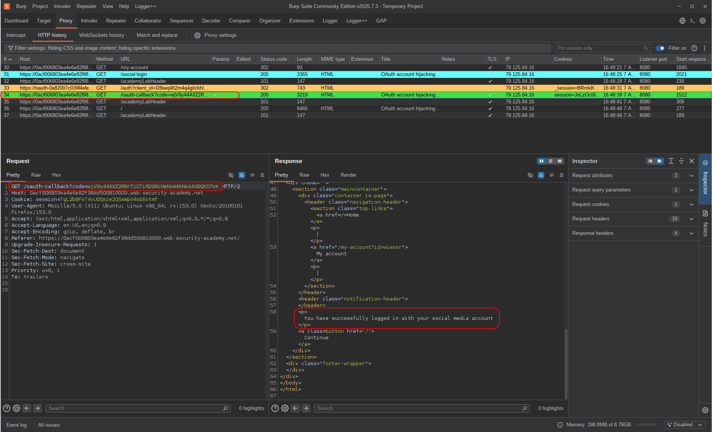

So the user got redirected back to the application using the address in `redirect_uri`, carrying the code.
This is exactly how the OAuth authorization code flow works.

 

What happens if the `redirect_uri` points to a server under an attacker's control?
Since the request carrying the code is a GET request, the code will be directly logged in the server's access log.

---

## Exploitation

I sent the OAuth authorization request to Repeater to see if I could manipulate it.
There is a rule I follow: always start with the least impactful change, so you can isolate the cause if something breaks or gets blocked.

I appended a single letter `A` to the end of the path and sent it.
No error — and the change was reflected in the response:

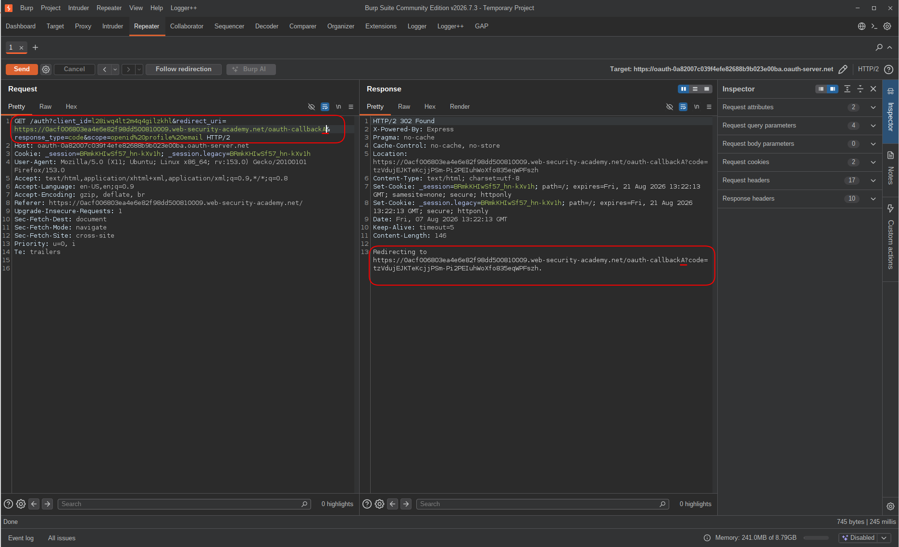

Then I changed the port to test whether I could also manipulate the host:

No errors — exact reflection again.

A stealthier approach for the next step would have been to manipulate the host in a subtle way, for example:
1. `legit.com.attacker.com`
2. `legit.com@attacker.com`

But since this is a lab, I just replaced the entire value with the exploit server's address:

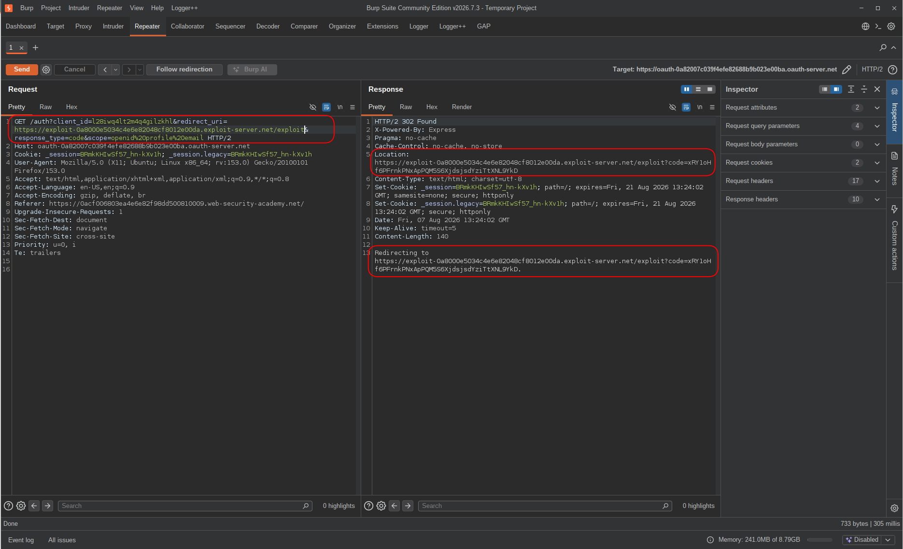

Again, full reflection. I followed the redirect and landed on the attacker's server:

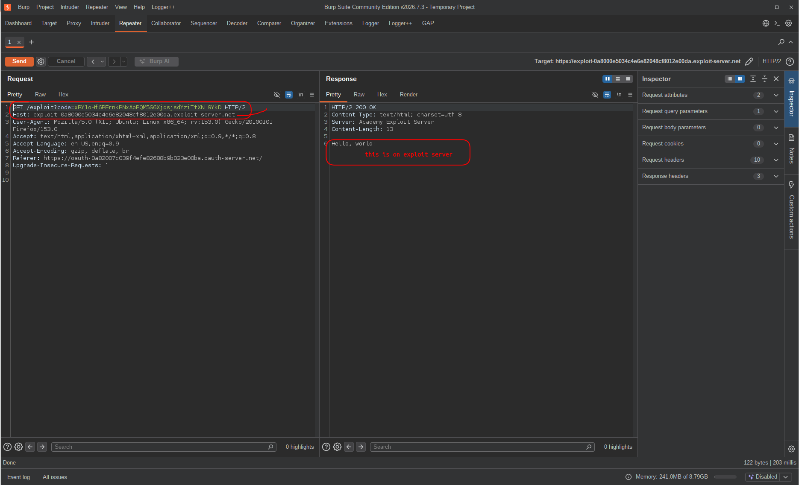

 

I checked the access log on the exploit server and the code was right there:

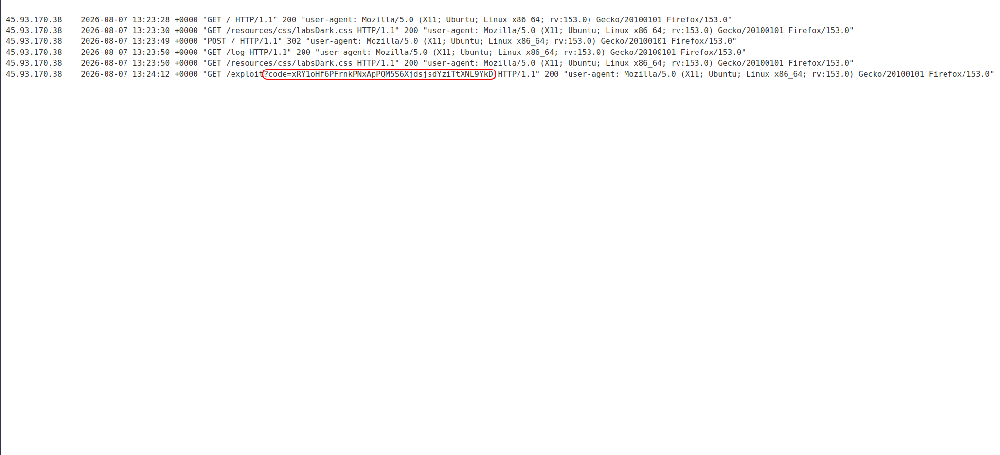

Vulnerability confirmed. The only remaining step was targeting the victim.

I copied the URL of the OAuth authorization request and embedded it in a redirect script.
When the victim opens this, their session cookie is automatically sent in the request and they get redirected to the malicious server — carrying their authorization code:

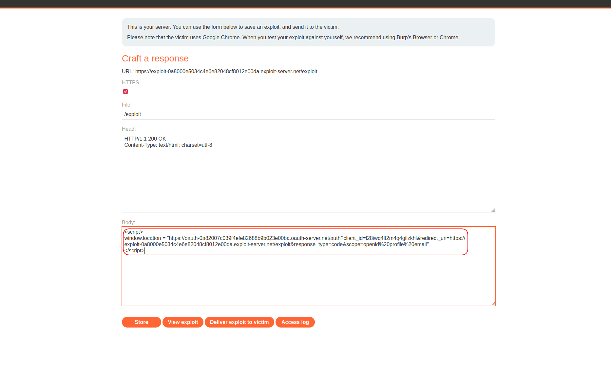

The code arrived in the access log:

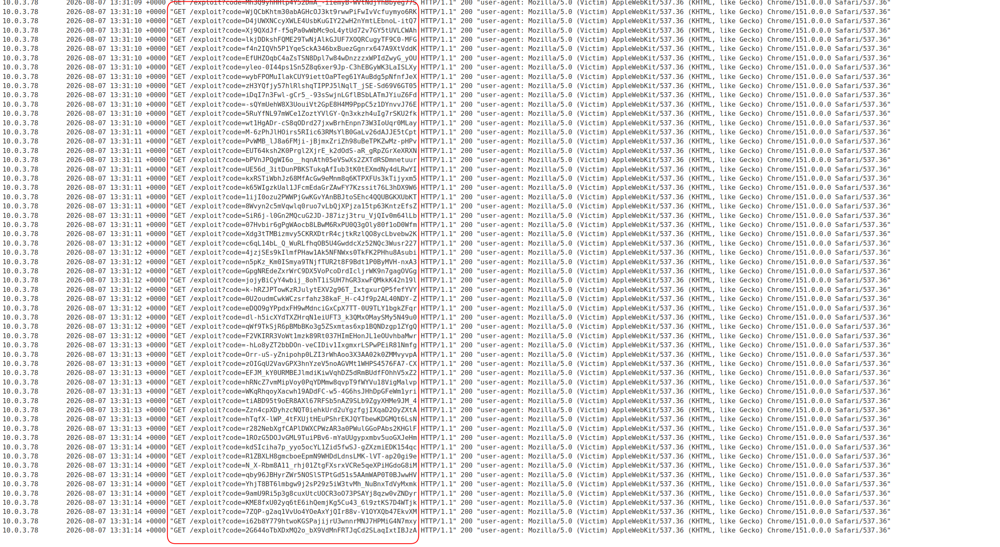

 

There were many codes in the log since the admin clicked multiple times, but it doesn't matter — any code that hasn't been consumed yet will work.
I copied one and used it in the callback request:

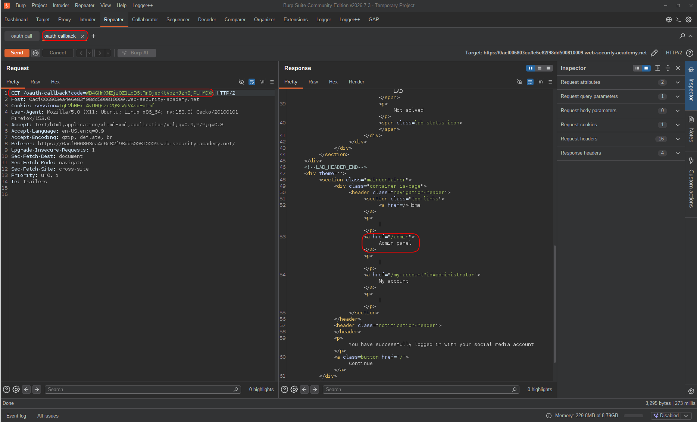

I was inside the admin's panel.
I took another fresh code, logged out, navigated to the callback URL with the code in my browser, and it was accepted:

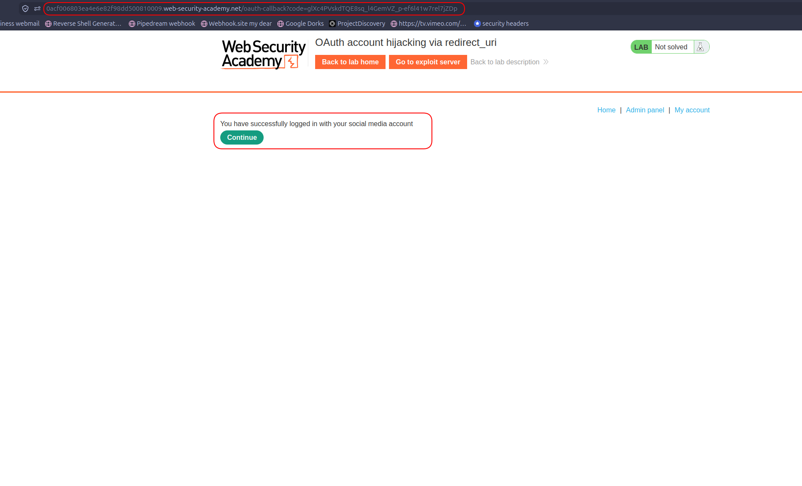

I was officially logged in as admin.
I opened the admin panel and deleted user `carlos`:

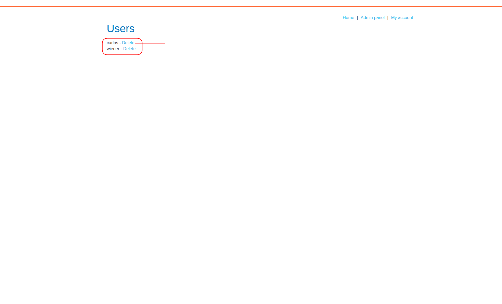

---

## Result

The lab was solved. Authorization code stolen via a manipulated `redirect_uri`, replayed in the callback endpoint, and full admin account access achieved — no credentials required.

The admin had an active session with the OAuth provider. When they opened the crafted link, the provider authenticated them silently and issued a fresh authorization code — delivered straight to the attacker's server. One code, one callback request, and the account was ours.

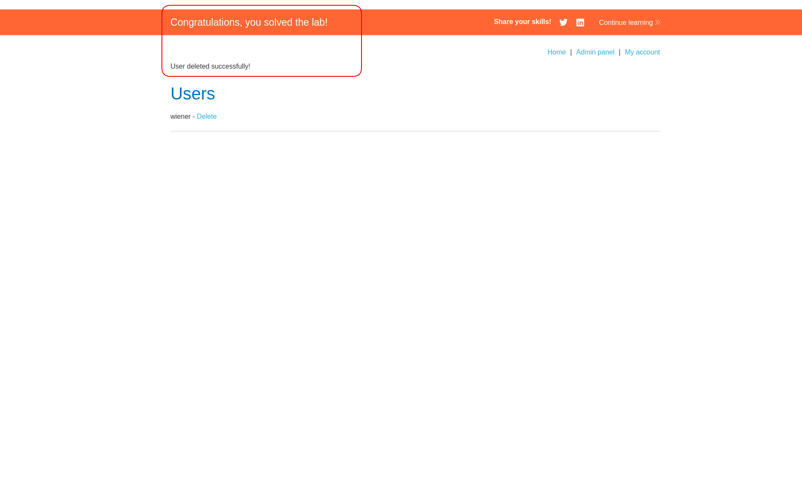

---

## Impact & Remediation

**Impact**

This vulnerability allows a complete account takeover of any user who is authenticated with the OAuth provider — including privileged accounts like administrators.
No credentials are needed. The attacker only needs to trick the victim into opening a crafted URL, which can be delivered via phishing, a malicious link in a message, or any other social engineering vector.
Because the authorization code is delivered via a GET request, it is silently logged in the attacker's server access log — no user interaction beyond opening the link is required.
In this lab, this translated to full administrative access and the ability to perform destructive actions on behalf of the victim.

**Remediation**

- **Strict redirect_uri validation**: The OAuth provider must validate the `redirect_uri` against an exact allowlist registered by the client application — no partial matches, no wildcard subdomains, no path traversal bypasses.
- **Bind the code to the redirect_uri**: The authorization server should store the `redirect_uri` used during the authorization request and verify it matches exactly when the code is exchanged for a token.
- **Implement the `state` parameter**: The absence of `state` in this flow means there is no CSRF protection on the OAuth flow itself. The `state` parameter should be a cryptographically random, session-bound value validated on callback.
- **Short-lived, single-use codes**: Authorization codes should expire quickly (typically 60 seconds) and be invalidated immediately after first use.

---

## Takeaway

The `redirect_uri` parameter in OAuth is a high-value attack surface.
When the provider fails to enforce strict validation — accepting modified paths, different ports, or entirely different hosts — the authorization code can be exfiltrated to an attacker-controlled server with nothing more than a crafted link.

The victim doesn't need to enter credentials. They don't need to approve anything. They just need to be logged in and open a URL.

This is also a good reminder that missing `state` parameter is not just a theoretical issue — in a real scenario, a missing `state` combined with a loose `redirect_uri` check creates a compounding attack surface where both CSRF and code theft are possible in the same flow.

OAuth misconfigurations are common in real-world applications, especially when the provider is a third-party service with permissive defaults. Always test `redirect_uri` manipulation early in any OAuth assessment.