# Lab: Remote code execution via polyglot web shell upload

| Field | Details |
|-------|---------|
| **Provider** | PortSwigger |
| **Difficulty** | Practitioner |
| **Category** | File Upload |
| **Date** | 2026-08-07 |

---

## Summary

Remote code execution via polyglot web shell upload is a lab in the PortSwigger Web Security Academy.
This lab features a blog where users can post things, add comments to each other's posts, create their profile, and more.
The task is reading a secret file on the server.

In this writeup I'll solve this challenge manually, step by step.

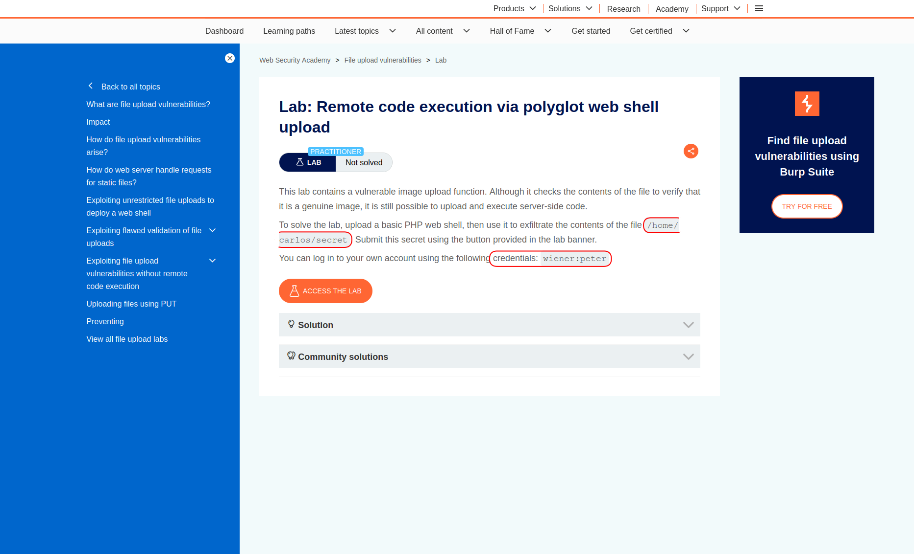

---

## Reconnaissance

I opened the target lab, and at first sight it's just another blog where users can post images and add comments to each other's posts.
Of course, users also have customized profiles.

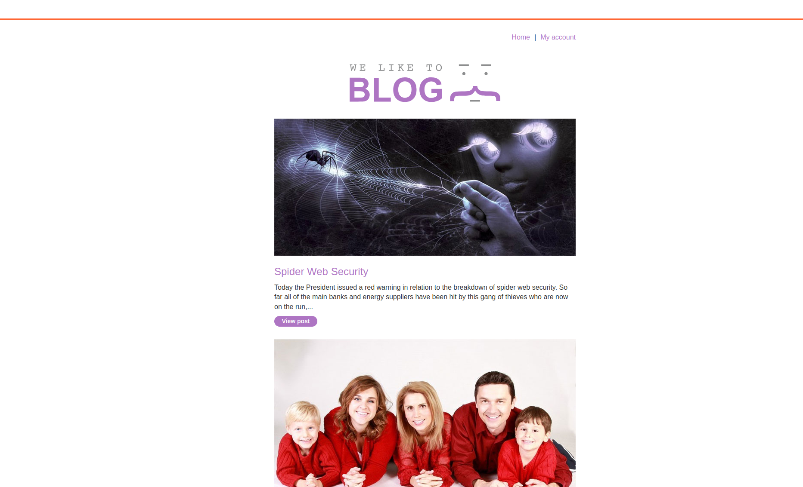

I opened one of the posts and scrolled down to the comments section.
There were many fields to fill in, like: comment, name, avatar, email, and website.

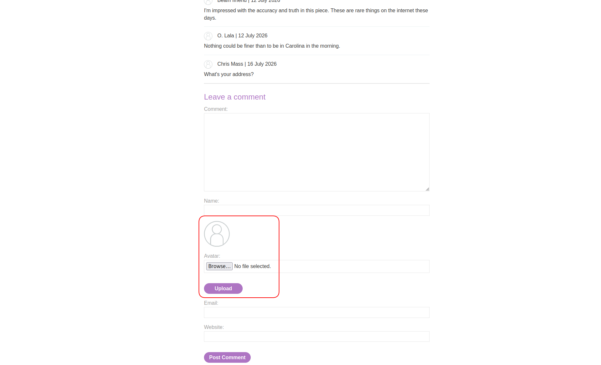

In the next step, I logged into the given account (`wiener:peter`) and on my profile page there was also another uploader for the avatar:

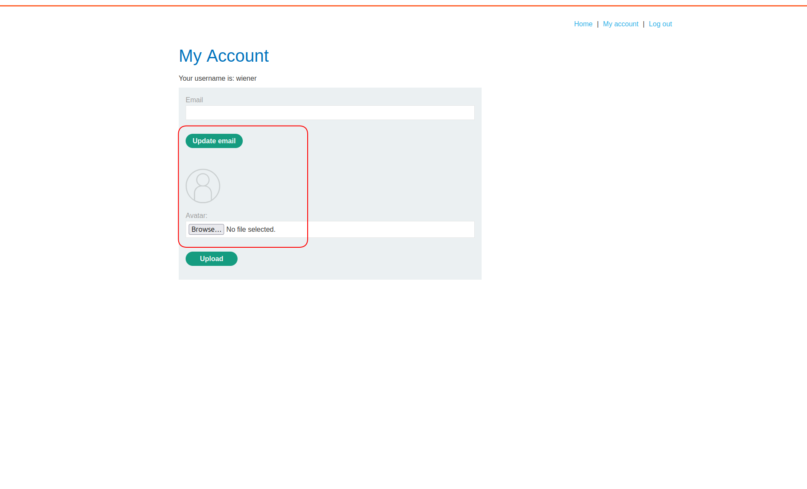

<br>

This website is using PHP as its backend language — I can tell by several signs.
In SSR (Server-Side Rendering) applications:
1. There are usually no heavy JS files.
2. The HTML is not sparse — it contains a lot of content.
3. Changing the path causes changes in the response HTML.
4. There are not many AJAX requests visible in the network tab.

PHP is the most common SSR backend language.
In PHP applications, if there is a broken file uploader, attackers can try to upload `.php` files —
so the PHP rendering engine will execute the code before rendering the page.

Also, there are two ways files can be accessed on a website:
1. Direct access — you get a static path to the uploaded resource, usually containing the file's original name. Example: `https://site.com/path/to/your/profile.img`
2. Indirect access — access is not direct and data comes through a side channel. Example: `https://site.com/api/v2/get_image/44`

Combining these two facts, attackers can perform an attack called web shell uploading.

> Note: you can also try uploading `.html` or `.htm` files for XSS regardless of the backend.

<br>

In this lab, there are two places to upload files.
Which one most likely gives direct access? Usually the profile one.
So I tried to inject there first.

I needed a web shell, so I wrote a simple one in PHP:
```php
<?php system($_GET['cmd']); ?>
```

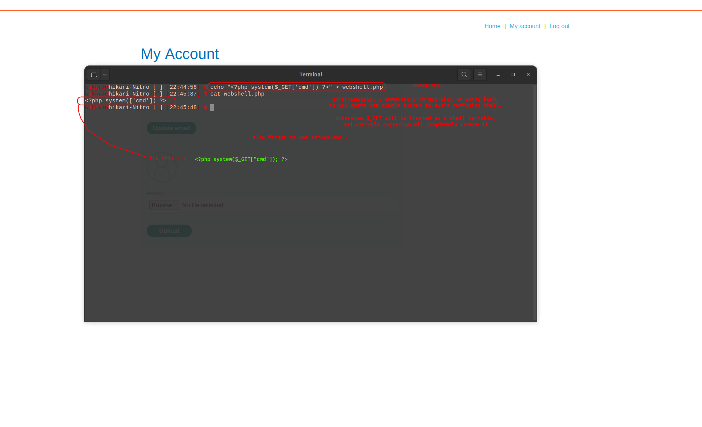

This line simply takes a command from the GET parameter named `cmd` and executes it in the OS environment.
So I saved this file and tried to upload it:

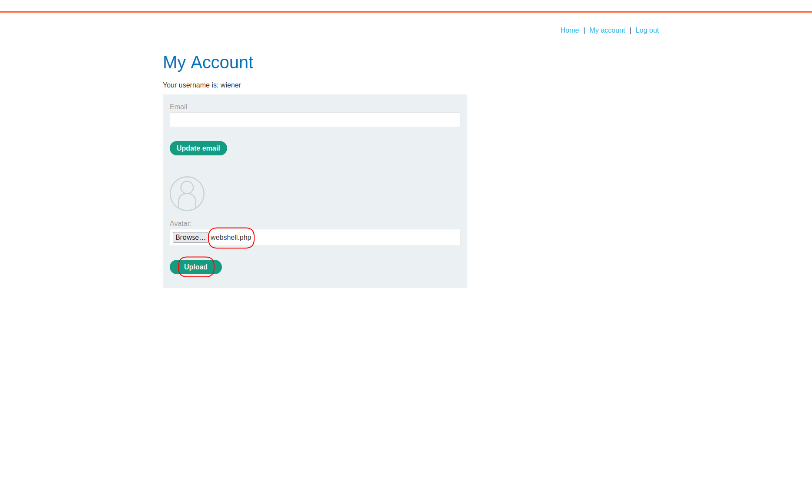

<br>

But as I expected, I got an error — `403 Forbidden` — with the message:
"Error: file is not a valid image."

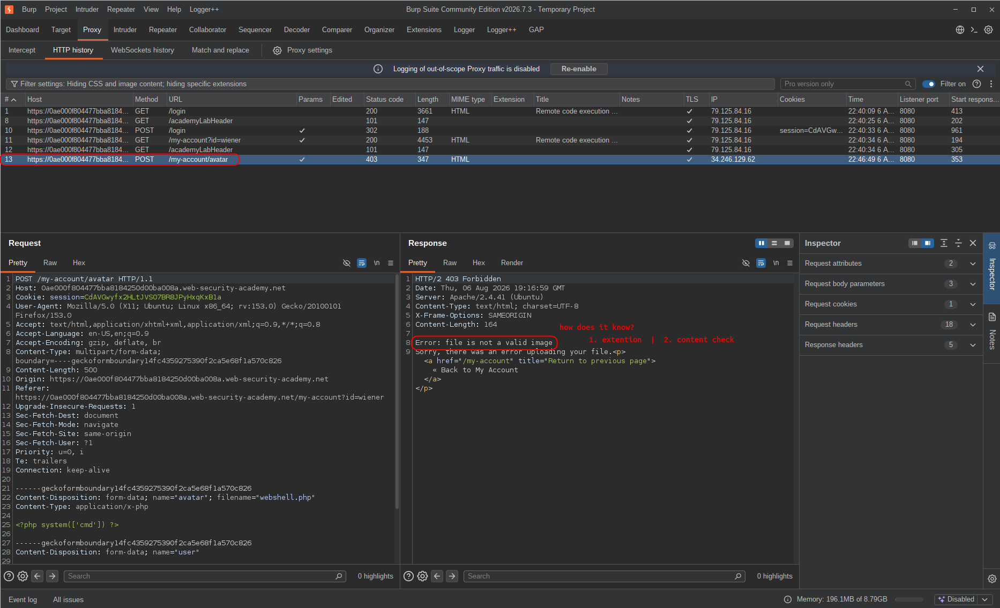

> There can be multiple checks on an uploaded file, such as size check (usually the first), extension check, and content check.
> My file is `.php` and also doesn't contain image magic bytes — so I had to figure out which check was firing.

There are multiple bypass tricks for extension check protection:
1. Using alternative extensions like `.phar` and `.phtm` (only against blacklist filters)
2. Double extension like `.php.png` or `.png.php`
3. Extensions with delimiters:
    - Number sign: `.php%23.png`
    - Null byte: `.php%00.png`
    - Line feed: `.php%0A.png`
4. Adding trailing dots like `.jsp.....` or `.php.` (only against blacklist filters)
5. And more.

You can try all these tricks in the `filename` parameter in the POST body via Repeater.

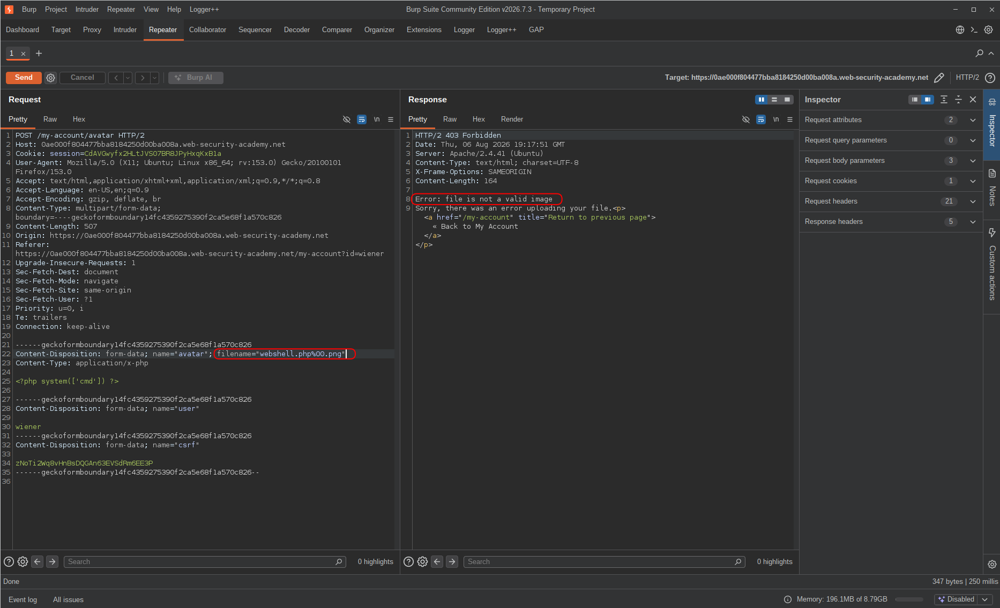

I tried many of them and none worked.

<br>

So there was another check. The next bypass was related to content validation:

**How does the application know that my file isn't an actual image?**

There are several ways an application can validate the content of an uploaded file. One common method is checking the **file signature**, also known as **magic bytes**.

Magic bytes are a small sequence of bytes at the beginning of a file that identify its actual format. Unlike the file extension — which is just a filename attribute and can be changed freely — magic bytes are part of the file's binary structure.

For example:
- JPEG files usually start with: `FF D8 FF`
- PNG files start with: `89 50 4E 47 0D 0A 1A 0A`
- GIF files start with: `47 49 46 38`

When a user uploads a file named `image.jpg`, the application can inspect the first few bytes and compare them with the expected signature. If the content doesn't match the claimed file type, the upload gets rejected.

Renaming `shell.php` to `shell.jpg` doesn't change the file content — it still starts with PHP code instead of a valid image signature, so a magic byte check will catch it.

<br>

So I needed a file that contains valid image magic bytes and still has PHP code in it.
That's why I took a very small screenshot and appended my PHP code to it:

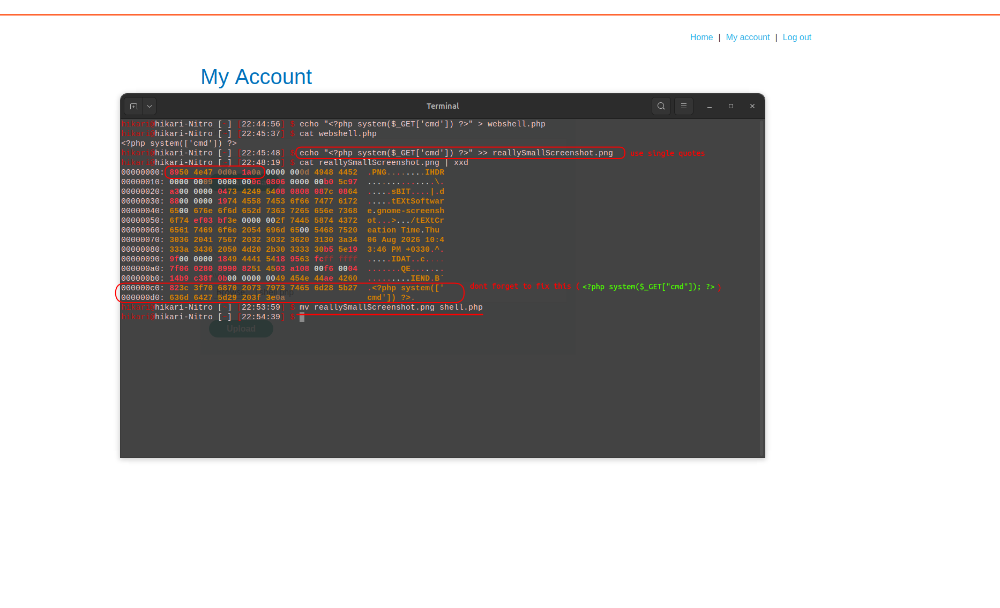

And my file finally got uploaded — with the name `shell.php`, because I needed the PHP engine to interpret it.

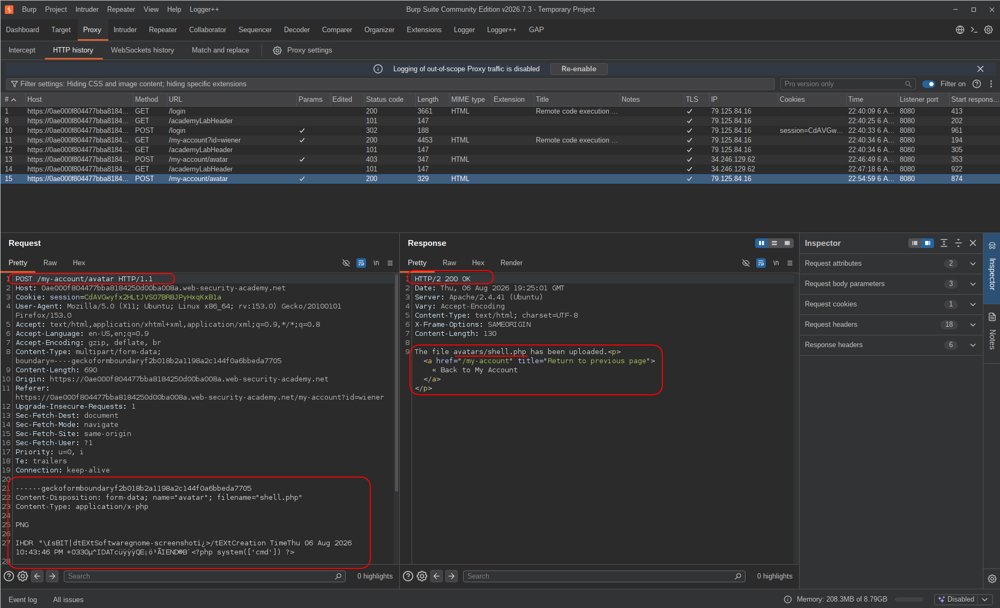

---

## Exploitation

File uploaded — but where is it?
I looked for a place where my profile picture was being reflected, and inspected the page source:

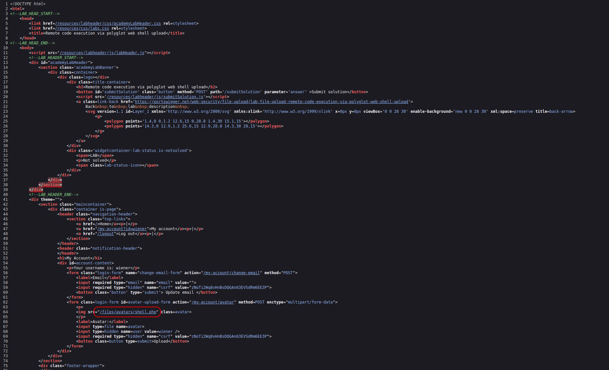

<br>

So I opened that address in the browser and sent it to Repeater for manual testing:

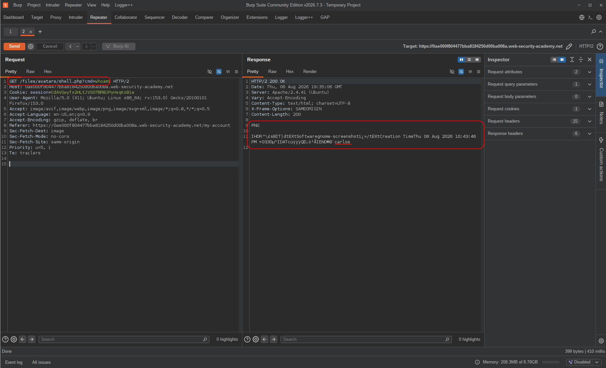

After confirming my web shell was working, I used it to read the secret file:

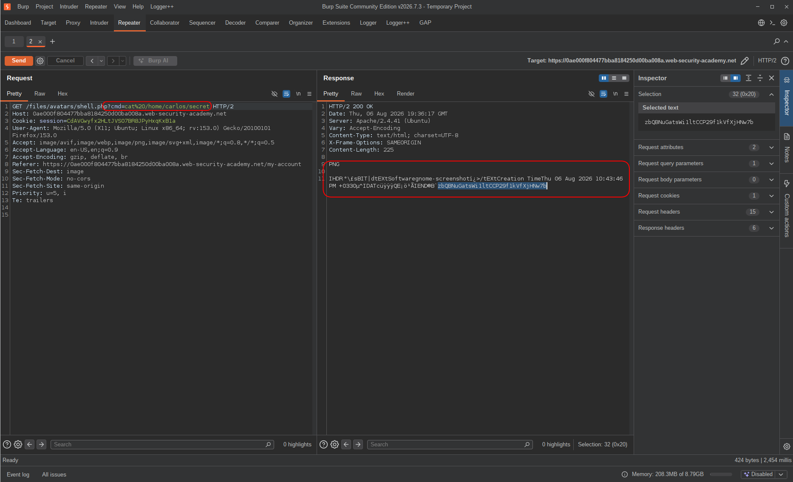

And finally there was a place in the application to submit the flag:

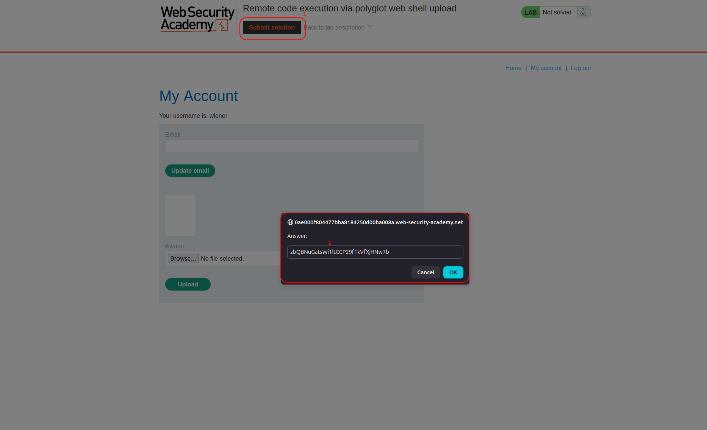

---

## Result

Extension bypasses all failed — the application was doing something more than just checking the filename.
The error "file is not a valid image" pointed to content validation, specifically magic bytes.
So instead of fighting the extension check, I took a real image, appended the PHP web shell to it, and uploaded the whole thing as `shell.php`.
The magic byte check saw valid image bytes at the start and passed it. The PHP engine saw a `.php` file and executed it.
Found the static path in the profile page source, hit the shell in Repeater, ran `cat /home/carlos/secret`, got the flag.

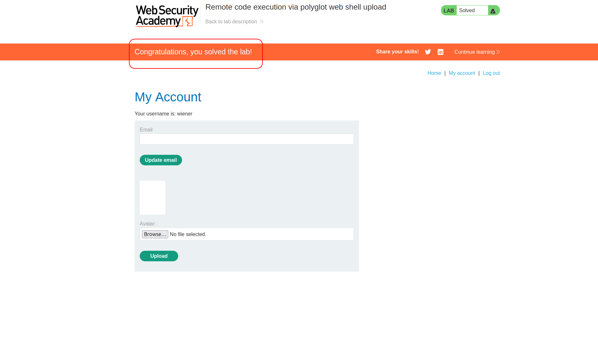

---

## Impact & Remediation

A working web shell is arbitrary OS command execution on the server — not just file reading.
From here an attacker can read any file the web server process has access to, write files, move laterally across the internal network, exfiltrate data, or plant a persistent backdoor.
The polyglot technique makes this particularly dangerous because it bypasses two common validation layers at once: the file passes the magic byte check as a valid image, and the `.php` extension tells the engine to execute it.

The root cause is that the application is validating content and extension independently, without ensuring they're consistent with each other — and without controlling what happens to the file after it's stored.

To fix this properly:

Validate content and extension together. A file with valid PNG magic bytes but a `.php` extension should be rejected. Both need to match an expected, whitelisted combination.

Never store uploaded files with their original filename or extension. Generate a random name server-side and strip the extension entirely — or force a safe one like `.bin`. This alone prevents the PHP engine from ever treating the file as executable.

Store uploaded files outside the web root, or serve them through a controller that streams the bytes without letting the web server interpret them. A `.php` file sitting in an unexecutable directory does nothing.

Use a dedicated file analysis library to verify file type — not just magic bytes, which can be prepended to anything, but structural validation that confirms the file is actually a valid image throughout.

---

## Takeaway

This lab is one step harder than a basic web shell upload — and that one step exposes a lot about how file validation actually works (and fails).

A few things worth remembering:

* **Magic bytes are not a reliable trust anchor.** They live at the start of a file and can be prepended to anything. A file that starts with `FF D8 FF` is not necessarily a JPEG — it's just a file whose first three bytes happen to match. Content validation needs to go deeper than the header.

* **Polyglot files are a real technique, not a CTF trick.** A file that is simultaneously a valid image and valid PHP (or JavaScript, or PDF) is genuinely useful in real engagements. The image passes content checks; the code executes when the file is processed by the right engine. It's worth knowing how to build one.

* **When one bypass fails, change the hypothesis.** Extension tricks not working means the check isn't extension-based — or isn't only extension-based. The error message "not a valid image" was the signal to shift to content validation. Reading what the application tells you matters.

* **The filename and the file content are two separate things.** Renaming a file changes nothing about what's inside it. The upload was accepted as `shell.php` because the content looked image-like. The engine executed it because the name ended in `.php`. Both decisions were made independently, and that gap is what made the attack possible.

* **Direct access to uploaded files is where the risk lives.** If the file had been served through a controller that just streamed bytes — regardless of extension — none of this would have been exploitable. The static path in the profile page source was the detail that confirmed execution was possible.