# Lab: Reflected XSS in a JavaScript URL with some characters blocked
| Field | Details |
|-------|---------|
| **Provider** | PortSwigger |
| **Difficulty** | Expert |
| **Category** | Cross-Site Scripting |
| **Date** | 2026-07-23 |

---

## Summary

Reflected XSS in a JavaScript URL with some characters blocked is a lab in the PortSwigger Web Security Academy. This lab has sooo much to learn if you're a newby. In this target, user input will be placed in a JavaScript scheme which can execute JS code, but there are some filters to prevent XSS attacks. How can it be bypassed?

Hacker's task is to alert the number 1337:

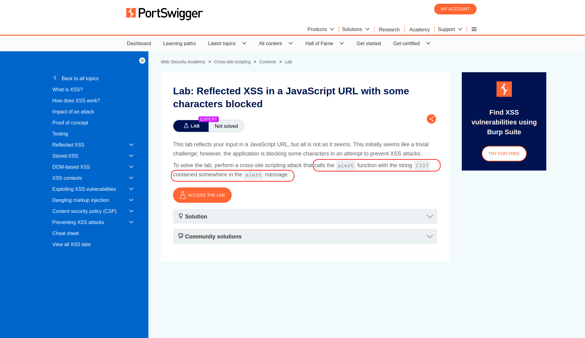

In this writeup, I'll walk through the entire manual exploitation flow step by step.

---

## Reconnaissance

When I opened the lab there was nothing so special, just some posts, and the user could open each one.

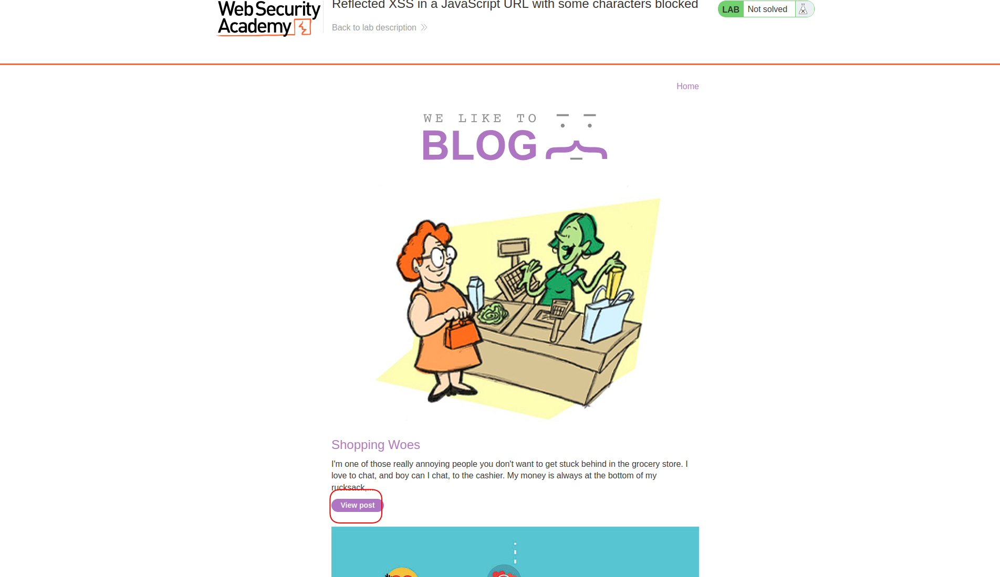
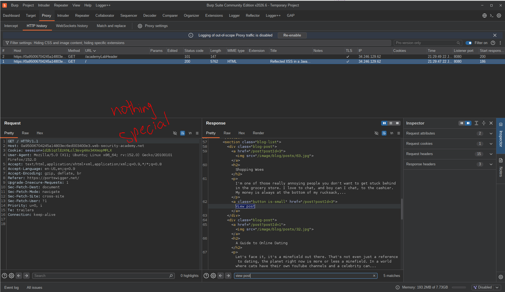


When the user opens a post, there is a 'back to blog' link, and the href is a JavaScript scheme!
This is where things start to get interesting...

You know with JS scheme, you can execute JS code directly by clicking on the link.
But the fun part is:
Part of the URL (path + query string) was present in the fetch inside JS code.

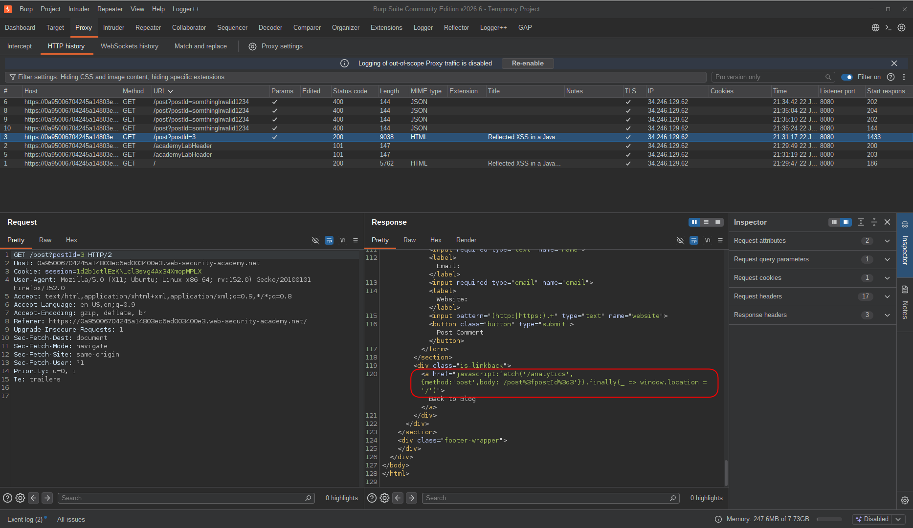

So I started with injecting a single quote:

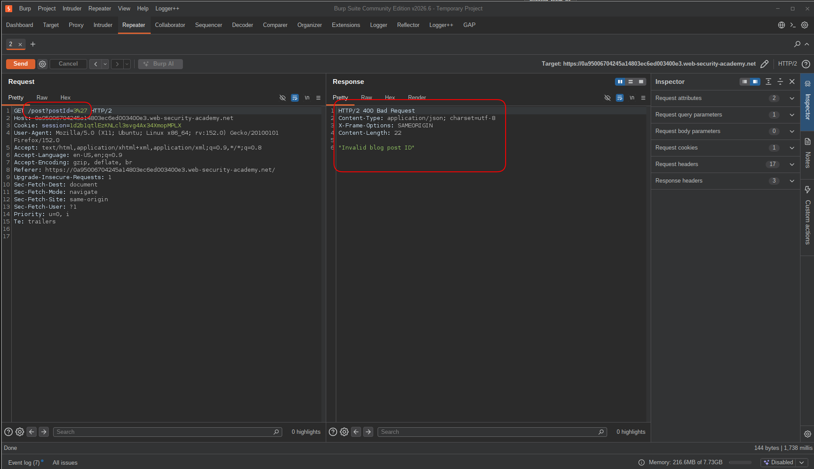

And I got a client-side error!
This confirmed that the input was reflected inside a JavaScript string context.
The single quote broke the surrounding string and caused a client-side syntax error.

So, what if there was another parameter?
Then I added an ampersand after postId=3 and I got no error this time.  

There was more to check: does changing the path affect the JS code (fetch)?
And the answer was yes:

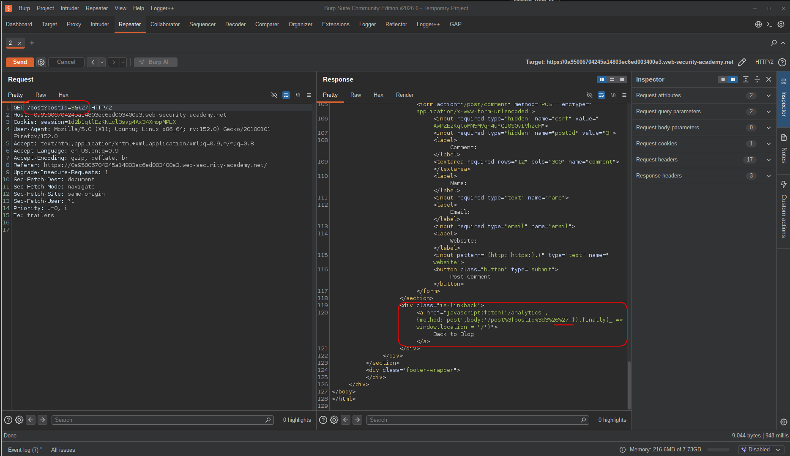

Explanation:  

When the server receives the request, it handles the URL in two separate ways.
For validation, it parses the query string and checks only the `postId` parameter — so `postId=3` passes, and the `'` after `&` is simply ignored as an unrecognized parameter.
For reflection, a different part of the code takes the raw URL (path + query string) as a plain string and places it directly inside the `fetch()` body argument — without any query string parsing.

This inconsistency is what makes exploitation possible: the `&` character acts as a separator for the validator, hiding the injected `'` from it, while the reflector sees the full raw string and places everything — including the `'` — inside the JavaScript context.

In one sentece: REFLECT and VALIDATE are two separated parts.  

You could find this with character fuzzing.  

Still, I needed to know if breaking was successful, so I added a closing curly brace to close the object, followed by an arbitrary string:

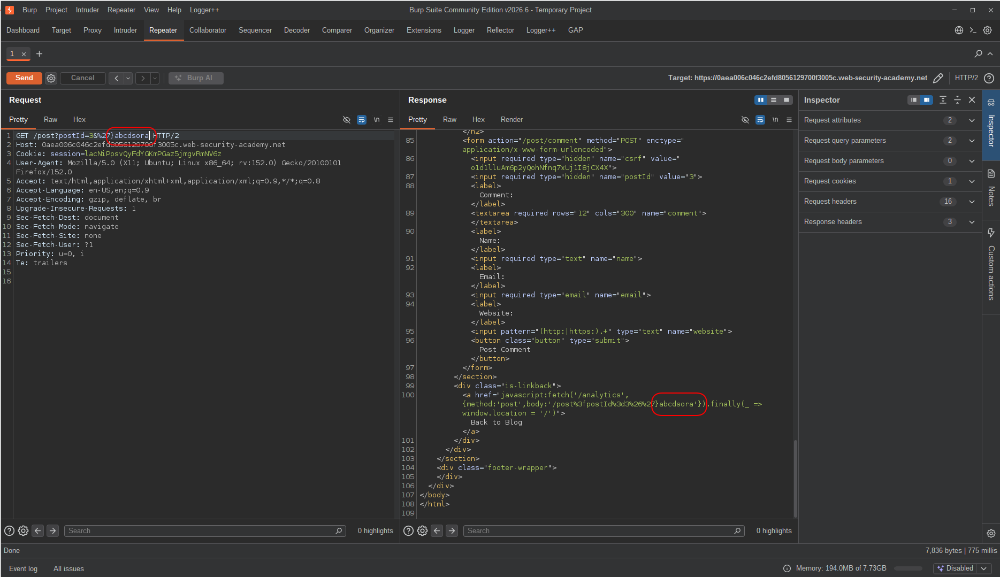


---

## Exploitation

Breaking was confirmed at this point, but how could I exploit that?

Now we are inside a function call argument list.
JavaScript function arguments must be expressions, so we need to inject a valid expression.
We are gonna need an expression. But what expression? Typically an alert:

```txt
&%27},alert(1337)
```

But there is a limit: we cannot use parentheses.
And we have to find a way to call a function without `()`.

But there may be a function that the browser calls by itself when needed? Browser APIs like `window.onerror`, `window.toString`, `window.onload`, `window.valueOf`, etc...

For example, if any error happens in the page and there is no catch statement to catch it, `onerror` will be executed.
And where do we find an error? We can create one!

> In case any error happens in the code, this code will be executed:
```javascript
onerror(error) 
```
And it's kinda like:
```javascript
try{
    // entire page
} catch(e){
    window.onerror(e)
}
```

will be executed.

So here is where things get a little confusing:
First of all, you need to call a specific function (`alert`) and you can't do that directly.
Second: you have to pass it a specific value (1337)!

How is this possible?
Look at the code above... what if `onerror` was `alert` and `e` was `1337`?
Exactly! We would have: `window.alert(1337)`.

But how to turn error into 1337 and onerror to alert?
You should know that `throw` is a statement that expects an expression as its operand, so:
```javascript
throw (
    onerror = alert,
    1337
)
```

This will assign `alert` to `onerror`. Functions are first-class citizens so `onerror` now references the `alert` function.
And then `1337` will be thrown.

But since parentheses (and also spaces) are not allowed, we can simply use a comma expression.
Comma expressions in JavaScript are written like this:
```javascript
onerror=alert,1337
```
Comma expressions evaluate each expression from left to right and the value of the whole expression is the value of the last expression.

So with this part:
```javascript
throw/**/onerror=alert,1337
```
From now on, `onerror` will refer to `alert` and `1337` will be thrown.

But remember what I've told earlier? This is a statement and by the syntax rules, we can't put this directly in the fetch arguments, so we're gonna need an expression, like a function.
But parentheses are also blocked, so how can we declare a function without parentheses? Arrow function **with a single parameter**:
```javascript
x=param=>{ ... }
```

And all of this ended up in this part of the payload:
```javascript
x=param=>{throw/**/onerror=alert,1337}
```

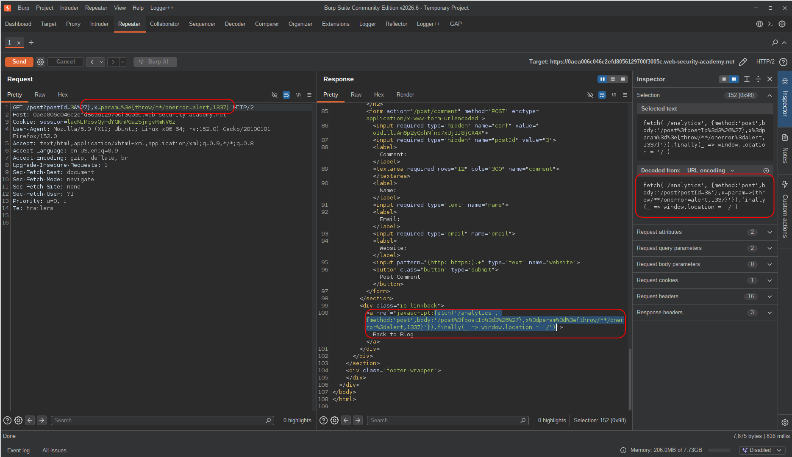

> Note that fetch does not care how many arguments we give it, but that does not mean they're not gonna be executed. The JS engine evaluates all arguments of a function before it even gets called.

At this point we have a function that does everything we want, but how do we trigger it?
We had no right of using parentheses for function calls or at all!!

Using the same strategy, we have to refer to browser APIs again.
There is another API called: `toString` (`window.toString`) and it will be called when we need a string — and when do we need a string? In string concatenation operations!

So what if `toString` was `x` and it was about to be triggered?
Before a string concatenation operation, the object must be turned into a string.
So when `window + ''` is found, JS tries to convert the window object into a string object — that's the key:
`window.toString` must be called and `toString` must refer to `x`!

```javascript
x=param=>{throw/**/onerror=alert,1337},toString=x,window+''
```

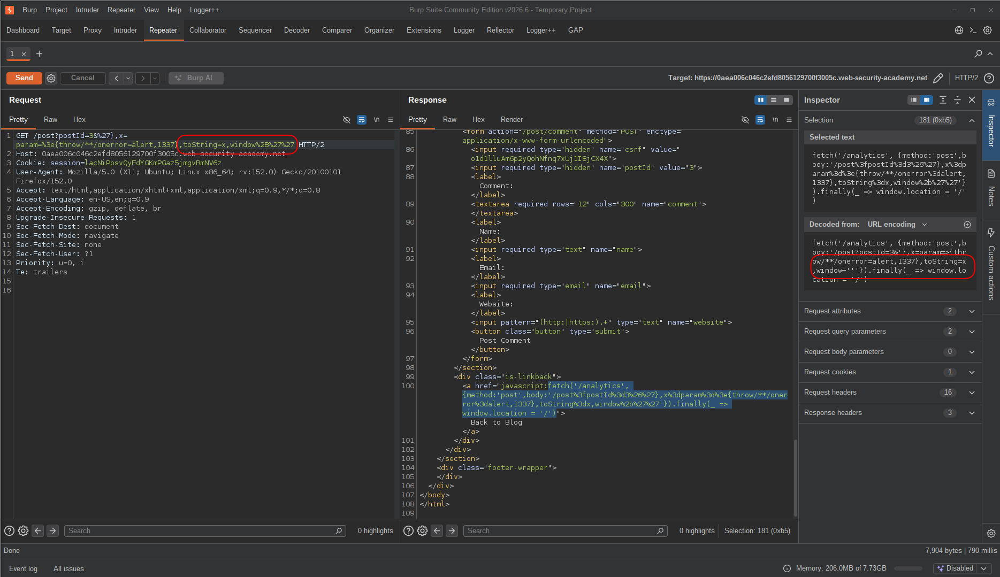

<br>

We are almost done, but leaving the code like this will cause a syntax error, since the code is invalid.
For one last step, we have to fix the context.
This is not valid JS code:
```javascript
fetch('/analytics',{method: 'post', body: '/post?postId=3&'},x=param=>{throw/**/onerror=alert,1337},toString=x,window+'''})
```
Because there is an extra single quote followed by a closing curly brace at the end, which will cause a syntax error.
So I fixed it:

```javascript
fetch('/analytics',{method: 'post', body: '/post?postId=3&'},x=param=>{throw/**/onerror=alert,1337},toString=x,window+'',{foo:''})
```

Now this code is perfectly valid.

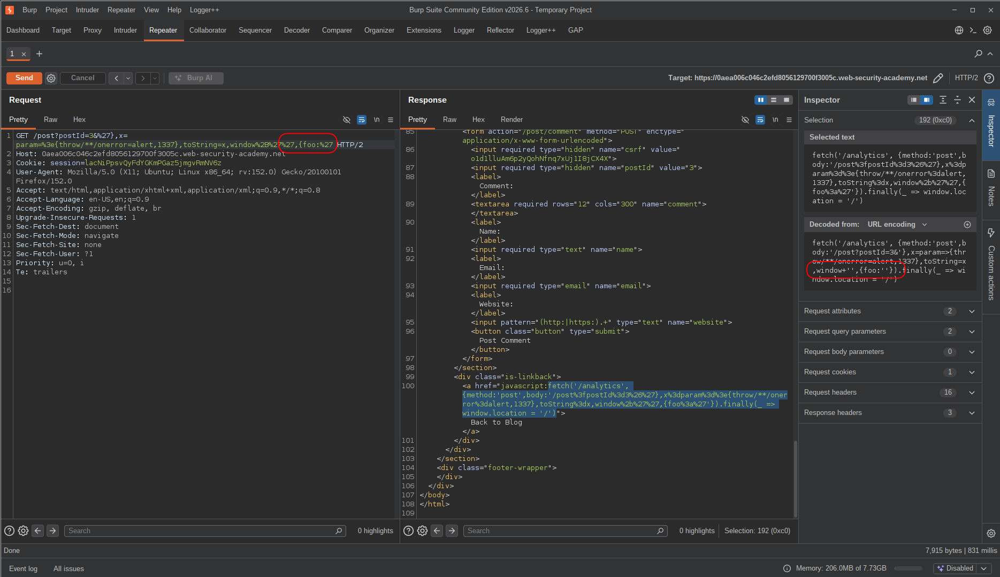


And the only remaining step is just placing the payload in the URL and hitting enter → click on the link to trigger fetch.


---

## Final Payload:

```text
postId=3&%27},x=param=>{throw/**/onerror=alert,1337},toString=x,window%2B'',{foo:'
```

---

## Result

I opened the URL in my browser with the payload included:

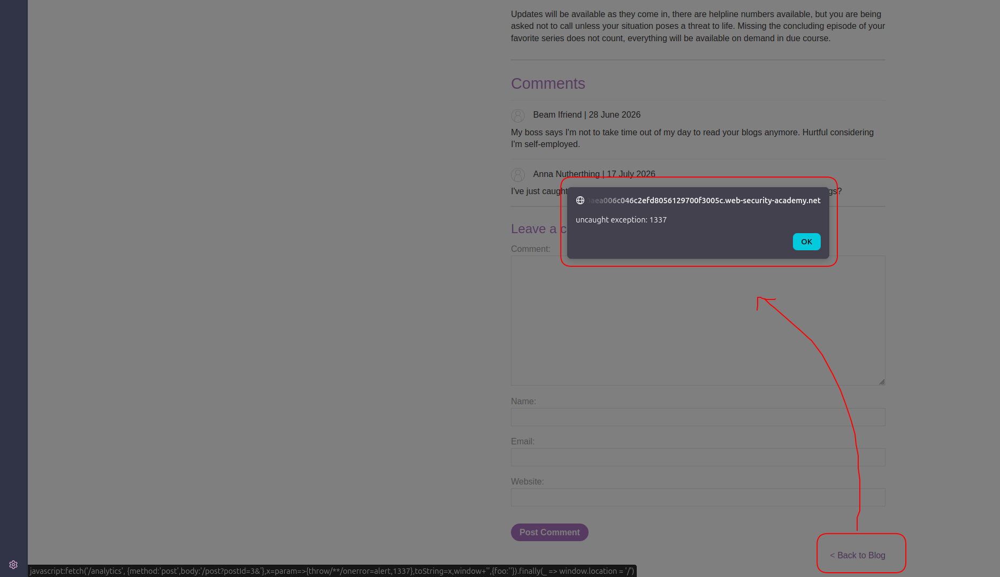

And done.

---

## Impact & Remediation

An attacker can execute arbitrary JavaScript in the victim's browser context.
This can lead to account compromise, sensitive data theft, session abuse, or unauthorized actions depending on application functionality.

Avoid placing user-controlled input directly inside JavaScript contexts.
Use proper output encoding for the target context and avoid constructing JavaScript URLs dynamically.
Prefer safe APIs such as event listeners instead of `javascript:` URLs.

---

## Takeaway

This lab was a great example of why understanding JavaScript execution context is more important than memorizing XSS payloads.

The key lessons learned from this challenge:

* **Always identify the exact injection context first.**
  The same input can behave completely differently depending on whether it is placed inside HTML, a JavaScript string, an object, or another JavaScript structure.

* **JavaScript syntax restrictions do not always mean code execution is impossible.**
  When common characters such as parentheses or spaces are blocked, alternative language features can often provide the same functionality. In this case, arrow functions with a single parameter replaced the traditional `() => {}` syntax.

* **Expressions and statements behave differently.**
  Function arguments require expressions, not arbitrary statements. Understanding this distinction allowed the use of a function expression to carry a `throw` statement inside its body.

* **JavaScript coercion can trigger hidden execution paths.**
  Operations such as string concatenation may invoke methods like `toString()` automatically. Overriding these behaviors can provide execution without directly calling a function.

* **Browser APIs can act as execution gadgets.**
  Features such as `window.onerror` can be abused when direct function calls are restricted. Instead of calling `alert(1337)` directly, the payload can make the browser call it indirectly.

* **A payload is not just a string; it is a piece of code that must satisfy JavaScript grammar.**
  Successful XSS exploitation often comes from building valid syntax step by step:

  1. Break out of the current context.
  2. Understand what the parser expects next.
  3. Find valid expressions that bypass restrictions.
  4. Trigger execution through available browser behavior.
  5. Repair the remaining syntax.

The biggest takeaway is that advanced XSS exploitation is less about finding a magic payload and more about understanding how the JavaScript engine parses, evaluates, and executes code.