# Lab: Reflected XSS with event handlers and href attributes blocked

| Field | Details |
|-------|---------|
| **Provider** | PortSwigger |
| **Difficulty** | Expert |
| **Category** | Cross-Site Scripting |
| **Date** | 2026-07-22 |

---

## Summary

Reflected XSS with event handlers and href attributes blocked is a lab in the PortSwigger Web Security Academy. In this lab, you can simply break out of context, but what the lab wants from you is a label with text including "Click" — and since the attributes and event listeners are blocked, it's not so simple to exploit.

In this writeup, I'll walk through the entire manual exploitation flow step by step.

---

## Reconnaissance

When you open the lab, there is a search box which is an obvious entry point.  
In real targets you would test parameters and fuzz them (to find new ones) so you have a valid entry point.  
This is the original request:

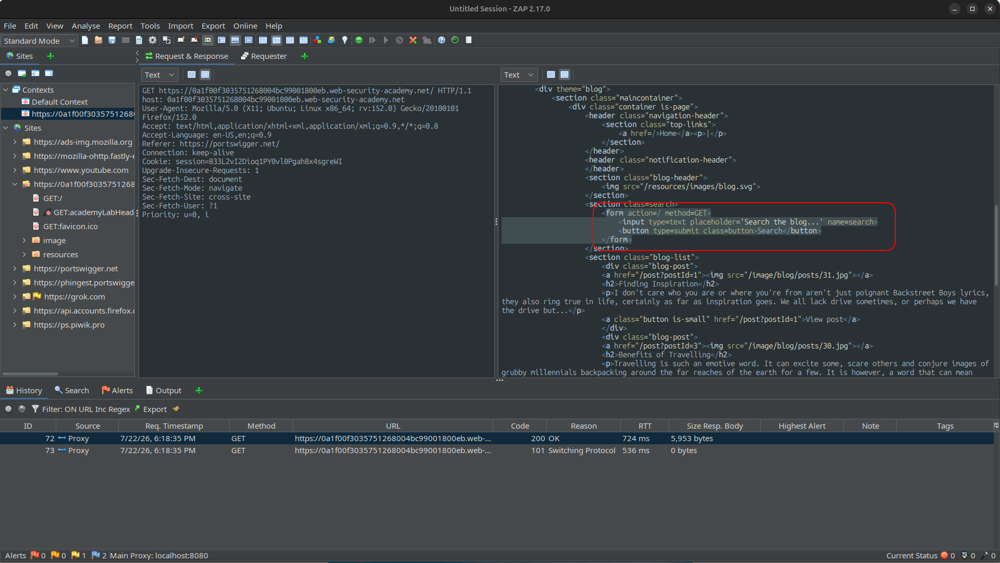

However, the first thing I did as an attacker was checking if there are any reflections:

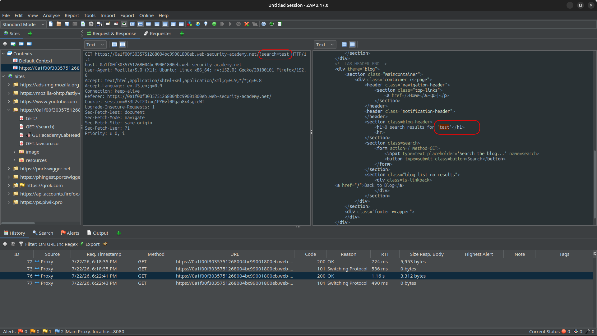

And I got it back.  
Note that it's always better to start from harmless payloads and extend step by step. Since this is a lab and I knew the task, steps were pretty straightforward.

When I got the reflection, the next question was: can I break out of the text/string and enter HTML context?  
So I injected a single quote based on the response I received:

```txt
...?search=test%27hello
```

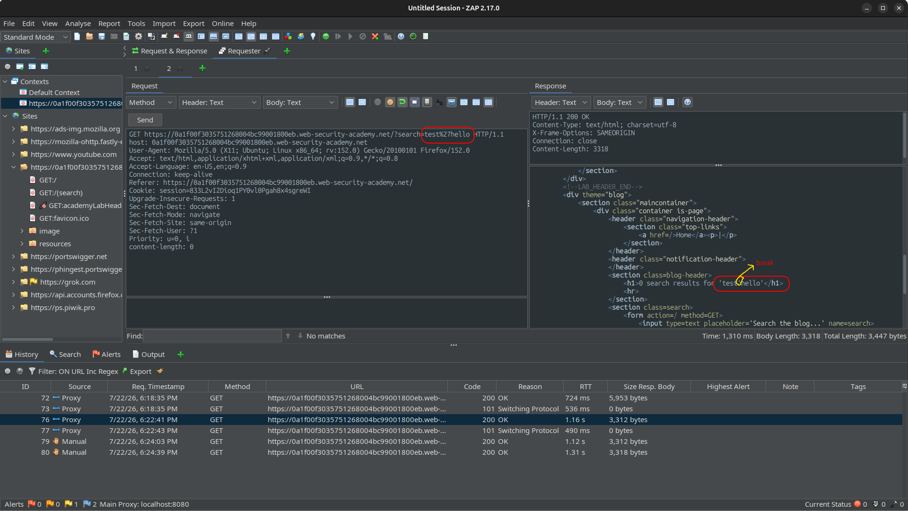

And it was successful.

> **Note:** When injecting characters in the query string, it's important to directly use URL-encoded values. Why? Because what happens if the server reflects the exact character you entered?  
> For example, you inject `>` and `>` is reflected. Then you enter `%3E` and `%3E` is what gets reflected.  
> What's the problem? If you send the malicious URL to a victim and they open the link, the browser will automatically convert characters like `<`, `>`, and space to URL-encoded format — and your payload may not work at all.  
> So one thing I always do is inject URL-encoded values directly. It's a bit harder to read, but you can use an encoder for that.

---

## Exploitation

After that, I wrote the complete payload:

```text
test'<a href="javascript:alert(origin)">Click Me</a>
```

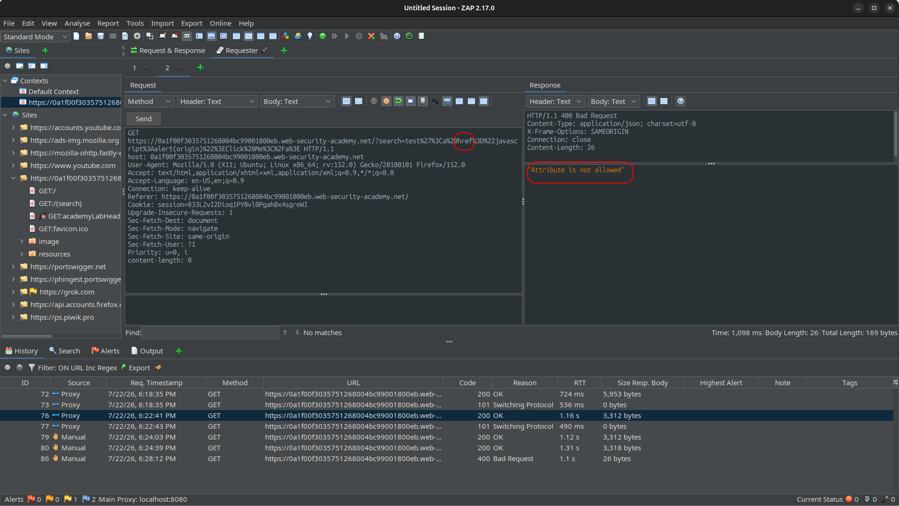

And BOOM! The `href` attribute was blacklisted.  
So I took a step back and tried again without any attributes — just the `a` tag.

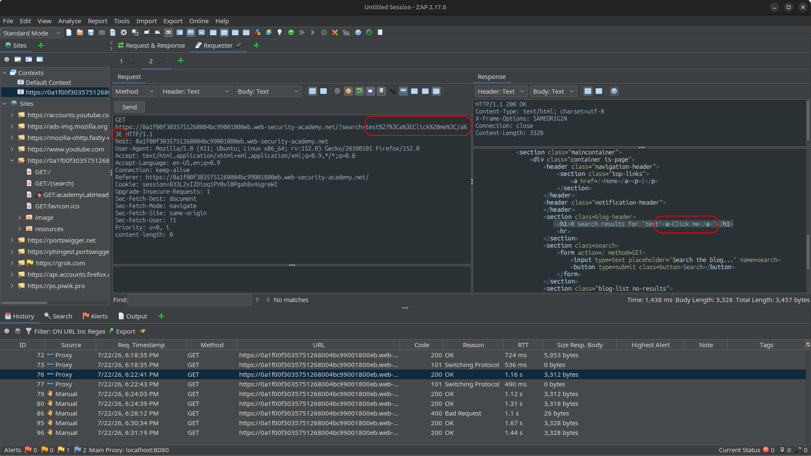

And the response was fine. `a` was reflected with no errors.

So I wanted to find out: is every attribute being blocked? I decided to test one of the most harmless ones: `id`.

```text
test'<a id="test">Click Me</a>
```

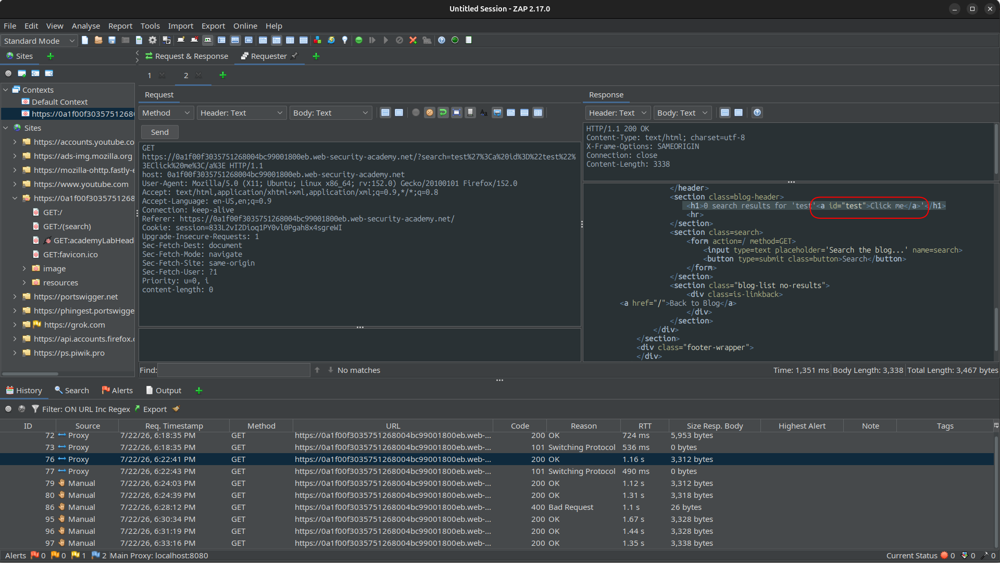

And again it was fine.

So what would I do? I need some attribute or event listener, but they're getting blocked immediately.

There's a known and clever combo for XSS when event handlers and href are blocked: using the `svg` tag, an attacker can create an attribute via animation — so it doesn't exist from moment 0, but gets created dynamically.  
this is exactly why the filter doesn't catch it — the dangerous value (`javascript:...`) never appears as a static attribute in the raw HTML. the filter sees `<animate>` with `attributeName` and `values`, which look harmless. the actual `href` attribute only exists at runtime, after the browser processes the SVG animation engine.  

How does it work? First I needed to check if `svg` was whitelisted:

```text
test'<svg></svg>
```

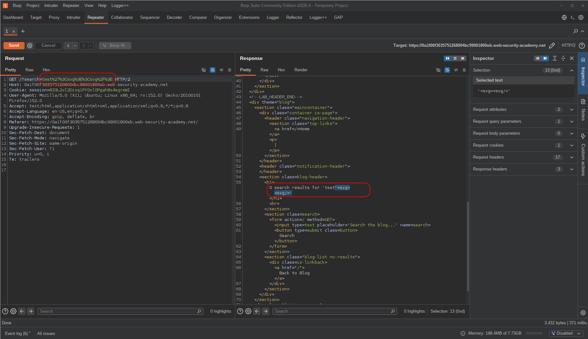

That's what I needed. I can use `svg` freely.

Then I recreated the `a` tag inside `svg`:

```text
'<svg><a>Click Me</a></svg>
```

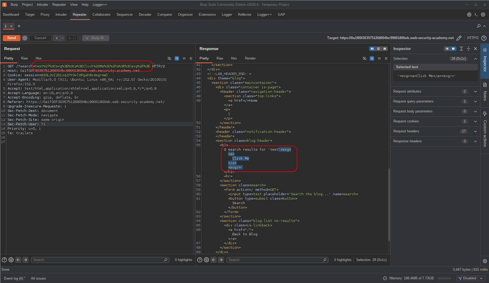

And just to confirm it still wouldn't work, I added an empty `href` attribute to the `a` tag again:

```text
'<svg><a href="">Click Me</a></svg>
```

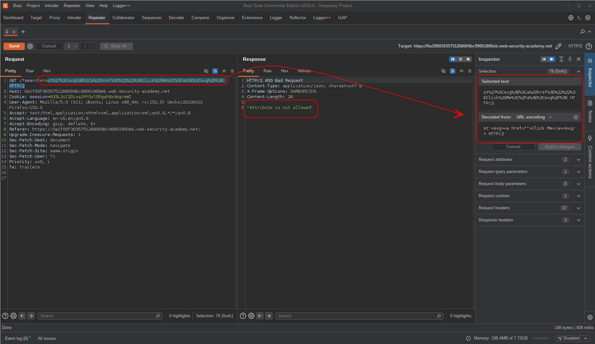

So I went straight for the `animate` tag inside SVG.  
The `animate` tag must be placed inside the target element (which is `a` in this case).  
It takes two useful attributes: `attributeName` for the name of the attribute to animate, and `values` for its value.

```text
'<svg><a><animate attributeName="href">Click Me</a></svg>
```

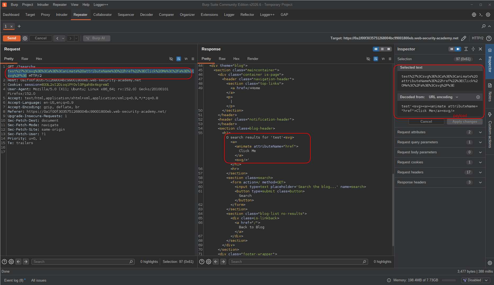

Completely fine. So I added `values` next:

```text
'<svg><a><animate attributeName="href" values="javascript:alert(origin)">Click Me</a></svg>
```

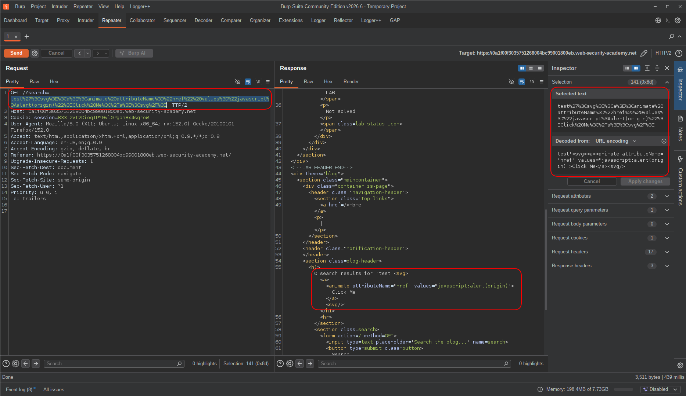

Almost done! I just needed to make it valid SVG.  
`animate` is a self-closing tag like `input`, so it should end with `/>`.  
Also, text should be placed inside a `<text>` tag to be valid in SVG, and `text` takes `x` and `y` attributes for positioning.

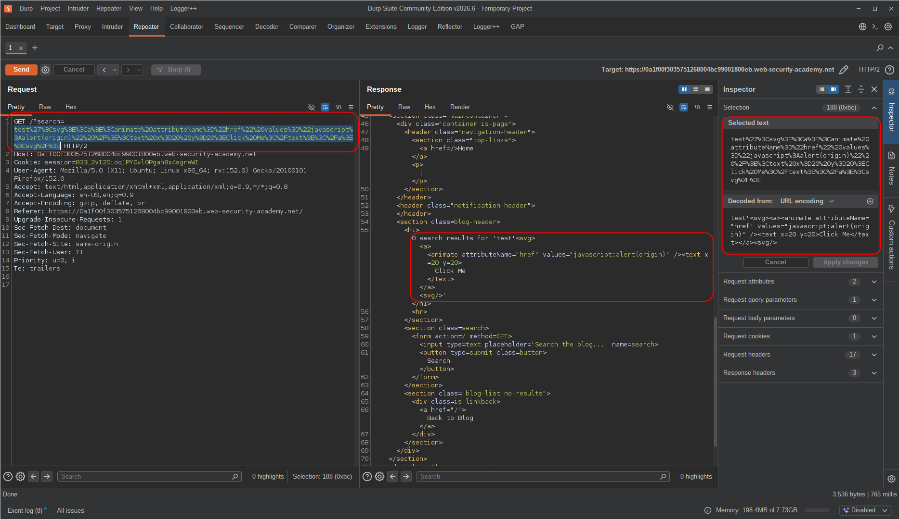

---

## final payload:

```text
'<svg><a><animate attributeName="href" values="javascript:alert(origin)" /><text x="20" y="20">Click Me</text></a></svg>
```

---

## Result

I opened the URL in my browser with the malicious query string:

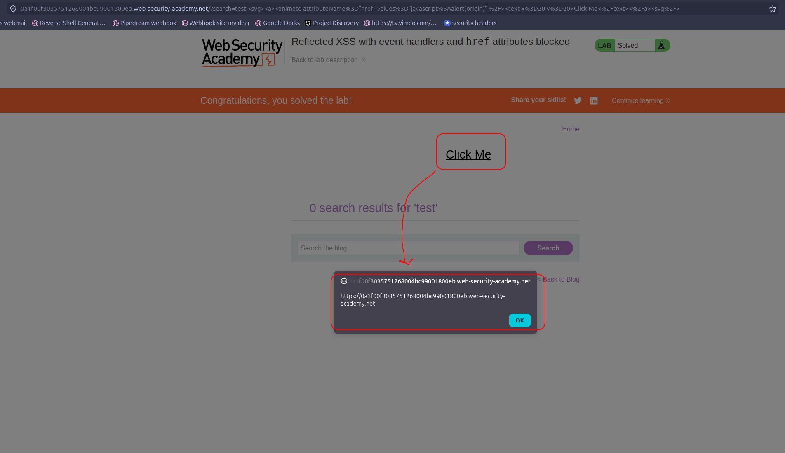

the `animate` tag successfully set the `href` attribute on the `a` tag at runtime, bypassing the filter entirely. clicking the "Click Me" text triggered the JavaScript payload in the target's origin context.  
And done.

---

## Impact & Remediation

If this vulnerability existed in a real application, an attacker could craft a malicious URL and trick a victim into clicking it. Since it's reflected XSS, the payload lives in the URL — not the database — so the attack surface is anyone who clicks the link. Possible impact includes:
- Executing arbitrary JavaScript in the victim's browser under the target origin
- Session hijacking if cookies are accessible
- Performing actions on behalf of the victim
- Redirecting to phishing pages or injecting fake UI elements

The root cause here is an incomplete blocklist. The application tried to block dangerous attributes like `href` and event handlers, but SVG's `animate` element provides an alternative way to set attributes dynamically — completely bypassing the filter.

Remediation:
- Never rely on attribute/tag blocklists for XSS prevention — they are always bypassable
- Use a proper HTML sanitization library (like DOMPurify) with a strict allowlist
- Apply a strong Content Security Policy (CSP) as a defense-in-depth layer
- Encode all user-controlled output before reflecting it into HTML context

---

## Takeaway

- Reflection + HTML context breakout is step one. What comes after depends entirely on what the filter allows.
- When event handlers and `href` are blocked, don't stop — probe what tags and attributes are still allowed. The filter might be narrower than it looks.
- SVG's `<animate>` tag is a powerful bypass technique: it sets attributes dynamically at runtime, so the dangerous value never appears as a static attribute in the raw HTML — blocklist-based filters won't catch it.
- `attributeName="href"` + `values="javascript:..."` inside `<animate>` is the combo to remember when `href` is blocked on the `a` tag directly.
- Blacklists are always losable. There's always another tag, another attribute, another context. Allowlists are the only defensible approach.