# Lab: SQL injection with filter bypass via XML encoding

| Field | Details |
|-------|---------|
| **Provider** | PortSwigger |
| **Difficulty** | Practitioner |
| **Category** | SQL Injection |
| **Date** | 2026-07-21 |

---

## Summary

SQL injection with filter bypass via XML encoding is a lab in the PortSwigger Web Security Academy. In this lab we can see that there are items in a shop, and each item has an option for checking quantity (remaining in stock). If we click on the button "Check Stock", we can see that the quantity number will appear on screen. Since we are inspecting the exact result and not only an effect, it becomes more interesting (better candidate for UNION based injection).

By manipulating the source, we can get different data from the application and sometimes a WAF is going to prevent the request from being sent upstream.

In this writeup, I'll walk through the entire manual exploitation flow step by step.

---

## Reconnaissance

The application takes user input (`storeId`) and returns dynamic data based on it — this suggests the input is being used in a database query somewhere in the backend. That makes it a good candidate for SQL injection testing.

So where is data being transferred, and how does the application know what to do the moment I press the "Check Stock" button? An HTTP request is sent to the server, and the server responds with some value which the application then displays on screen.
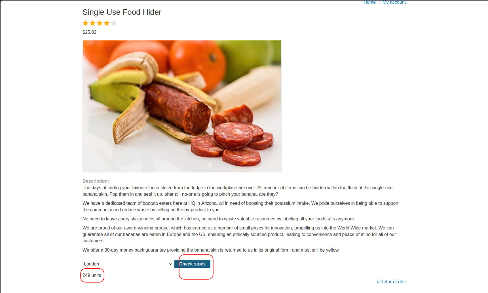

If you intercept your traffic, you can see the request:
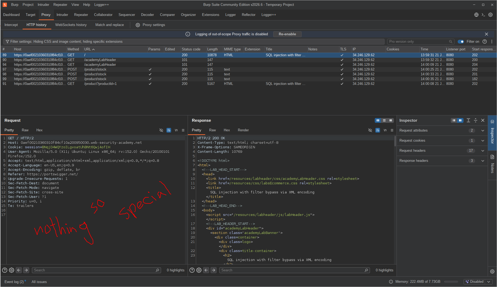
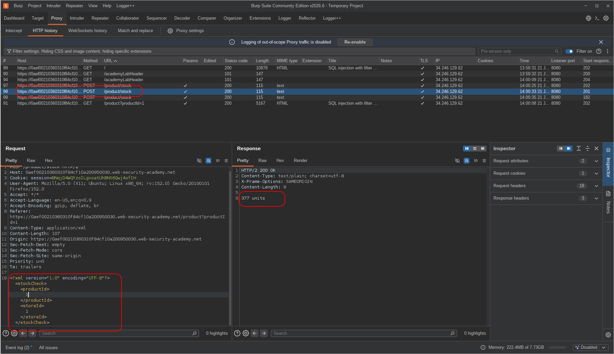

<br>

After I found the source (where data enters from the client side), I knew what to test to detect if there is an SQL injection.
In union-based injections, there are two phases to detect the vulnerability. (If you don't know about ORDER BY — it sorts results based on the column we specify, and we can specify a column number starting from 1):

Phase 1: Try these payloads. The goal is to get the exact same response as the original request:
1. `... ORDER BY 1`
2. `...' ORDER BY 1#`
3. `..." ORDER BY 1#`

<br>

If you got the same result with one of these, move to Phase 2:
Now change the number from 1 to a large number that you are sure the table does not have that many columns, like 100 or 1000.
1. `... ORDER BY 100`
2. `...' ORDER BY 100#`
3. `..." ORDER BY 100#`

If the response is different from the original and from ORDER BY 1, the SQLi vulnerability is confirmed.

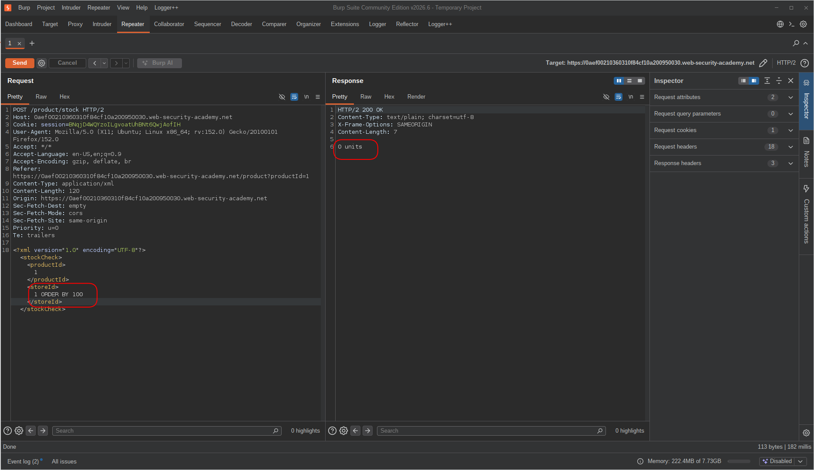

to confirm the column count, i increased the number to 2:
```sql
1 ORDER BY 2
```
the response changed to `0 units` instead of `377 units`, which means the query errored out — confirming there is only **1 column** in the original query.

<br>

The next step is to find the exact number of columns — increase the ORDER BY number (1, 2, 3, ...) until the response changes. The last number that gave the same response as the original is the column count.
In UNION SELECT, the number of selected columns on the left side and right side of UNION must be the same. This is why we need to know the exact number of columns in the original query.
In this case it was 1, so we can only get one value at a time if there are any reflections.
I did another test to confirm the column count and also check for reflection:
```sql
UNION SELECT NULL
```
the reason i used NULL instead of a string or number is that NULL has no data type in SQL — it matches any column type. if i had used `'test'` and the column was an integer type, i would get a type mismatch error and couldn't tell if the column count was wrong or the type was wrong. NULL eliminates that ambiguity.  

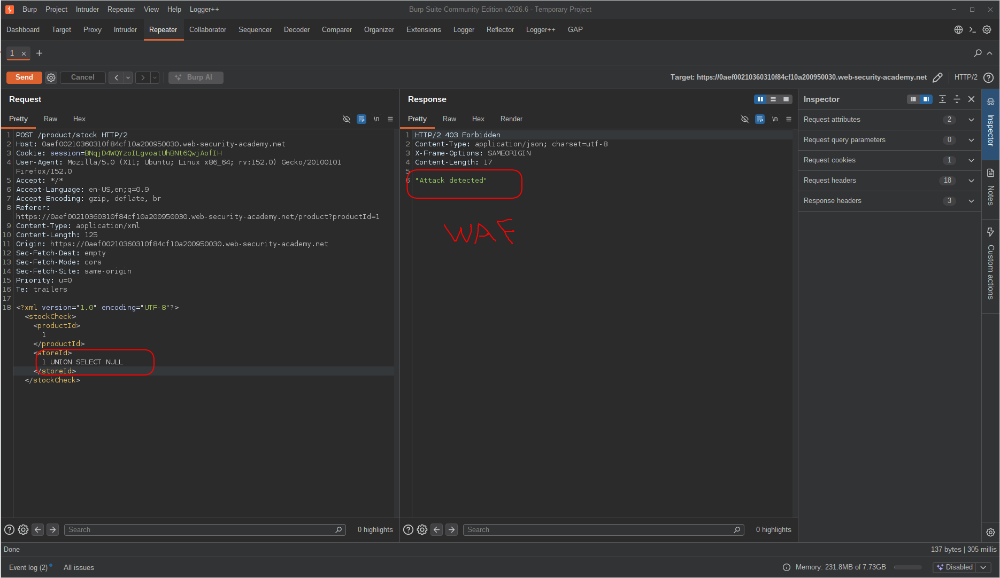
And the WAF caught me immediately.
How can I bypass this? One bypass method that has always helped hackers is encoding. Encoded data can be decoded anywhere, but it mostly gets decoded in the backend.

The XML parser automatically decodes XML/HTML encoded data to plain text before passing it to the application. The WAF sits before the XML parser, so the data flow looks like this:
```
Request -> WAF -> XML Parser -> App -> DATABASE
            ↑          ↑
      sees encoded   sees decoded
      (nothing       (UNION SELECT NULL)
      suspicious)
```
This means the WAF inspects the encoded version and finds nothing suspicious, while the XML parser silently decodes it and hands the raw SQL to the application — and eventually to the database.

<br>

The next step was to encode the payload and try again:
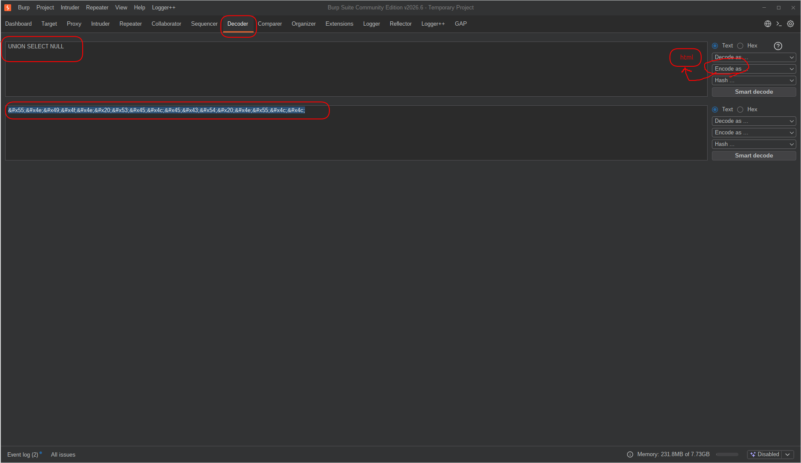
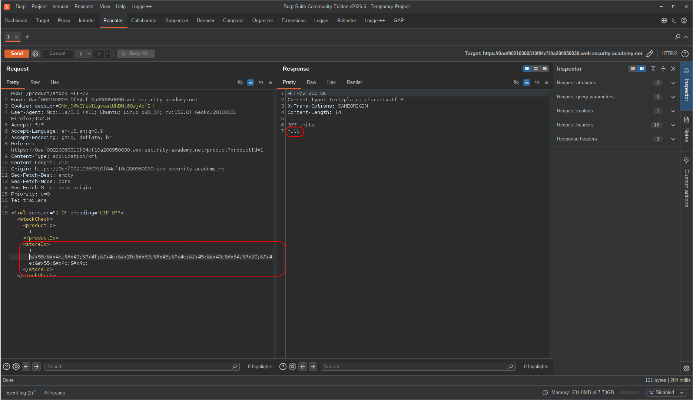
And it worked! I got the reflection.

The next move was to identify the database:
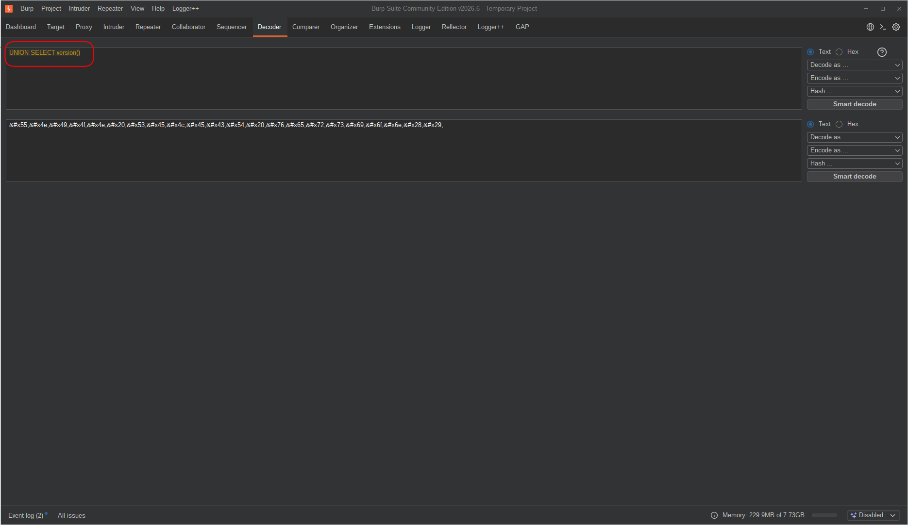
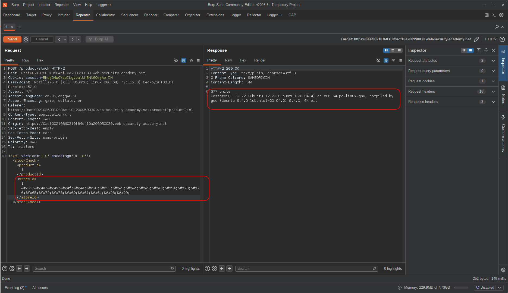
I got the `version()` output and it was a PostgreSQL database.

<br>

After that I entered the Exploitation Phase...

---

## Exploitation

To exploit the vulnerability, my first step was to extract table names with this query:
```sql
UNION SELECT string_agg(table_name,',') FROM information_schema.tables WHERE table_schema='public'
```
I used the `string_agg` function which works just like GROUP_CONCAT in MySQL. The reason was that I only had one column reflecting data and there were possibly more than one row to return.
Also, regarding `table_schema` — at first I tried to use the database name which I got with `UNION SELECT current_database()`, but it didn't work. At first I thought I did something wrong, but after researching the reason, I realized that MySQL and PostgreSQL treat schema differently.
In MySQL, `table_schema` is the same as the database name, but in PostgreSQL, `table_schema` defaults to `public`.
So I tried `public` and got the table names:
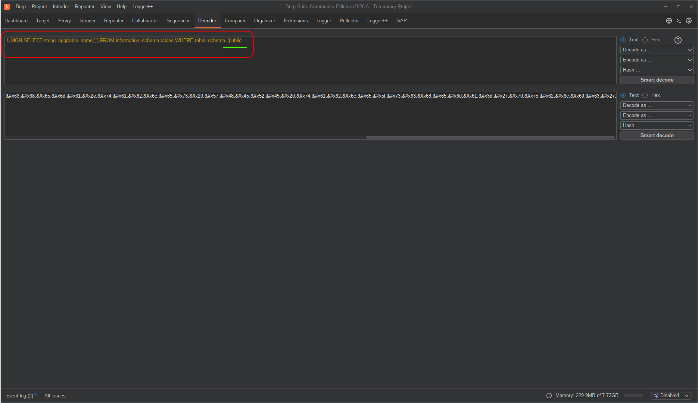
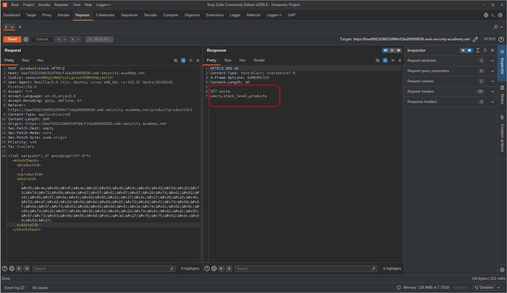

<br>

My target table was probably `users` — I could tell by the name.
So the next move was finding its column names, using the same strategy:
```sql
UNION SELECT string_agg(column_name,',') FROM information_schema.columns WHERE table_schema='public' AND table_name='users'
```
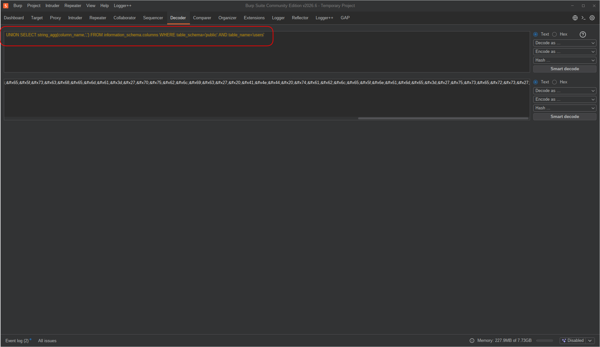
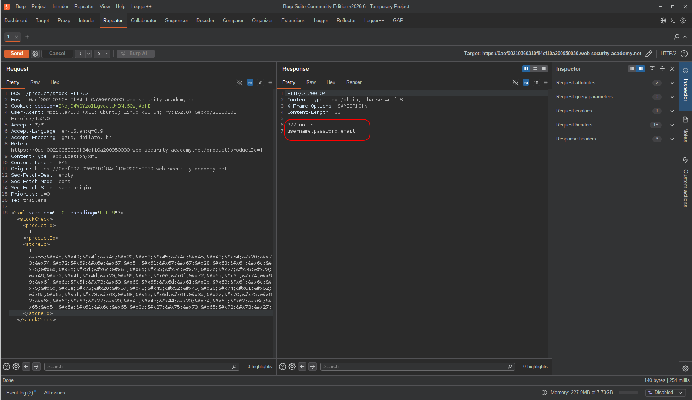
Each user had a username, password, and email.

<br>

Once I knew the column names, for the final step I went straight for username and password combinations:
```sql
UNION SELECT string_agg(username || ':' || password,' , ') FROM users
```
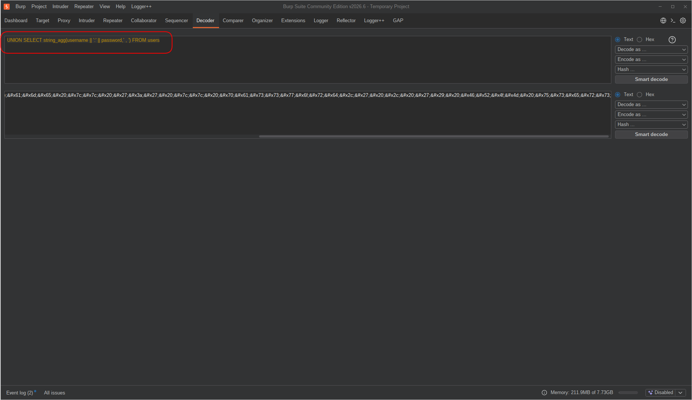
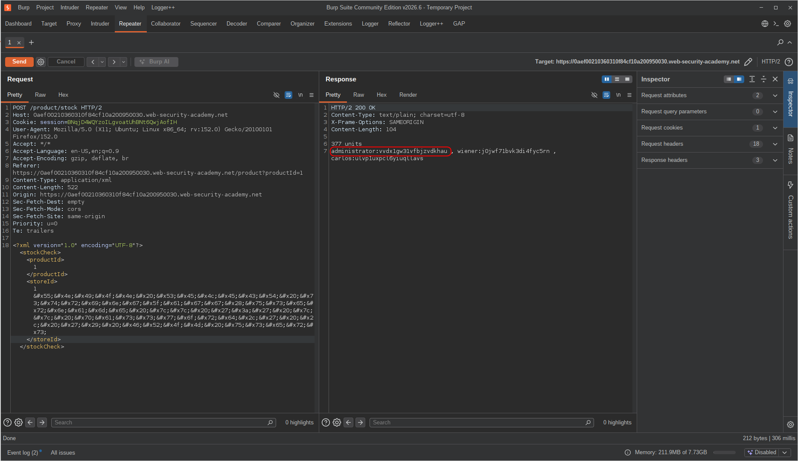

<br>

---

## Result

And the lab was solved.
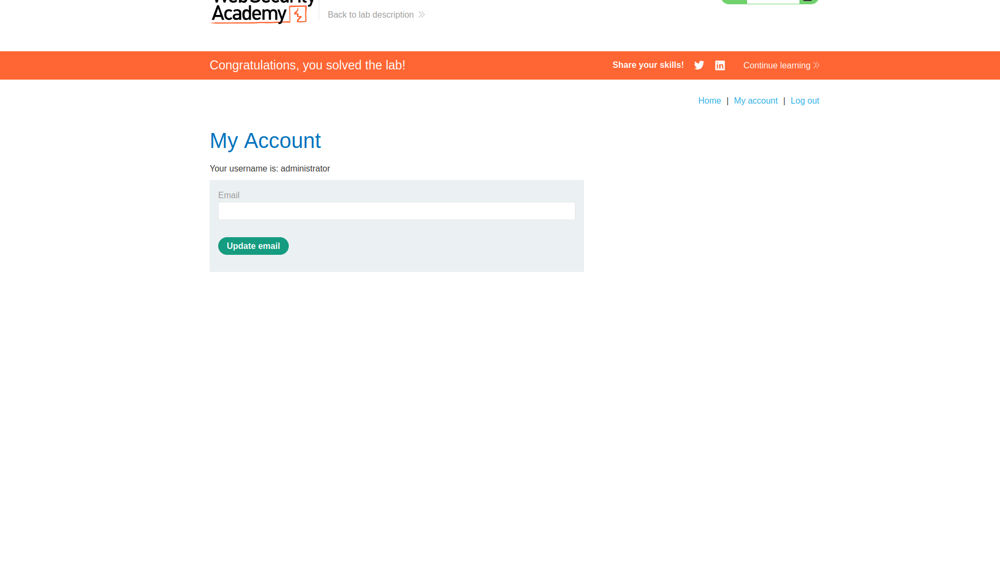

---

## Impact & Remediation

**Impact:** This vulnerability allows an unauthenticated attacker to extract any data from the database — including credentials, session tokens, and other sensitive records. In this lab, it led to full account takeover of the `administrator` user.

**Remediation:** The root cause is unsanitized user input being concatenated directly into SQL queries. The fix is to use **parameterized queries (prepared statements)** instead of string concatenation — this ensures user input is always treated as data, never as SQL syntax. Additionally, applying the principle of least privilege to database accounts and implementing a WAF as a defense-in-depth layer can further reduce the attack surface.