# Lab: SSRF with filter bypass via open redirection vulnerability

| Field | Details |
|-------|---------|
| **Provider** | PortSwigger |
| **Difficulty** | Apprentice |
| **Category** | Server Side Request Forgery |
| **Date** | 2026-08-06 |

---

## Summary

SSRF with filter bypass via open redirection vulnerability is a lab in the PortSwigger Web Security Academy.
The target is a shopping website and the task is deleting someone's account.

In this writeup I'll solve this challenge manually step by step.

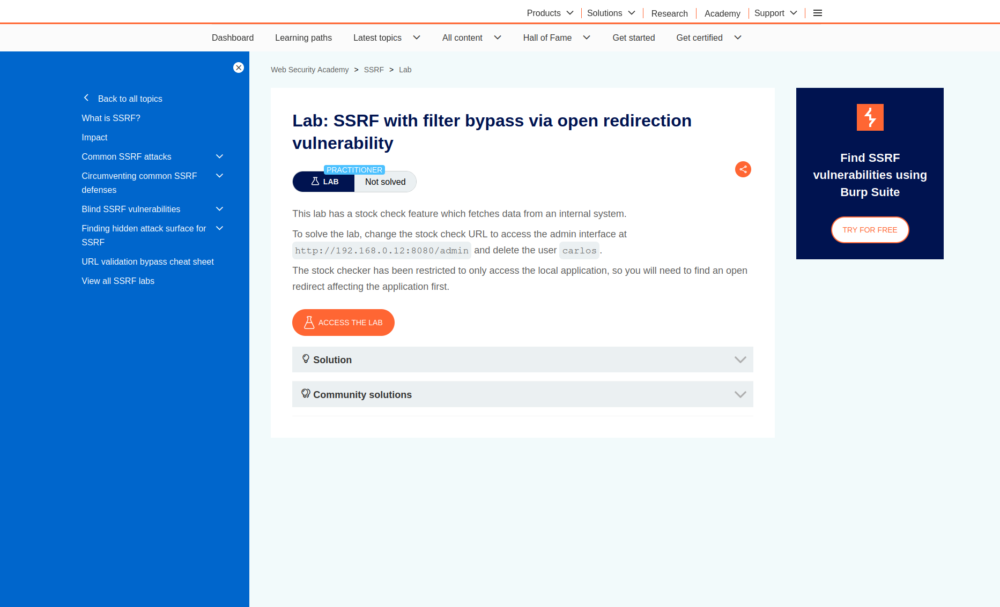

---

## Reconnaissance

I opened the target and it looked like another normal shopping application.

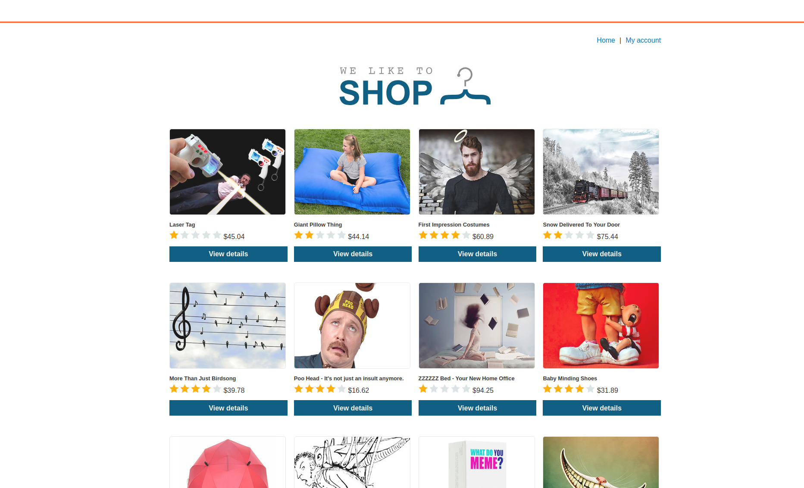

I opened a random product and there were some features like `check stock` and `next product`.

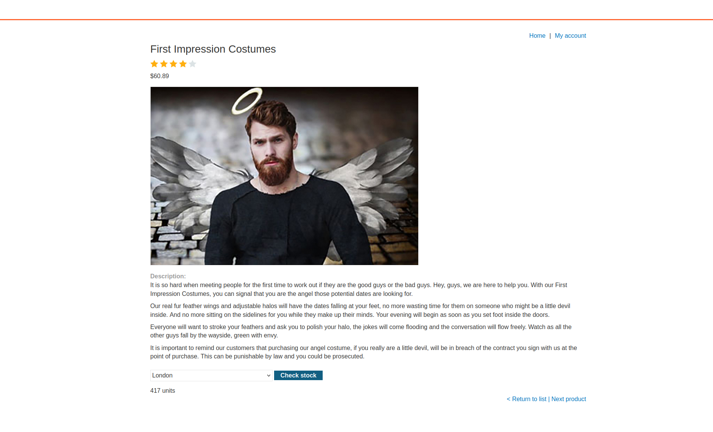

<br>

Whenever you see keywords like `next`, `move`, `redirect` and there is an actual redirection happening, you can add open redirect to your test cases.
So I moved on to Burp Suite to check my traffic.

This request was sent when I clicked on `check stock`:

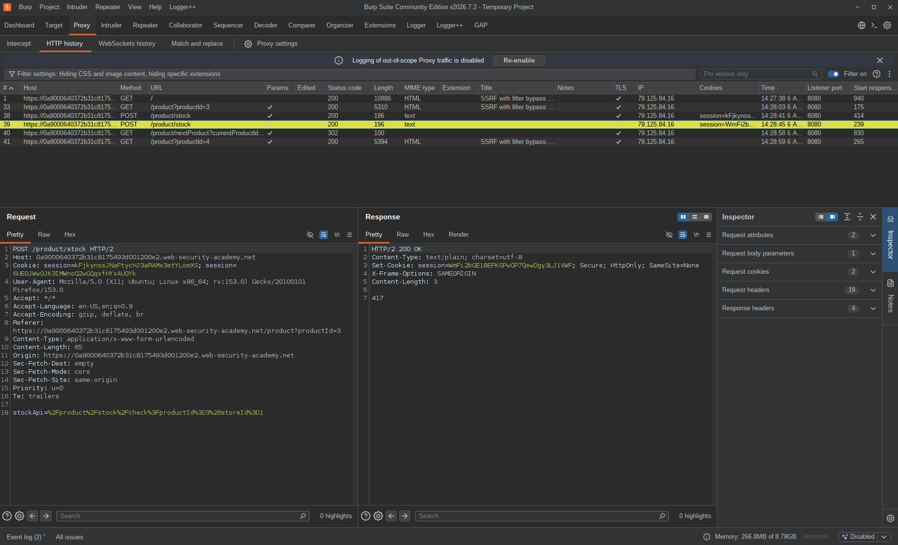

A POST request to `/product/stock`, and there is a parameter named `stockAPI` which holds the address that should be requested to get stock data.
Notice that the address is a relative path, not an absolute one.
But we can try an absolute address because we don't know exactly what's happening in the background —
if it works, we may have an SSRF vulnerability.

<br>

And this request was sent when I clicked on `next product`:

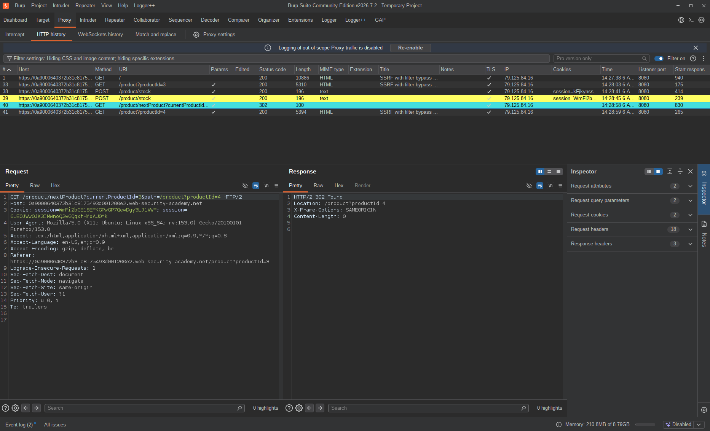

A GET request to `/product/nextProduct?currentProductId=3&path=/product?productId=4`.
This looks like a redirect portal and we should try replacing the relative path with an absolute one.
If it still works, we may have an open redirect vulnerability.

<br>

So I sent both requests to Repeater to test them further.
In the first request I tried changing the address to an absolute one and got an error: `Invalid URL`.

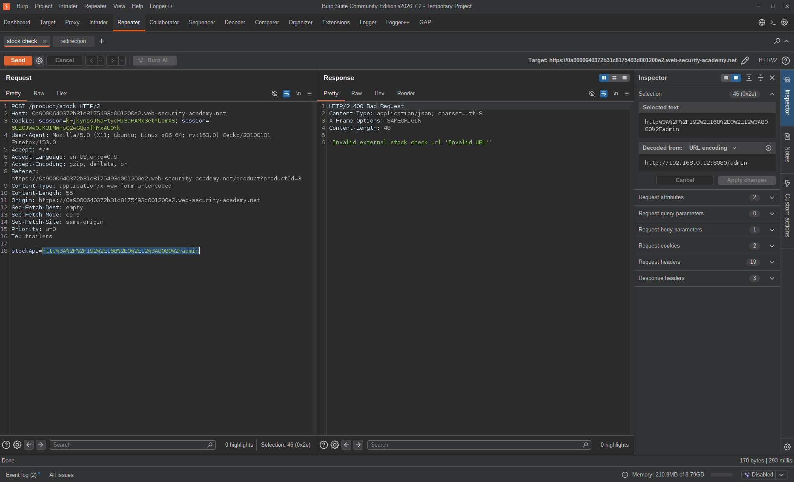

This endpoint probably only works with relative paths.

But there's a relative path that can lead the requester somewhere else if an open redirect exists — the second request, the portal.
So I tried replacing the relative address with an absolute one — and not just any address, but the application itself, to check if there's a blacklist or whitelist in place.


And it worked.
My next move was changing the port — using an invalid port should get no HTTP response. (Ports are the next step because we always start from the most harmless payloads.)

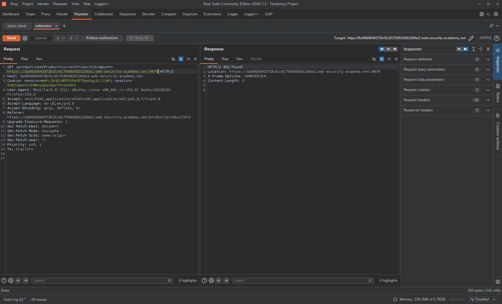

I followed the redirection and there was no HTTP response — verification step 2 completed.

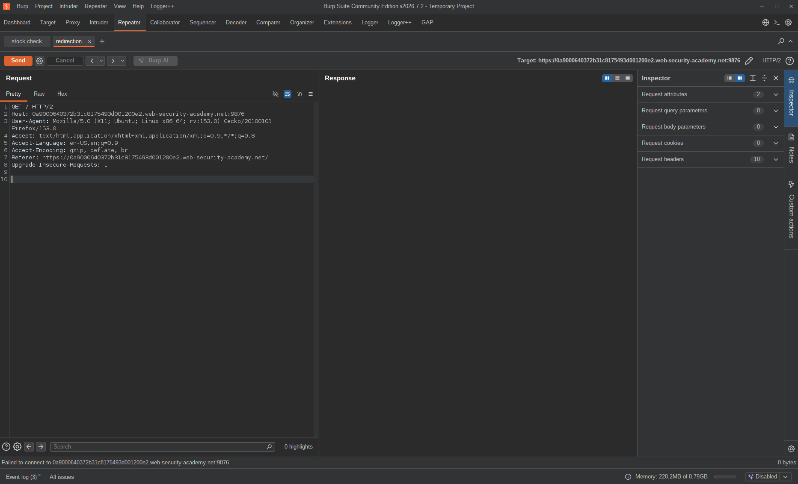

<br>

Finally I replaced the address with an external site to confirm whether the redirect is actually open.
I entered `https://google.com`:

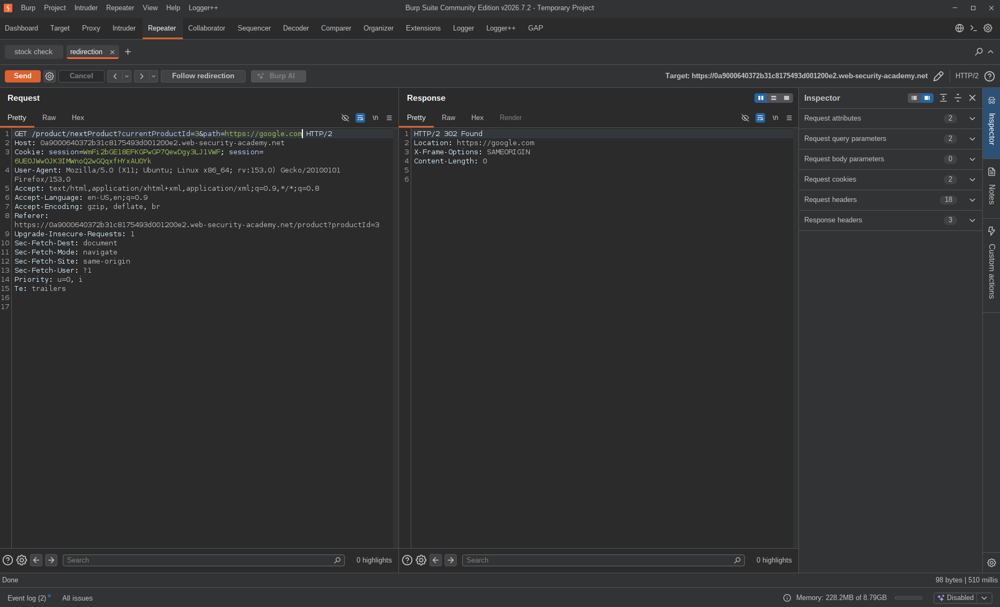

I followed the redirection and was viewing the Google webpage.

So open redirect was confirmed — and we also have a relative path we can use to chain requests through.

---

## Exploitation

Now, what happens if I enter an internal address like `192.168.0.12:8080` in the `path` parameter?
The application should send a request to that address.
So I chained the two requests together:

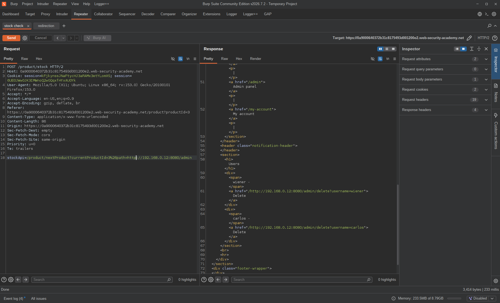

> Note that the `&` character must be URL-encoded, because the application needs to know it's part of the `stockAPI` parameter's value and not a separate parameter.

With this request I was able to view the admin panel.
Now I could complete the exploitation by modifying the address to perform a state-changing action —
and I found the delete link directly from the page itself.

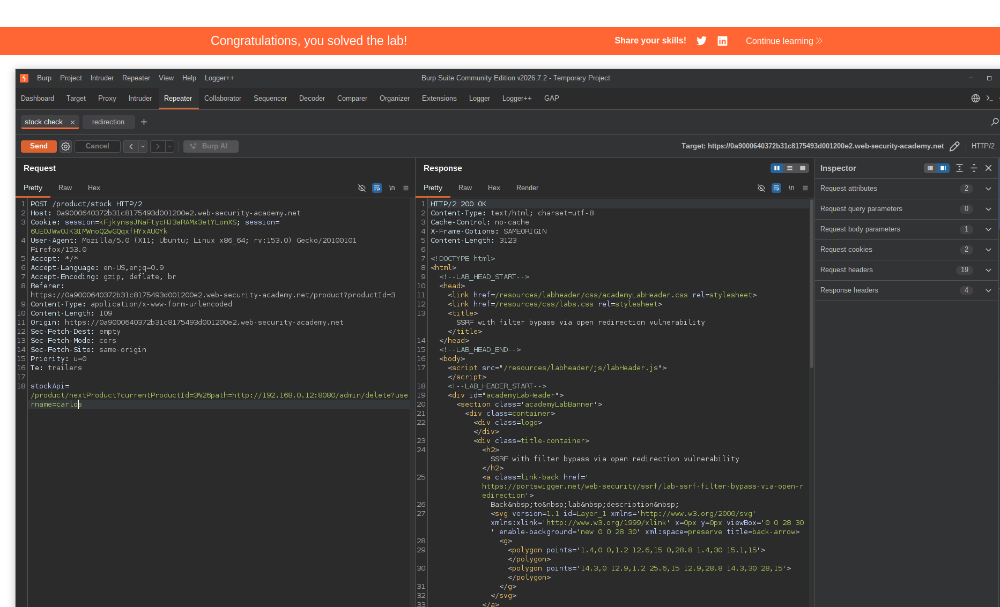

Carlos's account was deleted with this request:

```http
POST /product/stock HTTP/2
...
stockApi=/product/nextProduct?currentProductId=3%26path=http://192.168.0.12:8080/admin/delete?username=carlos
```

---

## Result

The SSRF filter was blocking absolute URLs on the `stockAPI` parameter directly.
But the open redirect on `/product/nextProduct` accepted absolute URLs just fine — and the stock checker trusted relative paths without question.
Chaining the two together was enough to get the server to reach an internal address it was never supposed to touch.
From there, the admin panel loaded, the delete link was right there in the HTML, and one more request took out Carlos's account.
Two vulnerabilities, neither critical on its own, combined into a full admin action with no authentication.

---

## Impact & Remediation

The damage here isn't just that SSRF exists — it's that the filter protecting it was bypassed through a completely separate feature.
The stock checker had some protection against absolute URLs. The redirect portal had none.
Combining them gave the attacker a path straight to the internal network, and from there to the admin panel.

In a real application, internal services often have no authentication of their own because they assume they're unreachable from the outside.
That assumption breaks the moment SSRF enters the picture. Any internal endpoint — admin panels, metadata services, databases, cloud provider APIs — becomes part of the attack surface.

To fix this properly, a few things need to change:

The `stockAPI` parameter should only ever be allowed to reach a specific, whitelisted set of URLs. Not just relative paths — a strict allowlist of known stock service endpoints. Anything else gets rejected.

The open redirect on `/product/nextProduct` needs to be locked down. The `path` parameter should only accept relative paths pointing to resources within the application. An absolute URL like `https://google.com` or `http://192.168.0.12:8080` should never be a valid value.

And internal services should not rely solely on network-level isolation for security. Authentication on admin endpoints — even basic auth — would have stopped the final step of this attack even if the SSRF got through.

---

## Takeaway

This lab is a clean example of vulnerability chaining — neither bug alone gets you to the goal, but together they bypass a protection that would've held against either one separately.

A few things worth remembering:

* **A filter bypass doesn't always mean breaking the filter.** Here the SSRF filter on `stockAPI` was never touched. The bypass came through a different endpoint entirely. When a direct approach is blocked, the question isn't "how do I break this filter?" — it's "is there another path that doesn't go through it?"

* **Open redirect is often treated as low severity. It shouldn't be.** On its own, redirecting a user to Google looks harmless. But as a stepping stone for SSRF, it's the piece that makes the whole chain work. Always think about what a vulnerability enables, not just what it does in isolation.

* **Internal services are not inherently protected.** The admin panel at `192.168.0.12:8080` had no authentication because it assumed it was unreachable. SSRF breaks that assumption entirely. Any internal service that handles sensitive operations needs its own access controls, independent of network topology.

* **Escalate tests gradually.** Starting with the application's own address, then an invalid port, then an external site — this step-by-step approach confirmed open redirect before ever touching an internal address. It's cleaner, less noisy, and gives you a clear picture of what the endpoint actually allows.

* **Read the HTML.** The delete link for Carlos's account was sitting in the admin panel response. No guessing, no fuzzing — just reading what the server returned. Sometimes the application tells you exactly what to do next.