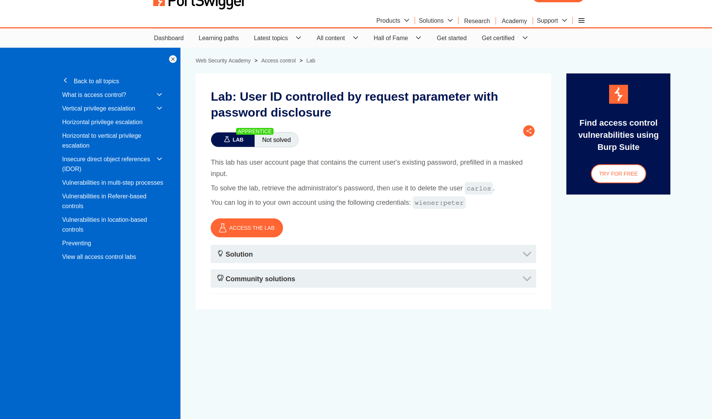
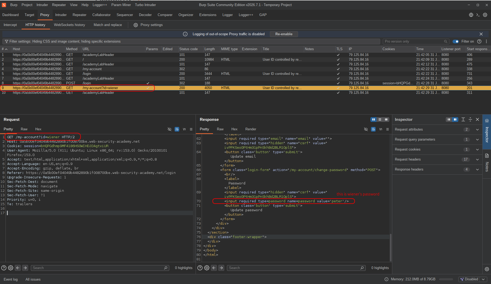
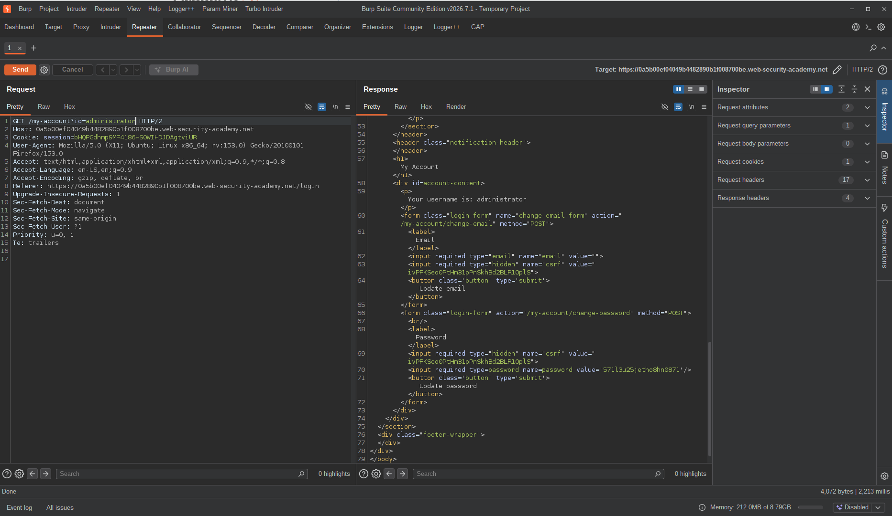
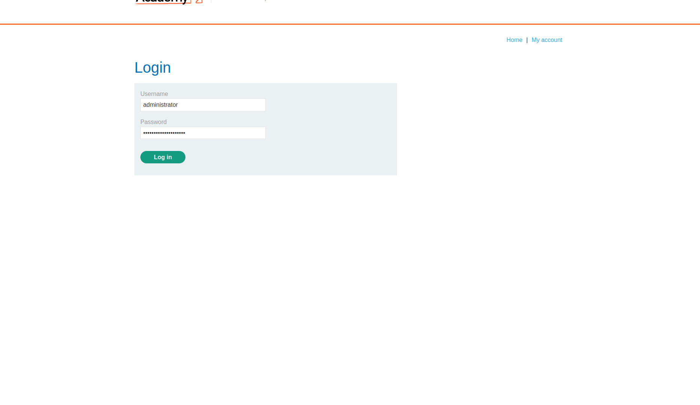
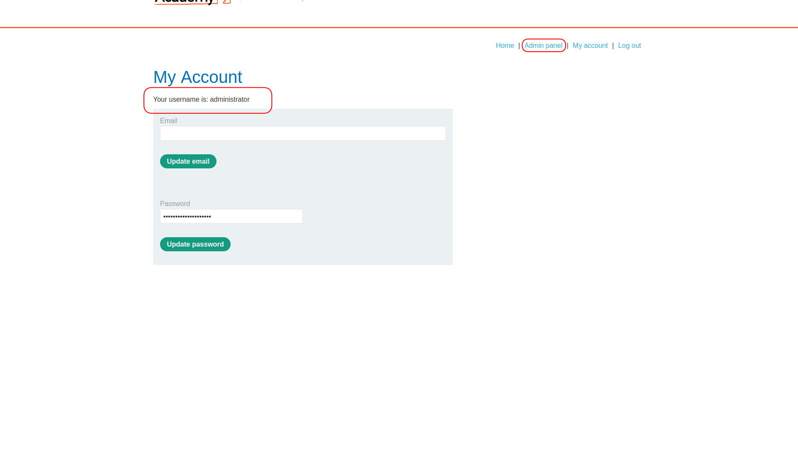
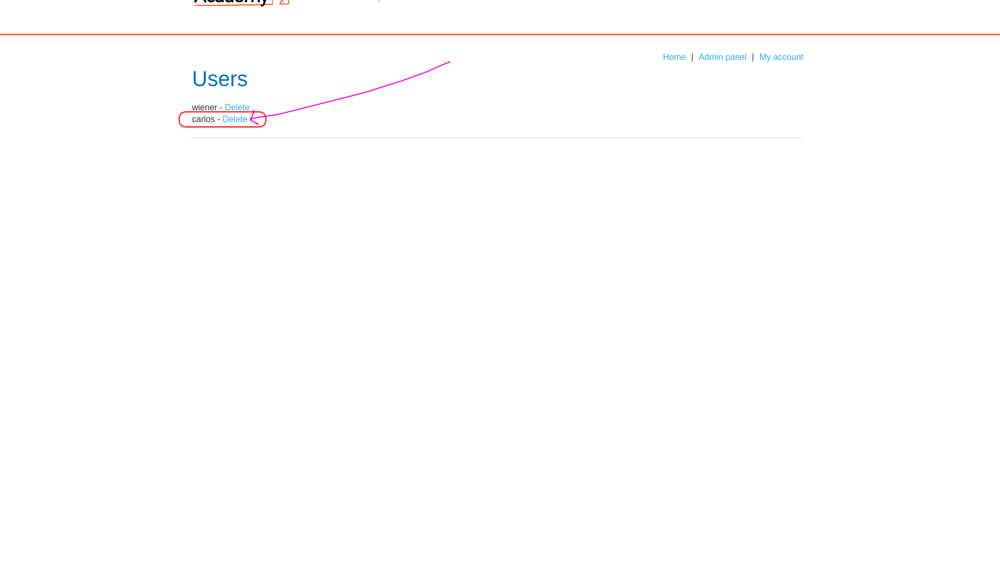
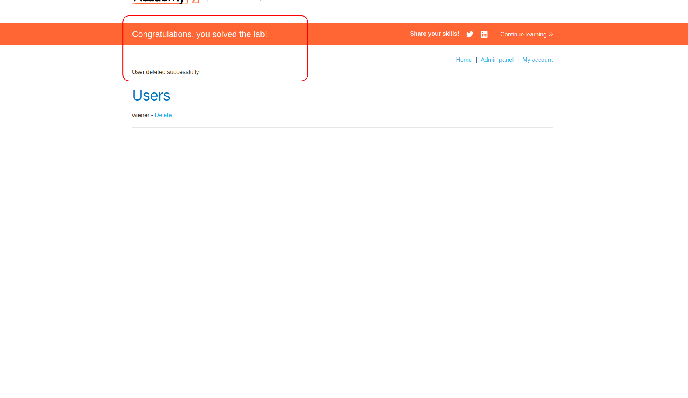

# Lab: User ID Controlled by Request Parameter with Password Disclosure

| Field | Details |
|-------|---------|
| **Provider** | PortSwigger |
| **Difficulty** | Apprentice |
| **Category** | Broken Access Control |
| **Date** | 2026-07-31 |

---

## Summary

User ID Controlled by Request Parameter with Password Disclosure is a lab in the PortSwigger Web Security Academy.  
In this lab, authentication is implemented for a shopping web application.  
Users can access their account and view their personal information on the `/my-account` page.

The task is to delete somebody else's account. The victim's username is `carlos`.



---

## Reconnaissance

I opened the target website and it looked like a normal shopping page.  
I was given credentials to log in: `wiener:peter`


When I logged into the account, a POST request was sent containing the credentials, followed by a GET request to the `/my-account` page.  
In the GET request's response, there was a hidden input containing a `CSRF token`, and another pre-filled input containing the password for `wiener`'s account.



That was eye-catching — because the user's password exists inside the HTML response.  
But how does the application know which user's password to show?

For a moment, imagine it doesn't come from the cookie or session ID.  
Where is the username being passed? The `id` parameter in the query string:

```
GET /my-account?id=wiener
```

If the server is using that `id` to decide what to show — and not verifying it against the session — then we can just change it.  
In a real-world engagement, you'd want two separate accounts to confirm the behavior cleanly.  
My next move was sending the request to the repeater and trying a different ID.



And there it was — `administrator`'s password, sitting in the HTML of a page I was never supposed to access.

Two things went wrong here at the same time:  
the server only checks if *someone* is logged in — not if the logged-in user matches the requested `id`.  
And on top of that, the password is being pre-filled into the HTML as plaintext, pulled straight from the database into the response.  
Either one of these alone would be a problem. Together, they're game over.

---

## Exploitation

With the administrator's password in hand, I logged into their account.  
The admin panel had a user management section — exactly what I needed.

  
  


---

## Result

I deleted `carlos` from the admin panel and the lab was solved.



---

## Impact & Remediation

The impact here is straightforward but severe.  
Any authenticated user can view any other user's account page — including their plaintext password — just by changing the `id` parameter in the URL.  
No guessing, no bruteforcing, no special tools. Just changing one value in the query string.

In a real application, this means every user account on the platform is fully exposed to any other logged-in user.  
Passwords, personal data, email addresses — all readable. And since passwords are exposed in plaintext, those credentials likely work on other platforms too (password reuse is common).  
The attacker doesn't even need to escalate from here — they already have the keys.

To fix this:
- The server must verify that the `id` in the request matches the authenticated session before serving any account data. Authorization can't stop at "is this user logged in?" — it has to answer "is this user allowed to see *this* resource?"
- Passwords must never appear in HTTP responses under any circumstances. If a password change form needs to be pre-filled, use a placeholder or prompt the user to re-enter it — never pull the actual password from the database into the HTML.
- Sensitive account pages should be served based on session identity alone, with no user-controlled parameter involved in deciding what data to return.

---

## Takeaway

A few things worth keeping in mind:

* **Always look at how the application identifies you.** When you land on an account page, the first question is: how does the server know who you are? Is it the session cookie? A parameter in the URL? Both? If there's a user-controlled value involved, that's your first test target.

* **The HTML source tells you more than the rendered page.** The browser hides `type=password` fields visually, but the value is right there in the source. Always check the raw response — prefilled forms, hidden inputs, and commented-out fields are a goldmine.

* **Two vulnerabilities stacked = much bigger impact.** The IDOR on the `id` parameter is a problem on its own. The password disclosure in the HTML is a problem on its own. But together, they create a full account takeover chain that requires zero exploitation skill. When you find one issue, always ask: what else has to be true for this to get worse?

* **Authorization is not authentication.** Checking if a user is logged in is not the same as checking if they're allowed to access a specific resource. This distinction is at the root of almost every access control bug — the application verified identity but skipped authorization entirely.