# Lab: Visible error-based SQL injection

| Field | Details |
|-------|---------|
| **Provider** | PortSwigger |
| **Difficulty** | Practitioner |
| **Category** | SQL Injection |
| **Date** | 2026-07-22 |

---

## Summary

Visible error-based SQL injection is a lab in the PortSwigger Web Security Academy. In this lab, the application tracks users with a cookie, which is one of the few "visible" entry points.

By manipulating the source (cookie), we can trigger errors in the application, and there is a misconfiguration which leaks sensitive data through these errors.

In this writeup, I'll walk through the entire manual exploitation flow step by step.

---

## Reconnaissance

The application may have different entry points to inject payloads for different purposes.

We can see there is a cookie set for us in the first request, and its name is `trackingId`, which makes perfect sense to be stored somewhere (typically a database).

The first thing most hackers do is inject a single or double quotation mark to check if the parameter is injectable:

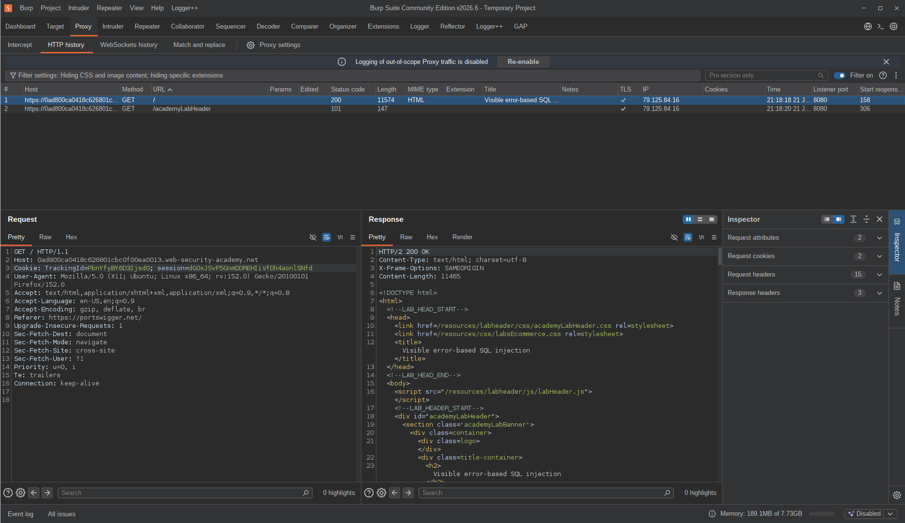

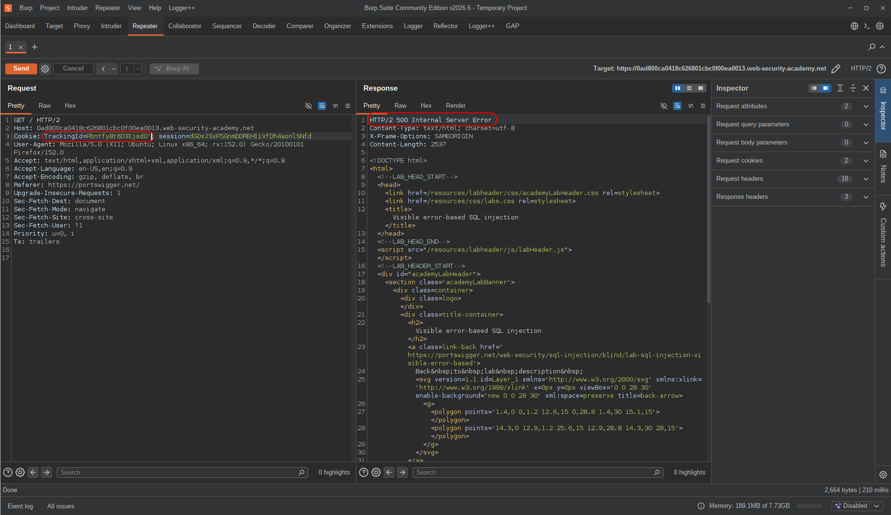

So I injected a `'` and got a server error (5XX), which told me something was wrong.

Then I tried some MySQL payload (which is my default XD) to check if I could create a broken true condition, and the result was shocking:

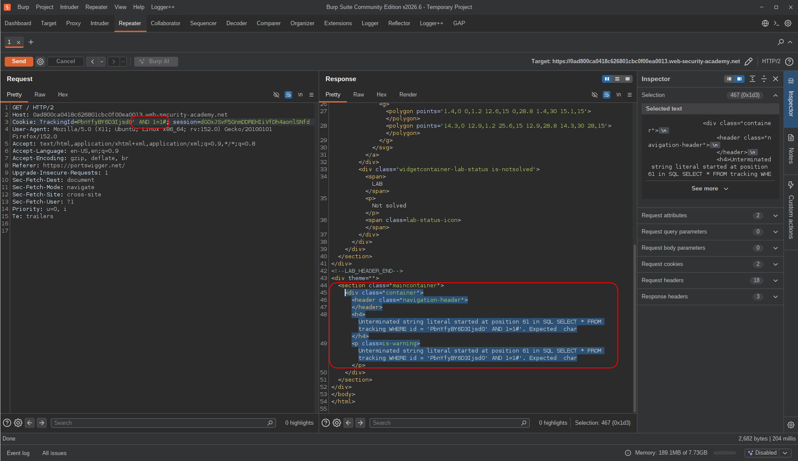

The application was leaking the entire query in the error message (and the error was shown to the user). But why did I get such an error? Because I was trying a query that works in MySQL and not PostgreSQL (`#` comment notation):

```sql
...' AND 1=1#
```

So I tried to fix the query and try again for boolean matching:

```sql
AND '1'='1'-- -
```

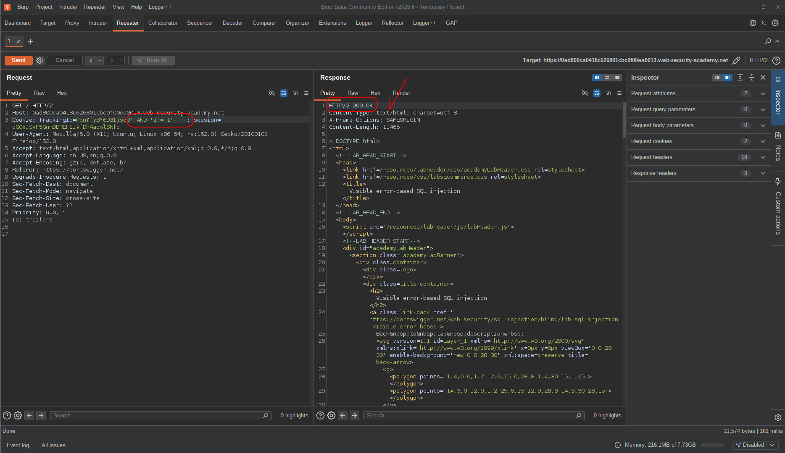

I got a 200 response, which made perfect sense, so I moved on to test a false condition as well:

```sql
AND '1'='2'-- -
```

But again the response status code was 200!

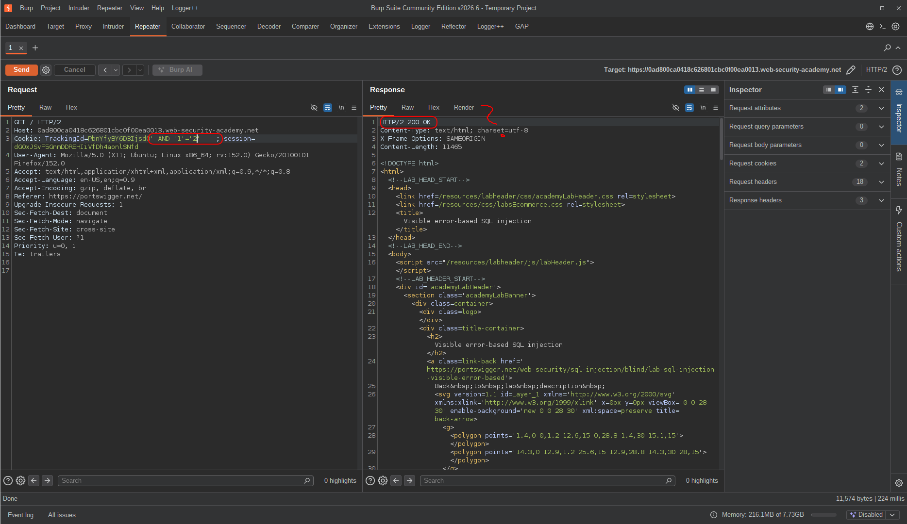

I realized that this application does not rely on conditions. I could try time-based payloads as well, but that was also not necessary, because I was able to extract data from errors.

The next step was to craft an arbitrary error that reveals the information I wanted. My next payload was:

```sql
AND CAST(version() AS int)-- -
```

Why would this cause an error? Because I was trying to cast a string to an integer.

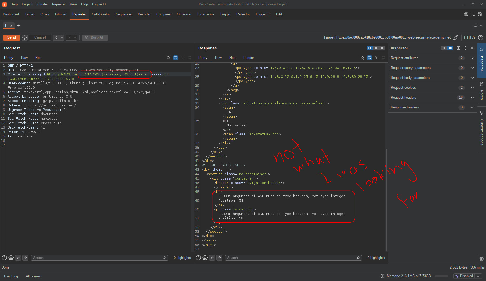

The error message was not what I was looking for. Why did this happen? `AND` is expecting a boolean value, not an integer — even though we would eventually get a type-casting error, this one is thrown sooner.

So I fixed that comparison:

```sql
AND 2002=CAST(version() AS int)-- -
```

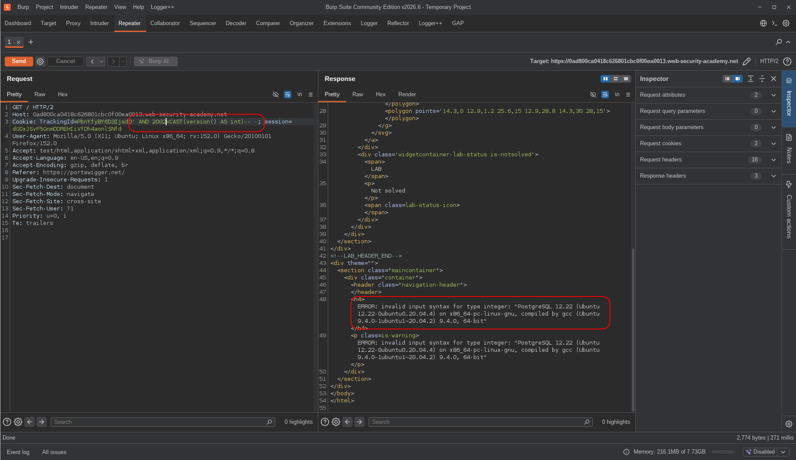

This is exactly what I wanted! Now I have information about the database, which is enough for a POC. Using the same approach, I was able to retrieve any other information and run functions:

```sql
AND 2002=CAST(current_database() AS int)-- -
```

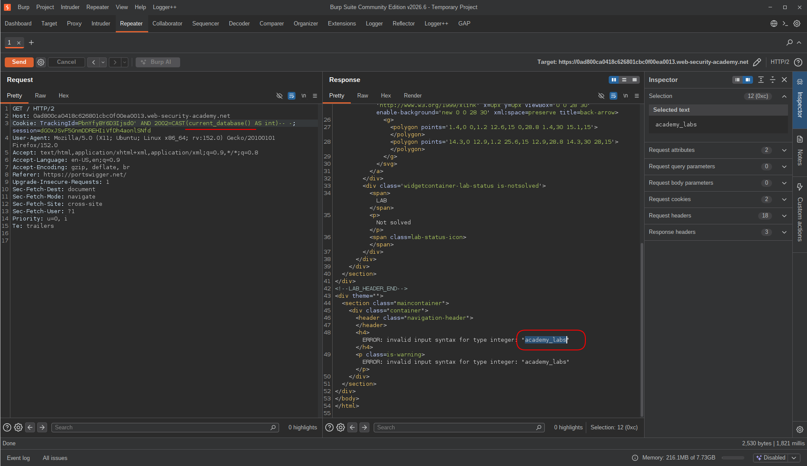

---

## Exploitation

After that, I went straight for table names:

```sql
AND 2002=CAST((SELECT string_agg(table_name,', ') FROM information_schema.tables WHERE table_schema='public') AS int)-- -
```

As you probably know, the default schema in PostgreSQL is `public` (instead of the db name, like in MySQL). But...

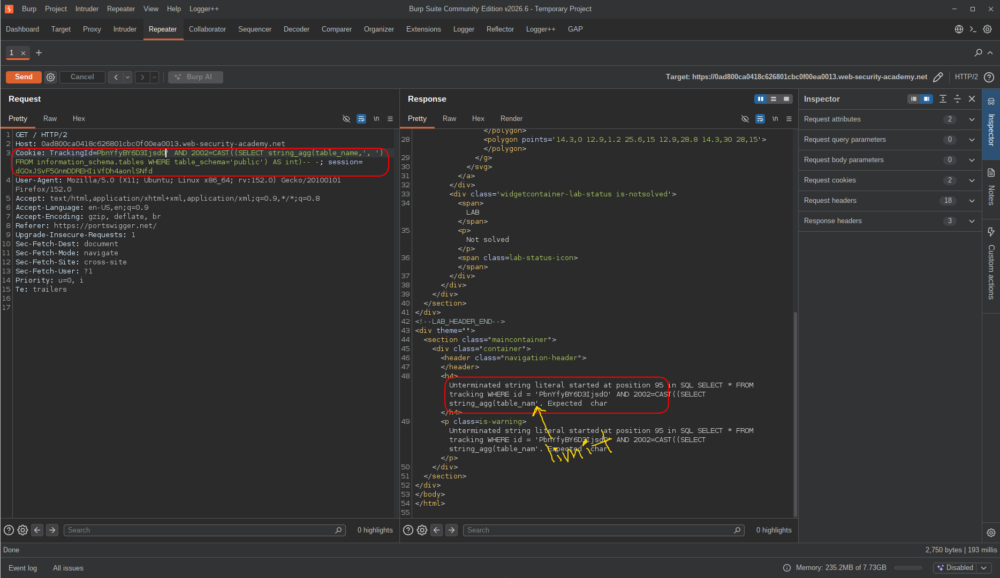

The result shocked me again — the query had a length limit.

What would I do next? I tried to make the query as short as possible, so I searched online for alternatives and found `pg_class` and `relname`. `pg_class` is a system catalog in PostgreSQL that holds all table names, and `relname` is the column name.

So I tried again with this payload:

```sql
AND 1=CAST((SELECT relname FROM pg_class LIMIT 1)AS int)-- -
```

And it worked!

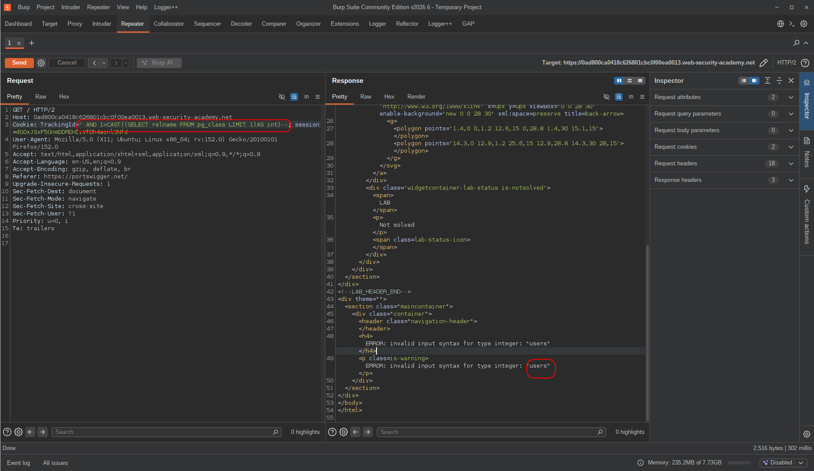

Unfortunately, because of the length limit in the query, I was not able to enumerate column names. In this lab, the description says the column names are `username` and `password`, but what would you do in a real-world scenario? An attacker can brute-force different names to find the real ones and directly retrieve the first row's data.

> **NOTE:** It's also worth knowing that usually, the first member of each database is the admin.

```sql
AND 1=CAST((SELECT username FROM users LIMIT 1)AS int)-- -
-- note that "username" is a variable and should be fuzzed.
```

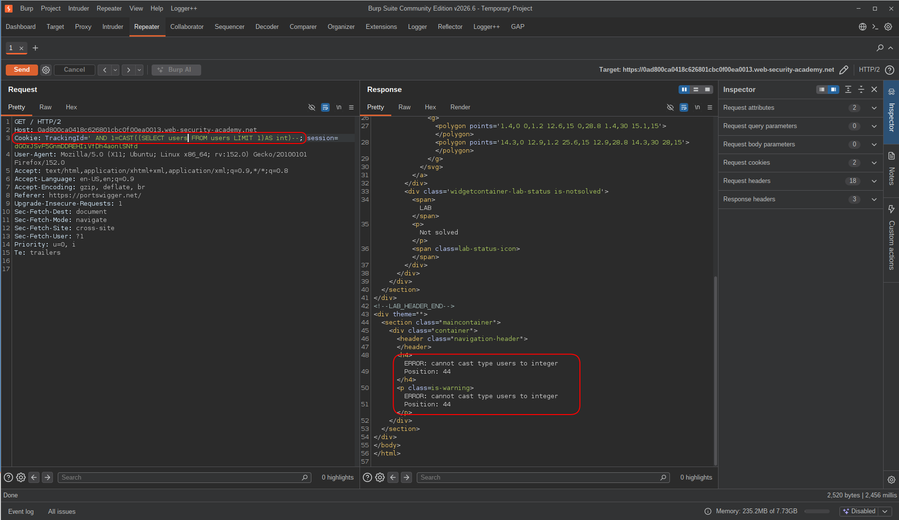

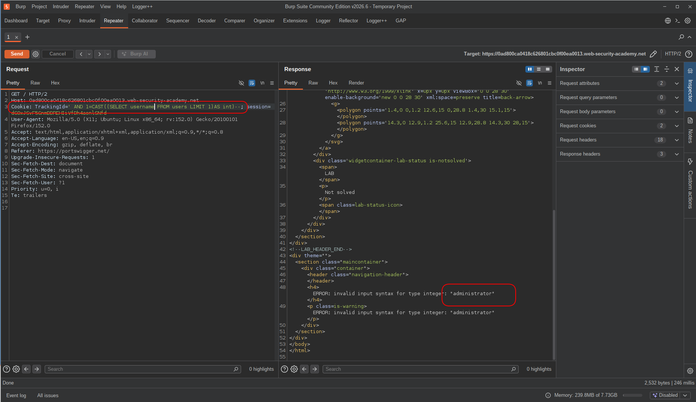

With the same strategy, an attacker can find data from other columns, then move forward by incrementing the `OFFSET` value (1, 2, 3, ...):

```sql
AND 1=CAST((SELECT password FROM users LIMIT 1)AS int)-- -
```


---

## Result

And the lab is solved.

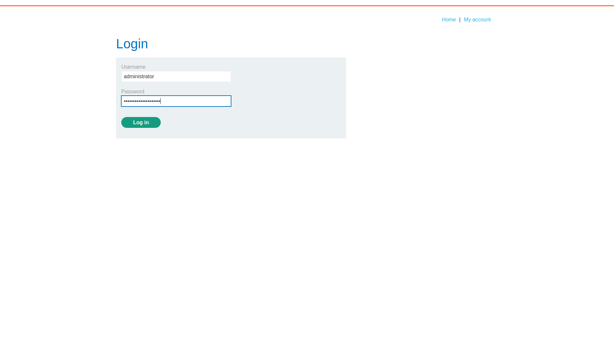

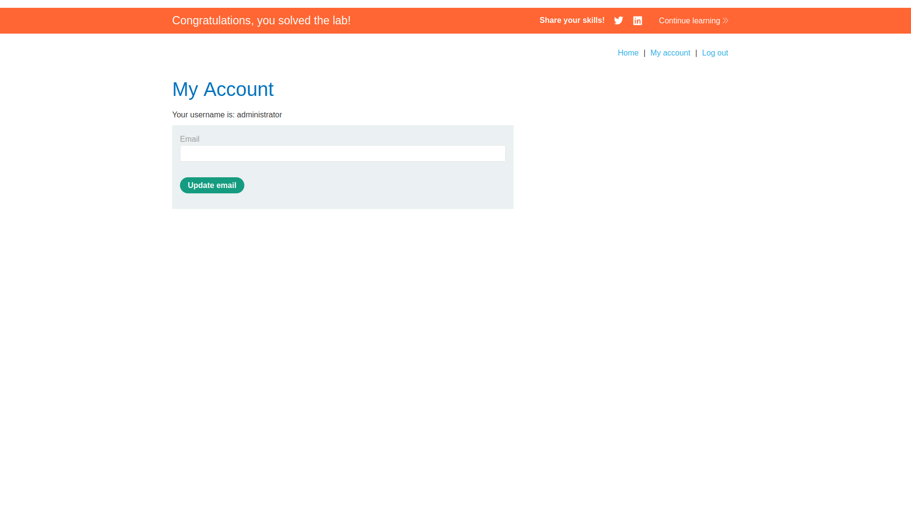

---

## Impact & Remediation

**Impact:** This vulnerability allows an unauthenticated attacker to extract any data from the database — including credentials, session tokens, and other sensitive records. In this lab, it led to full account takeover of the `administrator` user.

**Remediation:** The root cause is unsanitized user input being concatenated directly into SQL queries. The fix is to use **parameterized queries (prepared statements)** instead of string concatenation — this ensures user input is always treated as data, never as SQL syntax. Additionally, applying the principle of least privilege to database accounts and implementing a WAF as a defense-in-depth layer can further reduce the attack surface.

---

## Takeaway

The core lesson here is that **error messages are data** — when an application exposes raw database errors to the user, an attacker doesn't need blind techniques at all. Even without boolean-based or time-based feedback, a single misconfigured error handler turns the database into an open book.

The other key insight is around **adaptability**. Defaulting to MySQL syntax and hitting a wall isn't a dead end — it's information. The `#` comment error revealed the backend was PostgreSQL, which immediately shaped the rest of the approach. In real-world scenarios, reading what the application *tells* you through its errors is often faster than running automated tools.

Finally, **query length limits are a real constraint**, not just a lab quirk. Knowing alternative system catalogs like `pg_class` instead of relying solely on `information_schema` is the kind of practical knowledge that separates a methodical tester from someone who just runs scripts.