# Lab: Web shell upload via obfuscated file extension

| Field | Details |
|-------|---------|
| **Provider** | PortSwigger |
| **Difficulty** | Practitioner |
| **Category** | File Upload |
| **Date** | 2026-08-06 |

---

## Summary

Web shell upload via obfuscated file extension is a lab in the PortSwigger Web Security Academy.  
This lab features a blog where users can post things, add comments to each other's posts, create their profile, and more.  
The task is reading a secret file on the server.

In this writeup I'll solve this challenge manually, step by step.

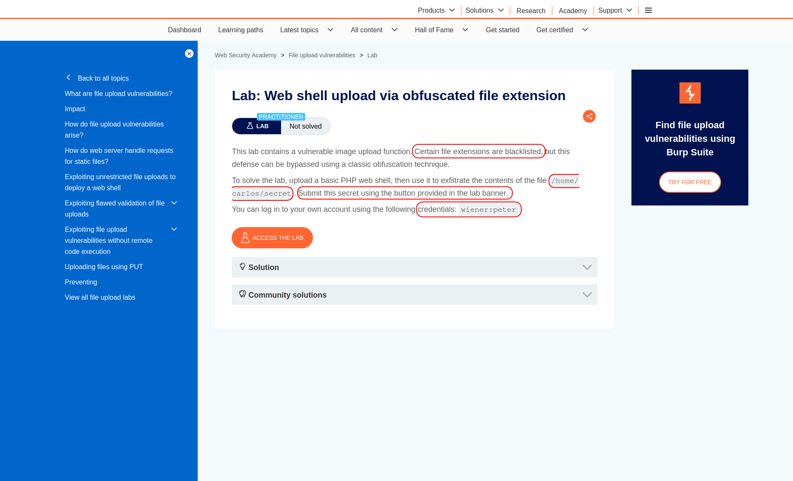

---

## Reconnaissance

I opened the target lab, and at first sight, it's just another blog where users can post images and add comments to each other's posts.  
Of course, users also have customized profiles.

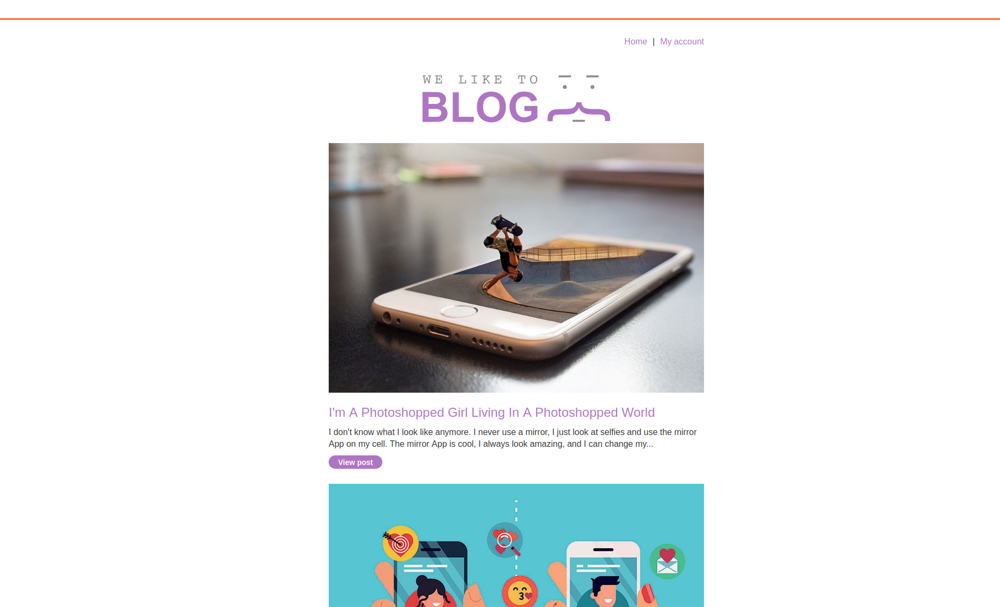

I opened one of the posts and scrolled down to the comments section.  
There were many fields to be filled, like:  
comment, name, avatar, email, website.

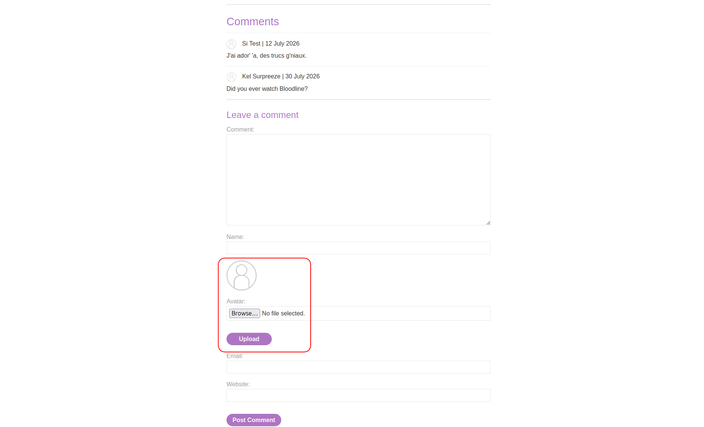

In the next step, I logged into the given account (`wiener:peter`) and in my profile page there was also another uploader (for avatar):

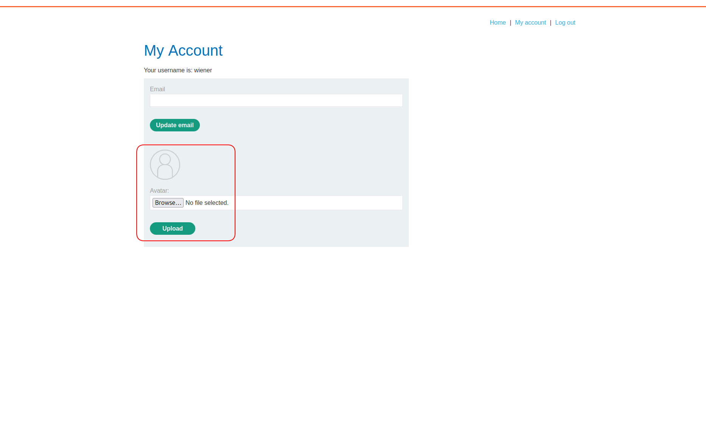

<br>

This website is using PHP as its backend language, I can tell by its signs.  
For example, in SSR (Server Side Rendering) applications:  
1. Usually there are no heavy JS files  
2. HTML is not so empty and it contains a lot of content  
3. Changing the path will cause changes in the response HTML  
4. There are not many AJAX requests visible in the network tab  

PHP is the most common SSR backend language.  
In PHP applications, if there is a broken uploader, attackers can try to upload `.php` files,  
so the PHP rendering engine will execute the code before rendering the page and HTML.

Also, there are two types of accessing files in websites:  
1. Direct access  
    - You will get a `static path` to the uploaded resource (usually containing the file's original name).  
    - Example: `https://site.com/path/to/your/profile.img`
2. Indirect access  
    - Access is not direct anymore and data comes through a side channel.  
    - Example: `https://site.com/api/v2/get_image/44`

Combining results from these two facts, hackers can perform an attack called `web shell uploading`.  
> Note that you can also try `.html` or `.htm` files for XSS.

<br>

In this lab, there are two points to upload files.  
Which one most likely gives us direct access? Usually the one in the profile.  
So I tried to inject there first.

I needed a web shell, so I wrote a simple one in PHP:  
```php
<?php system($_GET['command']) ?>
```

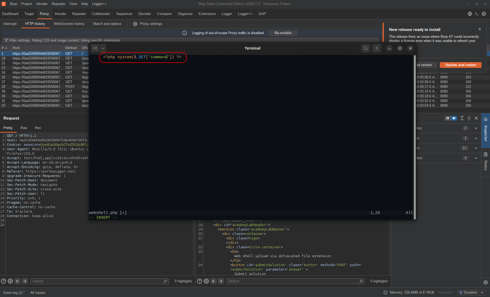

This line simply takes a command from the GET parameter named `command` and executes it in the OS environment.  
So I saved this file and tried to upload it:

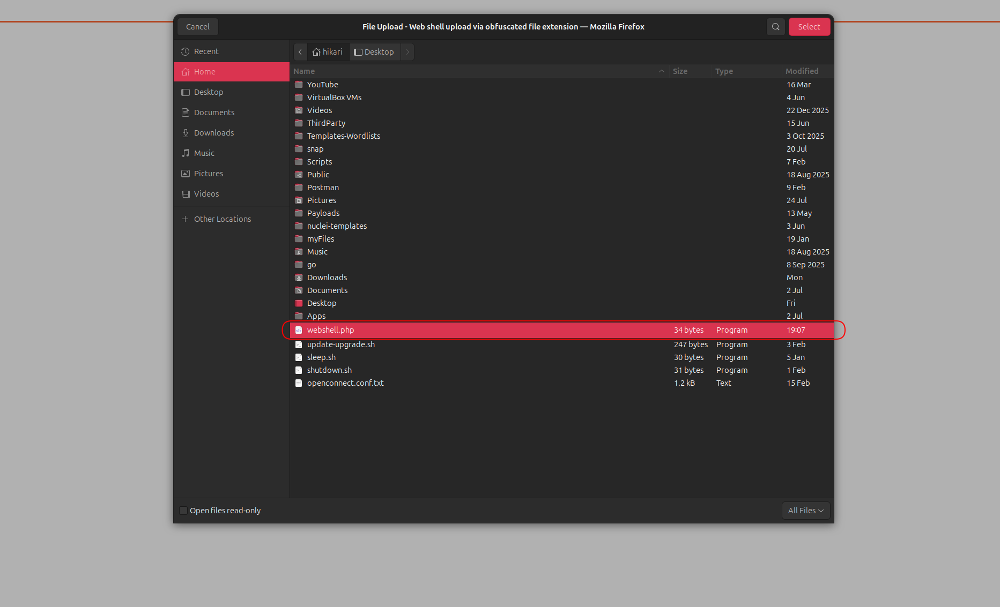  
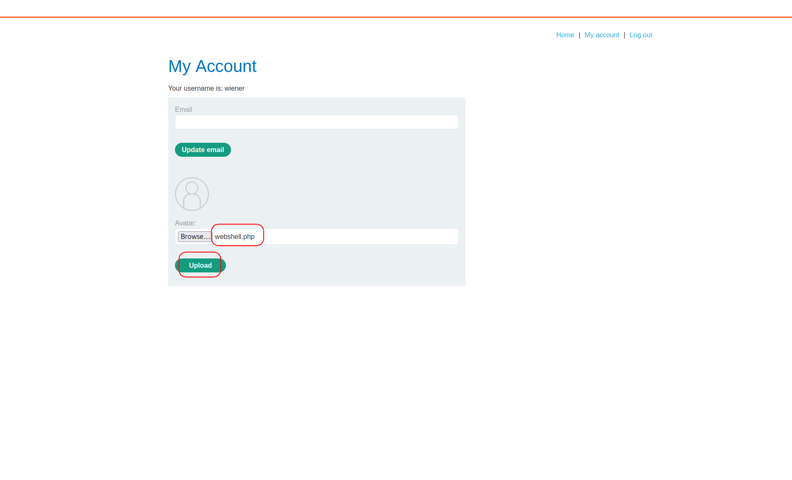

<br>

But as I expected, I got an error (403 Forbidden).  
The error text was:  
"Sorry, only JPG and PNG files are allowed."

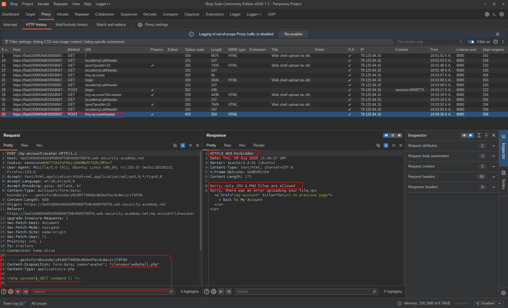

> There can be multiple checks on an uploaded file, such as size check (which is usually the first check), extension check, and content check.  
> I could guess this was an extension check because my file is `.php` and not an image.

There are also multiple bypass tricks for this protection:  
1. Using alternative extensions like `.phar` and `.phtm` (only in blacklist filters)  
2. Double extension like `.php.png` or `.png.php`  
3. Extension with delimiters:
    - Number sign: `.php%23.png`  
    - Null byte: `.php%00.png`  
    - Line feed: `.php%0A.png`  
4. Adding more dots like `.jsp.....` or `.php.` (only in blacklist filters)
5. Etc.

You can try all these bypassing tricks in the `filename` parameter (in the POST body) in Repeater.  
Somehow, I didn't — trusting my common sense, I went straight for `null bytes`:

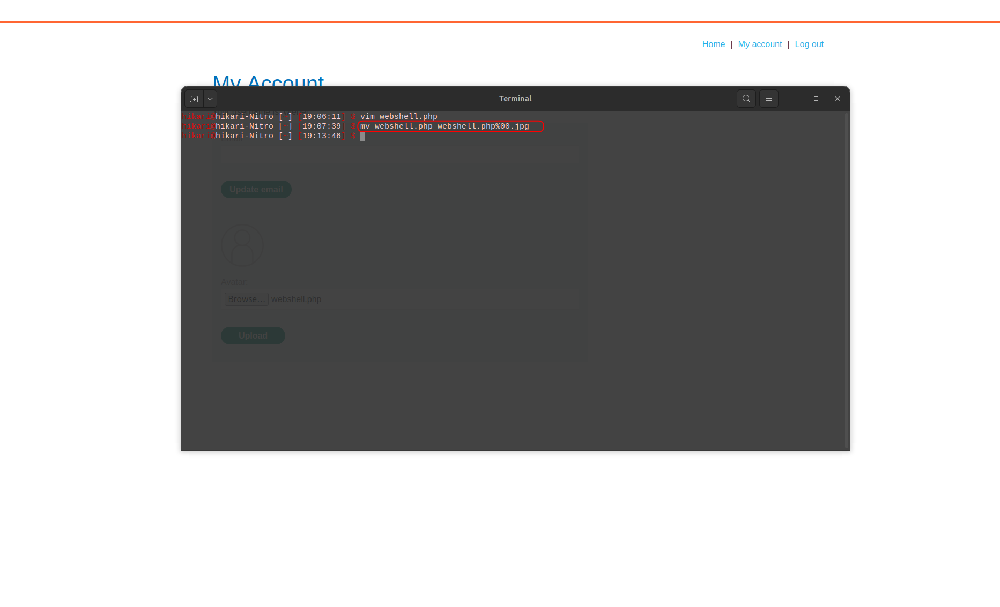

And it worked!

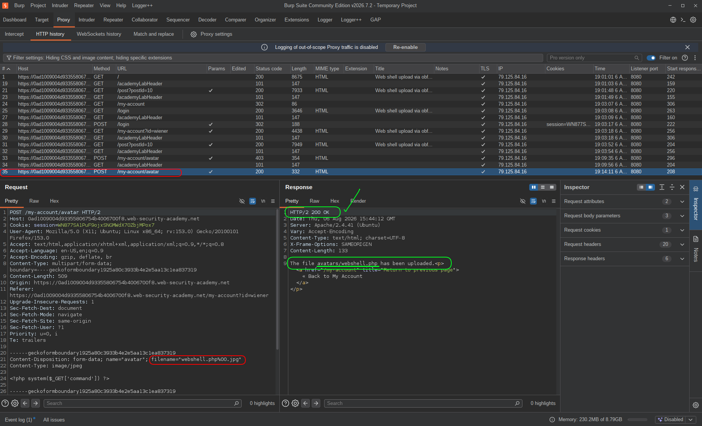

---

## Exploitation

File uploaded — but how should I know where it is?  
I looked for a place where my profile picture was being reflected (the profile page),  
and I inspected the page source (HTML):

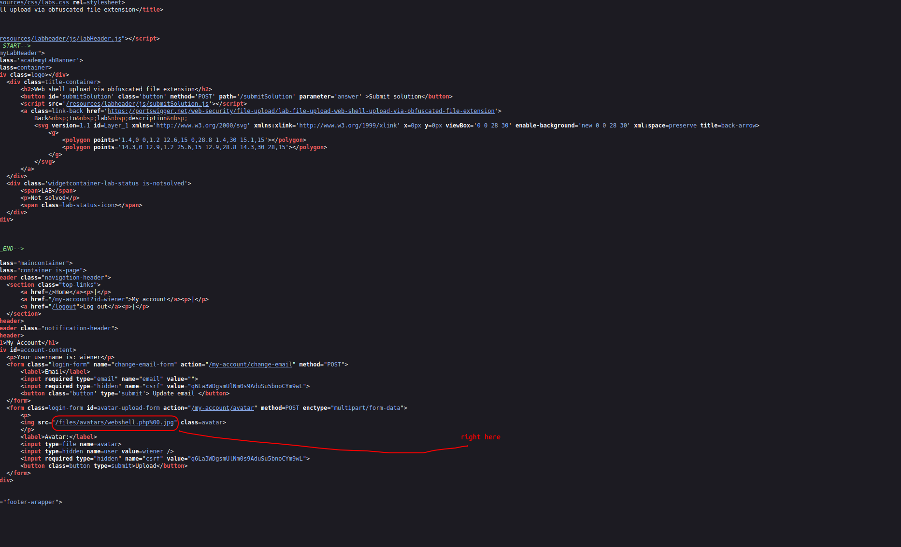

<br>

So I opened that address in the browser and sent it to Repeater for manual tests:

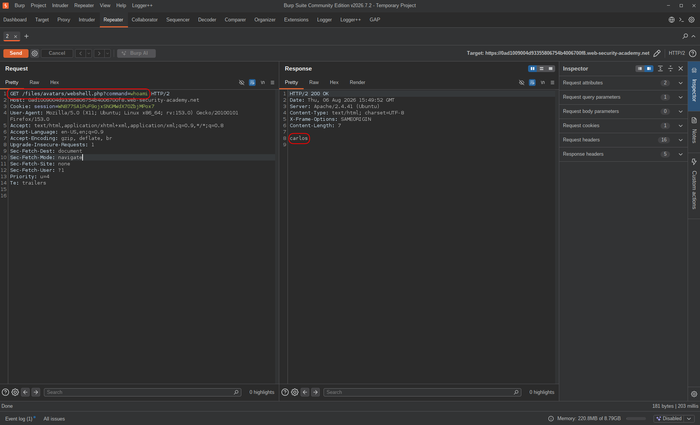

After I made sure that my web shell was working, I opened the secret file:

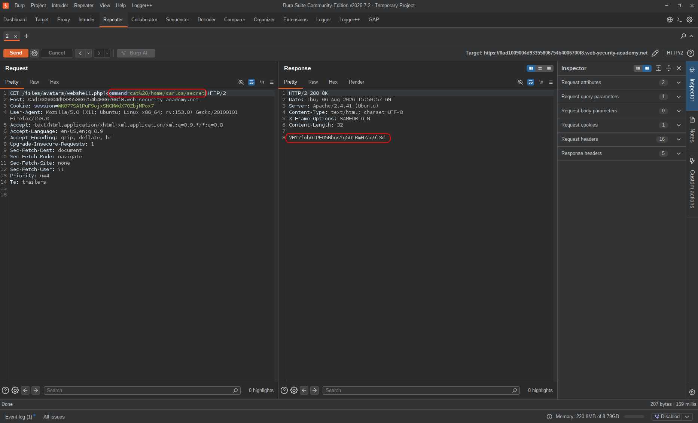

And finally, there was a place in the application to submit that flag:

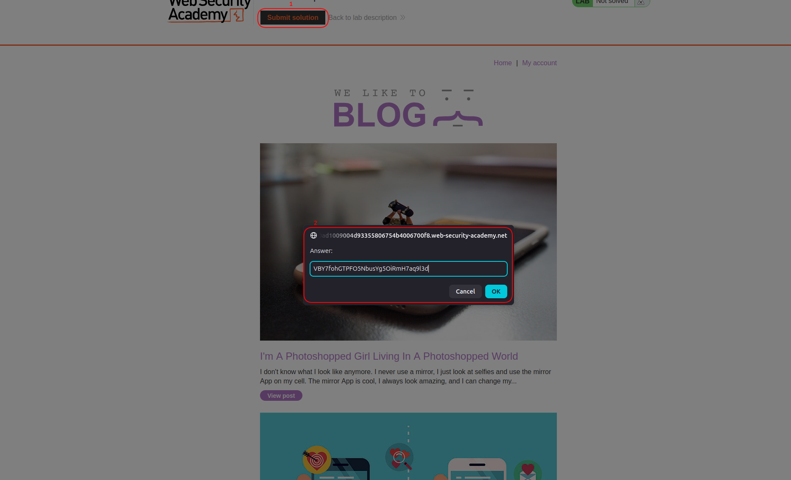

---

## Result

Tried uploading a `.php` web shell directly — got blocked with "only JPG and PNG files are allowed."  
Extension check was obvious, so I went straight for null byte: renamed the file to `shell.php%00.png` in Repeater, upload went through.  
Found the static path to the uploaded file in the profile page source, hit it in the browser, web shell was executing.  
Ran `whois` and `cat /home/carlos/secret` through the `command` parameter, got the flag, lab solved.

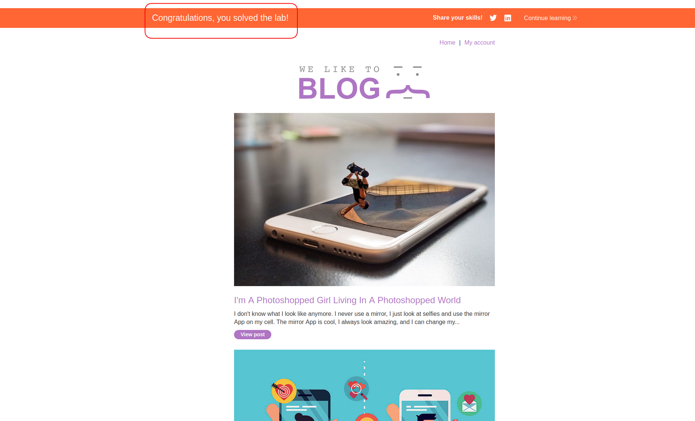

---

## Impact & Remediation

The upload filter was only checking the filename extension as a string — and that string is fully attacker-controlled.  
A null byte (`%00`) in the filename causes many server-side implementations to truncate at that point: the validation layer sees `.png` and passes it, the execution layer sees `.php` and runs it.  
Two layers reading the same value differently — that's the whole vulnerability.

Real-world impact: full Remote Code Execution on the server.  
Once the shell is up and the path is known, an attacker can read arbitrary files, run OS commands, do internal network recon, drop a reverse shell for persistent access, and potentially escalate privileges depending on the server config.  
It's one of the cleanest paths from "regular user" to "I own this box."

To fix this:  
Don't rely on extension blacklists — the bypass surface is too large and parser behavior varies across languages and frameworks.  
Use a whitelist and only allow specific extensions explicitly.  
Validate file content server-side using magic bytes, not the `Content-Type` header or filename the client sends.  
Rename uploaded files server-side to a random UUID — even if a `.php` file slips through, the attacker can't reach it without knowing the path.  
Serve uploaded files from a separate origin (S3, CDN) so PHP execution context doesn't apply at all.  
And disable script execution in upload directories at the server config level as a last line of defense.

---

## Takeaway

A few things worth keeping in mind:

* **The filename is attacker-controlled input. Treat it that way.** Anything derived from `filename` in a multipart request — extension, path, MIME guess — is untrusted. Validate the actual file content, not the metadata around it.

* **Null bytes work because two layers disagree on where the string ends.** The validation layer reads the full filename, the execution layer truncates at `%00`. That kind of parser mismatch is a pattern worth recognizing — it shows up in path traversal, SQL, and command injection too, not just file uploads.

* **Direct file access is what makes this critical.** If the uploaded file was served through an indirect endpoint (e.g., `/api/get_image/44`), the PHP wouldn't execute even if it got uploaded. The static path is what closes the loop. When testing file uploads, always figure out which access type the app is using — that determines whether upload-to-RCE is actually possible.

* **A one-liner shell is enough.** `<?php system($_GET['command']) ?>` — that's it. The payload isn't the hard part. The hard part is getting it past the filter and finding where it lands.